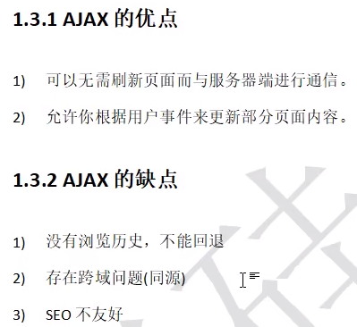
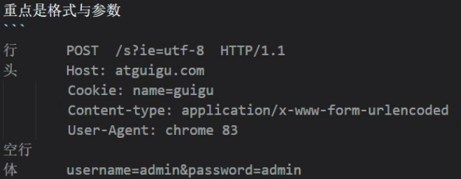
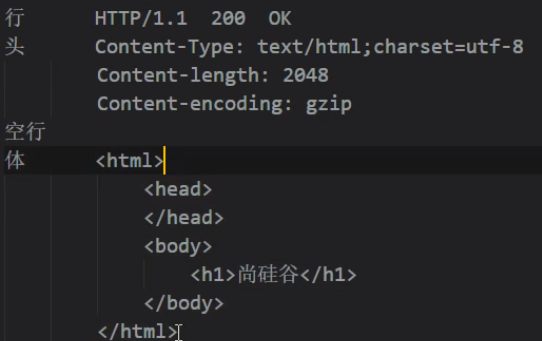
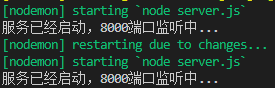
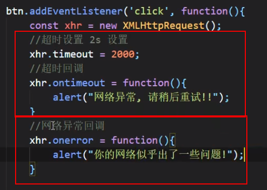
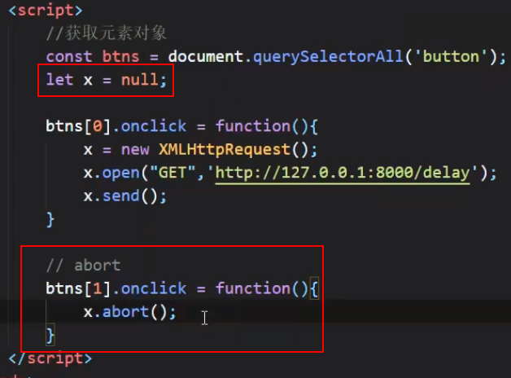
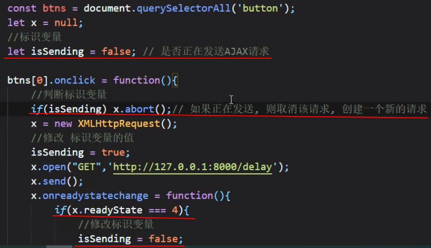
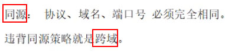

# 教程

https://www.bilibili.com/video/BV1WC4y1b78y

# 注意点

https://www.bootcdn.cn/   标签链接，在线链接

# AJAX

## 特点



# HTTP

## 请求报文



## 响应报文



# express

## 安装

先安装node.js再在VSCode中安装npm

## 响应文件

```
//引入express
const express = require('express');
//创建应用对象
const app = express();
//创建 get 路由规则
//request 请求报文封装
//response 响应报文封装
app.get('/', (request, response) => {
    //设置响应
    response.send('HELLO EXPRESS get');
});
//创建 post 路由规则
app.get('/', (request, response) => {
    //设置响应
    response.send('HELLO EXPRESS post');
});
//监听端口启动服务
app.listen(8000, () => {
    console.log("服务已经启动，8000端口监听中...");
})
//浏览器输入127.0.0.1:8000进行查看
```

# 请求文件

```
    <button>点击发送请求</button>
    <div id="result"></div>
    <script>
        //1、获取button元素
        const btn = document.getElementsByTagName('button')[0];
        const result = document.getElementById('result');
        //2、绑定事件
        btn.onclick = function () {
            //1.创建对象
            const xhr = new XMLHttpRequest();
            //2.初始化 设置请求方法和url
            xhr.open('GET', 'http://127.0.0.1:8000/server?a=100');
            //3.发送
            xhr.send();
            //4.事件绑定 处理服务端返回的结果
            //readystate是xhr对象中的属性，表示转台0 1 2 3 4
            //change改变 0到1 1到2...
            xhr.onreadystatechange = function () {
                //判断(服务端返回所有结果)
                if (xhr.readyState === 4) {
                    //判断响应状态码200 404 403
                    //2xx开头的都表示成功
                    if (xhr.status >= 200 && xhr.status < 300) {
                        //处理结果 行 头 空行 体
                        //响应行
                        result.innerHTML = xhr.response;
                    }
                }
            };
        }
    </script>
```


### 设置响应头

```
app.get('/server', (request, response) => {
    //设置响应头 设置允许跨域
    response.setHeader('Access-Control-Allow-Origin', '*');
    //设置响应
    response.send('HELLO EXPRESS');
```

### 设置请求头

```
xhr.setRequestHeader('Content-Type','application/x-www-form-urlencoded');
```

若要设置自定义请求头，必须设置响应的响应头，或者将响应头从app.get改成app.all

# 4步走！

```
            //1、创建对象
            const xhr = new XMLHttpRequest();
            //2、初始化 设置请求方法和url
            xhr.open('GET', 'http://127.0.0.1:8000/server?a=100');
            //3、发送
            xhr.send();
            //4、事件绑定 处理服务端返回的结果
            //readystate是xhr对象中的属性，表示转台0 1 2 3 4
            //change改变 0到1 1到2...
            xhr.onreadystatechange = function () {
                //判断(服务端返回所有结果)
                if (xhr.readyState === 4) {
                    //判断响应状态码200 404 403
                    //2xx开头的都表示成功
                    if (xhr.status >= 200 && xhr.status < 300) {
                        //处理结果 行 头 空行 体
                        //响应行
                        result.innerHTML = xhr.response;
                    }
                }
            };
```


# get响应

```
//获取button元素
const btn = document.getElementsByTagName('button')[0];
const result = document.getElementById('result');
//绑定事件
btn.onclick = function () {
            //1、创建对象
            const xhr = new XMLHttpRequest();
            //初始化 设置请求方法和url
            xhr.open('GET', 'http://127.0.0.1:8000/server?a=100');
            //设置请求头
            xhr.setRequestHeader('Content-Type','application/x-www-form-urlencoded');
            //发送
            xhr.send();
            //2、事件绑定 处理服务端返回的结果
            //readystate是xhr对象中的属性，表示转台0 1 2 3 4
            //change改变 0到1 1到2...
            xhr.onreadystatechange = function () {
                //判断(服务端返回所有结果)
                if (xhr.readyState === 4) {
                    //判断响应状态码200 404 403
                    //2xx开头的都表示成功
                    if (xhr.status >= 200 && xhr.status < 300) {
                        //处理结果 行 头 空行 体
                        //响应行
                        console.log(xhr.status);
                        console.log(xhr.statusText);
                        console.log(xhr.getAllResponseHeaders());
                        console.log(xhr.response);
                        result.innerHTML = xhr.response;
                    }
                }
}
```

# post响应

 

# 传参

http://127.0.0.1:8000/server?a=100

`?`后面的都是传参  a=100

# 服务端响应JSON数据

```
#响应JS中
const data = {
	name:'shizhua'
};
let str = JSON.stringify(data);    //将对象转换成字符串
response.send(str);               //设置响应体
```

```
#请求JS中
1、手动转换
let data = JSON.parse(xhr.response);   //转换为对象
console.log(data);
result.innerHTML = data.name;
2、自动转换
xhr.responseType = 'json';
result.innerHTML = xhr.respinse.name;
```

# nodemon工具

在vscode中安装

## 使用

VSCode终端中输入

nodemon server.js

## 作用

修改响应文件后，自动重启



# IE的AJAX缓存问题解决

```
#在URL后面加时间戳Date.now()
xhr.open('POST', 'http://127.0.0.1:8000/server'+Date.now());
```

# 请求超时与网络异常



# 取消请求

 

# 重复发送请求问题

点击时，取消前面一个相同的请求




# jQuery发送AJAX

```
        $('button').eq(2).click(function () {
            $.ajax({
                //url
                url: 'http://127.0.0.1:8000/jquery-server',
                //参数
                data: { a: 100, b: 200 },
                //请求类型
                type: 'get',
                //响应体结果
                dataType: 'json',
                //成功的回调
                success: function (data) {
                    console.log(data);
                },
                //超时时间
                timeout: 2000,
                //失败的回调
                error: function () {
                    console.log('出错了');
                },
                //头信息
                headers: {
                    c: 300,
                    d: 400
                }
            })
        });
```

# Axios发送AJAX

https://github.com/axios/axios  较慢

https://www.bootcdn.cn/   搜axios，较快

```
btns[0].onclick = function() {
	axios.get('https://127.0.0.1:8000/axios-server',{
	//url参数
	params:{
		id:100,
		vip:7
	},
	hearders:{
		name:'atguigu',
		age:20
	}
	}).then(value=>{
	console.log(value);
	});
}
```

```
axios.defaults.baseURL = 'https://127.0.0.1:8000';
btns[0].onclick = function() {
	axios.post('/axios-server',{
	username:'admin',
	password:'admin'
	},{
		//url参数
		params:{
		id:100,
		vip:7
		},
		hearders:{
		name:'atguigu',
		age:20
		}
	})
}
```

# Axios函数发送AJAX

```
btns[0].onclick = function() {
	axios({
		//url
		url:'/axios-server',
		params:{
		vip:10,
		level:30
		}
	}).then(response=>{
		console.log(response);
	})
}
```

# fetch()函数

```
Promise<Response> fetch(input[,init]);  #语法

btns[0].onclick = function() {
	axios({
		//请求方法
		method:'post',
		headers:{
		name:'atguigu'
		}
	}).then(response=>{
		return response.text();
	}).then(response=>{
		console.log(response);
	})
}
```

# 跨域

## 同源策略



## 如何解决跨域

### JSONP

```
//1、创建script标签
const script = document.createElement('script');
//2、设置标签的src属性
script.src = 'https://127.0.0.1:8000/check-username';
//3、将script插入到文档中
document.body.eppendChild(script);
```

###### 案例：用户名已存在

### CORS

跨域资源共享，官方

```
#server.js中加入响应头
response.setHeader("Access-control-Allow-Origin","*");
response.setHeader("Access-control-Allow-Headers","*");
response.setHeader("Access-control-Allow-Method","*");
```


