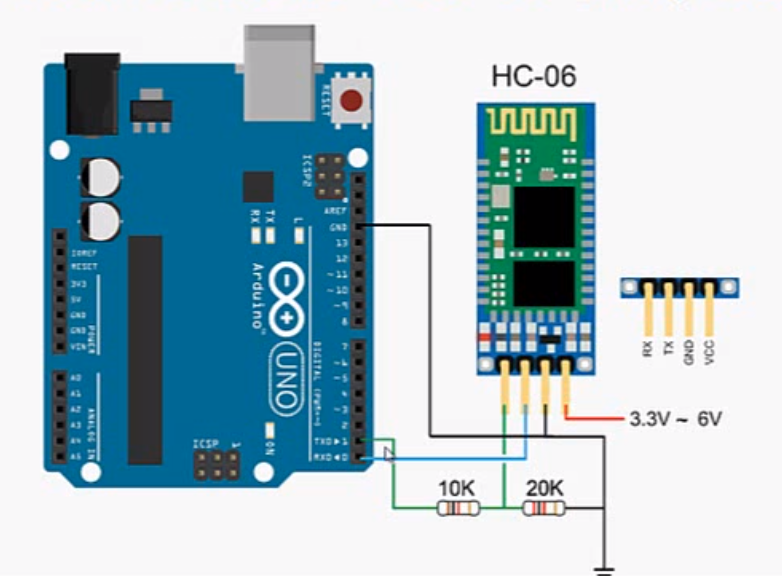
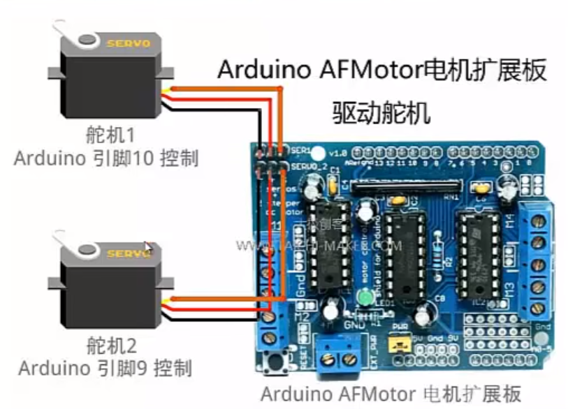

# 教程

https://www.bilibili.com/video/BV1b441177VF

P22未（太极创客）


# 软件

Altium Designer(AD,电路设计EDA)

Eagle(转化文件)

fritzing(画图,板子图)

Rhinocors(3D建模)

fusion360(3D建模)

C4D(3D建模)

inkScape(矢量图编辑)

ArtCAM(生成雕刻机刀路文件)

Keyshot(渲染)

Android Studio(手机APP开发)

MIT APP INVENTOR(手机APP开发)

Unity(3D场景仿真)

thinkercad

CNC雕刻机（三轴）

arduino bluetooth controller(安卓设备上安装，控制蓝牙模块)

# 库！！！

| 项目 | 所需库 |
| ---- | ------ |
| OLED | U8glib |
|      |        |
|      |        |

# 安装第三方库

1. zip库文件
   1. 打开Arduino IDE,文件>首选项>项目文件夹位置
   2. 将下载的zip库文件复制到“项目文件夹位置”
   3. Arduino IDE>项目>加载库>添加.zip库
2. 下载自带库
   1. Arduino IDE>工具>管理库>输入需要添加的库
3. 库文件夹
   1. 打开Arduino IDE,文件>首选项>项目文件夹位置
   2. 将下载的库文件夹复制到“项目文件夹位置”下的libraries文件夹下
   3. 重启Arduino IDE

# 软件设置


# 问题排查


# 注意点

```
//读取模拟信号
aname = analogRead(A0)
```

```
R = U/I
P = UI = I^2R
```

```
ln  //换行
```

```
逻辑与  &&
逻辑或  ||
```

```
//random
int myNumber = random(1,10);   //包括1，不包括10
```

```
//随机数与之前不同
randomSeed(alalogRead(A0));
```

```
//取出数字     P5控制伺服电机
Serial.parseInt()；
```

```
// 执行一次，只读取第一个数
Serial.read(); 
```

```
//判断是否有数据输入
if(Serial.available()){};
```

```
//链接引脚
rArm.attach(10);
//给数据
rArm.write(90)
```

```
//数组
int data[5] = {1,3,5,2,6};
char charArray[3] = {'a','b','c'};
String strArray[3] = {"aaa","bbb","ccc"};
Servo servoArray[2] = {aArm,bArm,cArm};
```

```
直流 DC
  1.有刷直流电机(BDC)
  2.无刷直流电机(BLDC)
交流 AC
交直流 Universal
```

```
//转换字符
Serial.print((char)dataFile.read());  
```

```
//空行
\r\n\r\n
```

```
//转换成字符
.as<String>();
.as<int>();
```


 欧姆定律


# 串口通讯

```
引脚0 RX ：接收（Receive）
引脚1 TX ：发送（Transmit）
```


#### Serial.availabel()


#### Arduino上其他引脚充当RX,TX


# 语句

#### switch


case 'b'

case "abc"

#### While

```
//while后面只有一条语句时，{}可省略
while(a>0) a=4;
```

# 模块

## 按键开关

1. 按下信号=low,0

# LED


# 蓝牙模块

1. 代码上传失败的话，先断开蓝牙


#### 传输电压




#### 串口透传（数据原封不动的传输）


# 光敏电阻


# 人体感应传感器


# 扩展板

### AFMotor

1. 可以同时给arduino供电




### CNC扩展板

1. 控制NEMA步进电机（42步进电机）
2. 不能为arduino供电


# [NANO](http://www.taichi-maker.com/?s=nano)


# OLED显示屏

1. 0.96寸 I2C IIC通信 128*64 OLED液晶屏模块
2. 黄蓝是屏上1/4（16像素） 部分为黄光，下3/4 为蓝
3. 英文和数字最小可用8x8像素
4. **汉字最小显示像素为16x16**，通常为了显示效果，**英文和数字通常使用8x16**像素表示
5. 上8像素为黄色，下面为蓝色
6. Arduino库（U8g2, U8glib, I2Cdev）
7. ATmega328p不行就选“ATmega328p(Old Bootloader)”

#### Nano-OLED接线

```
//Nano-OLED接线
GND > GUD
5V  > VCC
A4  > SDA
A5  > SCL

//例（只显示一种字体和大小）
#include "U8glib.h"
/*I2C协议*/
U8GLIB_SSD1306_128X64 u8g(U8G_I2C_OPT_NONE); 

void setup()
{
  if ( u8g.getMode() == U8G_MODE_R3G3B2 ) 
    u8g.setColorIndex(255);     // white
  else if ( u8g.getMode() == U8G_MODE_GRAY2BIT )
    u8g.setColorIndex(3);         // max intensity
  else if ( u8g.getMode() == U8G_MODE_BW )
    u8g.setColorIndex(1);         // pixel on

  // u8g.setFont(u8g_font_unifont);
  Serial.begin(9600);

  u8g.setFont(u8g_font_osb18);   /*设置字体大小*/
  u8g.setFontRefHeightExtendedText();
  u8g.setDefaultForegroundColor();
  u8g.setFontPosTop();
}

void loop()
{
  u8g.firstPage();  
  do {
    u8g.drawStr(0,0,"hello world!");
    u8g.drawStr(0,20,"ha ha!");
    u8g.drawStr(20,40,"well done!");  /*设置起始位置*/
  } while( u8g.nextPage() );
  delay(500);
}
```

#### 设置显示(设置不同字体和大小)接上

```
//设置显示(设置不同字体和大小)

void loop()
{
  u8g.firstPage();  
  do {
    u8g.setFont(u8g_font_osb18);   			/*设置字体1和大小*/
    u8g.setFontRefHeightExtendedText();   	//???搞清啥意思
    u8g.setDefaultForegroundColor(); 		//???搞清啥意思
    u8g.setFontPosTop();					//???搞清啥意思
    u8g.drawStr(0,0,"haha");				//显示位置和中文
    
    u8g.setFont(u8g_font_fub14);	//设置字体2和自号，目前测试字号有fub14,17,20,30
    u8g.setFontRefHeightExtendedText();     //重新设置字体后和大小后必须重新一遍
    u8g.setDefaultForegroundColor();		//重新设置字体后和大小后必须重新一遍
    u8g.setFontPosTop();					//重新设置字体后和大小后必须重新一遍
    u8g.setPrintPos(0, 20); 				//显示的位置
    u8g.print(roll);						//显示变量roll的值
  } while( u8g.nextPage() );
  delay(500);
}
```


#### NANO+OLED(画线条)

```

#include <SPI.h>
#include <Adafruit_SSD1306.h>
#include <Adafruit_GFX.h>
#include <Wire.h>

//Display
#define OLED_RESET 4
Adafruit_SSD1306 display(OLED_RESET);

// OLED I2C bus address
#define OLED_address  0x3c 

void setup() {
  Wire.begin();
  display.begin(SSD1306_SWITCHCAPVCC, 0x3c);  //用I2C地址0x3D初始化(对于128x64)
  display.clearDisplay();   //清除屏幕和缓冲区 
}

void RenderImage( void)
{
   display.drawLine(20,20,60,20, WHITE); //画线
   display.drawLine(20,-20,20,20, WHITE); //BLACK是不可见
}

void loop() {
  RenderImage(); // go draw it!
  display.display(); 
  
  
 
}
```

#### NANO+OLED(显示图像)

1. 画图保存一个128x64单色位bmp图
   1. 将图片修改为128x64像素
   2. 画图-文件-属性-128x64像素
   3. 保存为单色位bmp格式
2. 打开PCtoLCD,打开保存的图片
3. PCtoLCD-模式-图片模式
4. PCtoLCD-选项-阻码、逐行式、16x16、顺向、十六进制、输出索引文件、输出精简格、像素大小8、C51格式、自定义格式（行前缀“”，航后缀“,”）

#### NANO+OLED(切换显示图像、字母、数字)

```
#include <Wire.h>
#include <Adafruit_GFX.h>
#include <Adafruit_SSD1306.h>

#define OLED_RESET     4
Adafruit_SSD1306 display(128, 64, &Wire, OLED_RESET);

//取128*64 逐行式 顺向高位在前
static const unsigned char PROGMEM pic1[] =
{
  0x00, 0x00, 0x1F, 0xFF, 0xFF, 0xFF, 0xFF, 0xFF, 0xFF, 0xFF, 0xFF, 0xFF, 0xFF, 0xF0, 0x00, 0x00,
  0x00, 0x00, 0x7F, 0xFF, 0xFF, 0xFF, 0xFF, 0xFF, 0xFF, 0xFF, 0xFF, 0xFF, 0xFF, 0xF0, 0x00, 0x00,
  0x00, 0x00, 0xFF, 0xFF, 0xFF, 0xFF, 0xFF, 0xFF, 0xFF, 0xFF, 0xFF, 0xFF, 0xFF, 0xF0, 0x00, 0x00,
  0x00, 0x01, 0xFF, 0xFF, 0xFF, 0xFF, 0xFF, 0xFF, 0xFF, 0xFF, 0xFF, 0xFF, 0xFF, 0xF0, 0x00, 0x00,
  0x00, 0x01, 0xE3, 0xFF, 0xFF, 0xFC, 0xDF, 0xFF, 0xFF, 0xFF, 0xFF, 0xFF, 0xFF, 0xF0, 0x00, 0x00,
  0x00, 0x03, 0xC7, 0xFF, 0xFF, 0xFD, 0xDF, 0xFF, 0xFF, 0xFF, 0xFF, 0xFF, 0xFF, 0xF0, 0x00, 0x00,
  0x00, 0x07, 0x87, 0xFF, 0xFF, 0xF9, 0xDF, 0xFF, 0xFF, 0xFF, 0xFF, 0xFF, 0xFF, 0xF0, 0x00, 0x00,
  0x00, 0x07, 0x07, 0xFF, 0xFF, 0xF9, 0x9B, 0xFF, 0xFF, 0xFF, 0xFF, 0xFF, 0xFF, 0xF0, 0x00, 0x00,
  0x00, 0x0E, 0x07, 0xFF, 0xFF, 0xF9, 0x99, 0xFF, 0xFF, 0xFF, 0xFF, 0xFF, 0xFF, 0xF0, 0x00, 0x00,
  0x00, 0x0C, 0x0F, 0xFF, 0xFF, 0xF9, 0x9D, 0xFF, 0xFF, 0xFF, 0xDF, 0xFF, 0xFF, 0xF0, 0x00, 0x00,
  0x00, 0x08, 0x0F, 0xF7, 0xFF, 0xD1, 0x8C, 0xFF, 0xFF, 0xFF, 0xEF, 0xFF, 0xFF, 0xF0, 0x00, 0x00,
  0x00, 0x18, 0x0F, 0x77, 0xFF, 0xD1, 0x8C, 0xFF, 0xFF, 0xFF, 0xF7, 0xFF, 0xFF, 0xF0, 0x00, 0x00,
  0x00, 0x10, 0x0F, 0x77, 0xFF, 0x91, 0x8E, 0x7F, 0xFF, 0xDF, 0xFB, 0xFF, 0xFF, 0xE0, 0x00, 0x00,
  0x00, 0x00, 0x0F, 0x67, 0xEF, 0xFD, 0x86, 0x3F, 0xFF, 0xEF, 0xF9, 0xFF, 0xFF, 0xE0, 0x00, 0x00,
  0x00, 0x00, 0x0F, 0x67, 0xCF, 0xFF, 0xFE, 0x1F, 0xFF, 0xF3, 0xFD, 0xFF, 0xFF, 0xE0, 0x00, 0x00,
  0x00, 0x00, 0x0F, 0x63, 0xDF, 0xFF, 0xFF, 0x0F, 0xFF, 0xF8, 0x7F, 0xF5, 0xFF, 0xC0, 0x00, 0x00,
  0x00, 0x00, 0x0F, 0x63, 0xFF, 0x88, 0xFF, 0xC7, 0xFF, 0xFE, 0x1F, 0xF6, 0xFF, 0xC0, 0x00, 0x00,
  0x00, 0x00, 0x0F, 0x63, 0xFF, 0x88, 0x7F, 0xE3, 0x3F, 0xFF, 0xFE, 0xE2, 0xFF, 0xC0, 0x00, 0x00,
  0x00, 0x00, 0x07, 0x63, 0xFF, 0x87, 0x27, 0xE1, 0x8F, 0xFF, 0xFF, 0xF8, 0xFF, 0x80, 0x00, 0x00,
  0x00, 0x00, 0x07, 0x63, 0xF6, 0x9F, 0xE0, 0xF0, 0xE3, 0xFF, 0xFF, 0xFE, 0xFF, 0x80, 0x00, 0x00,
  0x00, 0x00, 0x03, 0x23, 0xF6, 0x71, 0xF0, 0x70, 0x39, 0xFF, 0xF8, 0x3F, 0xFF, 0x00, 0x00, 0x00,
  0x00, 0x00, 0x03, 0xA7, 0xF2, 0xE3, 0x18, 0x30, 0x0F, 0xF8, 0x7F, 0x87, 0xFF, 0x00, 0x00, 0x00,
  0x00, 0x00, 0x01, 0x87, 0xDA, 0xC3, 0x0C, 0x18, 0x07, 0x79, 0xE1, 0xE3, 0x7E, 0x00, 0x00, 0x00,
  0x00, 0x00, 0x00, 0x83, 0xD9, 0x8B, 0x04, 0x1F, 0xC2, 0x3B, 0xC0, 0x71, 0xBC, 0x00, 0x00, 0x00,
  0x00, 0x00, 0x00, 0xC3, 0xCB, 0x19, 0x00, 0x1F, 0xFE, 0x19, 0xC1, 0x19, 0xF8, 0x00, 0x00, 0x00,
  0x00, 0x00, 0x00, 0x60, 0xE6, 0x18, 0x00, 0x1F, 0xFC, 0x18, 0x40, 0x88, 0xF8, 0x00, 0x00, 0x00,
  0x00, 0x00, 0x00, 0x00, 0x64, 0x1C, 0x04, 0x1F, 0xFC, 0x0B, 0x00, 0x8C, 0xF8, 0x00, 0x00, 0x00,
  0x00, 0x00, 0x00, 0x00, 0x44, 0x1C, 0x0C, 0x00, 0x0C, 0x01, 0x00, 0x84, 0xF8, 0x00, 0x00, 0x00,
  0x00, 0x00, 0x00, 0x00, 0x66, 0x1D, 0xF8, 0x00, 0x04, 0x03, 0x81, 0x80, 0xF0, 0x00, 0x00, 0x00,
  0x00, 0x00, 0x00, 0x04, 0x62, 0x0F, 0xF0, 0x00, 0x04, 0x03, 0x93, 0x80, 0xE0, 0x00, 0x00, 0x00,
  0x00, 0x00, 0x00, 0x02, 0x63, 0x03, 0xC0, 0x20, 0x06, 0x01, 0xFE, 0x00, 0xC0, 0x00, 0x00, 0x00,
  0x00, 0x00, 0x00, 0x02, 0x31, 0x00, 0x00, 0x20, 0x06, 0x00, 0x7C, 0x00, 0xD0, 0x00, 0x00, 0x00,
  0x00, 0x00, 0x00, 0x02, 0x30, 0x00, 0x60, 0x40, 0x02, 0x00, 0x00, 0x01, 0x80, 0x00, 0x00, 0x00,
  0x00, 0x00, 0x00, 0x01, 0x18, 0x01, 0x00, 0x80, 0x03, 0x00, 0x00, 0x01, 0x88, 0x00, 0x00, 0x00,
  0x00, 0x00, 0x00, 0x01, 0x0C, 0x00, 0x01, 0x80, 0x01, 0x00, 0x41, 0x83, 0x98, 0x00, 0x00, 0x00,
  0x00, 0x00, 0x00, 0x00, 0x92, 0x00, 0x03, 0x02, 0x00, 0x80, 0x00, 0x07, 0x10, 0x00, 0x00, 0x00,
  0x00, 0x00, 0x00, 0x00, 0x49, 0x80, 0x0C, 0x02, 0x00, 0x40, 0x00, 0x06, 0x30, 0x00, 0x00, 0x00,
  0x00, 0x00, 0x00, 0x00, 0x04, 0xC0, 0x00, 0x00, 0x00, 0x20, 0x00, 0x0C, 0x20, 0x00, 0x00, 0x00,
  0x00, 0x00, 0x00, 0x00, 0x20, 0x80, 0x00, 0x04, 0x80, 0x18, 0x00, 0x18, 0xC0, 0x00, 0x00, 0x00,
  0x00, 0x00, 0x00, 0x00, 0x00, 0xC0, 0x00, 0x02, 0x00, 0x07, 0x00, 0x71, 0x80, 0x00, 0x00, 0x00,
  0x00, 0x00, 0x00, 0x00, 0x00, 0x40, 0x00, 0x00, 0x00, 0x01, 0xE0, 0x60, 0x10, 0x00, 0x00, 0x00,
  0x00, 0x00, 0x00, 0x00, 0x00, 0x20, 0x00, 0x00, 0x00, 0x00, 0x00, 0x20, 0x20, 0x00, 0x00, 0x00,
  0x00, 0x00, 0x00, 0x00, 0x00, 0x20, 0x00, 0x00, 0x00, 0x00, 0x00, 0x40, 0x40, 0x00, 0x00, 0x00,
  0x00, 0x00, 0x00, 0x00, 0x00, 0x10, 0x00, 0x00, 0x00, 0x00, 0x00, 0x00, 0x00, 0x00, 0x00, 0x00,
  0x00, 0x00, 0x00, 0x00, 0x00, 0x08, 0x00, 0x00, 0x00, 0x00, 0x00, 0x00, 0x00, 0x00, 0x00, 0x00,
  0x00, 0x00, 0x00, 0x00, 0x00, 0x04, 0x00, 0x00, 0x00, 0x00, 0x01, 0x18, 0x00, 0x00, 0x00, 0x00,
  0x00, 0x00, 0x00, 0x00, 0x00, 0x02, 0x00, 0x03, 0x00, 0x00, 0x03, 0x00, 0x00, 0x00, 0x00, 0x00,
  0x00, 0x00, 0x00, 0x00, 0x00, 0x01, 0x00, 0x02, 0x60, 0x00, 0x07, 0x80, 0x00, 0x00, 0x00, 0x00,
  0x00, 0x00, 0x00, 0x00, 0x00, 0x00, 0x80, 0x00, 0x00, 0x00, 0x0F, 0x80, 0x00, 0x00, 0x00, 0x00,
  0x00, 0x00, 0x00, 0x00, 0x00, 0x00, 0x60, 0x00, 0x00, 0x00, 0x43, 0xC0, 0x00, 0x00, 0x00, 0x00,
  0x00, 0x00, 0x00, 0x00, 0x00, 0x00, 0x30, 0x00, 0x00, 0x01, 0xC1, 0xC0, 0x00, 0x00, 0x00, 0x00,
  0x00, 0x00, 0x00, 0x00, 0x00, 0x00, 0x1C, 0x00, 0x00, 0x07, 0xF0, 0xC0, 0x00, 0x00, 0x00, 0x00,
  0x00, 0x00, 0x00, 0x00, 0x00, 0x06, 0x87, 0x00, 0x00, 0x1C, 0x18, 0x60, 0x00, 0x00, 0x00, 0x00,
  0x00, 0x00, 0x00, 0x00, 0x00, 0x00, 0x31, 0x80, 0x00, 0xF1, 0x08, 0x00, 0x00, 0x00, 0x00, 0x00,
  0x00, 0x00, 0x00, 0x00, 0x01, 0x80, 0x20, 0xE0, 0x07, 0x83, 0x08, 0x00, 0x00, 0x00, 0x00, 0x00,
  0x00, 0x00, 0x00, 0x00, 0x06, 0x00, 0x04, 0x1C, 0x7C, 0x02, 0x04, 0x00, 0x00, 0x00, 0x00, 0x00,
  0x00, 0x00, 0x00, 0x00, 0x0C, 0x00, 0x01, 0x20, 0x30, 0x04, 0x00, 0x00, 0x00, 0x00, 0x00, 0x00,
  0x00, 0x00, 0x00, 0x00, 0x08, 0x00, 0x00, 0x90, 0x00, 0x08, 0x00, 0x00, 0x00, 0x00, 0x00, 0x00,
  0x00, 0x00, 0x00, 0x00, 0x00, 0x00, 0x00, 0x4C, 0x00, 0x10, 0x00, 0x80, 0x00, 0x00, 0x00, 0x00,
  0x00, 0x00, 0x00, 0x00, 0x08, 0x01, 0x80, 0x3C, 0x08, 0x20, 0x03, 0x00, 0x00, 0x00, 0x00, 0x00,
  0x00, 0x00, 0x00, 0x00, 0x10, 0x01, 0x03, 0x32, 0x60, 0x40, 0x02, 0x40, 0x00, 0x00, 0x00, 0x00,
  0x00, 0x00, 0x00, 0x00, 0x00, 0x02, 0x83, 0xC1, 0x80, 0x40, 0x04, 0x18, 0x00, 0x00, 0x00, 0x00,
  0x00, 0x00, 0x00, 0x00, 0x00, 0x00, 0x81, 0x86, 0x00, 0x80, 0x04, 0x0E, 0x00, 0x00, 0x00, 0x00,
  0x00, 0x00, 0x00, 0x00, 0x00, 0x04, 0x00, 0x86, 0xC1, 0x00, 0x04, 0x01, 0x80, 0x00, 0x00, 0x00
};

static const unsigned char PROGMEM pic3[] =
{
0x00,0x00,0x00,0x00,0x00,0x00,0x00,0x00,0x00,0x00,0x00,0x00,0x00,0x00,0x00,0x00,
0x00,0x00,0x00,0x00,0x00,0x00,0x00,0x00,0x00,0x00,0x00,0x00,0x00,0x00,0x00,0x00,
0x00,0x00,0x00,0x00,0x00,0x00,0x00,0x00,0x00,0x00,0x00,0x00,0x00,0x00,0x00,0x00,
0x00,0x00,0x00,0x00,0x00,0x00,0x00,0x00,0x00,0x00,0x00,0x00,0x00,0x00,0x00,0x00,
0x00,0x00,0x00,0x00,0x00,0x00,0x00,0x00,0x00,0x0A,0x00,0x18,0xE0,0x00,0x00,0x00,
0x00,0x00,0x00,0x78,0x01,0x80,0x00,0x00,0x01,0xFE,0x00,0x0F,0xE0,0x00,0x00,0x00,
0x00,0x00,0x01,0xFF,0x00,0x0D,0xF0,0x01,0x99,0xF8,0x00,0x03,0xF0,0x00,0x00,0x00,
0x00,0x00,0x03,0xF8,0x00,0x01,0xFC,0x01,0xB7,0xF0,0x03,0x01,0xF8,0x00,0x00,0x00,
0x00,0x00,0x03,0xE0,0x00,0x00,0xFC,0x03,0xED,0xE0,0x70,0x00,0xE0,0x00,0x00,0x00,
0x00,0x00,0x03,0xE0,0x3C,0x00,0x7C,0x77,0xFB,0xE0,0x80,0x00,0x00,0x00,0x00,0x00,
0x00,0x00,0x00,0xC0,0x02,0x00,0x38,0x3F,0xFC,0x00,0x20,0x00,0x00,0x00,0x00,0x00,
0x00,0x00,0x00,0x80,0x00,0x30,0x20,0x07,0xF8,0x80,0x03,0x00,0x00,0x00,0x00,0x00,
0x00,0x00,0x00,0x00,0x00,0x00,0x00,0x07,0xE1,0x00,0x07,0xF0,0x30,0x00,0x00,0x00,
0x00,0x00,0x01,0x00,0x0C,0x00,0x10,0x0F,0xE3,0x80,0x0F,0xF0,0x30,0x00,0x00,0x00,
0x00,0x00,0x03,0x00,0x00,0x00,0x18,0x1F,0xC1,0x80,0x0F,0xF8,0x38,0x00,0x00,0x00,
0x00,0x00,0x0F,0x00,0x0C,0x80,0x1C,0x7F,0x8F,0xE0,0x0F,0x7C,0xFC,0x00,0x00,0x00,
0x00,0x00,0x3F,0xC0,0x08,0x00,0x1F,0xFF,0x8F,0xFC,0x1F,0x3F,0xFC,0x00,0x00,0x00,
0x00,0x00,0x3F,0xE0,0x02,0x00,0x7F,0xFF,0x1F,0xFF,0xFF,0xFF,0xFC,0x00,0x00,0x00,
0x00,0x00,0x7F,0xFE,0x00,0x07,0xFF,0xFC,0x1F,0x00,0xFF,0xFF,0xFC,0x00,0x00,0x00,
0x00,0x00,0xFF,0xF0,0x0F,0xE0,0xFF,0xE0,0x1E,0x00,0x00,0x03,0xFC,0x00,0x00,0x00,
0x00,0x01,0xFF,0xE0,0x00,0x00,0x7F,0x80,0x3C,0x00,0x00,0x00,0x7E,0x00,0x00,0x00,
0x00,0x01,0xFF,0xC0,0x00,0x00,0x3E,0x00,0x3C,0x00,0x00,0x00,0x3F,0x00,0x00,0x00,
0x00,0x01,0xFF,0x80,0x00,0x00,0x38,0x00,0x38,0x00,0x00,0x00,0x1F,0x00,0x00,0x00,
0x00,0x01,0xFF,0x80,0x00,0x00,0x30,0x00,0x78,0x00,0x00,0x00,0x0F,0x00,0x00,0x00,
0x00,0x01,0xFF,0x00,0x00,0x00,0x30,0x00,0x78,0x00,0x00,0x00,0x0F,0x00,0x00,0x00,
0x00,0x01,0xFF,0x00,0x00,0x00,0x10,0x00,0x78,0x00,0x00,0x00,0x0F,0x80,0x00,0x00,
0x00,0x01,0xFF,0x00,0x00,0x00,0x10,0x00,0x78,0x00,0x00,0x00,0x07,0x80,0x00,0x00,
0x00,0x01,0xFF,0x00,0x00,0x00,0x10,0x00,0x38,0x00,0x00,0x00,0x07,0x80,0x00,0x00,
0x00,0x01,0xF7,0x00,0x00,0x00,0x10,0x00,0x38,0x00,0x00,0x00,0x07,0x80,0x00,0x00,
0x00,0x01,0xE7,0x00,0x00,0x00,0x10,0x00,0x38,0x00,0x00,0x00,0x07,0x80,0x00,0x00,
0x00,0x00,0x07,0x00,0x00,0x00,0x30,0x00,0x38,0x00,0x00,0x00,0x07,0x80,0x00,0x00,
0x00,0x00,0x00,0x00,0x00,0x00,0x20,0x00,0x00,0x00,0x00,0x00,0x00,0x00,0x00,0x00,
0x00,0x00,0x00,0x00,0x00,0x00,0x00,0x00,0x00,0x00,0x00,0x00,0x00,0x00,0x00,0x00,
0x00,0x00,0x00,0x00,0x00,0x00,0x00,0x00,0x00,0x00,0x00,0x00,0x00,0x00,0x00,0x00,
0x00,0x00,0x00,0x00,0x00,0x00,0x00,0x00,0x00,0x00,0x00,0x00,0x00,0x00,0x00,0x00,
0x00,0x00,0x00,0x00,0x00,0x00,0x00,0x00,0x00,0x00,0x00,0x00,0x00,0x00,0x00,0x00,
0x00,0x00,0x00,0x00,0x00,0x00,0x00,0x00,0x00,0x00,0x00,0x00,0x00,0x00,0x00,0x00,
0x00,0x00,0x00,0x00,0x00,0x00,0x00,0x00,0x00,0x00,0x00,0x00,0x00,0x00,0x00,0x00,
0x00,0x00,0x00,0x00,0x00,0x00,0x00,0x00,0x00,0x00,0x00,0x00,0x00,0x00,0x00,0x00,
0x00,0x00,0x00,0x00,0x00,0x00,0x00,0x00,0x00,0x00,0x00,0x00,0x00,0x00,0x00,0x00,
0x00,0x00,0x00,0x00,0x00,0x00,0x00,0x00,0x00,0x00,0x00,0x00,0x00,0x00,0x00,0x00,
0x00,0x00,0x00,0x00,0x00,0x00,0x00,0x00,0x00,0x00,0x00,0x00,0x00,0x00,0x00,0x00,
0x00,0x00,0x00,0x00,0x00,0x00,0x00,0x00,0x00,0x00,0x00,0x00,0x00,0x00,0x00,0x00,
0x00,0x00,0x00,0x00,0x00,0x00,0x00,0x00,0x00,0x00,0x00,0x00,0x00,0x00,0x00,0x00,
0x00,0x00,0x00,0x00,0x00,0x00,0x00,0x00,0x00,0x00,0x00,0x00,0x00,0x00,0x00,0x00,
0x00,0x00,0x00,0x00,0x00,0x00,0x00,0x00,0x00,0x00,0x00,0x00,0x00,0x00,0x00,0x00,
0x00,0x00,0x00,0x00,0x00,0x00,0x00,0x00,0x00,0x00,0x00,0x00,0x00,0x00,0x00,0x00,
0x00,0x00,0x00,0x00,0x00,0x00,0x00,0x00,0x00,0x00,0x00,0x00,0x00,0x00,0x00,0x00
};

static const unsigned char PROGMEM str1[] =
{
0x08,0x80,0x08,0x80,0x08,0x80,0x11,0xFE,0x11,0x02,0x32,0x04,0x34,0x20,0x50,0x20,
0x91,0x28,0x11,0x24,0x12,0x24,0x12,0x22,0x14,0x22,0x10,0x20,0x10,0xA0,0x10,0x40
};

static const unsigned char PROGMEM str2[] =
{
0x10,0x00,0x10,0xFC,0x10,0x04,0x10,0x08,0xFC,0x10,0x24,0x20,0x24,0x20,0x25,0xFE,
0x24,0x20,0x48,0x20,0x28,0x20,0x10,0x20,0x28,0x20,0x44,0x20,0x84,0xA0,0x00,0x40
};

void setup() {
  display.begin(SSD1306_SWITCHCAPVCC, 0x3C);
  display.setTextColor(WHITE);//开像素点发光
  display.clearDisplay();//清屏
}

void loop() {
  display.drawBitmap(0, 0, pic1, 128, 64, 1); //画出字符对应点阵数据
  display.display();//开显示
  delay(2000);
  display.clearDisplay();//清屏
  
  display.setTextSize(1);//设置字体大小  
  display.setCursor(0, 0);//设置显示位置
  display.println("OLED TEST139999");
  display.drawBitmap(64, 40, str1, 16, 16, 1); //画出字符对应点阵数据
  display.drawBitmap(80, 40, str2, 16, 16, 1); //画出字符对应点阵数据
  display.display();//开显示
  delay(2000);
  display.clearDisplay();//清屏

  display.drawBitmap(0, 16, pic3, 128, 48, 1); //画出字符对应点阵数据
  display.drawBitmap(40, 0, str1, 16, 16, 1); //画出字符对应点阵数据
  display.drawBitmap(58, 0, str2, 16, 16, 1); //画出字符对应点阵数据
  display.display();//开显示
  delay(2000);
  display.clearDisplay();//清屏
 
}
```


#### ESP8266+OLED

1. 工具-开发板-Generic ESP8266 Module

###### 连线方法

1. 7pin SPI引脚，正面看，从左到右依次为GND、VCC、D0、D1、RES、DC、CS
      ESP8266 ---  OLED
        3V    ---  VCC
        G     ---  GND
        D7    ---  D1
        D5    ---  D0
        D2orD8---  CS
        D1    ---  DC
        RST   ---  RES
2. 4pin IIC引脚，正面看，从左到右依次为GND、VCC、SCL、SDA
        OLED  ---  ESP8266
        VCC   ---  3.3V
        GND   ---  G (GND)
        SCL   ---  D1(GPIO5)
        SDA   ---  D2(GPIO4)


#### ESP8266+OLED显示英文数字

```
#include <Arduino.h>
#include <U8g2lib.h>
#include <Wire.h>

//iic驱动方式
U8G2_SSD1306_128X64_NONAME_1_SW_I2C u8g2(U8G2_R0, /* clock=*/ SCL, /* data=*/ SDA, /* reset=*/ U8X8_PIN_NONE);

void setup(void) {
  u8g2.begin();
}

uint8_t m = 24;

void loop(void) {
  char m_str[3];
  strcpy(m_str, u8x8_u8toa(m, 2));    /* convert m to a string with two digits */
  u8g2.firstPage();
  do {
    u8g2.setFont(u8g2_font_logisoso62_tn);
    u8g2.drawStr(0,63,"9");
    u8g2.drawStr(33,63,":");
    u8g2.drawStr(50,63,m_str);
  } while ( u8g2.nextPage() );
  delay(1000);
  m++;
  if ( m == 60 )
    m = 0;
}
```

#### 8266+LED(显示汉字)

```
#include <Arduino.h>
#include <U8g2lib.h>

#ifdef U8X8_HAVE_HW_SPI
#include <SPI.h>
#endif
#ifdef U8X8_HAVE_HW_I2C
#include <Wire.h>
#endif

U8G2_SSD1306_128X64_NONAME_F_SW_I2C u8g2(U8G2_R0, /* clock=*/ SCL, /* data=*/ SDA, /* reset=*/ U8X8_PIN_NONE);   // All Boards without Reset of the Display

void setup(void) {
  u8g2.begin();
  u8g2.enableUTF8Print();        // enable UTF8 support for the Arduino print() function
}

void loop(void) {
  u8g2.setFont(u8g2_font_unifont_t_chinese2);  // use chinese2 for all the glyphs of "你好世界"
  u8g2.setFontDirection(0);
  u8g2.clearBuffer();
  u8g2.setCursor(0, 15);
  u8g2.print("kali论坛");
  u8g2.setCursor(0, 30);
  u8g2.print("bbskali.cn");        // Chinese "Hello World" 
  u8g2.setCursor(0, 45);
  u8g2.print("kali黑客教学");  
  
  u8g2.sendBuffer();
  
  delay(1000);
}
```

心知天气OLED显示（8266+LED）

```
//8266 OLED显示设置
#include <Arduino.h>
#include <U8g2lib.h>

#ifdef U8X8_HAVE_HW_SPI
#include <SPI.h>
#endif
#ifdef U8X8_HAVE_HW_I2C
#include <Wire.h>
#endif

U8G2_SSD1306_128X64_NONAME_F_SW_I2C u8g2(U8G2_R0, /* clock=*/ SCL, /* data=*/ SDA, /* reset=*/ U8X8_PIN_NONE);   // All Boards without Reset of the Display

//8266WIFI获取数据设置
#include <ArduinoJson.h>
#include <ESP8266WiFi.h>
 
const char* ssid     = "TP-LINK_B1CDE4";       // 连接WiFi名（此处使用taichi-maker为示例）
                                            // 请将您需要连接的WiFi名填入引号中
const char* password = "TivolyAdmin";          // 连接WiFi密码（此处使用12345678为示例）
                                            // 请将您需要连接的WiFi密码填入引号中
 
const char* host = "api.seniverse.com";   // 将要连接的服务器地址  
const int httpPort = 80;              // 将要连接的服务器端口      
 
// 心知天气HTTP请求所需信息
String reqUserKey = "SE2va4QL2bTD6Biad";   // 私钥
String reqLocation = "shanghai";            // 城市
String reqUnit = "c";                      // 摄氏/华氏
 
void setup(){
  //8266 OLED显示设置
  u8g2.begin();
  u8g2.enableUTF8Print();        // enable UTF8 support for the Arduino print() function
  
  //8266WIFI获取数据设置
  Serial.begin(9600);          
  Serial.println("");
  
  // 连接WiFi
  connectWiFi();
}
 
void loop(){
  //8266WIFI获取数据设置
  // 建立心知天气API当前天气请求资源地址
  String reqRes = "/v3/weather/daily.json?key=" + reqUserKey +
                  + "&location=" + reqLocation + "&language=en&unit=" +
                  reqUnit + "&start=0&days=3";
 
  // 向心知天气服务器服务器请求信息并对信息进行解析
  httpRequest(reqRes);
  
  delay(3000);
}
 
// 向心知天气服务器服务器请求信息并对信息进行解析
void httpRequest(String reqRes){
  WiFiClient client;
 
  // 建立http请求信息
  String httpRequest = String("GET ") + reqRes + " HTTP/1.1\r\n" + 
                              "Host: " + host + "\r\n" + 
                              "Connection: close\r\n\r\n";
  Serial.println(""); 
  Serial.print("Connecting to "); Serial.print(host);
 
  // 尝试连接服务器
  if (client.connect(host, 80)){
    Serial.println(" Success!");
 
    // 向服务器发送http请求信息
    client.print(httpRequest);
    Serial.println("Sending request: ");
    Serial.println(httpRequest);  
 
    // 获取并显示服务器响应状态行 
    String status_response = client.readStringUntil('\n');
    Serial.print("status_response: ");
    Serial.println(status_response);
 
    // 使用find跳过HTTP响应头
    if (client.find("\r\n\r\n")) {
      Serial.println("Found Header End. Start Parsing.");
    }
    
    // 利用ArduinoJson库解析心知天气响应信息
    parseInfo(client); 
  }
  else {
    Serial.println(" connection failed!");
  }   
  //断开客户端与服务器连接工作
  client.stop(); 
}
 
// 连接WiFi
void connectWiFi(){
  WiFi.begin(ssid, password);                  // 启动网络连接
  Serial.print("Connecting to ");              // 串口监视器输出网络连接信息
  Serial.print(ssid); Serial.println(" ...");  // 告知用户NodeMCU正在尝试WiFi连接
  
  int i = 0;                                   // 这一段程序语句用于检查WiFi是否连接成功
  while (WiFi.status() != WL_CONNECTED) {      // WiFi.status()函数的返回值是由NodeMCU的WiFi连接状态所决定的。 
    delay(1000);                               // 如果WiFi连接成功则返回值为WL_CONNECTED                       
    Serial.print(i++); Serial.print(' ');      // 此处通过While循环让NodeMCU每隔一秒钟检查一次WiFi.status()函数返回值
  }                                            // 同时NodeMCU将通过串口监视器输出连接时长读秒。
                                               // 这个读秒是通过变量i每隔一秒自加1来实现的。                                              
  Serial.println("");                          // WiFi连接成功后
  Serial.println("Connection established!");   // NodeMCU将通过串口监视器输出"连接成功"信息。
  Serial.print("IP address:    ");             // 同时还将输出NodeMCU的IP地址。这一功能是通过调用
  Serial.println(WiFi.localIP());              // WiFi.localIP()函数来实现的。该函数的返回值即NodeMCU的IP地址。  
}
 
// 利用ArduinoJson库解析心知天气响应信息
void parseInfo(WiFiClient client){
  const size_t capacity = JSON_ARRAY_SIZE(1) + JSON_ARRAY_SIZE(3) + JSON_OBJECT_SIZE(1) + JSON_OBJECT_SIZE(3) + JSON_OBJECT_SIZE(6) + 3*JSON_OBJECT_SIZE(14) + 860;
  
  DynamicJsonDocument doc(capacity);
  
  deserializeJson(doc, client);
  
  JsonObject results_0 = doc["results"][0];
  
  JsonArray results_0_daily = results_0["daily"];
  
  JsonObject results_0_daily_0 = results_0_daily[0];
  const char* results_0_daily_0_date = results_0_daily_0["date"]; 
  const char* results_0_daily_0_text_day = results_0_daily_0["text_day"]; 
  const char* results_0_daily_0_code_day = results_0_daily_0["code_day"];
  const char* results_0_daily_0_text_night = results_0_daily_0["text_night"]; 
  const char* results_0_daily_0_code_night = results_0_daily_0["code_night"]; 
  const char* results_0_daily_0_high = results_0_daily_0["high"];
  const char* results_0_daily_0_low = results_0_daily_0["low"]; 
  const char* results_0_daily_0_rainfall = results_0_daily_0["rainfall"];
  const char* results_0_daily_0_precip = results_0_daily_0["precip"]; 
  const char* results_0_daily_0_wind_direction = results_0_daily_0["wind_direction"]; 
  const char* results_0_daily_0_wind_direction_degree = results_0_daily_0["wind_direction_degree"];
  const char* results_0_daily_0_wind_speed = results_0_daily_0["wind_speed"];
  const char* results_0_daily_0_wind_scale = results_0_daily_0["wind_scale"];
  const char* results_0_daily_0_humidity = results_0_daily_0["humidity"];
  
  JsonObject results_0_daily_1 = results_0_daily[1];
  const char* results_0_daily_1_date = results_0_daily_1["date"];
  const char* results_0_daily_1_text_day = results_0_daily_1["text_day"];
  const char* results_0_daily_1_code_day = results_0_daily_1["code_day"];
  const char* results_0_daily_1_text_night = results_0_daily_1["text_night"]; 
  const char* results_0_daily_1_code_night = results_0_daily_1["code_night"]; 
  const char* results_0_daily_1_high = results_0_daily_1["high"];
  const char* results_0_daily_1_low = results_0_daily_1["low"]; 
  const char* results_0_daily_1_rainfall = results_0_daily_1["rainfall"]; 
  const char* results_0_daily_1_precip = results_0_daily_1["precip"]; 
  const char* results_0_daily_1_wind_direction = results_0_daily_1["wind_direction"];
  const char* results_0_daily_1_wind_direction_degree = results_0_daily_1["wind_direction_degree"]; 
  const char* results_0_daily_1_wind_speed = results_0_daily_1["wind_speed"];
  const char* results_0_daily_1_wind_scale = results_0_daily_1["wind_scale"];
  const char* results_0_daily_1_humidity = results_0_daily_1["humidity"]; 
  
  JsonObject results_0_daily_2 = results_0_daily[2];
  const char* results_0_daily_2_date = results_0_daily_2["date"];
  const char* results_0_daily_2_text_day = results_0_daily_2["text_day"];
  const char* results_0_daily_2_code_day = results_0_daily_2["code_day"];
  const char* results_0_daily_2_text_night = results_0_daily_2["text_night"];
  const char* results_0_daily_2_code_night = results_0_daily_2["code_night"];
  const char* results_0_daily_2_high = results_0_daily_2["high"]; 
  const char* results_0_daily_2_low = results_0_daily_2["low"]; 
  const char* results_0_daily_2_rainfall = results_0_daily_2["rainfall"];
  const char* results_0_daily_2_precip = results_0_daily_2["precip"]; 
  const char* results_0_daily_2_wind_direction = results_0_daily_2["wind_direction"]; 
  const char* results_0_daily_2_wind_direction_degree = results_0_daily_2["wind_direction_degree"]; 
  const char* results_0_daily_2_wind_speed = results_0_daily_2["wind_speed"];
  const char* results_0_daily_2_wind_scale = results_0_daily_2["wind_scale"]; 
  const char* results_0_daily_2_humidity = results_0_daily_2["humidity"]; 
  
  const char* results_0_last_update = results_0["last_update"]; 
  
  // 从以上信息中摘选几个通过串口监视器显示
  String results_0_daily_0_date_str = results_0_daily_0["date"].as<String>();
  String  results_0_daily_0_text_day_str = results_0_daily_0["text_day"].as<String>(); 
  int results_0_daily_0_code_day_int = results_0_daily_0["code_day"].as<int>(); 
  String results_0_daily_0_text_night_str = results_0_daily_0["text_night"].as<String>(); 
  int results_0_daily_0_code_night_int = results_0_daily_0["code_night"].as<int>(); 
  int results_0_daily_0_high_int = results_0_daily_0["high"].as<int>();
  int results_0_daily_0_low_int = results_0_daily_0["low"].as<int>();
  String results_0_last_update_str = results_0["last_update"].as<String>();
 
  Serial.println(F("======Today Weahter ======="));
  Serial.print(F("DATE: "));
  Serial.println(results_0_daily_0_date_str);
  Serial.print(F("Day Weather: "));
  Serial.print(results_0_daily_0_text_day_str);
  Serial.print(F(" "));
  Serial.println(results_0_daily_0_code_day_int);
  Serial.print(F("Night Weather: "));
  Serial.print(results_0_daily_0_text_night_str);
  Serial.print(F(" "));
  Serial.println(results_0_daily_0_code_night_int);
  Serial.print(F("High: "));
  Serial.println(results_0_daily_0_high_int);
  Serial.print(F("LOW: "));
  Serial.println(results_0_daily_0_low_int);
  Serial.print(F("Last Update: "));
  Serial.println(results_0_last_update_str);
  Serial.println(F("=============================="));

  //8266 OLED显示设置
  u8g2.setFont(u8g2_font_unifont_t_chinese2);  // use chinese2 for all the glyphs of "你好世界"
  u8g2.setFontDirection(0);
  u8g2.clearBuffer();
  u8g2.setCursor(0, 15);
  u8g2.print("日期");
  u8g2.setCursor(40, 15);
  u8g2.print(results_0_daily_0_date_str);
  u8g2.setCursor(0, 30);
  u8g2.print("天气");  
  u8g2.setCursor(40, 30);
  u8g2.print(results_0_daily_0_text_day_str);   
  u8g2.setCursor(0, 45);
  u8g2.print("温度"); 
  u8g2.setCursor(40, 45);
  u8g2.print(results_0_daily_0_low_int);  
  u8g2.setCursor(60, 45);
  u8g2.print("-");  
  u8g2.setCursor(80, 45);
  u8g2.print(results_0_daily_0_high_int);  
  
  u8g2.sendBuffer();
}
```


#### 8266+LED(显示滚屏多行文字)

```
#include <Arduino.h>
#include <U8g2lib.h>

#ifdef U8X8_HAVE_HW_SPI
#include <SPI.h>
#endif
#ifdef U8X8_HAVE_HW_I2C
#include <Wire.h>
#endif


U8G2_SSD1306_128X64_NONAME_1_SW_I2C u8g2(U8G2_R0, /* clock=*/ SCL, /* data=*/ SDA, /* reset=*/ U8X8_PIN_NONE);
#define FONT u8g2_font_wqy14_t_gb2312b

//#define FONT u8g2_font_wqy16_t_chinese1
//#define FONT u8g2_font_wqy16_t_gb2312b

// The next two macros define the scroll speed of the short story
#define SCROLL_DELTA 2
#define SCROLL_DELAY 200


const char c_str[] = 
"Shen Nong\n\n"
"KALI论坛介绍\n"
"kali论坛创建于20\n"
"17年，站长Priess\n"
"本论坛基于kali安\n"
"全研究和网络安全\n"
"为方便小伙伴学习\n"
"我们搭建了此论坛\n"
"论坛学习完全免费\n"
"我们的网址:\n"
"bbskali,cn\n"
"微信公众号：\n"
"【kali黑客教学】\n"
"感谢大家关注。\n";


char buf[48];            // there are at most 8 chinese glyphs per line, max buf size is 8*3 = 24 
 
uint8_t total_lines;        // the total number of lines in the story
uint8_t i;                // loop variable for the lines
uint8_t line_cnt;        // number of lines to draw, usually equal to lines_per_draw
uint8_t start_line;        // topmost visible line, derived from top_window_pos
uint8_t lines_per_draw;    // how many lines to draw on the screen, derived from font and display height
uint16_t glyph_height;    // height of the glyphs

uint16_t top_window_pos;        // defines the display position in pixel within the text
uint16_t total_height;            // total height in pixel, derived from font height and total_lines
u8g2_uint_t top_offset;            // offset between the first visible line and the display


void setup(void) {

  /* U8g2 Project: SSD1306 Test Board */
  pinMode(SCL, OUTPUT);
  pinMode(SDA, OUTPUT);
  digitalWrite(10, 0);
  digitalWrite(9, 0);        

  /* U8g2 Project: T6963 Test Board */
  //pinMode(18, OUTPUT);
  //digitalWrite(18, 1);    

  /* U8g2 Project: KS0108 Test Board */
  //pinMode(16, OUTPUT);
  //digitalWrite(16, 0);    

  /* U8g2 Project: LC7981 Test Board, connect RW to GND */
  //pinMode(17, OUTPUT);
  //digitalWrite(17, 0);    

  /* U8g2 Project: Pax Instruments Shield: Enable Backlight */
  //pinMode(6, OUTPUT);
  //digitalWrite(6, 0);    

  u8g2.begin();  
  

  /* select a font */
  
 // u8g2.setFont(u8g2_font_wqy12_t_chinese1);    // two unknown glyphs
 //u8g2.setFont(u8g2_font_wqy12_t_chinese3);    // two unknown glyphs

  //u8g2.setFont(u8g2_font_wqy12_t_gb2312a);    // ";" is missing
  //u8g2.setFont(u8g2_font_wqy12_t_gb2312b);    // all glyphs available

  u8g2.setFont(FONT);
  
  /* calculate the length of the text in lines */
  total_lines = u8x8_GetStringLineCnt(c_str);
  
  /* get the height of the glyphs */
  glyph_height = u8g2.getMaxCharHeight();

  /* calculate the height of the text in pixel */
  total_height = (uint16_t)total_lines * (uint16_t)glyph_height;
  

  /* calculate how many lines must be drawn on the screen */
  lines_per_draw = u8g2.getDisplayHeight() / glyph_height;
  lines_per_draw += 2;

  /* start at the top of the text */
  top_window_pos = 0;

}

void loop(void) {

  start_line = top_window_pos / glyph_height;
  top_offset = top_window_pos % glyph_height;
  
  line_cnt = total_lines - start_line;
  if ( line_cnt > lines_per_draw )
    line_cnt = lines_per_draw;

  u8g2.firstPage();
  do {
      for( i = 0; i < line_cnt; i++ )
      {
    /* copy a line of the text to the local buffer */
    u8x8_CopyStringLine(buf, i+start_line, c_str);
    
    /* draw the content of the local buffer */
    u8g2.drawUTF8(0, i*glyph_height-top_offset +glyph_height, buf);
      }
  } while ( u8g2.nextPage() );
  
  delay(SCROLL_DELAY);
  top_window_pos += SCROLL_DELTA;
}
```


# MPU6050陀螺仪

1. Arsuino库（MPU6050, I2Cdev）

   https://github.com/electroniccats/mpu6050

2. Processing库（ToxicLibs）

2. ATmega328p不行就选“ATmega328p(Old Bootloader)”

#### 精准读数

```
//Nano-MPU6050接线
GND > GUD
5V  > VCC
A4  > SDA
A5  > SCL
D2  > INT

//例1：Arduino串口显示

#include <Wire.h>

const int MPU = 0x68; // MPU6050 I2C address
float AccX, AccY, AccZ;
float GyroX, GyroY, GyroZ;
float accAngleX, accAngleY, gyroAngleX, gyroAngleY, gyroAngleZ;
float roll, pitch, yaw;
float AccErrorX, AccErrorY, GyroErrorX, GyroErrorY, GyroErrorZ;
float elapsedTime, currentTime, previousTime;
int c = 0;

void setup() {
  Serial.begin(19200);
  Wire.begin();                      // Initialize comunication
  Wire.beginTransmission(MPU);       // Start communication with MPU6050 // MPU=0x68
  Wire.write(0x6B);                  // Talk to the register 6B
  Wire.write(0x00);                  // Make reset - place a 0 into the 6B register
  Wire.endTransmission(true);        //end the transmission

  // Call this function if you need to get the IMU error values for your module
  calculate_IMU_error();
  delay(20);

}

void loop() {
  // === Read acceleromter data === //
  Wire.beginTransmission(MPU);
  Wire.write(0x3B); // Start with register 0x3B (ACCEL_XOUT_H)
  Wire.endTransmission(false);
  Wire.requestFrom(MPU, 6, true); // Read 6 registers total, each axis value is stored in 2 registers
  //For a range of +-2g, we need to divide the raw values by 16384, according to the datasheet
  AccX = (Wire.read() << 8 | Wire.read()) / 16384.0; // X-axis value
  AccY = (Wire.read() << 8 | Wire.read()) / 16384.0; // Y-axis value
  AccZ = (Wire.read() << 8 | Wire.read()) / 16384.0; // Z-axis value
  // Calculating Roll and Pitch from the accelerometer data
  accAngleX = (atan(AccY / sqrt(pow(AccX, 2) + pow(AccZ, 2))) * 180 / PI) - 0.58; // AccErrorX ~(0.58) See the calculate_IMU_error()custom function for more details
  accAngleY = (atan(-1 * AccX / sqrt(pow(AccY, 2) + pow(AccZ, 2))) * 180 / PI) + 1.58; // AccErrorY ~(-1.58)

  // === Read gyroscope data === //
  previousTime = currentTime;        // Previous time is stored before the actual time read
  currentTime = millis();            // Current time actual time read
  elapsedTime = (currentTime - previousTime) / 1000; // Divide by 1000 to get seconds
  Wire.beginTransmission(MPU);
  Wire.write(0x43); // Gyro data first register address 0x43
  Wire.endTransmission(false);
  Wire.requestFrom(MPU, 6, true); // Read 4 registers total, each axis value is stored in 2 registers
  GyroX = (Wire.read() << 8 | Wire.read()) / 131.0; // For a 250deg/s range we have to divide first the raw value by 131.0, according to the datasheet
  GyroY = (Wire.read() << 8 | Wire.read()) / 131.0;
  GyroZ = (Wire.read() << 8 | Wire.read()) / 131.0;
  // Correct the outputs with the calculated error values
  GyroX = GyroX + 0.56; // GyroErrorX ~(-0.56)
  GyroY = GyroY - 2; // GyroErrorY ~(2)
  GyroZ = GyroZ + 0.79; // GyroErrorZ ~ (-0.8)

  // Currently the raw values are in degrees per seconds, deg/s, so we need to multiply by sendonds (s) to get the angle in degrees
  gyroAngleX = gyroAngleX + GyroX * elapsedTime; // deg/s * s = deg
  gyroAngleY = gyroAngleY + GyroY * elapsedTime;
  yaw =  yaw + GyroZ * elapsedTime;

  // Complementary filter - combine acceleromter and gyro angle values
  roll = 0.96 * gyroAngleX + 0.04 * accAngleX;
  pitch = 0.96 * gyroAngleY + 0.04 * accAngleY;
  
  // Print the values on the serial monitor
  Serial.print(roll);
  Serial.print("/");
  Serial.print(pitch);
  Serial.print("/");
  Serial.println(yaw);
}


void calculate_IMU_error() {
  while (c < 200) {
    Wire.beginTransmission(MPU);
    Wire.write(0x3B);
    Wire.endTransmission(false);
    Wire.requestFrom(MPU, 6, true);
    AccX = (Wire.read() << 8 | Wire.read()) / 16384.0 ;
    AccY = (Wire.read() << 8 | Wire.read()) / 16384.0 ;
    AccZ = (Wire.read() << 8 | Wire.read()) / 16384.0 ;
    // Sum all readings
    AccErrorX = AccErrorX + ((atan((AccY) / sqrt(pow((AccX), 2) + pow((AccZ), 2))) * 180 / PI));
    AccErrorY = AccErrorY + ((atan(-1 * (AccX) / sqrt(pow((AccY), 2) + pow((AccZ), 2))) * 180 / PI));
    c++;
  }
  //Divide the sum by 200 to get the error value
  AccErrorX = AccErrorX / 200;
  AccErrorY = AccErrorY / 200;
  c = 0;
  // Read gyro values 200 times
  while (c < 200) {
    Wire.beginTransmission(MPU);
    Wire.write(0x43);
    Wire.endTransmission(false);
    Wire.requestFrom(MPU, 6, true);
    GyroX = Wire.read() << 8 | Wire.read();
    GyroY = Wire.read() << 8 | Wire.read();
    GyroZ = Wire.read() << 8 | Wire.read();
    // Sum all readings
    GyroErrorX = GyroErrorX + (GyroX / 131.0);
    GyroErrorY = GyroErrorY + (GyroY / 131.0);
    GyroErrorZ = GyroErrorZ + (GyroZ / 131.0);
    c++;
  }
  //Divide the sum by 200 to get the error value
  GyroErrorX = GyroErrorX / 200;
  GyroErrorY = GyroErrorY / 200;
  GyroErrorZ = GyroErrorZ / 200;
  // Print the error values on the Serial Monitor
  Serial.print("AccErrorX: ");
  Serial.println(AccErrorX);
  Serial.print("AccErrorY: ");
  Serial.println(AccErrorY);
  Serial.print("GyroErrorX: ");
  Serial.println(GyroErrorX);
  Serial.print("GyroErrorY: ");
  Serial.println(GyroErrorY);
  Serial.print("GyroErrorZ: ");
  Serial.println(GyroErrorZ);
}

//例2：processing演示

import processing.serial.*;
import java.awt.event.KeyEvent;
import java.io.IOException;

Serial myPort;

String data="";
float roll, pitch,yaw;

void setup() {
  size (2560, 1440, P3D);
  myPort = new Serial(this, "COM7", 19200); // starts the serial communication
  myPort.bufferUntil('\n');
}

void draw() {
  translate(width/2, height/2, 0);
  background(233);
  textSize(22);
  text("Roll: " + int(roll) + "     Pitch: " + int(pitch), -100, 265);

  // Rotate the object
  rotateX(radians(-pitch));
  rotateZ(radians(roll));
  rotateY(radians(yaw));
  
  // 3D 0bject
  textSize(30);  
  fill(0, 76, 153);
  box (386, 40, 200); // Draw box
  textSize(25);
  fill(255, 255, 255);
  text("www.HowToMechatronics.com", -183, 10, 101);

  //delay(10);
  //println("ypr:\t" + angleX + "\t" + angleY); // Print the values to check whether we are getting proper values
}

// Read data from the Serial Port
void serialEvent (Serial myPort) { 
  // reads the data from the Serial Port up to the character '.' and puts it into the String variable "data".
  data = myPort.readStringUntil('\n');

  // if you got any bytes other than the linefeed:
  if (data != null) {
    data = trim(data);
    // split the string at "/"
    String items[] = split(data, '/');
    if (items.length > 1) {

      //--- Roll,Pitch in degrees
      roll = float(items[0]);
      pitch = float(items[1]);
      yaw = float(items[2]);
    }
  }
}
```

#### 8266+MPU6050

```
 MPU6050  ---  ESP8266
    VCC   ---  3.3V
    GND   ---  G (GND)
    SCL   ---  D1(GPIO5)
    SDA   ---  D2(GPIO4)
    INT   ---  D8


#include "I2Cdev.h"

#include "MPU6050_6Axis_MotionApps20.h"

#if I2CDEV_IMPLEMENTATION == I2CDEV_ARDUINO_WIRE
    #include "Wire.h"
#endif

MPU6050 mpu;

#define OUTPUT_READABLE_YAWPITCHROLL

// MPU control/status vars
bool dmpReady = false;  // set true if DMP init was successful
uint8_t mpuIntStatus;   // holds actual interrupt status byte from MPU
uint8_t devStatus;      // return status after each device operation (0 = success, !0 = error)
uint16_t packetSize;    // expected DMP packet size (default is 42 bytes)
uint16_t fifoCount;     // count of all bytes currently in FIFO
uint8_t fifoBuffer[64]; // FIFO storage buffer

// orientation/motion vars
Quaternion q;           // [w, x, y, z]         quaternion container
VectorInt16 aa;         // [x, y, z]            accel sensor measurements
VectorInt16 aaReal;     // [x, y, z]            gravity-free accel sensor measurements
VectorInt16 aaWorld;    // [x, y, z]            world-frame accel sensor measurements
VectorFloat gravity;    // [x, y, z]            gravity vector
float ypr[3];           // [yaw, pitch, roll]   yaw/pitch/roll container and gravity vector

// ================================================================
// ===               INTERRUPT DETECTION ROUTINE                ===
// ================================================================

volatile bool mpuInterrupt = false;     // indicates whether MPU interrupt pin has gone high
void dmpDataReady() {
    mpuInterrupt = true;
}

// ================================================================
// ===                      INITIAL SETUP                       ===
// ================================================================

void setup() {
    // join I2C bus (I2Cdev library doesn't do this automatically)
    #if I2CDEV_IMPLEMENTATION == I2CDEV_ARDUINO_WIRE
        Wire.begin();
        Wire.setClock(400000); // 400kHz I2C clock. Comment this line if having compilation difficulties
    #elif I2CDEV_IMPLEMENTATION == I2CDEV_BUILTIN_FASTWIRE
        Fastwire::setup(400, true);
    #endif

    // initialize serial communication
    // (115200 chosen because it is required for Teapot Demo output, but it's
    // really up to you depending on your project)
    Serial.begin(9600);
    while (!Serial); // wait for Leonardo enumeration, others continue immediately

    // initialize device
    Serial.println(F("Initializing I2C devices..."));
    mpu.initialize();

    // verify connection
    Serial.println(F("Testing device connections..."));
    Serial.println(mpu.testConnection() ? F("MPU6050 connection successful") : F("MPU6050 connection failed"));

    while (Serial.available() && Serial.read()); // 清空缓冲
    
    // load and configure the DMP
    Serial.println(F("Initializing DMP..."));
    devStatus = mpu.dmpInitialize();

    // 在这里提供你自己的陀螺仪偏移量，按最小灵敏度缩放
    mpu.setXGyroOffset(220);
    mpu.setYGyroOffset(76);
    mpu.setZGyroOffset(-85);
    mpu.setZAccelOffset(1788); // 1688 factory default for my test chip

    // 确保它工作(如果是，则返回0)
    if (devStatus == 0) {
        // 校准时间:生成偏移量并校准我们的MPU6050
        mpu.CalibrateAccel(6);
        mpu.CalibrateGyro(6);
        mpu.PrintActiveOffsets();
        // 打开DMP，现在它已经准备好了
        Serial.println(F("Enabling DMP..."));
        mpu.setDMPEnabled(true);

        // 开启Arduino中断检测
        Serial.print(F("Enabling interrupt detection (Arduino external interrupt "));
        Serial.println(F(")..."));
        mpuIntStatus = mpu.getIntStatus();

        // 设置我们的DMP就绪标志，以便主循环()函数知道可以使用它
        Serial.println(F("DMP ready! Waiting for first interrupt..."));
        dmpReady = true;

        // 获取预期的DMP包大小，以便以后进行比较
        packetSize = mpu.dmpGetFIFOPacketSize();
    } else {
        // ERROR!
        // 1 = initial memory load failed
        // 2 = DMP configuration updates failed
        // (if it's going to break, usually the code will be 1)
        Serial.print(F("DMP Initialization failed (code "));
        Serial.print(devStatus);
        Serial.println(F(")"));
    }
}

// ================================================================
// ===                    MAIN PROGRAM LOOP                     ===
// ================================================================

void loop() {
    // 如果编程失败，不要尝试做任何事情
    if (!dmpReady) return;
    // 从FIFO读取数据包
    if (mpu.dmpGetCurrentFIFOPacket(fifoBuffer)) { // Get the Latest packet 获取最新数据包

        #ifdef OUTPUT_READABLE_YAWPITCHROLL
            // 以度显示欧拉角
            mpu.dmpGetQuaternion(&q, fifoBuffer);
            mpu.dmpGetGravity(&gravity, &q);
            mpu.dmpGetYawPitchRoll(ypr, &q, &gravity);
            Serial.print("ypr\t");
            Serial.print(ypr[0] * 180/M_PI);
            Serial.print("\t");
            Serial.print(ypr[1] * 180/M_PI);
            Serial.print("\t");
            Serial.println(ypr[2] * 180/M_PI);
        #endif
    }
}
```

# 74HC595


# 无线控制方法


# Arduino内存


### EEPROM

1. 存放1024个0~255的字节=1kb（1字节=8Bit）

```
EEPROM.write(addr,val);
EEPROM.length()   //一般来说为1024
EEPROM.read()
```

# 优化SRAM储存


1. 常量放在flash中


2. 亮度用byte


# ???


### 平衡

1. IMU（惯性测量单元）
2. MPU6050

# NODEMCU/ESP8266

https://www.bilibili.com/video/BV1L7411c7jw


## 语言

1. c/c++
2. Micro Python

## 驱动

https://cn.silabs.com/developers/usb-to-uart-bridge-vcp-drivers

## 环境

1. 连接设备，安装驱动
2. 进入arduino IDE，首选项，附加开发板管理器网址： http://arduino.esp8266.com/stable/package_esp8266com_index.json   ，确定
3. 工具，开发板，开发板管理器，输入esp8266,安装
4. 工具，开发板，NodeMCU 1.0
5. 工具，端口，选择对应端口
6. 验证：文件，示例，Basics,Blink

## 创建无线网络

```
/*

此程序用于演示如何将NodeMCU以接入点模式工作。通过此程序，您可以使用
电脑或者手机连接NodeMCU所建立WiFi网络。
 
网络名: NODEMCU_ESP8266
密码：12345678

*/
 
#include <ESP8266WiFi.h>        // 本程序使用ESP8266WiFi库
 
const char *ssid = "NODEMCU_ESP8266"; // 这里定义将要建立的WiFi名称。此处以"taichi-maker"为示例
                                   // 您可以将自己想要建立的WiFi名称填写入此处的双引号中
 
const char *password = "12345678";  // 这里定义将要建立的WiFi密码。此处以12345678为示例
                                    // 您可以将自己想要使用的WiFi密码放入引号内
                                    // 如果建立的WiFi不要密码，则在双引号内不要填入任何信息
 
void setup() {
  Serial.begin(9600);              // 启动串口通讯
 
  WiFi.softAP(ssid, password);     // 此语句是重点。WiFi.softAP用于启动NodeMCU的AP模式。
                                   // 括号中有两个参数，ssid是WiFi名。password是WiFi密码。
                                   // 这两个参数具体内容在setup函数之前的位置进行定义。
 
  
  Serial.print("Access Point: ");    // 通过串口监视器输出信息
  Serial.println(ssid);              // 告知用户NodeMCU所建立的WiFi名
  Serial.print("IP address: ");      // 以及NodeMCU的IP地址
  Serial.println(WiFi.softAPIP());   // 通过调用WiFi.softAPIP()可以得到NodeMCU的IP地址
}
 
void loop() { 
}

//查看IP：打开串口通讯监视器，按一下ESP8266上的RST键
```

## 无线终端模式

```
/*
连接多WIFI模式
此程序将会控制NodeMCU在当前的网络环境里搜索预先存储好的WiFi。
一旦找到预存的WiFi名称，NodeMCU将会使用预存的密码信息尝试连接该WiFi。
如果同时找到多个预存WiFi，NodeMCU将会尝试连接信号最强的WiFi。
*/
 
#include <ESP8266WiFi.h>          // 本程序使用ESP8266WiFi库
#include <ESP8266WiFiMulti.h>   // 本程序使用ESP8266WiFiMulti库
 
ESP8266WiFiMulti wifiMulti;     // 建立ESP8266WiFiMulti对象,对象名称是'wifiMulti'
 
void setup() {
  Serial.begin(9600);            // 启动串口通讯
 
//通过addAp函数存储  WiFi名称       WiFi密码
  wifiMulti.addAP("TP-LINK_B1CDE4", "TivolyAdmin");  // 这三条语句通过调用函数addAP来记录3个不同的WiFi网络信息。
  wifiMulti.addAP("603", "dzh13122019099"); // 这3个WiFi网络名称分别是taichi-maker, taichi-maker2, taichi-maker3。
  wifiMulti.addAP("taichi-maker3", "13572468"); // 这3个网络的密码分别是123456789，87654321，13572468。
                                                // 此处WiFi信息只是示例，请在使用时将需要连接的WiFi信息填入相应位置。
                                                // 另外这里只存储了3个WiFi信息，您可以存储更多的WiFi信息在此处。
                                                
  Serial.println("Connecting ...");         // 通过串口监视器输出信息告知用户NodeMCU正在尝试连接WiFi
  int i = 0;                                 
  while (wifiMulti.run() != WL_CONNECTED) {  // 此处的wifiMulti.run()是重点。通过wifiMulti.run()，NodeMCU将会在当前
    delay(1000);                             // 环境中搜索addAP函数所存储的WiFi。如果搜到多个存储的WiFi那么NodeMCU
    Serial.print('.');                       // 将会连接信号最强的那一个WiFi信号。
  }                                           // 一旦连接WiFI成功，wifiMulti.run()将会返回“WL_CONNECTED”。这也是
                                              // 此处while循环判断是否跳出循环的条件。
 
  
  Serial.println('\n');                     // WiFi连接成功后
  Serial.print("Connected to ");            // NodeMCU将通过串口监视器输出。
  Serial.println(WiFi.SSID());              // 连接的WiFI名称
  Serial.print("IP address:\t");            // 以及
  Serial.println(WiFi.localIP());           // NodeMCU的IP地址
}
 
void loop() { 
}
```

```
/*
单独WIFI模式
*/
 
#include <ESP8266WiFi.h>        // 本程序使用ESP8266WiFi库
 
const char* ssid     = "TP-LINK_B1CDE4";      // 连接WiFi名（此处使用taichi-maker为示例）
                                            // 请将您需要连接的WiFi名填入引号中
const char* password = "TivolyAdmin";          // 连接WiFi密码（此处使用12345678为示例）
                                            // 请将您需要连接的WiFi密码填入引号中
                                            
void setup() {
  Serial.begin(9600);         // 启动串口通讯
  
  WiFi.begin(ssid, password);                  // 启动网络连接
  Serial.print("Connecting to ");              // 串口监视器输出网络连接信息
  Serial.print(ssid); Serial.println(" ...");  // 告知用户NodeMCU正在尝试WiFi连接
  
  int i = 0;                                   // 这一段程序语句用于检查WiFi是否连接成功
  while (WiFi.status() != WL_CONNECTED) {      // WiFi.status()函数的返回值是由NodeMCU的WiFi连接状态所决定的。 
    delay(1000);                               // 如果WiFi连接成功则返回值为WL_CONNECTED                       
    Serial.print(i++); Serial.print(' ');      // 此处通过While循环让NodeMCU每隔一秒钟检查一次WiFi.status()函数返回值
  }                                            // 同时NodeMCU将通过串口监视器输出连接时长读秒。
                                               // 这个读秒是通过变量i每隔一秒自加1来实现的。
                                               
  Serial.println("");                          // WiFi连接成功后
  Serial.println("Connection established!");   // NodeMCU将通过串口监视器输出"连接成功"信息。
  Serial.print("IP address:    ");             // 同时还将输出NodeMCU的IP地址。这一功能是通过调用
  Serial.println(WiFi.localIP());              // WiFi.localIP()函数来实现的。该函数的返回值即NodeMCU的IP地址。
}
 
void loop() {                                   
}
```

## 网络服务器

```
#include <ESP8266WiFi.h>        // 本程序使用 ESP8266WiFi库
#include <ESP8266WiFiMulti.h>   //  ESP8266WiFiMulti库
#include <ESP8266WebServer.h>   //  ESP8266WebServer库

ESP8266WiFiMulti wifiMulti;     // 建立ESP8266WiFiMulti对象,对象名称是'wifiMulti'

ESP8266WebServer esp8266_server(80);// 建立ESP8266WebServer对象，对象名称为esp8266_server
                                    // 括号中的数字是网路服务器响应http请求的端口号
                                    // 网络服务器标准http端口号为80，因此这里使用80为端口号

void setup(void){
  Serial.begin(9600);          // 启动串口通讯

  //通过addAp函数存储  WiFi名称       WiFi密码
  wifiMulti.addAP("taichi-maker", "12345678");  // 这三条语句通过调用函数addAP来记录3个不同的WiFi网络信息。
  wifiMulti.addAP("taichi-maker2", "87654321"); // 这3个WiFi网络名称分别是taichi-maker, taichi-maker2, taichi-maker3。
  wifiMulti.addAP("taichi-maker3", "13572468"); // 这3个网络的密码分别是123456789，87654321，13572468。
                                                // 此处WiFi信息只是示例，请在使用时将需要连接的WiFi信息填入相应位置。
                                                // 另外这里只存储了3个WiFi信息，您可以存储更多的WiFi信息在此处。

  int i = 0;                                 
  while (wifiMulti.run() != WL_CONNECTED) {  // 此处的wifiMulti.run()是重点。通过wifiMulti.run()，NodeMCU将会在当前
    delay(1000);                             // 环境中搜索addAP函数所存储的WiFi。如果搜到多个存储的WiFi那么NodeMCU
    Serial.print(i++); Serial.print(' ');    // 将会连接信号最强的那一个WiFi信号。
  }                                          // 一旦连接WiFI成功，wifiMulti.run()将会返回“WL_CONNECTED”。这也是
                                             // 此处while循环判断是否跳出循环的条件。
 
  // WiFi连接成功后将通过串口监视器输出连接成功信息 
  Serial.println('\n');                     // WiFi连接成功后
  Serial.print("Connected to ");            // NodeMCU将通过串口监视器输出。
  Serial.println(WiFi.SSID());              // 连接的WiFI名称
  Serial.print("IP address:\t");            // 以及
  Serial.println(WiFi.localIP());           // NodeMCU的IP地址
  
//--------"启动网络服务功能"程序部分开始-------- //  此部分为程序为本示例程序重点1
  esp8266_server.begin();                   //  详细讲解请参见太极创客网站《零基础入门学用物联网》
  esp8266_server.on("/", handleRoot);       //  第3章-第2节 ESP8266-NodeMCU网络服务器-1
  esp8266_server.onNotFound(handleNotFound);        
//--------"启动网络服务功能"程序部分结束--------
  Serial.println("HTTP esp8266_server started");//  告知用户ESP8266网络服务功能已经启动
}

/* 以下函数语句为本示例程序重点3
详细讲解请参见太极创客网站《零基础入门学用物联网》
第3章-第2节 3_2_1_First_Web_Server 的说明讲解*/  
void loop(void){
  esp8266_server.handleClient();     // 处理http服务器访问
}

/* 以下两个函数为本示例程序重点2
详细讲解请参见太极创客网站《零基础入门学用物联网》
第3章-第2节 3_2_1_First_Web_Server 的说明讲解*/                                                                            
void handleRoot() {   //处理网站根目录“/”的访问请求 
  esp8266_server.send(200, "text/plain", "Hello from ESP8266");   // NodeMCU将调用此函数。
}

// 设置处理404情况的函数'handleNotFound'
void handleNotFound(){                                        // 当浏览器请求的网络资源无法在服务器找到时，
  esp8266_server.send(404, "text/plain", "404: Not found");   // NodeMCU将调用此函数。
}
```

```
//网页控制ESP8266上LED灯闪烁

#include <ESP8266WiFi.h>        // 本程序使用 ESP8266WiFi库
#include <ESP8266WiFiMulti.h>   //  ESP8266WiFiMulti库
#include <ESP8266WebServer.h>   //  ESP8266WebServer库
 
ESP8266WiFiMulti wifiMulti;     // 建立ESP8266WiFiMulti对象,对象名称是 'wifiMulti'
 
ESP8266WebServer esp8266_server(80);// 建立网络服务器对象，该对象用于响应HTTP请求。监听端口（80）
 
void setup(void){
  Serial.begin(9600);   // 启动串口通讯
 
  pinMode(LED_BUILTIN, OUTPUT); //设置内置LED引脚为输出模式以便控制LED
  
  wifiMulti.addAP("TP-LINK_B1CDE4", "TivolyAdmin"); // 将需要连接的一系列WiFi ID和密码输入这里
  wifiMulti.addAP("603", "dzh13122019099"); // ESP8266-NodeMCU再启动后会扫描当前网络
  wifiMulti.addAP("taichi-maker3", "13572468"); // 环境查找是否有这里列出的WiFi ID。如果有
  Serial.println("Connecting ...");                            // 则尝试使用此处存储的密码进行连接。
  
  int i = 0;                                 
  while (wifiMulti.run() != WL_CONNECTED) {  // 此处的wifiMulti.run()是重点。通过wifiMulti.run()，NodeMCU将会在当前
    delay(1000);                             // 环境中搜索addAP函数所存储的WiFi。如果搜到多个存储的WiFi那么NodeMCU
    Serial.print(i++); Serial.print(' ');    // 将会连接信号最强的那一个WiFi信号。
  }                                          // 一旦连接WiFI成功，wifiMulti.run()将会返回“WL_CONNECTED”。这也是
                                             // 此处while循环判断是否跳出循环的条件。
  
  // WiFi连接成功后将通过串口监视器输出连接成功信息 
  Serial.println('\n');
  Serial.print("Connected to ");
  Serial.println(WiFi.SSID());              // 通过串口监视器输出连接的WiFi名称
  Serial.print("IP address:\t");
  Serial.println(WiFi.localIP());           // 通过串口监视器输出ESP8266-NodeMCU的IP
 
  esp8266_server.begin();                           // 启动网站服务
  esp8266_server.on("/", HTTP_GET, handleRoot);     // 设置服务器根目录即'/'的函数'handleRoot'
  esp8266_server.on("/LED", HTTP_POST, handleLED);  // 设置处理LED控制请求的函数'handleLED'
  esp8266_server.onNotFound(handleNotFound);        // 设置处理404情况的函数'handleNotFound'
 
  Serial.println("HTTP esp8266_server started");//  告知用户ESP8266网络服务功能已经启动
}
 
void loop(void){
  esp8266_server.handleClient();                     // 检查http服务器访问
}
 
/*设置服务器根目录即'/'的函数'handleRoot'
  该函数的作用是每当有客户端访问NodeMCU服务器根目录时，
  NodeMCU都会向访问设备发送 HTTP 状态 200 (Ok) 这是send函数的第一个参数。
  同时NodeMCU还会向浏览器发送HTML代码，以下示例中send函数中第三个参数，
  也就是双引号中的内容就是NodeMCU发送的HTML代码。该代码可在网页中产生LED控制按钮。 
  当用户按下按钮时，浏览器将会向NodeMCU的/LED页面发送HTTP请求，请求方式为POST。
  NodeMCU接收到此请求后将会执行handleLED函数内容*/
void handleRoot() {       
  esp8266_server.send(200, "text/html", "<form action=\"/LED\" method=\"POST\"><input type=\"submit\" value=\"Toggle LED\"></form>");
}
 
//处理LED控制请求的函数'handleLED'
void handleLED() {                          
  digitalWrite(LED_BUILTIN,!digitalRead(LED_BUILTIN));// 改变LED的点亮或者熄灭状态
  esp8266_server.sendHeader("Location","/");          // 跳转回页面根目录
  esp8266_server.send(303);                           // 发送Http相应代码303 跳转  
}
 
// 设置处理404情况的函数'handleNotFound'
void handleNotFound(){
  esp8266_server.send(404, "text/plain", "404: Not found"); // 发送 HTTP 状态 404 (未找到页面) 并向浏览器发送文字 "404: Not found"
}
```

```
//控制8266上引脚3高低电平  （3名为buttonPin）
//按住开发板Flash按钮，引脚3为LOW。放开为HIGH

#include <ESP8266WiFi.h>        // 本程序使用 ESP8266WiFi库
#include <ESP8266WiFiMulti.h>   //  ESP8266WiFiMulti库
#include <ESP8266WebServer.h>   //  ESP8266WebServer库
 
#define buttonPin D3            // 按钮引脚D3
 
ESP8266WiFiMulti wifiMulti;     // 建立ESP8266WiFiMulti对象,对象名称是'wifiMulti'
 
ESP8266WebServer esp8266_server(80);// 建立网络服务器对象，该对象用于响应HTTP请求。监听端口（80）
 
bool pinState;  // 存储引脚状态用变量
 
void setup(){
  Serial.begin(9600);   // 启动串口通讯
 
  pinMode(buttonPin, INPUT_PULLUP); // 将按键引脚设置为输入上拉模式
 
  wifiMulti.addAP("TP-LINK_B1CDE4", "TivolyAdmin"); // 将需要连接的一系列WiFi ID和密码输入这里
  wifiMulti.addAP("603", "dzh13122019099"); // ESP8266-NodeMCU再启动后会扫描当前网络
  wifiMulti.addAP("taichi-maker3", "13572468"); // 环境查找是否有这里列出的WiFi ID。如果有
  Serial.println("Connecting ...");                            // 则尝试使用此处存储的密码进行连接。
  
  int i = 0;                                 
  while (wifiMulti.run() != WL_CONNECTED) {  // 此处的wifiMulti.run()是重点。通过wifiMulti.run()，NodeMCU将会在当前
    delay(1000);                             // 环境中搜索addAP函数所存储的WiFi。如果搜到多个存储的WiFi那么NodeMCU
    Serial.print(i++); Serial.print(' ');    // 将会连接信号最强的那一个WiFi信号。
  }                                          // 一旦连接WiFI成功，wifiMulti.run()将会返回“WL_CONNECTED”。这也是
                                             // 此处while循环判断是否跳出循环的条件。
  // WiFi连接成功后将通过串口监视器输出连接成功信息 
  Serial.println('\n');                     // WiFi连接成功后
  Serial.print("Connected to ");            // NodeMCU将通过串口监视器输出。
  Serial.println(WiFi.SSID());              // 连接的WiFI名称
  Serial.print("IP address:\t");            // 以及
  Serial.println(WiFi.localIP());           // NodeMCU的IP地址
  
  esp8266_server.begin();                   // 启动网站服务                
  esp8266_server.on("/", handleRoot);       // 设置服务器根目录即'/'的函数'handleRoot'
  esp8266_server.onNotFound(handleNotFound);// 设置处理404情况的函数'handleNotFound'        
 
  Serial.println("HTTP esp8266_server started");//  告知用户ESP8266网络服务功能已经启动
}
 
void loop(){
  esp8266_server.handleClient();     // 处理http服务器访问
  pinState = digitalRead(buttonPin); // 获取引脚状态
}
 
/* 以下函数处理网站首页的访问请求。此函数为本示例程序重点1
详细讲解请参见太极创客网站《零基础入门学用物联网》
第3章-第2节“通过网络服务将开发板引脚状态显示在网页中”的说明讲解。*/                                                                       
void handleRoot() {   
  String displayPinState;                   // 存储按键状态的字符串变量
  
  if(pinState == HIGH){                     // 当按键引脚D3为高电平
    displayPinState = "Button State: HIGH"; // 字符串赋值高电平信息
  } else {                                  // 当按键引脚D3为低电平
    displayPinState = "Button State: LOW";  // 字符串赋值低电平信息
  }
  
  esp8266_server.send(200, "text/plain", displayPinState); 
                                            // 向浏览器发送按键状态信息  
}
 
// 设置处理404情况的函数'handleNotFound'
void handleNotFound(){                                        // 当浏览器请求的网络资源无法在服务器找到时，
  esp8266_server.send(404, "text/plain", "404: Not found");   // NodeMCU将调用此函数。
}
```

```
//页面每5秒自动刷新

#include <ESP8266WiFi.h>        // 本程序使用 ESP8266WiFi库
#include <ESP8266WiFiMulti.h>   //  ESP8266WiFiMulti库
#include <ESP8266WebServer.h>   //  ESP8266WebServer库
 
#define buttonPin D3            // 按钮引脚D3
 
ESP8266WiFiMulti wifiMulti;     // 建立ESP8266WiFiMulti对象,对象名称是'wifiMulti'
 
ESP8266WebServer esp8266_server(80);// 建立网络服务器对象，该对象用于响应HTTP请求。监听端口（80）
 
bool pinState;                      // 存储引脚状态用变量
 
void setup(){
  Serial.begin(9600);          // 启动串口通讯
  delay(10);
  Serial.println("");
 
  pinMode(buttonPin, INPUT_PULLUP); // 将按键引脚设置为输入上拉模式
 
  wifiMulti.addAP("TP-LINK_B1CDE4", "TivolyAdmin"); // 将需要连接的一系列WiFi ID和密码输入这里
  wifiMulti.addAP("603", "dzh13122019099"); // ESP8266-NodeMCU再启动后会扫描当前网络
  wifiMulti.addAP("taichi-maker3", "13572468"); // 环境查找是否有这里列出的WiFi ID。如果有
  Serial.println("Connecting ...");                            // 则尝试使用此处存储的密码进行连接。
  
  int i = 0;                                 
  while (wifiMulti.run() != WL_CONNECTED) {  // 此处的wifiMulti.run()是重点。通过wifiMulti.run()，NodeMCU将会在当前
    delay(1000);                             // 环境中搜索addAP函数所存储的WiFi。如果搜到多个存储的WiFi那么NodeMCU
    Serial.print(i++); Serial.print(' ');    // 将会连接信号最强的那一个WiFi信号。
  }                                          // 一旦连接WiFI成功，wifiMulti.run()将会返回“WL_CONNECTED”。这也是
                                             // 此处while循环判断是否跳出循环的条件。
  // WiFi连接成功后将通过串口监视器输出连接成功信息 
  Serial.println('\n');                     // WiFi连接成功后
  Serial.print("Connected to ");            // NodeMCU将通过串口监视器输出。
  Serial.println(WiFi.SSID());              // 连接的WiFI名称
  Serial.print("IP address:\t");            // 以及
  Serial.println(WiFi.localIP());           // NodeMCU的IP地址
  
  esp8266_server.begin();                  
  esp8266_server.on("/", handleRoot);      
  esp8266_server.onNotFound(handleNotFound);        
 
  Serial.println("HTTP esp8266_server started");//  告知用户ESP8266网络服务功能已经启动
}
 
void loop(){
  esp8266_server.handleClient();     // 处理http服务器访问
  pinState = digitalRead(buttonPin); // 获取引脚状态
}                                                                   
 
/* 以下函数处理网站首页的访问请求。此函数为本示例程序重点1
详细讲解请参见太极创客网站《零基础入门学用物联网》
第3章-第2节“通过网络服务将开发板引脚状态显示在网页中”的说明讲解。*/    
void handleRoot() {   //处理网站目录“/”的访问请求 
  esp8266_server.send(200, "text/html", sendHTML(pinState));  
}
 
/*
建立用于发送给客户端浏览器的HTML代码。此代码将会每隔5秒刷新页面。
通过页面刷新，引脚的最新状态也会显示于页面中
*/
String sendHTML(bool buttonState){
  
  String htmlCode = "<!DOCTYPE html> <html>\n";
  htmlCode +="<head><meta http-equiv='refresh' content='5'/>\n";
  htmlCode +="<title>ESP8266 Butoon State</title>\n";
  htmlCode +="<style>html { font-family: Helvetica; display: inline-block; margin: 0px auto; text-align: center;}\n";
  htmlCode +="body{margin-top: 50px;} h1 {color: #444444;margin: 50px auto 30px;} h3 {color: #444444;margin-bottom: 50px;}\n";
  htmlCode +="</style>\n";
  htmlCode +="</head>\n";
  htmlCode +="<body>\n";
  htmlCode +="<h1>ESP8266 BUTTON STATE</h1>\n";
  
  if(buttonState)
    {htmlCode +="<p>Button Status: HIGH</p>\n";}
  else
    {htmlCode +="<p>Button Status: LOW</p>\n";}
    
  htmlCode +="</body>\n";
  htmlCode +="</html>\n";
  
  return htmlCode;
}
 
// 设置处理404情况的函数'handleNotFound'
void handleNotFound(){                                        // 当浏览器请求的网络资源无法在服务器找到时，
  esp8266_server.send(404, "text/plain", "404: Not found");   // NodeMCU将调用此函数。
}
```

## 闪存文件系统

```
//格式化闪存，写入文件

/**********************************************************************
函数说明：
SPIFFS.open(file_name, "w"); 
以上函数有两个参数：
第一个参数是被操作的文件名称，本示例中该文件为/notes.txt
第二个参数"w" 代表写入文件信息。（如需了解如何读取信息，请参阅示例程序esp8266-flash-read）
***********************************************************************/
#include <FS.h>  
 
String file_name = "/taichi-maker/notes.txt"; //被读取的文件位置和名称
 
void setup() {
  Serial.begin(9600);
  Serial.println("");
  
  Serial.println("SPIFFS format start");
  SPIFFS.format();    // 格式化SPIFFS
  Serial.println("SPIFFS format finish");
  
  if(SPIFFS.begin()){ // 启动SPIFFS
    Serial.println("SPIFFS Started.");
  } else {
    Serial.println("SPIFFS Failed to Start.");
  }
  
  File dataFile = SPIFFS.open(file_name, "w");// 建立File对象用于向SPIFFS中的file对象（即/notes.txt）写入信息
  dataFile.println("Hello IOT World.");       // 向dataFile写入字符串信息
  dataFile.close();                           // 完成文件写入后关闭文件
  Serial.println("Finished Writing data to SPIFFS");
}
 
void loop() {
}
```

```
//读取信息

/**********************************************************************
函数说明：
SPIFFS.open(file_name, "r"); 
以上SPIFFS函数有两个参数：
第一个参数是被操作的文件名称，本示例中该文件为/notes.txt
第二个参数"r" 代表读取文件信息。（如需了解如何写入信息，请参阅示例程序esp8266-flash-write）
***********************************************************************/
 
#include <FS.h>
 
String file_name = "/taichi-maker/notes.txt";              //被读取的文件位置和名称
 
void setup() {
  Serial.begin(9600);
  Serial.println("");
  
  if(SPIFFS.begin()){ // 启动闪存文件系统
    Serial.println("SPIFFS Started.");
  } else {
    Serial.println("SPIFFS Failed to Start.");
  }
 
  //确认闪存中是否有file_name文件
  if (SPIFFS.exists(file_name)){
    Serial.print(file_name);
    Serial.println(" FOUND.");
  } else {
    Serial.print(file_name);
    Serial.print(" NOT FOUND.");
  }
 
  //建立File对象用于从SPIFFS中读取文件
  File dataFile = SPIFFS.open(file_name, "r"); 
 
  //读取文件内容并且通过串口监视器输出文件信息
  for(int i=0; i<dataFile.size(); i++){
    Serial.print((char)dataFile.read());       
  }
 
  //完成文件读取后关闭文件
  dataFile.close();                           
}
 
void loop() {
}
```

```
//添加信息

/**********************************************************************
函数说明：
SPIFFS.open(file_name, "a"); 
以上SPIFFS函数有两个参数：
第一个参数是被操作的文件名称，本示例中该文件为/notes.txt
第二个参数"a" 代表添加文件信息。（如需了解如何读取信息，请参阅示例程序esp8266-flash-read）
此示例程序所演示的是向SPIFFS中的文件里添加信息。这一操作写入信息有所区别。
添加信息是不会删除文件内原有信息，而是在原有信息后面添加新的信息。
但写入操作（示例 esp8266-flash-write.ino）是将文件内容完全清除，重新写入新信息。    
***********************************************************************/
 
#include <FS.h>
 
String file_name = "/taichi-maker/notes.txt";              //被读取的文件位置和名称
 
void setup() {
  Serial.begin(9600);
  Serial.println("");
  
  if(SPIFFS.begin()){ // 启动闪存文件系统
    Serial.println("SPIFFS Started.");
  } else {
    Serial.println("SPIFFS Failed to Start.");
  }
 
  //确认闪存中是否有file_name文件
  if (SPIFFS.exists(file_name)){
    
    Serial.print(file_name);
    Serial.println(" FOUND.");
 
    File dataFile = SPIFFS.open(file_name, "a");// 建立File对象用于向SPIFFS中的file对象（即/notes.txt）写入信息
    dataFile.println("This is Appended Info."); // 向dataFile添加字符串信息
    dataFile.close();                           // 完成文件操作后关闭文件   
    Serial.println("Finished Appending data to SPIFFS");
    
  } else {
    Serial.print(file_name);
    Serial.print(" NOT FOUND.");
  }
                        
}
 
void loop() {
}
```

```
//通过程序读取目录内容

/**********************************************************************
函数说明：
SPIFFS.openDir(folder_name);
以上函数打开指定目录并返回一个目录对象实例。
***********************************************************************/
 
 
#include <FS.h>
 
String file_name = "/taichi-maker/myFile.txt"; //被读取的文件位置和名称
String folder_name = "/taichi-maker";         //被读取的文件夹
 
void setup() {
  Serial.begin(9600);
  Serial.println("");
  
  if(SPIFFS.begin()){ // 启动闪存文件系统
    Serial.println("SPIFFS Started.");
  } else {
    Serial.println("SPIFFS Failed to Start.");
  }
 
  File dataFile = SPIFFS.open(file_name, "w");// 建立File对象用于向SPIFFS中的file对象（即myFile.txt）写入信息
  dataFile.println("Hello Taichi-Maker.");    // 向dataFile写入字符串信息
  dataFile.close();                           // 完成文件写入后关闭文件
  Serial.println(F("Finished Writing data to SPIFFS"));
 
  // 显示目录中文件内容以及文件大小
  Dir dir = SPIFFS.openDir(folder_name);  // 建立“目录”对象
  
  while (dir.next()) {  // dir.next()用于检查目录中是否还有“下一个文件”
    Serial.println(dir.fileName()); // 输出文件名
  }
}
 
void loop() {
}
```

```
//从闪存文件系统中删除文件

#include <FS.h>
 
String file_name = "/taichi-maker/notes.txt";              //被读取的文件位置和名称
 
void setup() {
  Serial.begin(9600);
  Serial.println("");
  
  if(SPIFFS.begin()){ // 启动闪存文件系统
    Serial.println("SPIFFS Started.");
  } else {
    Serial.println("SPIFFS Failed to Start.");
  }
  
  //从闪存中删除file_name文件
  if (SPIFFS.remove(file_name)){
    
    Serial.print(file_name);
    Serial.println(" remove sucess");
    
  } else {
    Serial.print(file_name);
    Serial.println(" remove fail");
  }                       
}
 
void loop() {
}
```

```
//显示闪存文件系统信息
 
#include <FS.h>
 
FSInfo fs_info;
 
void setup() {
  Serial.begin(9600);
 
  SPIFFS.begin();       //启动SPIFFS
  Serial.println("");
  Serial.println("SPIFFS Started.");
 
  // 闪存文件系统信息
  SPIFFS.info(fs_info);
 
  // 可用空间总和（单位：字节）
  Serial.print("totalBytes: ");     
  Serial.print(fs_info.totalBytes); 
  Serial.println(" Bytes"); 
 
  // 已用空间（单位：字节）
  Serial.print("usedBytes: "); 
  Serial.print(fs_info.usedBytes);
  Serial.println(" Bytes"); 
 
  // 最大文件名字符限制（含路径和'\0'）
  Serial.print("maxPathLength: "); 
  Serial.println(fs_info.maxPathLength);
 
  // 最多允许打开文件数量
  Serial.print("maxOpenFiles: "); 
  Serial.println(fs_info.maxOpenFiles);
 
  // 存储块大小
  Serial.print("blockSize: "); 
  Serial.println(fs_info.blockSize);
 
  // 存储页大小
  Serial.print("pageSize: ");
  Serial.println(fs_info.pageSize);
}
 
void loop() {
}
```

## 闪存文件应用

1. [在网页中加载闪存文件系统中的图片、CSS和JavaScript](http://www.taichi-maker.com/homepage/esp8266-nodemcu-iot/iot-c/spiffs/spiffs-web-server/load-imagecsss-javascript/)
2. [通过网页控制ESP8266开发板的引脚](http://www.taichi-maker.com/homepage/esp8266-nodemcu-iot/iot-c/spiffs/spiffs-web-server/esp8266-pin-control/)
3. [通过网页文本框控制ESP8266开发板的PWM引脚](http://www.taichi-maker.com/homepage/esp8266-nodemcu-iot/iot-c/spiffs/spiffs-web-server/text-pwm-pin-control/)
4. [(Ajax)控制LED引脚并将A0引脚读数实时显示于网页中](http://www.taichi-maker.com/homepage/esp8266-nodemcu-iot/iot-c/spiffs/spiffs-web-server/a0-pin-control/)
5. [(JavaScript)通过网页图形界面控制ESP8266的PWM引脚](http://www.taichi-maker.com/homepage/esp8266-nodemcu-iot/iot-c/spiffs/spiffs-web-server/javascript-know-pwm-control/)
6. [(JavaScript)使用指针表显示模拟输入引脚数值](http://www.taichi-maker.com/homepage/esp8266-nodemcu-iot/iot-c/spiffs/spiffs-web-server/javascript-analog-input-gauge/)
7. [通过网页将文件上传到ESP8266开发板闪存文件系统](http://www.taichi-maker.com/homepage/esp8266-nodemcu-iot/iot-c/spiffs/spiffs-web-server/file-upload-server/)

## 闪存文件插件程序

https://github.com/esp8266/arduino-esp8266fs-plugin/releases

1. 下载插件zip
2. arduino，文件，首选项，项目文件夹位置
3. 进入项目文件夹位置，新建名为‘tools’的文件夹
4. 将zip解压，ESP8266FS文件夹复制到tools下
5. 重启arduino,工具下有“ESP8266 Sketch Data Upload”
6. 点击“...Data Upload”，可将此IDE文件同级目录下data文件夹中的文件上传到8266闪存中

## 在网页中加载闪存文件系统中的图片、CSS和JavaScript

```
//模板

#include <ESP8266WiFi.h>
#include <ESP8266WiFiMulti.h>
#include <ESP8266WebServer.h>
#include <FS.h>  

ESP8266WiFiMulti wifiMulti;     // 建立ESP8266WiFiMulti对象

ESP8266WebServer esp8266_server(80);    // 建立网络服务器对象，该对象用于响应HTTP请求。监听端口（80）

void setup() {
  Serial.begin(9600);          // 启动串口通讯
  Serial.println("");
  
  wifiMulti.addAP("TP-LINK_B1CDE4", "TivolyAdmin"); // 将需要连接的一系列WiFi ID和密码输入这里
  wifiMulti.addAP("603", "dzh13122019099"); // ESP8266-NodeMCU再启动后会扫描当前网络
  wifiMulti.addAP("taichi-maker3", "13572468"); // 环境查找是否有这里列出的WiFi ID。如果有
  Serial.println("Connecting ...");                            // 则尝试使用此处存储的密码进行连接。
  
  int i = 0;  
  while (wifiMulti.run() != WL_CONNECTED) { // 尝试进行wifi连接。
    delay(1000);
    Serial.print(i++); Serial.print(' ');
  }
  
  // WiFi连接成功后将通过串口监视器输出连接成功信息 
  Serial.println('\n');
  Serial.print("Connected to ");
  Serial.println(WiFi.SSID());              // 通过串口监视器输出连接的WiFi名称
  Serial.print("IP address:\t");
  Serial.println(WiFi.localIP());           // 通过串口监视器输出ESP8266-NodeMCU的IP

  if(SPIFFS.begin()){                       // 启动闪存文件系统
    Serial.println("SPIFFS Started.");
  } else {
    Serial.println("SPIFFS Failed to Start.");
  }
  
  esp8266_server.onNotFound(handleUserRequet);      // 告知系统如何处理用户请求

  esp8266_server.begin();                           // 启动网站服务
  Serial.println("HTTP server started");
}

void loop(void) {
  esp8266_server.handleClient();                    // 处理用户请求
}

// 处理用户浏览器的HTTP访问
void handleUserRequet() {         
     
  // 获取用户请求网址信息
  String webAddress = esp8266_server.uri();
  
  // 通过handleFileRead函数处处理用户访问
  bool fileReadOK = handleFileRead(webAddress);

  // 如果在SPIFFS无法找到用户访问的资源，则回复404 (Not Found)
  if (!fileReadOK){                                                 
    esp8266_server.send(404, "text/plain", "404 Not Found"); 
  }
}

bool handleFileRead(String path) {            //处理浏览器HTTP访问

  if (path.endsWith("/")) {                   // 如果访问地址以"/"为结尾
    path = "/index.html";                     // 则将访问地址修改为/index.html便于SPIFFS访问
  } 
  
  String contentType = getContentType(path);  // 获取文件类型
  
  if (SPIFFS.exists(path)) {                     // 如果访问的文件可以在SPIFFS中找到
    File file = SPIFFS.open(path, "r");          // 则尝试打开该文件
    esp8266_server.streamFile(file, contentType);// 并且将该文件返回给浏览器
    file.close();                                // 并且关闭文件
    return true;                                 // 返回true
  }
  return false;                                  // 如果文件未找到，则返回false
}

// 获取文件类型
String getContentType(String filename){
  if(filename.endsWith(".htm")) return "text/html";
  else if(filename.endsWith(".html")) return "text/html";
  else if(filename.endsWith(".css")) return "text/css";
  else if(filename.endsWith(".js")) return "application/javascript";
  else if(filename.endsWith(".png")) return "image/png";
  else if(filename.endsWith(".gif")) return "image/gif";
  else if(filename.endsWith(".jpg")) return "image/jpeg";
  else if(filename.endsWith(".ico")) return "image/x-icon";
  else if(filename.endsWith(".xml")) return "text/xml";
  else if(filename.endsWith(".pdf")) return "application/x-pdf";
  else if(filename.endsWith(".zip")) return "application/x-zip";
  else if(filename.endsWith(".gz")) return "application/x-gzip";
  return "text/plain";
}
```

## [网络客户端](http://www.taichi-maker.com/homepage/esp8266-nodemcu-iot/iot-c/esp8266-nodemcu-web-client/)

## [Stream](http://www.taichi-maker.com/homepage/esp8266-nodemcu-iot/iot-c/esp8266-nodemcu-web-client/stream-basics/)

## 客户端向服务器发送数据信息

```
//接收信息的服务器设置（设置固定IP）

#include <ESP8266WiFi.h>
#include <ESP8266WiFiMulti.h>   // 使用WiFiMulti库 
#include <ESP8266WebServer.h>   // 使用WebServer库
 
ESP8266WiFiMulti wifiMulti;     // 建立ESP8266WiFiMulti对象,对象名称是 'wifiMulti'
 
ESP8266WebServer server(80);    // 建立网络服务器对象，该对象用于响应HTTP请求。监听端口（80）
 
IPAddress local_IP(192, 168, 0, 123); // 设置ESP8266-NodeMCU联网后的IP
IPAddress gateway(192, 168, 0, 1);    // 设置网关IP（通常网关IP是WiFI路由IP）
IPAddress subnet(255, 255, 255, 0);   // 设置子网掩码
IPAddress dns(192,168,0,1);           // 设置局域网DNS的IP（通常局域网DNS的IP是WiFI路由IP）
 
void setup(void){
  Serial.begin(9600);          // 启动串口通讯
  Serial.println("");
 
  pinMode(LED_BUILTIN, OUTPUT);   
  digitalWrite(LED_BUILTIN, HIGH);
  
  // 设置开发板网络环境
  if (!WiFi.config(local_IP, gateway, subnet)) {
    Serial.println("Failed to Config ESP8266 IP"); 
  } 
  
  wifiMulti.addAP("TP-LINK_B1CDE4", "TivolyAdmin"); // 将需要连接的一系列WiFi ID和密码输入这里
  wifiMulti.addAP("603", "dzh13122019099"); // ESP8266-NodeMCU再启动后会扫描当前网络
  wifiMulti.addAP("taichi-maker3", "13572468"); // 环境查找是否有这里列出的WiFi ID。如果有
  Serial.println("Connecting ...");                            // 则尝试使用此处存储的密码进行连接。
  
  // 尝试进行wifi连接。
  while (wifiMulti.run() != WL_CONNECTED) { 
    delay(250);
    Serial.print('.');
  }
 
  // WiFi连接成功后将通过串口监视器输出连接成功信息 
  Serial.println('\n');
  Serial.print("Connected to ");
  Serial.println(WiFi.SSID());              // 通过串口监视器输出连接的WiFi名称
  Serial.print("IP address:\t");
  Serial.println(WiFi.localIP());           // 通过串口监视器输出ESP8266-NodeMCU的IP
 
  server.on("/update", handleUpdate);        // 处理服务器更新函数
  
  server.begin();                            // 启动网站服务
  Serial.println("HTTP server started");
}
 
void loop(void){
  server.handleClient();                    // 检查http服务器访问
}
 
void handleUpdate(){
  float floatValue = server.arg("float").toFloat();  // 获取客户端发送HTTP信息中的浮点数值
  int intValue = server.arg("int").toInt();        // 获取客户端发送HTTP信息中的整数数值
  int buttonValue = server.arg("button").toInt();  // 获取客户端发送HTTP信息中的按键控制量
  
  server.send(200, "text/plain", "Received");                 // 发送http响应
 
  buttonValue == 0 ? digitalWrite(LED_BUILTIN, LOW) : digitalWrite(LED_BUILTIN, HIGH);
 
  // 通过串口监视器输出获取到的变量数值
  Serial.print("floatValue = ");  Serial.println(floatValue);  
  Serial.print("intValue = ");  Serial.println(intValue); 
  Serial.print("buttonValue = ");  Serial.println(buttonValue);   
  Serial.println("=================");    
}

//发送信息的客户端设置

#include <ESP8266WiFi.h>
#include <ESP8266WiFiMulti.h>   // 使用WiFiMulti库 
 
#define buttonPin D3            // 按钮引脚D3
 
ESP8266WiFiMulti wifiMulti;     // 建立ESP8266WiFiMulti对象,对象名称是 'wifiMulti'
 
bool buttonState;       //存储客户端按键控制数据
float clientFloatValue; //存储客户端发送的浮点型测试数据
int clientIntValue;     //存储客户端发送的整数型测试数据
 
const char* host = "192.168.0.123";    // 即将连接服务器网址/IP
const int httpPort = 80;               // 即将连接服务器端口
 
void setup(void){
  Serial.begin(9600);                  // 启动串口通讯
  Serial.println("");
 
  pinMode(buttonPin, INPUT_PULLUP);    // 将按键引脚设置为输入上拉模式
  
  wifiMulti.addAP("ssid_from_AP_1", "your_password_for_AP_1"); // 将需要连接的一系列WiFi ID和密码输入这里
  wifiMulti.addAP("ssid_from_AP_2", "your_password_for_AP_2"); // ESP8266-NodeMCU再启动后会扫描当前网络
  wifiMulti.addAP("ssid_from_AP_3", "your_password_for_AP_3"); // 环境查找是否有这里列出的WiFi ID。如果有
  Serial.println("Connecting ...");                            // 则尝试使用此处存储的密码进行连接。
  
  while (wifiMulti.run() != WL_CONNECTED) { // 尝试进行wifi连接。
    delay(250);
    Serial.print('.');
  }
 
  // WiFi连接成功后将通过串口监视器输出连接成功信息 
  Serial.println('\n');
  Serial.print("Connected to ");
  Serial.println(WiFi.SSID());              // 通过串口监视器输出连接的WiFi名称
  Serial.print("IP address:\t");
  Serial.println(WiFi.localIP());           // 通过串口监视器输出ESP8266-NodeMCU的IP
}
 
void loop(void){
 // 获取按键引脚状态
 buttonState = digitalRead(buttonPin); 
 
 // 改变测试用变量数值用于服务器端接收数据检测
 clientFloatValue += 1.5;
 clientIntValue += 2;
 
 // 发送请求
 wifiClientRequest();
 delay(1000);
}
 
void wifiClientRequest(){
  WiFiClient client;  
 
  // 将需要发送的数据信息放入客户端请求
  String url = "/update?float=" + String(clientFloatValue) + 
               "&int=" + String(clientIntValue) +
               "&button=" + String(buttonState);
                         
  // 建立字符串，用于HTTP请求
  String httpRequest =  String("GET ") + url + " HTTP/1.1\r\n" +
                        "Host: " + host + "\r\n" +
                        "Connection: close\r\n" +
                        "\r\n";
                        
  Serial.print("Connecting to "); 
  Serial.print(host); 
  
  if (client.connect(host, httpPort)) {  //如果连接失败则串口输出信息告知用户然后返回loop
    Serial.println(" Sucess");
    
    client.print(httpRequest);          // 向服务器发送HTTP请求
    Serial.println("Sending request: ");// 通过串口输出HTTP请求信息内容以便查阅
    Serial.println(httpRequest);        
  } else{
    Serial.println(" failed");
  }
  
  client.stop();                         
}
```

## [解析JSON](http://www.taichi-maker.com/homepage/esp8266-nodemcu-iot/iot-c/esp8266-nodemcu-web-client/esp8266-json-parse/)

#### [解析工具](https://arduinojson.org/v6/assistant/)

```
#include <ArduinoJson.h>
 
void setup() {
  Serial.begin(9600);
  Serial.println("");
 
  // 重点1：DynamicJsonDocument对象
  const size_t capacity = JSON_OBJECT_SIZE(2) + 30;
  DynamicJsonDocument doc(capacity);
 
  // 重点2：即将解析的json文件
  String json = "{\"name\":\"taichi-maker\",\"number\":1}";
  
  // 重点3：反序列化数据
  deserializeJson(doc, json);
 
  // 重点4：获取解析后的数据信息
  String nameStr = doc["name"].as<String>();
  int numberInt = doc["number"].as<int>();
 
  // 通过串口监视器输出解析后的数据信息
  Serial.print("nameStr = ");Serial.println(nameStr);
  Serial.print("numberInt = ");Serial.println(numberInt);
}
 
void loop() {}
```

## [心知天气API应用](http://www.taichi-maker.com/homepage/iot-development/iot-platform/seniverse/esp8266-application/)

```
#include <ArduinoJson.h>
#include <ESP8266WiFi.h>
 
const char* ssid     = "TP-LINK_B1CDE4";       // 连接WiFi名（此处使用taichi-maker为示例）
                                            // 请将您需要连接的WiFi名填入引号中
const char* password = "TivolyAdmin";          // 连接WiFi密码（此处使用12345678为示例）
                                            // 请将您需要连接的WiFi密码填入引号中
 
const char* host = "api.seniverse.com";     // 将要连接的服务器地址  
const int httpPort = 80;                    // 将要连接的服务器端口      
 
// 心知天气HTTP请求所需信息
String reqUserKey = "SE2va4QL2bTD6Biad";   // 私钥
String reqLocation = "Beijing";            // 城市
String reqUnit = "c";                      // 摄氏/华氏
 
void setup(){
  Serial.begin(9600);          
  Serial.println("");
  
  // 连接WiFi
  connectWiFi();
}
 
void loop(){
  // 建立心知天气API当前天气请求资源地址
  String reqRes = "/v3/weather/now.json?key=" + reqUserKey +
                  + "&location=" + reqLocation + 
                  "&language=en&unit=" +reqUnit;
 
  // 向心知天气服务器服务器请求信息并对信息进行解析
  httpRequest(reqRes);
  delay(3000);
}
 
// 向心知天气服务器服务器请求信息并对信息进行解析
void httpRequest(String reqRes){
  WiFiClient client;
 
  // 建立http请求信息
  String httpRequest = String("GET ") + reqRes + " HTTP/1.1\r\n" + 
                              "Host: " + host + "\r\n" + 
                              "Connection: close\r\n\r\n";
  Serial.println(""); 
  Serial.print("Connecting to "); Serial.print(host);
 
  // 尝试连接服务器
  if (client.connect(host, 80)){
    Serial.println(" Success!");
 
    // 向服务器发送http请求信息
    client.print(httpRequest);
    Serial.println("Sending request: ");
    Serial.println(httpRequest);  
 
    // 获取并显示服务器响应状态行 
    String status_response = client.readStringUntil('\n');
    Serial.print("status_response: ");
    Serial.println(status_response);
 
    // 使用find跳过HTTP响应头
    if (client.find("\r\n\r\n")) {
      Serial.println("Found Header End. Start Parsing.");
    }
    
    // 利用ArduinoJson库解析心知天气响应信息
    parseInfo(client); 
  } else {
    Serial.println(" connection failed!");
  }   
  //断开客户端与服务器连接工作
  client.stop(); 
}
 
// 连接WiFi
void connectWiFi(){
  WiFi.begin(ssid, password);                  // 启动网络连接
  Serial.print("Connecting to ");              // 串口监视器输出网络连接信息
  Serial.print(ssid); Serial.println(" ...");  // 告知用户NodeMCU正在尝试WiFi连接
  
  int i = 0;                                   // 这一段程序语句用于检查WiFi是否连接成功
  while (WiFi.status() != WL_CONNECTED) {      // WiFi.status()函数的返回值是由NodeMCU的WiFi连接状态所决定的。 
    delay(1000);                               // 如果WiFi连接成功则返回值为WL_CONNECTED                       
    Serial.print(i++); Serial.print(' ');      // 此处通过While循环让NodeMCU每隔一秒钟检查一次WiFi.status()函数返回值
  }                                            // 同时NodeMCU将通过串口监视器输出连接时长读秒。
                                               // 这个读秒是通过变量i每隔一秒自加1来实现的。                                              
  Serial.println("");                          // WiFi连接成功后
  Serial.println("Connection established!");   // NodeMCU将通过串口监视器输出"连接成功"信息。
  Serial.print("IP address:    ");             // 同时还将输出NodeMCU的IP地址。这一功能是通过调用
  Serial.println(WiFi.localIP());              // WiFi.localIP()函数来实现的。该函数的返回值即NodeMCU的IP地址。  
}
 
// 利用ArduinoJson库解析心知天气响应信息
void parseInfo(WiFiClient client){
  const size_t capacity = JSON_ARRAY_SIZE(1) + JSON_OBJECT_SIZE(1) + 2*JSON_OBJECT_SIZE(3) + JSON_OBJECT_SIZE(6) + 230;
  DynamicJsonDocument doc(capacity);
  
  deserializeJson(doc, client);
  
  JsonObject results_0 = doc["results"][0];
  
  JsonObject results_0_now = results_0["now"];
  const char* results_0_now_text = results_0_now["text"]; // "Sunny"
  const char* results_0_now_code = results_0_now["code"]; // "0"
  const char* results_0_now_temperature = results_0_now["temperature"]; // "32"
  
  const char* results_0_last_update = results_0["last_update"]; // "2020-06-02T14:40:00+08:00" 
 
  // 通过串口监视器显示以上信息
  String results_0_now_text_str = results_0_now["text"].as<String>(); 
  int results_0_now_code_int = results_0_now["code"].as<int>(); 
  int results_0_now_temperature_int = results_0_now["temperature"].as<int>(); 
  
  String results_0_last_update_str = results_0["last_update"].as<String>();   
 
  Serial.println(F("======Weahter Now======="));
  Serial.print(F("Weather Now: "));
  Serial.print(results_0_now_text_str);
  Serial.print(F(" "));
  Serial.println(results_0_now_code_int);
  Serial.print(F("Temperature: "));
  Serial.println(results_0_now_temperature_int);
  Serial.print(F("Last Update: "));
  Serial.println(results_0_last_update_str);
  Serial.println(F("========================"));
}
```

## 获取天气预报信息（温度，天气，降水概率，风力，风向，湿度）

```
#include <ArduinoJson.h>
#include <ESP8266WiFi.h>
 
const char* ssid     = "TP-LINK_B1CDE4";       // 连接WiFi名（此处使用taichi-maker为示例）
                                            // 请将您需要连接的WiFi名填入引号中
const char* password = "TivolyAdmin";          // 连接WiFi密码（此处使用12345678为示例）
                                            // 请将您需要连接的WiFi密码填入引号中
 
const char* host = "api.seniverse.com";   // 将要连接的服务器地址  
const int httpPort = 80;              // 将要连接的服务器端口      
 
// 心知天气HTTP请求所需信息
String reqUserKey = "SE2va4QL2bTD6Biad";   // 私钥
String reqLocation = "shanghai";            // 城市
String reqUnit = "c";                      // 摄氏/华氏
 
void setup(){
  Serial.begin(9600);          
  Serial.println("");
  
  // 连接WiFi
  connectWiFi();
}
 
void loop(){
  // 建立心知天气API当前天气请求资源地址
  String reqRes = "/v3/weather/daily.json?key=" + reqUserKey +
                  + "&location=" + reqLocation + "&language=en&unit=" +
                  reqUnit + "&start=0&days=3";
 
  // 向心知天气服务器服务器请求信息并对信息进行解析
  httpRequest(reqRes);
  
  delay(3000);
}
 
// 向心知天气服务器服务器请求信息并对信息进行解析
void httpRequest(String reqRes){
  WiFiClient client;
 
  // 建立http请求信息
  String httpRequest = String("GET ") + reqRes + " HTTP/1.1\r\n" + 
                              "Host: " + host + "\r\n" + 
                              "Connection: close\r\n\r\n";
  Serial.println(""); 
  Serial.print("Connecting to "); Serial.print(host);
 
  // 尝试连接服务器
  if (client.connect(host, 80)){
    Serial.println(" Success!");
 
    // 向服务器发送http请求信息
    client.print(httpRequest);
    Serial.println("Sending request: ");
    Serial.println(httpRequest);  
 
    // 获取并显示服务器响应状态行 
    String status_response = client.readStringUntil('\n');
    Serial.print("status_response: ");
    Serial.println(status_response);
 
    // 使用find跳过HTTP响应头
    if (client.find("\r\n\r\n")) {
      Serial.println("Found Header End. Start Parsing.");
    }
    
    // 利用ArduinoJson库解析心知天气响应信息
    parseInfo(client); 
  }
  else {
    Serial.println(" connection failed!");
  }   
  //断开客户端与服务器连接工作
  client.stop(); 
}
 
// 连接WiFi
void connectWiFi(){
  WiFi.begin(ssid, password);                  // 启动网络连接
  Serial.print("Connecting to ");              // 串口监视器输出网络连接信息
  Serial.print(ssid); Serial.println(" ...");  // 告知用户NodeMCU正在尝试WiFi连接
  
  int i = 0;                                   // 这一段程序语句用于检查WiFi是否连接成功
  while (WiFi.status() != WL_CONNECTED) {      // WiFi.status()函数的返回值是由NodeMCU的WiFi连接状态所决定的。 
    delay(1000);                               // 如果WiFi连接成功则返回值为WL_CONNECTED                       
    Serial.print(i++); Serial.print(' ');      // 此处通过While循环让NodeMCU每隔一秒钟检查一次WiFi.status()函数返回值
  }                                            // 同时NodeMCU将通过串口监视器输出连接时长读秒。
                                               // 这个读秒是通过变量i每隔一秒自加1来实现的。                                              
  Serial.println("");                          // WiFi连接成功后
  Serial.println("Connection established!");   // NodeMCU将通过串口监视器输出"连接成功"信息。
  Serial.print("IP address:    ");             // 同时还将输出NodeMCU的IP地址。这一功能是通过调用
  Serial.println(WiFi.localIP());              // WiFi.localIP()函数来实现的。该函数的返回值即NodeMCU的IP地址。  
}
 
// 利用ArduinoJson库解析心知天气响应信息
void parseInfo(WiFiClient client){
  const size_t capacity = JSON_ARRAY_SIZE(1) + JSON_ARRAY_SIZE(3) + JSON_OBJECT_SIZE(1) + JSON_OBJECT_SIZE(3) + JSON_OBJECT_SIZE(6) + 3*JSON_OBJECT_SIZE(14) + 860;
  
  DynamicJsonDocument doc(capacity);
  
  deserializeJson(doc, client);
  
  JsonObject results_0 = doc["results"][0];
  
  JsonArray results_0_daily = results_0["daily"];
  
  JsonObject results_0_daily_0 = results_0_daily[0];
  const char* results_0_daily_0_date = results_0_daily_0["date"]; 
  const char* results_0_daily_0_text_day = results_0_daily_0["text_day"]; 
  const char* results_0_daily_0_code_day = results_0_daily_0["code_day"];
  const char* results_0_daily_0_text_night = results_0_daily_0["text_night"]; 
  const char* results_0_daily_0_code_night = results_0_daily_0["code_night"]; 
  const char* results_0_daily_0_high = results_0_daily_0["high"];
  const char* results_0_daily_0_low = results_0_daily_0["low"]; 
  const char* results_0_daily_0_rainfall = results_0_daily_0["rainfall"];
  const char* results_0_daily_0_precip = results_0_daily_0["precip"]; 
  const char* results_0_daily_0_wind_direction = results_0_daily_0["wind_direction"]; 
  const char* results_0_daily_0_wind_direction_degree = results_0_daily_0["wind_direction_degree"];
  const char* results_0_daily_0_wind_speed = results_0_daily_0["wind_speed"];
  const char* results_0_daily_0_wind_scale = results_0_daily_0["wind_scale"];
  const char* results_0_daily_0_humidity = results_0_daily_0["humidity"];
  
  JsonObject results_0_daily_1 = results_0_daily[1];
  const char* results_0_daily_1_date = results_0_daily_1["date"];
  const char* results_0_daily_1_text_day = results_0_daily_1["text_day"];
  const char* results_0_daily_1_code_day = results_0_daily_1["code_day"];
  const char* results_0_daily_1_text_night = results_0_daily_1["text_night"]; 
  const char* results_0_daily_1_code_night = results_0_daily_1["code_night"]; 
  const char* results_0_daily_1_high = results_0_daily_1["high"];
  const char* results_0_daily_1_low = results_0_daily_1["low"]; 
  const char* results_0_daily_1_rainfall = results_0_daily_1["rainfall"]; 
  const char* results_0_daily_1_precip = results_0_daily_1["precip"]; 
  const char* results_0_daily_1_wind_direction = results_0_daily_1["wind_direction"];
  const char* results_0_daily_1_wind_direction_degree = results_0_daily_1["wind_direction_degree"]; 
  const char* results_0_daily_1_wind_speed = results_0_daily_1["wind_speed"];
  const char* results_0_daily_1_wind_scale = results_0_daily_1["wind_scale"];
  const char* results_0_daily_1_humidity = results_0_daily_1["humidity"]; 
  
  JsonObject results_0_daily_2 = results_0_daily[2];
  const char* results_0_daily_2_date = results_0_daily_2["date"];
  const char* results_0_daily_2_text_day = results_0_daily_2["text_day"];
  const char* results_0_daily_2_code_day = results_0_daily_2["code_day"];
  const char* results_0_daily_2_text_night = results_0_daily_2["text_night"];
  const char* results_0_daily_2_code_night = results_0_daily_2["code_night"];
  const char* results_0_daily_2_high = results_0_daily_2["high"]; 
  const char* results_0_daily_2_low = results_0_daily_2["low"]; 
  const char* results_0_daily_2_rainfall = results_0_daily_2["rainfall"];
  const char* results_0_daily_2_precip = results_0_daily_2["precip"]; 
  const char* results_0_daily_2_wind_direction = results_0_daily_2["wind_direction"]; 
  const char* results_0_daily_2_wind_direction_degree = results_0_daily_2["wind_direction_degree"]; 
  const char* results_0_daily_2_wind_speed = results_0_daily_2["wind_speed"];
  const char* results_0_daily_2_wind_scale = results_0_daily_2["wind_scale"]; 
  const char* results_0_daily_2_humidity = results_0_daily_2["humidity"]; 
  
  const char* results_0_last_update = results_0["last_update"]; 
  
  // 从以上信息中摘选几个通过串口监视器显示
  String results_0_daily_0_date_str = results_0_daily_0["date"].as<String>();
  String  results_0_daily_0_text_day_str = results_0_daily_0["text_day"].as<String>(); 
  int results_0_daily_0_code_day_int = results_0_daily_0["code_day"].as<int>(); 
  String results_0_daily_0_text_night_str = results_0_daily_0["text_night"].as<String>(); 
  int results_0_daily_0_code_night_int = results_0_daily_0["code_night"].as<int>(); 
  int results_0_daily_0_high_int = results_0_daily_0["high"].as<int>();
  int results_0_daily_0_low_int = results_0_daily_0["low"].as<int>();
  String results_0_last_update_str = results_0["last_update"].as<String>();
 
  Serial.println(F("======Today Weahter ======="));
  Serial.print(F("DATE: "));
  Serial.println(results_0_daily_0_date_str);
  Serial.print(F("Day Weather: "));
  Serial.print(results_0_daily_0_text_day_str);
  Serial.print(F(" "));
  Serial.println(results_0_daily_0_code_day_int);
  Serial.print(F("Night Weather: "));
  Serial.print(results_0_daily_0_text_night_str);
  Serial.print(F(" "));
  Serial.println(results_0_daily_0_code_night_int);
  Serial.print(F("High: "));
  Serial.println(results_0_daily_0_high_int);
  Serial.print(F("LOW: "));
  Serial.println(results_0_daily_0_low_int);
  Serial.print(F("Last Update: "));
  Serial.println(results_0_last_update_str);
  Serial.println(F("=============================="));
}
```

## 获取实时生活指数（穿衣，紫外线强度，洗车，旅游，感冒，运动）

```
#include <ArduinoJson.h>
#include <ESP8266WiFi.h>
 
const char* ssid     = "taichimaker";       // 连接WiFi名（此处使用taichi-maker为示例）
                                            // 请将您需要连接的WiFi名填入引号中
const char* password = "12345678";          // 连接WiFi密码（此处使用12345678为示例）
                                            // 请将您需要连接的WiFi密码填入引号中
 
const char* host = "api.seniverse.com";     // 将要连接的服务器地址  
const int httpPort = 80;                    // 将要连接的服务器端口      
 
// 心知天气HTTP请求所需信息
String reqUserKey = "XXXXXXXXXXXXXXXXX";   // 私钥
String reqLocation = "beijing";            // 城市
String reqUnit = "c";                      // 摄氏/华氏
 
void setup(){
  Serial.begin(9600);          
  Serial.println("");
  
  // 连接WiFi
  connectWiFi();
}
 
void loop(){
  // 建立心知天气API当前天气请求资源地址
  String reqRes = "/v3/life/suggestion.json?key=" + reqUserKey +
                  + "&location=" + reqLocation + 
                  "&language=en";
                  
  // 向心知天气服务器服务器请求信息并对信息进行解析                               
  httpRequest(reqRes);
  delay(3000);
}
 
// 向心知天气服务器服务器请求信息并对信息进行解析
void httpRequest(String reqRes){
  WiFiClient client;
 
  // 建立http请求信息
  String httpRequest = String("GET ") + reqRes + " HTTP/1.1\r\n" + 
                              "Host: " + host + "\r\n" + 
                              "Connection: close\r\n\r\n";
  Serial.println(""); 
  Serial.print("Connecting to "); Serial.print(host);
 
  // 尝试连接服务器
  if (client.connect(host, 80)){
    Serial.println(" Success!");
 
    // 向服务器发送http请求信息
    client.print(httpRequest);
    Serial.println("Sending request: ");
    Serial.println(httpRequest);  
 
    // 获取并显示服务器响应状态行 
    String status_response = client.readStringUntil('\n');
    Serial.print("status_response: ");
    Serial.println(status_response);
 
    // 使用find跳过HTTP响应头
    if (client.find("\r\n\r\n")) {
      Serial.println("Found Header End. Start Parsing.");
    }
    
    // 利用ArduinoJson库解析心知天气响应信息
    parseInfo(client); 
  }
  else {
    Serial.println(" connection failed!");
  }   
  //断开客户端与服务器连接工作
  client.stop(); 
}
 
// 连接WiFi
void connectWiFi(){
  WiFi.begin(ssid, password);                  // 启动网络连接
  Serial.print("Connecting to ");              // 串口监视器输出网络连接信息
  Serial.print(ssid); Serial.println(" ...");  // 告知用户NodeMCU正在尝试WiFi连接
  
  int i = 0;                                   // 这一段程序语句用于检查WiFi是否连接成功
  while (WiFi.status() != WL_CONNECTED) {      // WiFi.status()函数的返回值是由NodeMCU的WiFi连接状态所决定的。 
    delay(1000);                               // 如果WiFi连接成功则返回值为WL_CONNECTED                       
    Serial.print(i++); Serial.print(' ');      // 此处通过While循环让NodeMCU每隔一秒钟检查一次WiFi.status()函数返回值
  }                                            // 同时NodeMCU将通过串口监视器输出连接时长读秒。
                                               // 这个读秒是通过变量i每隔一秒自加1来实现的。                                              
  Serial.println("");                          // WiFi连接成功后
  Serial.println("Connection established!");   // NodeMCU将通过串口监视器输出"连接成功"信息。
  Serial.print("IP address:    ");             // 同时还将输出NodeMCU的IP地址。这一功能是通过调用
  Serial.println(WiFi.localIP());              // WiFi.localIP()函数来实现的。该函数的返回值即NodeMCU的IP地址。  
}
 
// 利用ArduinoJson库解析心知天气响应信息
void parseInfo(WiFiClient client){
  const size_t capacity = JSON_ARRAY_SIZE(1) + JSON_OBJECT_SIZE(1) + 6*JSON_OBJECT_SIZE(2) + JSON_OBJECT_SIZE(3) + 2*JSON_OBJECT_SIZE(6) + 400;
  DynamicJsonDocument doc(capacity);
  
  deserializeJson(doc, client);
  
  JsonObject results_0 = doc["results"][0];
  
  JsonObject results_0_suggestion = results_0["suggestion"];
  
  const char* results_0_suggestion_car_washing_brief = results_0_suggestion["car_washing"]["brief"];
  const char* results_0_suggestion_car_washing_details = results_0_suggestion["car_washing"]["details"];
  
  const char* results_0_suggestion_dressing_brief = results_0_suggestion["dressing"]["brief"];
  const char* results_0_suggestion_dressing_details = results_0_suggestion["dressing"]["details"]; 
  
  const char* results_0_suggestion_flu_brief = results_0_suggestion["flu"]["brief"]; 
  const char* results_0_suggestion_flu_details = results_0_suggestion["flu"]["details"]; 
  
  const char* results_0_suggestion_sport_brief = results_0_suggestion["sport"]["brief"]; 
  const char* results_0_suggestion_sport_details = results_0_suggestion["sport"]["details"];
  
  const char* results_0_suggestion_travel_brief = results_0_suggestion["travel"]["brief"];
  const char* results_0_suggestion_travel_details = results_0_suggestion["travel"]["details"]; 
  
  const char* results_0_suggestion_uv_brief = results_0_suggestion["uv"]["brief"]; 
  const char* results_0_suggestion_uv_details = results_0_suggestion["uv"]["details"]; 
  
  const char* results_0_last_update = results_0["last_update"];
 
  // 通过串口监视器显示以上信息
  String results_0_suggestion_car_washing_brief_str = results_0_suggestion["car_washing"]["brief"];
    
  String results_0_suggestion_dressing_brief_str = results_0_suggestion["dressing"]["brief"];
   
  String results_0_suggestion_flu_brief_str = results_0_suggestion["flu"]["brief"]; 
  
  String results_0_suggestion_sport_brief_str = results_0_suggestion["sport"]["brief"]; 
  
  String results_0_suggestion_travel_brief_str = results_0_suggestion["travel"]["brief"]; 
  
  String results_0_suggestion_uv_brief_str = results_0_suggestion["uv"]["brief"]; 
   
  const char* results_0_last_update_str = results_0["last_update"]; 
  
  Serial.println(F("======Life Info======="));
  Serial.print(F("Car Washing: "));
  Serial.println(results_0_suggestion_car_washing_brief_str);
  Serial.print(F("Dressing: "));
  Serial.println(results_0_suggestion_dressing_brief_str);
  Serial.print(F("Flu: "));
  Serial.println(results_0_suggestion_flu_brief_str);
  Serial.print(F("Sport: "));
  Serial.println(results_0_suggestion_sport_brief_str);
  Serial.print(F("Travel: "));
  Serial.println(results_0_suggestion_travel_brief_str);  
  Serial.print(F("UV: "));
  Serial.println(results_0_suggestion_uv_brief_str);    
  Serial.print(F("Last Update: "));
  Serial.println(results_0_last_update_str);
  Serial.println(F("======================"));
}
```

## [WIFI Manager](http://www.taichi-maker.com/homepage/esp8266-nodemcu-iot/iot-c/esp8266-tips/wifimanager/)

1. [安装库](https://wwa.lanzous.com/ibBlTe9jaif)
2. 清除8266WIFI信息

```
#include <ESP8266WiFi.h>          
#include <DNSServer.h>
#include <ESP8266WebServer.h>
#include <WiFiManager.h>         
 
void setup() {
  Serial.begin(9600);       
  // 建立WiFiManager对象
  WiFiManager wifiManager;
  
  // 清除ESP8266所存储的WiFi连接信息以便测试WiFiManager工作效果
  wifiManager.resetSettings();
  Serial.println("ESP8266 WiFi Settings Cleared");
}
 
void loop() {}
```

3. 创建8266热点AP用于初次连接

```
#include <ESP8266WiFi.h>          
#include <DNSServer.h>
#include <ESP8266WebServer.h>
#include <WiFiManager.h>         
 
void setup() {
    Serial.begin(9600);       
    // 建立WiFiManager对象
    WiFiManager wifiManager;
    
    // 自动连接WiFi。以下语句的参数是连接ESP8266时的WiFi名称
    wifiManager.autoConnect("ESP8266_AP");
    
    // 如果您希望该WiFi添加密码，可以使用以下语句：
    // wifiManager.autoConnect("ESP8266_AP", "12345678");
    // 以上语句中的12345678是连接AutoConnectAP的密码
    
    // WiFi连接成功后将通过串口监视器输出连接成功信息 
    Serial.println(""); 
    Serial.print("ESP8266 Connected to ");
    Serial.println(WiFi.SSID());              // WiFi名称
    Serial.print("IP address:\t");
    Serial.println(WiFi.localIP());           // IP
}
 
void loop() {}
```

4. 连接热点设置，让8266连接WIFI


## [多任务处理ticker](http://www.taichi-maker.com/homepage/esp8266-nodemcu-iot/iot-c/esp8266-tips/ticker/)

## [隔空传输OTA](http://www.taichi-maker.com/homepage/esp8266-nodemcu-iot/iot-c/esp8266-tips/esp8266-ota/)

1. OTA传输，程序代码占用空间更大
2. 8266和设备必须处于同一网络

