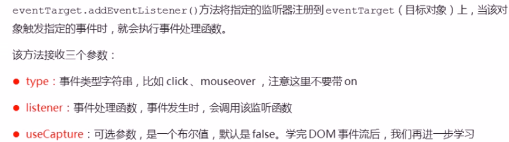
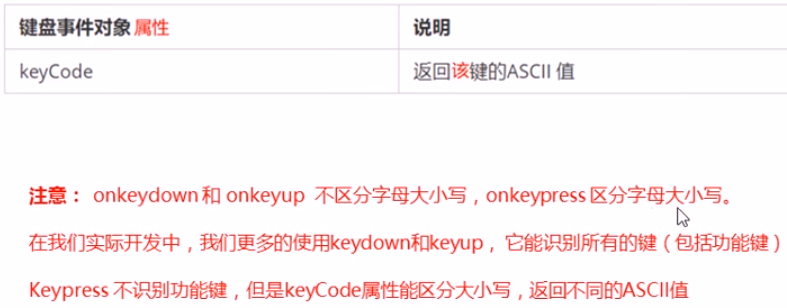

# 教程

https://www.bilibili.com/video/BV1k4411w7sV

# 小tips

#### a链接防止跳转

```
<a href='javascript:;'>删除</a>
```

#### 弹出输入框

```
var text = prompt("请输入：");
```


# Web APIs和JS基础关联性

### JS的组成


### API


### Web PI


### API和Web API总结


# DOM

## DOM树


## 获取元素

##### 根据ID获取

```
document.getElementById('');
```

```
<div id="time">2020-9-9</div>
<script>
    var timer = document.getElementById('time');
    console.log(timer);
</script>
```

##### 根据name属性名获取

```
document.getElementByName('')
```

##### 根据标签名获取

```
getElementsByTagName('标签名');
```

```
var ol = document.getElementById('ol');
console.log(ol.getElementsByTagName('li'));
```

##### 根据类名获取

```
document.getElementsByClassName('类名')
```

##### 返回指定选择器的第一个对象

```
document.querySelector('选择器') #.box/#box/li
```

##### 根据选择器返回

```
document.querySelectorAll('选择器') #.box/#box/li
```

##### 获取body标签

```
document.body;
```

##### 获取html标签

```
document.documentElement;
```

## 注册事件基础

```
<input type="button" onclick="change()">
```


1. 事件源 2. 事件类型 3. 处理事件程序

```
<button id="btn">我是按钮</button>
    <script>
        var btn = document.getElementById('btn');
        btn.onclick = function () {
            alert('我是响应')
        }
    </script>
```

##### 鼠标注册事件


## 操作元素

#### 修改元素内容

```
element.innerText
```

```
#     element.innerHTML    #用的最多
div.innerHTML = '<strong>今天是：</strong>2020';
```

#### 修改元素属性


```
zxy.onclick = function(){
	img.src = 'images/zxy.jpg';
}
```

###### 案例：根据不同的时间，显示不同的问候语和不同的图片

```
    <div>上午好</div>
    
    <script>
        // 获取元素
        var jpg = document.querySelector('img');
        var div = document.querySelector('div');
        // 得到当前的小时
        var date = new Date();
        var h = date.getHours();
        // 判断小时数改变文字
        if (h < 12) {
            img.src = 'shangwu.jpg';
            div.innerHTML = '上午好';
        } else if (h < 18) {
            img.src = 'xiawu.jpg';
            div.innerHTML = '下午好';
        } else {
            img.src = 'wanshang.jpg';
            div.innerHTML = '晚上好';
        }

    </script>
```

#### 表单元素的属性操作


```
input.value = '修改内容';
```

```
btn.onclick = function() {
	this.disabled = true;    #按钮只能点一次
}
# this 只想的是时间函数的调用者，即btn
```

==this==

###### 案例：京东显示隐藏密码

```
<head>
    <meta charset="UTF-8">
    <meta name="viewport" content="width=device-width, initial-scale=1.0">
    <title>Document</title>
    <style>
        .box {
            position: relative;
            width: 400px;
            border-bottom: 1px solid #ccc;
            margin: 100px auto;
        }

        .box input {
            width: 370px;
            height: 30px;
            border: 0px;
            outline: none;
        }

        .box img {
            position: absolute;
            top: 2px;
            right: 2px;
            width: 24px;
        }
    </style>
</head>

<body>
    <div class="box">
        <label for="">
            
        </label>
        <input type="password" name="" id="pwd">
    </div>
    <script>
        // 获取元素
        var eye = document.getElementById('eye');
        var pwd = document.getElementById('pwd');
        // 注册事件
        var flag = 0;
        eye.onclick = function () {
            if (flag == 0) {
                pwd.type = 'text';
                eye.src = 'images/openeye.png';
                flag = 1;
            } else {
                pwd.type = 'password';
                eye.src = 'images/closeeye.png';
                flag = 0;
            }
        }
    </script>
</body>
```

#### 样式属性操作


###### element.style举例

```
div.style.backgroundColor = 'purple';
```

###### element.className举例

```
<head>
    <meta charset="UTF-8">
    <meta name="viewport" content="width=device-width, initial-scale=1.0">
    <title>Document</title>
    <style>
        .change {
            width: 50px;
            height: 50px;
        }
    </style>
</head>
<body>
    <div class="change"></div>
    <script>
        text.onclick = function(){
            this.className = 'change';
        }
    </script>
</body>
```


###### 案例

点击关闭二维码悬浮盒子

```
<head>
    <meta charset="UTF-8">
    <meta name="viewport" content="width=device-width, initial-scale=1.0">
    <title>Document</title>
    <style>
        .box {
            position: relative;
            width: 74px;
            height: 88px;
            border: 1px solid #ccc;
            margin: 100px auto;
            font-size: 12px;
            text-align: center;
            color: #f40;
        }

        .box img {
            width: 60px;
            margin-top: 5px;
        }

        .close-btn {
            position: absolute;
            top: -1px;
            left: -16px;
            width: 14px;
            height: 14px;
            border: 1px solid #ccc;
            line-height: 14px;
            font-family: Arial, Helvetica, sans-serif;
            cursor: pointer;
        }
    </style>
</head>

<body>
    <div class="box">
        二维码
        
        <i class="close-btn">x</i>
    </div>
    <script>
        var btn = document.querySelector('.close-btn');
        var box = document.querySelector('.box');
        btn.onclick = function () {
            box.style.display = 'none';
        }
    </script>
</body>
```

###### 案例：精灵图P21

###### 案例：显示隐藏文本框内容

#### 总结


#### 排他思想（算法）

###### 案例：多个按钮，点击按钮背景颜色变化


###### 案例：换网页背景

###### 案例：鼠标经过表格行背景变色

###### 案例：表单全选取消

#### 自定义属性操作

###### 获取属性值

```
element.getAttribute('属性');
```

###### 设置属性值

```
div.id = 'test';    #老方法，针对原有属性，如id等
```

```
element.setAttribute('属性','值') #主要针对自定义属性
                    ('index','2')
```

###### 移除属性

```
div.removeAttribute('index');
```

###### 案例：Tab栏切换（重点）

#### H5自定义属性

#### 设置H5自定义属性

`data-`开头的作为自定义属性

#### H5获取自定义属性的方法

```
div.setAttribute('data-index','2')
console.log(div.dataset.index);    #方法1
console.log(div.dataset['index'])  #方法2
```

```
#如果自定义属性里面有多个-链接的单词，我们获取的时候才去驼峰命名法
div.setAttribute('data-index-name','2')
console.log(div.dataset.indexName);    #方法1
console.log(div.dataset['indexName']);    #方法2
```

## 节点操作

#### 概述


#### 获取节点

##### 获取父级节点

```
zijiedian.parentNode;
```

##### 获取子节点

```
fujiedian.childNodes   #包含元素节点 文本节点等   #一般不用
```

##### 获取子元素节点

```
fujiedian.children   #实际开发常用
fujiedian.firstElementChild  #返回第一个子元素节点   #这个需IE9以上才兼容
fujiedian.children[0];     #采用此方法
fujiedian.children[fuyuansu.children.length - 1];   #获取最后一个元素
```

###### 案例：下拉菜单

##### 获取兄弟节点

```
node.nextSibling     #得到下个兄弟节点，包括文本节点
```

```
node.nextElementSibling    #下个兄弟元素节点 # IE9以上
node.previousElementSibling #上个兄弟元素节点 #IE9以上
```


#### 创建节点

动态创建元素节点

```
document.createElement('tagName')
```

```
node.appendChild(child)   #添加到指定父节点的子节点末尾
```

```
node.insertBefore(child,指定元素) #在父节点的指定子节点前面加
ul.insertBefore(lili,ul.children[0]) #例，在第一个子节点前加lili
```

###### 案例：发布留言

#### 删除节点

```
node.removeChild(child)
```

#### 复制节点

```
node.cloneNode()
```


###### 案例：动态生成表格

#### 三种动态创建元素区别


## DOM重点核心


# 事件高级

## 注册事件（绑定事件）

###### 监听函数

```
addEventListener          #监听函数
```

```
a.addEventListener('click',function(e){
	
},false);
```


```
event.Target.addEventListener(type,listener[,useCapture])
```




```
#事件监听方式 attachEvent  #IE9以前识别 
eventTarget.attachEvent(eventNameWithOn,callback)
```


##### 注册事件兼容性解决方案

#####  

## 删除事件


## DOM事件流


## 事件对象

```
#event
div.onclik = function(event) {
	console.log(event);
}
```


#### 时间对象的属性方法


## 阻止事件冒泡

```
e.stopPropagation();   #方法1
```

```
e.cancelBubble = true;  #方法2
```

###### 兼容性方案


## 事件委托

##### 原理


```
#点击哪个li就变背景颜色
var ul = document.querySelector('ul');
ul.addEventListener('click',function(e){
	e.target.style.backgroundColor = 'pink';
})
```

## 常用鼠标事件

##### 禁止鼠标右键菜单contexmenu

```
document.addEventListener('contextmenu',function(e){
	e.preventDefault();
})
```

##### 禁止鼠标选中selectstart

```
document.addEventLisener('selectstart',function(e){
	e.preventDefault();
})
```

#### 鼠标时间对象

```
#其中较重要
e.pageX
e.pageY
```


## 常用键盘事件


```
document.addEventListener('keypress',function(e){
	console.log(e.keypress);
})
```



###### 案例：按键定位输入内容

###### 案例：模拟快递单号查询自动放大


# BOM

## BOM概述


## window对象的常见事件

```
//关闭浏览器当前窗口
windows.close();
```


#### 窗口加载事件

```
window.onload = function(){};
或者
window.addEventListener("load",function(){});
```


```
document.addEventListener('DOMContentLoad',function(){})    #IE9以上
```

#### 调整窗口大小事件

```
window.onresize = function(){}
window.addEventListener("resize",function(){})
```

window.innerWidth当前屏幕的宽度

## 定时器

##### setTimeout()

```
wondow.setTimeout(调用函数,[延迟的毫秒数])；    #调用一次
```

```
#可以调用函数
function callback(){
    console.log('爆炸了')；
}
setTimeout(callback,2000);
```


###### 案例：3秒自动隐藏图片广告

##### setInterval()

```
wondow.setInterval(调用函数,[延迟的毫秒数])；   #重复调用
```

##### 回调函数


##### 停止定时器

```
window.clearTimeout(timeoutID);
window.clearInterval(IntervalID);
```

###### 案例：倒计时效果

###### 案例：发送短信发送按钮倒计时

## JS执行机制

#### 同步和异步


## location对象

#### URL


#### location常见的属性


###### 案例：获取URL参数

#### location对象方法

```
location.assign()
location.replace()
location.reload()
```


## navigator对象

#### 判断PC端、移动端页面


## history对象

# PC端网页特效

## 元素偏移量offset系列


#### offset和style区别


###### 案例：获取鼠标在盒子内的坐标

###### 案例：动态框拖拽

###### 案例：图片放大镜效果

## 元素可视区client系统


#### 立即执行函数

```
(function(){})()
或者
(function(){}())
```

###### *案例：淘宝flexible.JS

#### dpr物理像素比

```
var dpr = window.devicePixelRatio || 1
```


#### pageshow


## 元素滚动scroll系列


```
window.pageYOffset
window.pageXOffset
```


###### 案例：淘宝固定侧边栏

## 三大系列总结


#### mouseover和mouseenter


## 动画函数封装

#### 动画实现原理


#### 动画函数的封装


#### 不同元素记录不同定时器


#### 缓动动画原理


###### 完美写法


#### 缓动动画回调函数


## 常见网页特效案例

#### 节流阀

# 移动端网页特效

## 触屏事件


#### 触摸事件对象


#### 移动端拖动元素


## 移动端常见特效

###### 案例：移动端轮播图

```
transition
```

##### classList

```
classList[0];  #取类名第几个
div.classList.add('three');  #添加类名，不用加.
div.classList.remove('three'); #移除类名，不用加.
div.classList.toggle('类名')；  #切换类名
```

###### 案例：返回顶部模块

#### click延迟解决方案

##### 禁用缩放

```
<meta name="viewport"content="user-scalable=no">
```

##### 解决延迟


## 移动端常用开发插件

#### fastclick插件使用

#### swiper的使用(P157)

https://www.swiper.com.cn

Swiper4.x使用方法（官网）

1. demos文件夹中找到对应html文件

2. dist文件夹/复制min.css文件、min.js文件

3. 引入文件

4. 复制html结构，样式CSS，js

5. 复制CSS样式

#### 其他插件（P160）

superslide:  http://www.superslide2.com

iscroll:  https://github.com/cubiq/iscroll

#### 插件使用总结


###### 案例：引入视频插件zy.media.js

## 移动端常用开发框架


# 本地存储

## window.sessionStorage


##### 存储数据

```
sessionStorage.setItem(key,value)
```

##### 获取数据

```
sessionStorage.getItem(key)
```

##### 删除数据

```
sessionStorage.removeItem(key)
```

##### 删除所有数据

```
sessionStorage.clear()
```

## window.localStorage

www.todolist.cn

##### 存储数据

```
localStorage.setItem(key,value)
```

##### 获取数据

```
localStorage.getItem(key)
```

##### 删除数据

```
localStorage.removeItem(key)
```

##### 删除所有数据

```
localStorage.clear()
```

