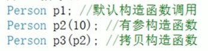
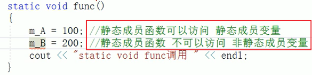
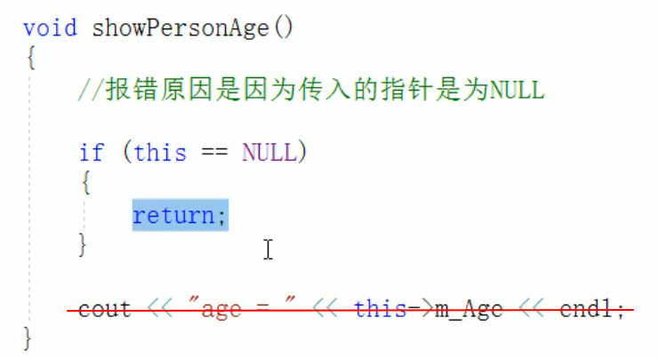
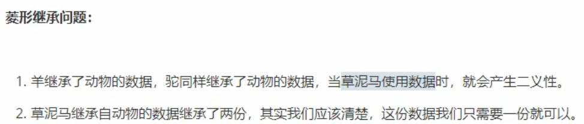
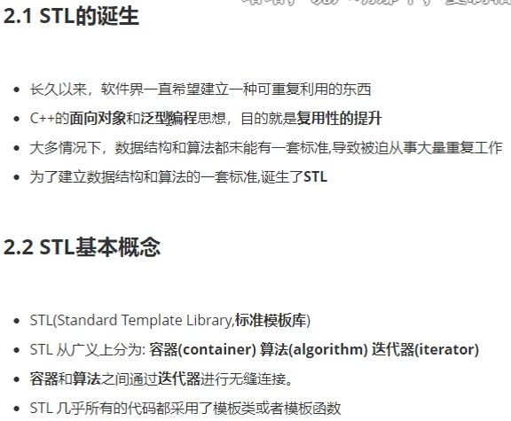

# 教程

https://www.bilibili.com/video/BV1et411b73Z

P189未（建议回顾指针和模板后从P185开始学习）


回顾：P93、P108、P110、P111、P112

回顾：指针、模板

# 软件

# 基础

```
#include <iostream>
using namespace std;


int main() {
	cout << "test"<< endl;
	system("pause");
	return 0;
}
```

# 注意点

## 随机数

```
#include <ctime>
srand((unsigned int)time(NULL));	//添加随机种子 利用当前系统时间生成随机数，防止每次随机数一样
rand()%100				//生成0~99随机数
rand()%100 +1			//生成0+1~99+1随机数，即1~100的随机数
```

## 清屏

```
//清除dos的历史屏幕数据
system("pause");
system("cls");
```

## 判断文件是否存在

```
ifstream ifs;
	ifs.open(FILENAME, ios::in);	//读文件
	if (!ifs.is_open())			//文件打开不成功
	{
		cout << "文件不存在" << endl;
		ifs.close();
		return;
	}
```

## 判断文件内容是否为空

```
char ch;
	ifs >> ch;
	if (ifs.eof())
	{
		cout << "文件为空" << endl;
		ifs.close();
		return;
	}
```

## 查看数据类型

```
typeid(T).name()
```

## 标准算法头文件

```
#include <algorithm>
```


# 清空文件，删除后重建

```
//清空文件
		ofstream ofs(FILENAME, ios::trunc);		//删除文件后再重新创建
		ofs.close();
```


# 关键字


# 整型


# sizeof

1. 统计数据类型所占内存大小

#### 语法

```
sizeof(数据类型/变量)
```

# 实型(浮点型)

1. 默认情况下，输出一个小鼠，最多显示出6位有效数字


#### 语法

```
float f1 = 3.14f		//不加f，系统默认为双精度
double f2 = 3.14
```

# 科学计数法

```
float f2 = 3e2;			//3*10^2
float f3 = 3e-2;		//3*0.1^2
```

# 字符型

1. 占1字节内存

#### 语法

```
char ch = 'a';
```

#### 查看字符的ASCⅡ值

```
cout << (int)ch << endl;
```

# 转义字符

1. \t占用8个位置


# 字符串型

#### c语言风格

```
char str1[] = "Hello world";
```

#### c++风格

```
#include <string>			//需写上这个头文件（VS2019不需要写这个头文件）
string str2 = "Hello world";
```

# 布尔类型bool

```
true    false
```

# 数据的输入

#### 语法

```
cin >> 变量
```

#### 例

```
#include <iostream>

using namespace std;

int main() {
	int a = 0;
	cout << "请给整型变量a赋值："<< endl;
	cin >> a;
	cout << "整型变量a = " << a << endl;
	system("pause");
	return 0;
}
```

# 运算符

## 算数运算符


## 赋值运算符


## 比较运算符


## 逻辑运算符


# 程序流程结构

## 顺序结构

## 选择结构

if

switch

## 循环结构

while

do...while

for

# 函数的分文件编写

1. 创建后缀名为swap.h的头文件，在头文件中写函数的声明

   ```
   #include<iostream>
   using namespace std;
   
   void swap(int a, int b);
   ```

2. 创建后缀名为swap.cpp的源文件，在源文件中写函数的定义

   ```
   #include "swap.h"
   
   void swap(int a, int b)
   {
   	int temp = a;
   	a = b;
   	b = temp;
   	cout << "a = " << a << endl;
   	cout << "b = " << b << endl;
   }
   ```

3. 在主文件.cpp中引用

   ```
   #include <iostream>
   using namespace std;
   #include "swap.h"
   
   int main() {
   	int a = 10;
   	int b = 20;
   	swap(a, b);
   	
   	return 0;
   }
   ```

# 指针

1. 定义指针

   ```
   数据类型 *指针变量名;
   
   int a = 10;
   
   int *p;			//定义一个指针变量
   p = &a;			//将a的地址&a赋值给指针变量p ，打印p就是打印a的地址
   或
   int * p = &a;
   ```

2. 使用指针

   ```
   指针前加 * 代表解引用，找到指针指向的内存数据
   
   *p			//p的指针地址，*p就是这个地址里的数据
   *p = 100;	//修改原来指针地址里的数据
   ```

#### 指针所占内存空间

1. 32位操作系统下，占用4个字节
2. 64位操作系统下，占用8个字节 

#### 空指针

```
int *p = NULL;
```

定义：指针变量指向内存中编号为0的空间

用途：初始化指针变量

注意：空指针指向的内存是不可以访问的

#### 野指针

指针变量指向非法的内存空间

```
int * p = (int *)0x1100;
```

#### const修饰指针

##### 常量指针

1. 指针的指向可以改（p=&a,换成p=&b可行，但是a的值要等与b(a=b=10))
2. 指针指向的值不可改（指向值10不可改）

```
const int * p = &a;
```

##### 指针常量

1. 指针的指向不可以改（p=&a,换成p=&b不可行)	
2. 指针指向的值可以改（指向值10可改）(*p = 20)

```
int * const p = &a;
```

##### const全修饰

指针的指向和指针指向的值都不可以改

```
const int * const p = &a;
```

#### 数组指针

```
int arr[10]={1,2,3,4,5,5,3,2,5,8};
int *p=arr;		//arr就是数组首地址
cout << "访问第一个元素："<<*p<<endl;
p++;			//向后偏移4个字节
cout<< "访问第二个元素："<<*p<<endl;
```

##### 遍历数组

```
int arr[10]={1,2,3,4,5,5,3,2,5,8};
int *p=arr;		//arr就是数组首地址
for(int i=0;i<10;i++)
{
	cout << *p <<endl;
	p++;
}
```

#### 函数指针

```
void swap(int *p1,int *p2){}

swap(&a,&b);
```

# 结构体

==用户自定义的数据类型==

**语法：**`struct 结构体名{结构体成员列表}；`

+ struct 结构体名 变量名
+ struct 结构体名 变量名 = {成员1值，成员2值...}
+ 定义结构体顺便创建变量

#### 创建具体实例

1. 定义的时候struct不可以省略
2. 创建实例的时候struct可以省略

```
// 第一种
struct student{			//定义的时候struct不可以省略
	string name;
	int age;
	int score;
};


struct student zhang;	//创建实例的时候struct可以省略
zhang.name = "张三"；
...
```

```
//第二种
struct student{
	string name;
	int age;
	int score;
};
struct student zhang = {"张三"，19，100}；
```

```
//第三种
struct student{
	string name;
	int age;
	int score;
}s3;
s3.name = "张三";
...
```

#### 结构体数组

**语法：**`struct 结构体名 数组名[元素个数] = {{},{},{},{}}`

```
struct Student{
	string name;
	int age;
	int score;
};
int main(){
	//创建实例
    struct Student atuArray[3] = {
        {"zhang",18,100},
        {"li",20,80},
        {"wang",31,99}
    };
    //修改信息
    atuArray[2].name = "sun";
    //遍历数组
    for(int i=0;i<3;i++){
        cout<<"姓名："<<stuArray[i].name<<"年龄："<<stuArray[i].age<<"分数："<<stuArray[i].score<<endl;
    }
}

```

#### 结构体指针

```
struct Student{
	string name;
	int age;
	int score;
};
int main(){
	//创建结构体遍历
	struct student s = {"张三"，19，100}；	//struct可省略，相当于 int s = {};
	//通过指针指向结构体变量
	struct student * p = &s;			////struct可省略，相当于 int * p = &s;
	//通过指针访问结构体变量
	cout<< "姓名："<<p->name<<"年龄："<<p->age<<"分数："<<p->score<<endl;
```

#### 结构体嵌套

```
struct teacher{
	int id;
	string name;
	int age;
	struct student stu;
};
struct student{
	string name;
	int age;
	int score;
};
int main(){
	//创建老师实例
	teacher t;
	t.id = 111;
	t.name = "zhang";
	t.age = 50;
	t.stu.name = "wang";
	
}
```

#### 结构体做函数参数

+ 值传递（实参不改变形参）

```
struct student{
	string name;
	int age;
	int score;
};
void printStudent(struct student s){ 		//struct可省略，相当于int s
	cout<<p.name<<endl;
}
int main(){
	struct student s = {"张三"，19，100}；	
	printStudent(s);
}
```

+ 地址传递(实参改变形参)

```
struct student{
	string name;
	int age;
	int score;
};
void printStudent(struct student * p){		//struct可省略，相当于int * s
	cout<<p->name<<endl;
}
int main(){
	struct student s = {"张三"，19，100}；
	printStudent(&s);
}
```

==不想修改主函数中的数据，用值传递，反之用地址传递==

#### 结构体中const使用场景

1. 防止地址传递的时候实参改变形参

```
struct student{
	string name;
	int age;
	int score;
};
void printStudent(const student * p){		//const 防止在printStudent中误修改
	cout<<p->name<<endl;
}
int main(){
	struct student s = {"张三"，19，100}；
	printStudent(&s);
}
```

#### 结构体案例

三个老师，每个老师分别带5个学生

```
#include <iostream>
using namespace std;
//构造学生
struct Student{
	string sName;
	int score;
};
//构造老师
struct Teacher{
	string tName;
	struct Student sArray[5];
};


//给老师和学生赋值的函数
void allocateSpace(struct Teacher tArray[],int len){
	string nameSeed = "ABCDE";
	//给老师赋值
	for(int i=0;i<len,i++){
		tArray[i].tName = "Teacher_";
		tArray[i].tName += nameSeed[i];		//循环写出老师A,B,C,D,E
		//通过循环给老师带的学生赋值
		for(int j=0;j<5;j++){
			tArray[i].sArray[j].sName = "Student_";
			tArray[i].sArray[j].sName += nameSeed[j];
			tArray[i].sArray[j].score = 60;
		}
	}
	
}

//打印信息函数
void printInfo(struct Teacher tArray[],int len){
	for(int i=0;i<len,i++){
		cout<<"老师姓名："<<tArray[i].tName<<endl;
		//通过循环给老师带的学生赋值
		for(int j=0;j<5;j++){
			cout<<"\t学生姓名："<<tArray[i].sArray[j].tName<<" 学生分数："<<tArray[i].sArray[j].score<<endl;
		}
	}
}

int main() {
	struct Teacher tArray[3];
	int len = sizeof(tArray)/sizeof(tArray[0]);	//算数数组长度[]
	allocateSpace(tArray,len)
	printInfo(tArray,len);
}
```

# 冒泡排序

```
void bubbleSort(struct Hero heroArray[],int len){
	for(int i=0;i<len;i++){
		for(int j=0;j<len-i-1;i++){
			if(heroArray[j].age > heroArray[j+1].age){
				struct Hero temp = heroArray[j];
				heroArray[j] = heroArray[j+1];
				heroArray[j+1] = temp;
			}
		}
	}
}
```

# 内存分区模型

## 程序运行前

#### 代码区

**特点**：共享、只读

#### 全局区（==该区域的数据在程序结束后由系统自动释放==）

```
全局变量
静态变量	static int a =10;
字符串常量	"hello world"
const全局常量		const int b =10;
```

#### 不在全局区

```
const局部变量		const int c =10; 	//在函数内
局部变量	int d =10;
```

## 程序运行后

#### 栈区

1. 栈区的数据由编译器管理开辟和释放

**存放**：局部变量、形参

#### 堆区

1. 由程序员分配释放，若程序员不释放，程序结束时由系统回收
2. c++中主要利用new在堆区中开辟内存

```
new int(10);
```

如果想释放堆区的数据用delete

`delete p`

## new操作符

语法：`new 数据类型`

```
new int(10);
new int[10];
```

# 引用

给变量起别名

语法：`数据类型 &别名 = 原名`

```
int a = 10;
int &b = a;		//b和a操作同一块内存
```

## 注意事项

+ 引用必须初始化
+ 引用在初始化后，不可改变

## 引用做函数参数

作用：函数参数时，利用引用让形参修饰实参

有点：简化指针修改实参

## 引用做函数的返回值

+ 不要返回局部变量的引用（返回1次为系统保留，后面就是乱码）
+ 函数的调用可以作为左值

## 常量引用

```
const int & ref = 10;
```

# 函数高级

## 函数默认参数

语法：`返回值类型 函数名(参数=默认值){}`

## 函数占位参数

语法：`返回值类型 函数名(数据类型){}`

## 函数重载


# 类和对象


## 封装

 


#### 权限


#### 成员设置为私有


## 对象的初始化和清理

### 构造函数和析构函数


**构造函数**

```
class Person{
public:
	Person(){
		cout<<"Person的构造函数"<<endl;
	}
}
```

**析构函数**(函数销毁前调用）

```
class Person{
public:
	~Person(){
		cout<<"Person的析构函数"<<endl;
	}
}
```

### 构造函数的分类和调用


**拷贝构造函数**

```
class Person{
public:
	Person(const Person &p){
		age = p.age;
		cout<<"Person的拷贝构造函数"<<endl;
	}
	int age;
}
```

**括号法**



**显示法**


**隐式转换法**


### 拷贝构造函数调用时机


### 构造函数的调用规则


### 深拷贝与浅拷贝


### 初始化列表


```
class Person{
public:
	Person(int a,int b):age(a),score(b)
	{
		cout<<"初始化"<<endl;
	}
	int age;
	int score;
}
int main(){
	Person p(20,99);
}
```

### 类对象作为类成员


### 静态成员




## C++对象模型的和this指针

### 成员变量和成员函数分开储存

### this指针

this->****


***this**


### 空指针访问成员函数



### const修饰成员函数

常函数(**muteble**)


```
class Person
{
public:
	void showPerson() const
	{
		this->m_B = 100;
	}
	muteble int m_B;
}
```


**常对象**


## 友元


**类外写成员函数**


## 运算符重载


### 函数调用运算符重载()


## 继承

**语法：**`class 子类: 继承方式 父类`

子类：也称为 派生类

父类：也称为 基类


### 继承方式


### 继承中的对象模型


### 构造和析构顺序


### 继承同名成员处理方式


### 继承同名静态成员处理方式


### 多继承语法


### 菱形继承




**解决菱形继承**


**总结**


## 多态


**virtual**


### 纯虚函数和抽象类


```
例
class Base
{
public:
	virtual void func() = 0;
}
```

```
例
class Son:public Base
{
public:
	virtual void func(){
		cout<<"func调用"<<endl;
	};
}
void test01()
{
	Base * base = NULL;
	base = new Son;
	base->func();
	delete base;
}
```

**案例(制作咖啡)**

```
//抽象类 制作饮品
class AbstractDrinking
{
public:
	virtual void Boil() = 0;
	void makeDrink()
	{
		Boil();
	}
}
//实例 制作咖啡
class Coffee:public AbstractDrinking
{
public:
	virtual void Boil()
	{
		cout<<"煮农夫山泉"<<endl;
	}
}
//调用制作
void doWork(AbstractDrinking * abs)
{
	abs.makeDrink();
}
//制作某一杯咖啡
void test01()
{
	doWork(new Coffee);
}
```

### 虚析构纯虚析构


# 文件操作

fstream


## 文本文件

### 写文件


#### 文件打开方式


```
#include <iostream>
#include <fstream>
using namespace std;

void test01() {
	ofstream ofs;
	ofs.open("text.txt",ios::out);
	ofs << "hello world" << endl;
	ofs << "姓名：张三" << endl;
	ofs.close();
}
int main() {
	test01();
}
```

### 读文件


**第一种读数据方式**

```
char buf[1024] = {0};
while (ifs >> buf){
	cout<<buf<<endl;
}
```

**第二种读数据方式**

```
char buf[1024] = {0};
while (ifs.getline(buf,sizeof(buf))){
	cout<<buf<<endl;
}
```

**第三种读数据方式**

```
string buf;
while(getline(ifs,buf)){
	cout<<buf<<endl;
}
```

**第四种读数据方式**

```
char c;
while((ifs.get()) != EOF){
	cout<<buf<<endl;
}
```

#### 例

```
#include <iostream>
#include <fstream>
using namespace std;

void test01() {
	ifstream ifs;
	ifs.open("text.txt",ios::in);
	if (!ifs.is_open()) {
		cout << "打开失败" << endl;
		return;
	}
	string buf;
	while(getline(ifs,buf)){
		cout<<buf<<endl;
	}
	ifs.close();
}
int main() {
	test01();
}
```

## 二进制文件


#### 二进制写文件


```
#include <iostream>
using namespace std;
#include <fstream>

class Person
{
public:
	char m_Name[64];
	int m_Age;
};

void test01() {
	ofstream ofs("person.txt", ios::out | ios::binary);
	Person p = { "张三",18 };
	ofs.write((const char*)&p,sizeof(Person));
	ofs.close();
}
int main() {
	test01();
}

```

#### 二进制读文件


```
#include <iostream>
using namespace std;
#include <fstream>

class Person
{
public:
	char m_Name[64];
	int m_Age;
};

void test01() {
	ifstream ifs("person.txt", ios::in | ios::binary);
	if (!ifs.is_open()) {
		cout << "打开失败" << endl;
		return;
	}
	Person p;
	ifs.read((char*)&p, sizeof(Person));
	cout << "姓名：" << p.m_Name << "年龄：" << p.m_Age << endl;
	ifs.close();
}
int main() {
	test01();
}
```


# 利用开发人员命令提示工具查看对象模型


# struct和class的区别


# 头文件源文件(.h.cpp)

## point.h(声明)

```
#prama once
#include <iostream>
using namespace std;

class Point
{
public:
	void setX(int x)
	int getX();
private:
	int m_X;
}
```

## point.cpp

```
#include "point.h"

void Point::setX(int x)
{
	m_X = x;
}
int Point::getX()
{
	return m_X;
}
```

# 模板

## 1、函数模板

```
template<typename T>

void mySwap(T &a, T &b)
{
	T temp = a;
	a = b;
	b = temp;
}

int main()
{	
	int a = 10;
	int b = 20;
	mySwap(a,b);
	或者
	mySwap<int>(a,b)
}
```

```
template<class T>
```


## 2、类模板

```
template<class NameType,class AgeType>
class Person
{
public:
	NameType m_Name;
	AgeType m_Age;
}
```

## 3、类模板与继承


```
template<class T>
class Base
{
	T m;
}
class Son:public Base<int>			//继承的时候必须明确类型
{
	
}
```

# STL

#### 容器、算法、迭代器、仿函数、适配器、空间配置器




**vector存放内置数据类型**


```
#include<vector>

void test01()
{
	vector<int> v;
	v.push_back(20);
	
	vector<int>::iterator itBegin = v.begin(); //起始迭代器，只想容器中第一个元素
	vector<int>::iterator itEnd = v.end();  //结束迭代器，指向容器中最后一个元素的下个位置
}
```

# 回顾

1. 指针
2. 模板