# 教程

https://www.bilibili.com/video/BV147411x7p1

P194-未

# 软件

VS 2019

#### **Nuget Package下载**

https://www.nuget.org/packages/Sayaka.Common/

1. 工具--Nuget包管理器--程序包管理器控制台
2. 输入安装代码，如“Install-Package Sayaka.Common -Version 1.0.6”，回车

#### Newtonsoft.Json.dll(C#使用json)

1. Nuget里应该包含了


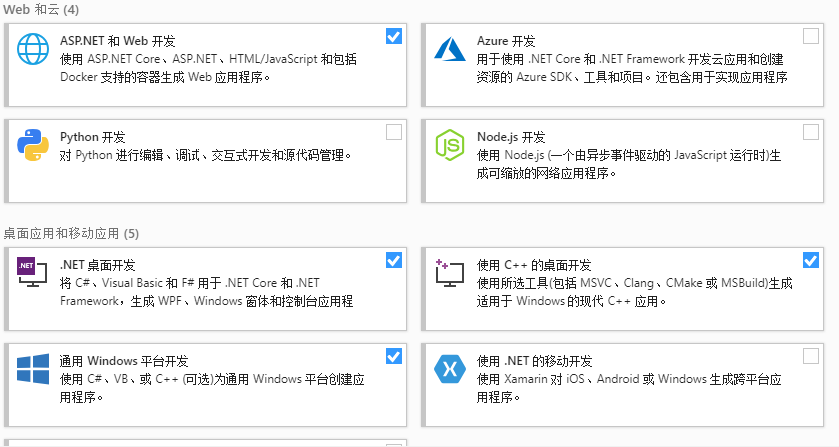

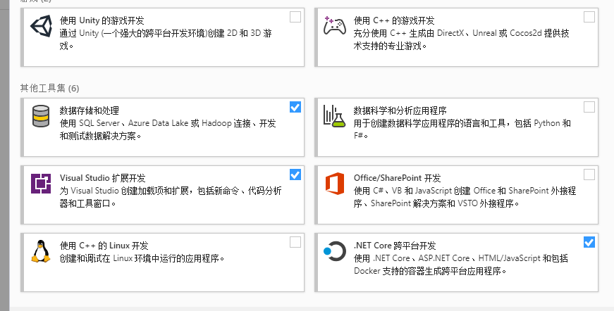

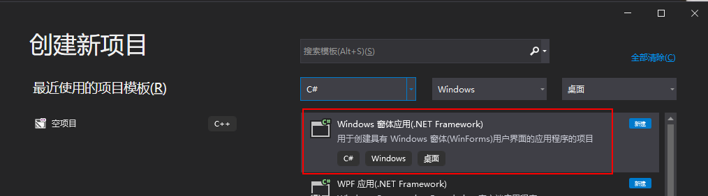


# 快捷写法，快捷键

## 属性

```
prop + 双击tab键
```

# 注意点

## try...catch...finally

```
try
{

}
catch(Exception ex)
{
	Console.WriteLine(ex.Message);
	Console.WriteLine($"Hello World");
}
finally
{
	
}
```

## using

1. 用完自动释放资源
2. 比如打开数据库可放在里面，忘记关会自动关闭

```
string connStr ="";
SqlConnection conn = null;
using (conn = new SqlConnection(connStr))
{

}
```

## 计时

```
Stopwatch sw = new Stopwatch();
sw.Start();
...
sw.Stop();
Console.WriteLine($"耗时：{sw.ElapsedMilliseconds}");
```


## 定位到命令解释

选中命令，按F12

## 强制转换

```
b.ToString()
```

```
object a = 123;
int i = (int)a;
```

## x ?? y

## x is y


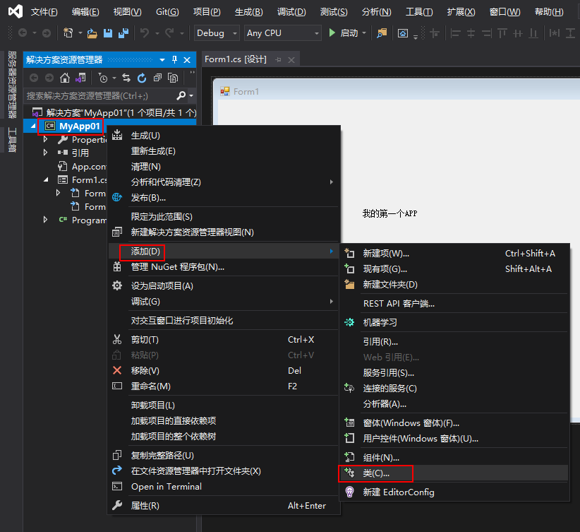

```
public class Person
    {
        public int Age { get; set; }
        public void Eat()
        {
            MessageBox.Show("人在吃");
        }
    }

Person person = new Person();	//实例化
```


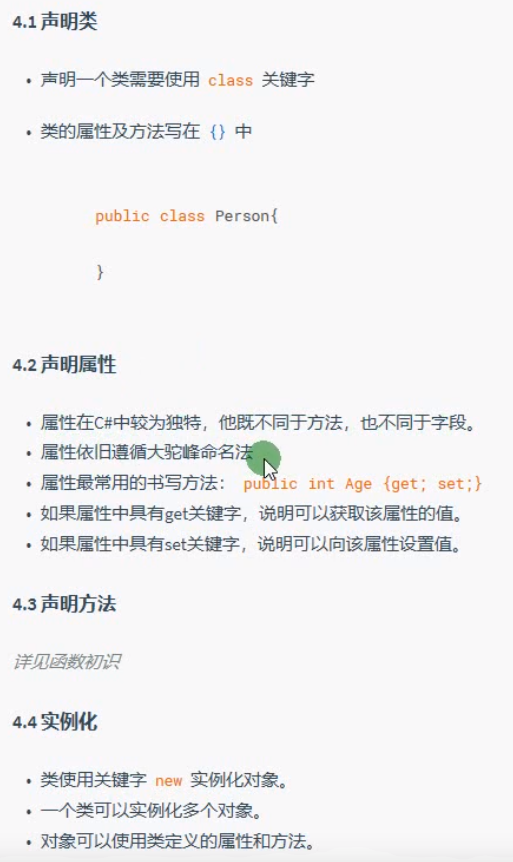

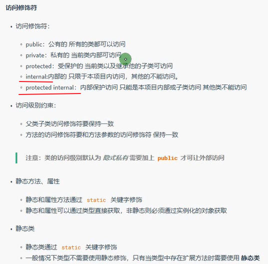

```
public static string Id {get;set;}

Person.Id //通过类直接调用，不能实例化对象调用
```

# 集合&字典

1. 储存时用==object==类型进行储存

```
ArrayList array1 = new ArrayList();
```

## 方法

```
arrayList.Add("abc");

arrayList.RemoveAt(0);

arrayList.Remove(123);

arrayList.Insert(0,"Hello");

arrayList[2] = 435;
```

## List集合

1. 只能储存一种类型的数据

```
List<int> intList = new List<int>()

List<int> intList = new List<int>{1,4,2,5,6}

intList.Add("abc");

intList.RemoveAt(0);

intList.Remove(123);

intList.Insert(0,"Hello");

intList[2] = 435;
```

#### 示例

```
//Person为创建好的类
List<Person> personList = new List<Person>();
Person person1 = new Person{
	Age = 18;
};
PersonList.Add(person1);

或

//Person为创建好的类
List<Person> personList = new List<Person>();
PersonList.Add(new Person{
	Age = 18;
});
```

## Dictionary字典

1. 键，值。
2. 键，值可以是任何类型
3. 键唯一，值可以不唯一。

```
Dictionary<int,string> dictionary = new Dictionary<int,string>();

dictionary.Add(1,"张三");
dictionary.Add(2,"李四");
dictionary[1] = "王五";

string Name1 = dictionary[1];

或

Dictionary<string,string> dictionary = new Dictionary<string,string>(){
	{"A","张三"},
	{"B","李四"}
};
```

# foreach

1. 操作数组

```
int[] ints = {1,3,5,6,7};
foreach(int item in ints){
	MessageBox.Show(item.ToString())
}
```

2. 操作集合

```
List<int> intList = new List<int>(){1,4,5,6}
foreach(int item in intList){
	MessageBox.Show(item.ToString())
}
```

2. 操作字典

```
Dictionary<string,string> dictionary = new Dictionary<string,string>(){
	{"A","张三"},
	{"B","李四"}
};

foreach(KeyValuePair<string,string> item in dictionary){
	MessageBox.Show(item.Key);
	MessageBox.Show(item.Value);
}
```

# WinForm

1. 界面设计，拖控件
2. 设置属性
3. 编写代码
4. 保存
5. 运行程序

## 插件

##### dsoframer.ocx

1. 将“dsoframer.ocx”文件复制到C:\Windows\sysWOW64
2. 右击C:\Windows\sysWOW64 目录中的cmd.exe的程序，以管理员运行
3. 执行 regsvr32 dsoframer.ocx回车即可

## 注意点

#### Load事件写代码添加

实例化--属性设置--注册事件--把控件添加到当前窗体的Controls集合中

#### 清空空格

```
Trim()
```

#### 判断输入是否为空

```
string.IsNullOrEmpty(userName)
```

#### 数据大，闪烁问题

```
*.BeginUpdate();
*.EndUpdate();
```

#### 当前时间

放在Timer控件下可改变时间

```
= DateTime.Now.ToString();
```

#### 注册控件

```
timer3.Elapsed += Timer3_Elapsed;
```

#### 委托Invoke

```
Private void Timer1()
{
	Action act = UpdateTime;
	this.Invoke(act);
}
Private void UpdateTime(){
	lbl.Text = DateTime.Now.ToString();	
}
```

#### Mdi容器显示其他窗体

```
MForms.FormAddStudent fAddStudent = new MForms.FormAddStudent();
fAddStudent.MdiParent = this;	//设置Mdi父容器
fAddStudent.Show();
```

#### 鼠标经过事件

鼠标经过菜单显示子菜单

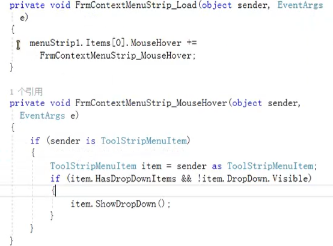


#### TreeView排他思想

```
private void treeView1_AfterSelect(object sender, TreeViewEventArgs e)
        {
            foreach(TreeNode node in trvMenu.Nodes)
            {
                node.BackColor = Color.White;
                node.ForeColor = Color.Black;
            }
            e.Node.BackColor = SystemColors.Highlight;
            e.Node.ForeColor = Color.White;
        }
```

#### ？语法

```
frmPrinterAssets?.Hide();
//如果frmPrinterAssets != null;则执行frmPrinterAssets.Hide();
```

#### 转义@

```
@"D:\Projects\C#Project\MyTime\DZHData.mdb" 	//没@要在每个\前添加一个\
```


## 程序入口点Program.cs

#### 设置默认启动的第一个窗体

1. 打开Program.cs
2. 修改`Application.Run(new FrmUser());`

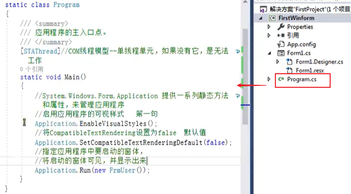

#### ADOX(创建Catalog目录类)

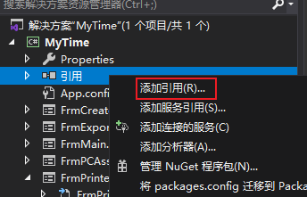

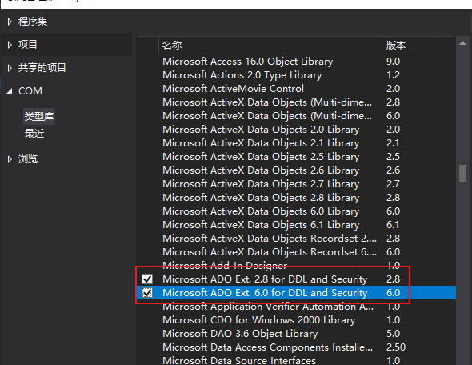

## 项目结构

#### 1、Properities

程序集属性

#### 2、引用

1. 右击，添加引用
2. 选择需要添加的

#### 3、App.config

配置文件

#### 4、窗体文件

添加窗体

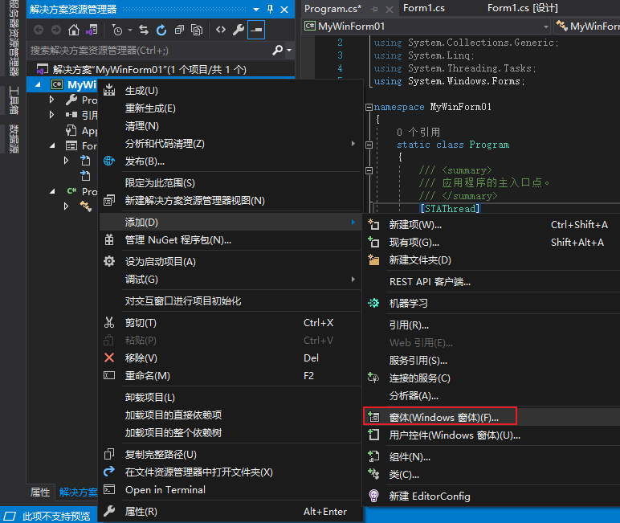

#### 5、Program

入口文件

## 项目文件

#### *.sln	

解决方案文件。位置引用。打开这个文件可直接打开此VS项目

#### *.csproj 	

项目文件。位置引用。打开这个文件可直接打开此VS项目

#### bin	

存放项目编译结果。debug调试版本/release发布版本。可在VS中选择

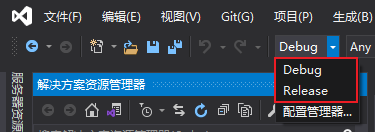

#### *.pdb(bin文件夹中)

位置信息，调试文件。

发布时需要去除此文件，不允许调试。

#### obj

编译过程中生成的中间临时文件

#### 窗体.cs

放置窗体功能源代码，处理代码

#### 窗体.Designer.cs

窗体布局代码

拖动控件，自动生成控件代码

#### 窗体.resx

窗体的资源文件(图标等)

## 常用控件

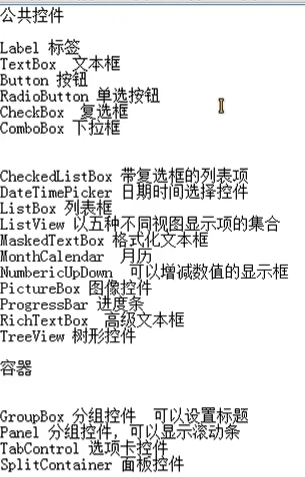

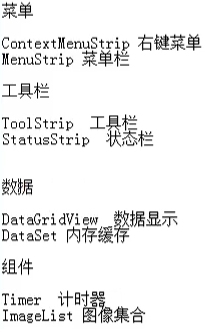


## 控件属性、方法

#### ==Form==

AcceptButton: 设置某个按钮为回车默认按的按钮

CancelButton：按ESC默认按的按钮

ContextMenuStrip：窗体右击菜单

ControlBox: 窗口最大化最小化

FormBorderStyle: 窗口大小是否可自行调整

Maxmizebox:最大化窗口启用或关闭

IsMdiContainer:窗体内是否包含其他窗体，不包含则把其他窗体显示在此窗体外部

StartPosition:窗体出现时在屏幕的位置

Tag:传的数据,比如字符串

TopMost: 窗体是否总显示在最上层

FormClosing:窗体关闭时的动作

#### ==TextBox==

Multiline:是否可多行输入

PasswordChar:密码输入，如*

MaxLength:最大字符数

**方法**

AppendText()

Clear()

Focus()

Select()

SelectAll()

**事件**

TextChanged()

Click

#### ==Button==

Visible： 是否显示

#### ==RadioButton==

AutoCheck: 是否检查同组RadioButton互斥（选择一个，另一个自动取消选择）

CheckAlign：选择圆点在文本位置

#### ==ListBox==

ListBox.Items.Clear();		//项目清空

ListBox.BeginUpdate();		//避免闪烁

ListBox.EndUpdate();

ListBox.SelectedValue		//选定项的值

ListBox.SelectedIndices		//选定项的所有索引

ListBox.SelectedItems		//选定项

```
//绑定数据
List<UserInfo> list = new List<UserInfo>();		//UserInfo为创建的类
list.Add(new UserInfo(){
	Id = 1;
	Name = "admin1"
});
list.Add(new UserInfo(){
	Id = 2;
	Name = "admin2"
});
ListBox.DataSource = list;
ListBox.DisplayMember = "Name";
ListBox.ValueMember = "Name";
```

#### ==ComboBox点击下拉框==

DropDownStyle: 下拉样式

```
cboList.Items.Clear();
```

#### ==Timer==

```
System.Windows.Forms.Timer		//基于UI，优先使用。精度低

System.Timers.Timer	//基于服务

System.Threading.Timer 	//基于线程,多线程，轻量级，精度高
例：
timer4 = new System.Threading.Timer(new System.Threading.TimerCallback(o=>{
	
}),null,100,1000);
```

#### ==MenuStrip==

1. 在集合属性中添加菜单项

Text: 文件(&F)           //设置快捷键Alt需加&，设置Ctril不需要写括号内容

ShortcutKey: Alt+F

ShowShortcutKeys: True

#### ==GroupBox、Panel容器==

1. 拖动容器，里面的内容全都一起移动
2. GroupBox有边框
3. Panel无边框，可以有下拉条

#### ==SplitContainer==

Orientation: 调整拆分方向（上下、左右）

IsSplitterFixed：拆分条是否固定

FixedPanel: 选择固定某个面板的宽度（窗口变动大小时，此窗口不变）

#### ==ContextMenuStrip右键菜单==

控件命名：cms...

子菜单命名：tsm...

关联：父组件ContextMenuStrip

#### ==DataGridView==

RowHeaderVisible:首行隐藏

DataGridViewRow行，DataGridViewRowCollection行集合，Rows所有行 

DataGridViewColumn列，DataGridViewColumnCollection列集合，Columns所有列

DataGridViewCell单元格，

**右击选中整行数据**


AutoSizeColumnsMode: 左右自动填充整个窗口大小

CellBorderStyle:单元格边框样式	

CellContentClick: 点击单元格内容事件

CurrentCellDirtyStateChanged :单元格内容发生改变，比如checkbox勾选

**点击行中“删除“弹出窗口**

1. 添加列，类型选"DataGridViewLinkClumn"
2. 属性--数据--NullValue写“删除”

```
if(Cell.FomattedValue.ToString()=="删除")
{
	MessageBox.Show("");
}
```

**手动添加列了以后让读取数据不显示原来的标题**

1. 在编辑列中将每个添加的列的属性DataPropertyName的值改为对应读取的数据库列名。
   1. 添加下面代码，要写在指定数据源前

```
dataGridView.AutoGenerateColumns = false;
```


#### ==MaskedTextBox密码输入框==

BeepOnError：输入错误发出声音

CutCopyMaskedFormat：拷贝的时候是否带格式字符，如-

Mask：比如输入密码，mask为*

RejectInputOnFirstFailure:错误错误时禁止继续输入

#### ==NumericUpDown==

DecimalPlaces：小数位数

Increment：每次改变的数值

#### ==PictureBox==

SizeMode:图片显示模式（自适应等）

#### ==RichTextBox==

LoadFile：导入文件,如   rtb1.LoadFile(@"D:\a.txt",RichTextBoxStreamType.PlainText);

SaveFile: 保存文件，如 rtb1.SaveFile(@"D:\a.rtf");

LinkClicked :点击链接打开‘System.Diagnostics.Process.Start(e.LinkText);’

**插入图片：**

```
Clipboard.Clear();
Image img = Image.FromFile(@"d:\a.jpg");
Clipboard.SetImage(img);
rtb.Paste();
```

**加粗：**

```
                Font oldFont, newFont;
                oldFont = rtb.SelectionFont;
                if(oldFont.Bold)
                {
                    newFont = new Font(oldFont, oldFont.Style & ~FontStyle.Bold);
                }
                else
                {
                    newFont = new Font(oldFont, oldFont.Style | FontStyle.Bold);
                }
                rtb.SelectionFont = newFont;
                rtb.Focus();
```

**居中：**

```
            if(rtb.SelectionAlignment == HorizontalAlignment.Center)
            { rtb.SelectionAlignment = HorizontalAlignment.Left; }
            else
            { rtb.SelectionAlignment = HorizontalAlignment.Center; }
```

#### ==ListView==

view: 	1. details(可以增加列Column)  2.

SubItems: 子项（相当于文件的详细信息、大小等）


## 功能

```
MessageBox.Show(txtUserName.Text);
```

```
Frm01.ShowDialog();		//模式化窗体打开
```

```
Frm01.Activate();		//失去焦点，激活窗体
```

```
this.Close();		//关闭窗体
```

```
this.Hide();		//隐藏窗体
```

```

```

#### 跳转页面

```
private void BtnLogin_Click(object sender, EventArgs e)
        {
            FrmMain fMain = new FrmMain();
            fMain.Show();
        }
```

#### 报错弹窗

```
if(string.IsNullOrEmpty(userName))
            {
                MessageBox.Show("未输入用户名！","登陆页面",MessageBoxButtons.OK,MessageBoxIcon.Error);
                return;
           }
```

#### 最小化到通知区域

1. 创建NotifyIcon，添加icon图标

```
//设置窗体SizeChanged属性
private void FrmMain_SizeChanged(object sender, EventArgs e)
        {
            if (this.WindowState == FormWindowState.Minimized)
            {
                this.Hide();
            }
        }
//设置点击Icon弹出窗口并获得焦点
private void notifyIcon1_MouseDoubleClick(object sender, MouseEventArgs e)
        {
            this.Show();
            this.WindowState = FormWindowState.Normal;
        }
```

#### 创建新节点TreeView

```
TreeNode tn1 = new TreeNode();
tn1.Text = "新节点";
trvMenu.Nodes.Add(tn1);
```

#### 一个窗口给另一个窗口添加控件或者节点？？

#### 窗口直接修改数据库数据

P234最后

#### 定时提醒

https://www.bilibili.com/video/BV1Vt4y1S7r6?p=16

P16,25分

#### 批量删除

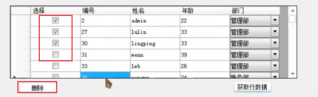

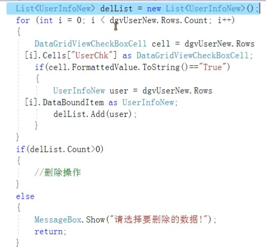

#### 点击TreeView节点切换窗口

```
    public partial class FrmMain : Form
    {
        FrmPCAssets frmPCAssets;
        FrmPrinterAssets frmPrinterAssets;
        public FrmMain()
        {
            InitializeComponent();
        }

        private void FrmMain_Load(object sender, EventArgs e)
        {
            
            //打开显示表格
            frmPCAssets = new FrmPCAssets();
            frmPCAssets.MdiParent = this;
            frmPCAssets.Parent = splitContainer1.Panel2;
            frmPCAssets.Show();
        }

        private void treeView1_AfterSelect(object sender, TreeViewEventArgs e)
        {
            foreach(TreeNode node in trvMenu.Nodes)
            {
                node.BackColor = Color.White;
                node.ForeColor = Color.Black;
            }
            e.Node.BackColor = SystemColors.Highlight;
            e.Node.ForeColor = Color.White;

            switch(e.Node.Index)
            {
                case 0:
                    if(frmPCAssets == null)
                    {
                        frmPCAssets = new FrmPCAssets();
                        frmPCAssets.MdiParent = this;
                        frmPCAssets.Parent = splitContainer1.Panel2;
                    }
                    frmPrinterAssets?.Hide();
                    frmPCAssets.Show();
                    break;
                case 1:
                    if(frmPrinterAssets == null)
                    {
                        frmPrinterAssets = new FrmPrinterAssets();
                        frmPrinterAssets.MdiParent = this;
                        frmPrinterAssets.Parent = splitContainer1.Panel2;
                    }
                    frmPCAssets?.Hide();
                    frmPrinterAssets.Show();
                    break;
            }
        }
     }
```

#### 动态创建TreeView的Nodes

**根据ACCESS数据库创建**

```
//取跟节点
            string mdbPath = @".\data\data.mdb";
            DataTable dt = new DataTable();
            DataRow dr;
            //建立连接
            string strConn = "Provider=Microsoft.Jet.OLEDB.4.0;Data Source=" + mdbPath;
            OleDbConnection odcConnection = new OleDbConnection(strConn);
            //打开连接
            odcConnection.Open();
            //建立SQL查询语句
            OleDbCommand odCommand = odcConnection.CreateCommand();
            //输入查询语句
            odCommand.CommandText = "select * from tb_foodtype";
            //建立读取
            OleDbDataReader odrReader = odCommand.ExecuteReader();


            //查询并显示数据
            int size = odrReader.FieldCount;
            for (int i = 0; i < size; i++)
            {
                DataColumn dc;
                dc = new DataColumn(odrReader.GetName(i));
                dt.Columns.Add(dc);
            }
            while (odrReader.Read())
            {
                dr = dt.NewRow();
                for (int i = 0; i < size; i++)
                {
                    dr[odrReader.GetName(i)] = odrReader[odrReader.GetName(i)].ToString();
                }
                dt.Rows.Add(dr);
                //添加父节点的方法
                
            }
            DataRow[] rows = dt.Select();//取根
            foreach (DataRow dRow in rows)
            {
                TreeNode rootNode = new TreeNode();
                rootNode.Tag = dRow;
                rootNode.Text = dRow["foodtype"].ToString();
                treeView1.Nodes.Add(rootNode);
                //BindChildAreas(rootNode);//调用添加子节点的方法
            }

            //关闭连接
            odrReader.Close();
            odcConnection.Close();
```

**添加子节点，待解决？？？**

```
using System;
using System.Collections.Generic;
using System.ComponentModel;
using System.Data;
using System.Drawing;
using System.Linq;
using System.Text;
using System.Threading.Tasks;
using System.Windows.Forms;
using System.Data.OleDb;
using System.IO;
using Newtonsoft.Json.Linq;
using Newtonsoft.Json;
using Newtonsoft.Json.Converters;
using System.Data.SqlClient;

namespace MyTime
{
    public partial class sun : Form
    {
        public sun()
        {
            InitializeComponent();
        }

        private void splitContainer1_Panel2_Paint(object sender, PaintEventArgs e)
        {
            //uiDataGridView1.DataSource = ReadAllData("打印机资产", @".\data\Data.mdb");
        }
        

        private void sun_Load(object sender, EventArgs e)
        {
            //ReadAllData("tb_foodtype", @".\data\data.mdb");

            //取跟节点
            string mdbPath = @".\data\data.mdb";
            DataTable dt = new DataTable();
            DataRow dr;
            //建立连接
            string strConn = "Provider=Microsoft.Jet.OLEDB.4.0;Data Source=" + mdbPath;
            OleDbConnection odcConnection = new OleDbConnection(strConn);
            //打开连接
            odcConnection.Open();
            //建立SQL查询语句
            OleDbCommand odCommand = odcConnection.CreateCommand();
            //输入查询语句
            odCommand.CommandText = "select * from tb_foodtype";
            //建立读取
            OleDbDataReader odrReader = odCommand.ExecuteReader();


            //查询并显示数据
            int size = odrReader.FieldCount;
            for (int i = 0; i < size; i++)
            {
                DataColumn dc;
                dc = new DataColumn(odrReader.GetName(i));
                dt.Columns.Add(dc);
            }
            while (odrReader.Read())
            {
                dr = dt.NewRow();
                for (int i = 0; i < size; i++)
                {
                    dr[odrReader.GetName(i)] = odrReader[odrReader.GetName(i)].ToString();
                }
                dt.Rows.Add(dr);
                //添加父节点的方法
                
            }
            DataRow[] rows = dt.Select();//取根
            foreach (DataRow dRow in rows)
            {
                TreeNode rootNode = new TreeNode();
                rootNode.Tag = dRow;
                rootNode.Text = dRow["foodtype"].ToString();
                treeView1.Nodes.Add(rootNode);
                BindChildAreas(rootNode);//调用添加子节点的方法

                string mdbPath1 = @".\data\data.mdb";
                DataTable dt1 = new DataTable();
                DataRow dr1;
                //建立连接
                string strConn1 = "Provider=Microsoft.Jet.OLEDB.4.0;Data Source=" + mdbPath1;
                OleDbConnection odcConnection1 = new OleDbConnection(strConn);
                //打开连接
                //odcConnection.Open();
                //建立SQL查询语句
                OleDbCommand odCommand1 = odcConnection.CreateCommand();
                //输入查询语句
                odCommand.CommandText = "select * from tb_food";
                //建立读取
                //OleDbDataReader odrReader1 = odCommand.ExecuteReader();


                //查询并显示数据
                int size1 = odrReader.FieldCount;
                for (int i = 0; i < size; i++)
                {
                    DataColumn dc;
                    dc = new DataColumn(odrReader.GetName(i));
                    dt1.Columns.Add(dc);
                }
                while (odrReader.Read())
                {
                    dr1 = dt1.NewRow();
                    for (int i = 0; i < size; i++)
                    {
                        dr1[odrReader.GetName(i)] = odrReader[odrReader.GetName(i)].ToString();
                    }
                    dt1.Rows.Add(dr1);
                    //添加父节点的方法

                }
                DataRow dr2 = (DataRow)rootNode.Tag;//父节点数据关联的数据行
                int fAreaId = (int)dr2["ID"]; //父节点ID
                DataRow[] rows1 = dt1.Select("foodty =" + fAreaId);//子区域
                if (rows1.Length == 0) //递归终止，区域不包含子区域时
                {
                    return;
                }
                foreach (DataRow dRow1 in rows1)
                {
                    TreeNode node = new TreeNode();
                    node.Tag = dRow1;
                    node.Text = dRow1["foodname"].ToString();
                    //添加子节点
                    rootNode.Nodes.Add(node);
                }

                //关闭连接
                //odrReader.Close();
                //odcConnection.Close();

            }

            //关闭连接
            odrReader.Close();
            odcConnection.Close();

            
        }
        //创建子节点方法
        private void BindChildAreas(TreeNode fNode)
        {
            

            
        }
        public static DataTable ReadAllData(string tableName, string mdbPath)
        {
            DataTable dt = new DataTable();
            try
            {
                DataRow dr;
                //建立连接
                string strConn = "Provider=Microsoft.Jet.OLEDB.4.0;Data Source=" + mdbPath;
                OleDbConnection odcConnection = new OleDbConnection(strConn);
                //打开连接
                odcConnection.Open();
                //建立SQL查询语句
                OleDbCommand odCommand = odcConnection.CreateCommand();
                //输入查询语句
                odCommand.CommandText = "select * from " + tableName;
                //建立读取
                OleDbDataReader odrReader = odCommand.ExecuteReader();

                //查询并显示数据
                int size = odrReader.FieldCount;
                for (int i = 0; i < size; i++)
                {
                    DataColumn dc;
                    dc = new DataColumn(odrReader.GetName(i));
                    dt.Columns.Add(dc);
                }
                while (odrReader.Read())
                {
                    dr = dt.NewRow();
                    for (int i = 0; i < size; i++)
                    {
                        dr[odrReader.GetName(i)] = odrReader[odrReader.GetName(i)].ToString();
                    }
                    dt.Rows.Add(dr);
                }

                //关闭连接
                odrReader.Close();
                odcConnection.Close();
                //success = true;
                return dt;
            }
            catch
            {
                //success = false;
                return dt;
            }
        }

        private void button1_Click(object sender, EventArgs e)
        {
            string getJson = File.ReadAllText(@"D:\data2.json", UTF8Encoding.UTF8);

            //这个需要引入Newtonsoft.Json这个DLL并using
            //传入我们的实体类还有需要解析的JSON字符串这样就OK了。然后就可以通过实体类使用数据了。
            Root rt = JsonConvert.DeserializeObject<Root>(getJson);
            //这样就可以取出json数据里面的值
            
            for (int i = 0; i < rt.data.Count; i++)
            {
                MessageBox.Show("Data=" + rt.data[i].context + "\r\n" + rt.data[i].location + "\r\n" + rt.data[i].time + "\r\n" + rt.data[i].ftime);
                //MessageBox.Show();
            }
        }

        private void button2_Click(object sender, EventArgs e)
        {
            //我们的接口
            string getJson = File.ReadAllText(@"D:\data2.json", UTF8Encoding.UTF8);

            //这个需要引入Newtonsoft.Json这个DLL并using
            //传入我们的实体类还有需要解析的JSON字符串这样就OK了。然后就可以通过实体类使用数据了。
            Root rt = JsonConvert.DeserializeObject<Root>(getJson);
            //这样就可以取出json数据里面的值
            MessageBox.Show("com=" + rt.com + "\r\n" + "condition=" + rt.condition + "\r\n" + "ischeck=" + rt.ischeck + "\r\n" + "state=" + rt.state + "\r\n" + "status=" + rt.status);
            //由于这个JSON字符串的 public List<DataItem> data 是一个集合，所以我们需要遍历集合里面的所有数据
            for (int i = 0; i < rt.data.Count; i++)
            {
                MessageBox.Show("Data=" + rt.data[i].context + "\r\n" + rt.data[i].location + "\r\n" + rt.data[i].time + "\r\n" + rt.data[i].ftime);
            }

        }
    }
}

```


**根据字典创建**

```
Dictionary<string, object> dictionary1 = new Dictionary<string, object>(){
                {"A",new List<string> { "张三", "李四", "王五" }},
                {"B","李四"}
            };
            foreach(KeyValuePair<string, object> item in dictionary1)
            {
                TreeNode tn1 = new TreeNode();
                tn1.Text = item.Key;
                trvMenu.Nodes.Add(tn1);
                if(item.Value.GetType() == typeof(List<string>))
                {
                    List<string> strList1 = (item.Value) as List<string>;
                    for(int i=0;i<strList1.Count;i++)
                    {
                        TreeNode tn2 = new TreeNode();
                        tn2.Text = strList1[i];
                        tn1.Nodes.Add(tn2);
                    }
                }
                else
                {
                    TreeNode tn2 = new TreeNode();
                    tn2.Text = item.Value.ToString();
                    tn1.Nodes.Add(tn2);
                }
            }
```

#### 读取Json文件

==方法1==

参考： https://www.cnblogs.com/zoujinhua/p/10330066.html

1. 引用Newtonsoft.Json.dll（可能安装Nuget后包含此引用）
2. 预定义实体类，将json文件内容复制到http://www.bejson.com/convert/json2csharp/，新建一个类文件，将装换的内容复制进去

==方法2==

```
{
  "A1":"1",
  "A2":[{
	"B1":"b1",
	"B2":"b2",
	"B3":"b3",
  }],
  "A3":{"C1":"c1","C2":"c2"}
}
```

```
using Newtonsoft.Json;
using Newtonsoft.Json.Linq;

private void sun_Load(object sender, EventArgs e)
        {
            string josnString = File.ReadAllText(@"D:\data.json", UTF8Encoding.UTF8);
            JObject jo = JObject.Parse(josnString);
            string all = jo.ToString();
            string neame = jo["Data"][1]["UserName"].ToString();
            int age = int.Parse(jo["Data"][1]["UserID"].ToString());
            textBox1.Text = neame;

        }
```

#### 设置透明度

```
this.Opacity = 1.0f;
```


## 连接Access数据库

1. 工具--连接到数据库--更改--选择“Microsoft Access 数据库文件”--确定
2. 点“浏览”--选择Access数据库文件（最好把文件复制到项目文件夹中）
3. 测试连接成功后，点确定
4. 右击Access文件，属性，复制“连接字符串”，字符串将在代码中使用

#### 读取表所有内容

```
using System;
using System.Collections.Generic;
using System.ComponentModel;
using System.Data;
using System.Drawing;
using System.Linq;
using System.Text;
using System.Threading.Tasks;
using System.Windows.Forms;
//增加using
using System.Data.OleDb;

namespace MyTime
{
    public partial class FrmPCAssets : Form
    {
        public FrmPCAssets()
        {
            InitializeComponent();
        }

        private void FrmPCAssets_Load(object sender, EventArgs e)
        {
            //调用读取函数，赋值给dataGridView1
            dataGridView1.DataSource = ReadAllData("PCAssets", "D:\\Projects\\C#Project\\MyTime\\DZHData.mdb");		//可以写成@"D:\Projects\C#Project\MyTime\DZHData.mdb"，相对路径将文件放在debug目录下.\data.mdb

        }
        public static DataTable ReadAllData(string tableName,string mdbPath)
        {
            DataTable dt = new DataTable();
            try
            {
                DataRow dr;
                //建立连接
                string strConn = "Provider=Microsoft.Jet.OLEDB.4.0;Data Source="+mdbPath;
                OleDbConnection odcConnection = new OleDbConnection(strConn);
                //打开连接
                odcConnection.Open();
                //建立SQL查询语句
                OleDbCommand odCommand = odcConnection.CreateCommand();
                //输入查询语句
                odCommand.CommandText = "select * from " + tableName;
                //建立读取
                OleDbDataReader odrReader = odCommand.ExecuteReader();

                //查询并显示数据
                int size = odrReader.FieldCount;
                for (int i = 0; i < size; i++)
                {
                    DataColumn dc;
                    dc = new DataColumn(odrReader.GetName(i));
                    dt.Columns.Add(dc);
                }
                while (odrReader.Read())
                {
                    dr = dt.NewRow();
                    for (int i = 0; i < size; i++)
                    {
                        dr[odrReader.GetName(i)] = odrReader[odrReader.GetName(i)].ToString();
                    }
                    dt.Rows.Add(dr);
                }
                
                //关闭连接
                odrReader.Close();
                odcConnection.Close();
                //success = true;
                return dt;
            }
            catch
            {
                //success = false;
                return dt;
            }
        }
        
    }
}

```


## 数据库

### 查询语句

```
//提取列为uName,uAge的数据，并将uName和uAge以中文别名显示
string sql = "select uName 姓名,uAge 年龄 form UserInfo"
```

## 界面美化

https://www.moeinn.com/c-sharp-winform-ui.html

IrisSkin4.dll

MetroModernUI

DSkin

##### NanUI

https://gitee.com/yhuse/SunnyUI

https://www.bilibili.com/video/BV1b5411L7eA?from=search&seid=9810297408294808761

https://www.cnblogs.com/yhuse/p/SunnyUI_Setup.html

	1. 进入工具箱--右击“添加选项卡”--输入SunnyUI确定
	2. 进入下载好的SunnyUI文件夹，将bin/net40/SunnyUI.dll文件拖动到工具箱里SunnyUI下的文字上

## 打包程序（打包安装项目）

打包步骤https://www.senxiaoxing.com/article/av11

打包属性详解https://blog.csdn.net/dog123xuheyin/article/details/85008071

1. 右击原项目--属性--图标和清单--选择ico图标
2. CS2019--扩展-管理扩展
3. 搜索并安装Miscrosoft Visual Studio Installer Projects
4. 右击项目--属性
5. 目标框架：选择.Net Framwork 4.6.1，确定，关闭VS安装（安装选择modify）。
6. 右键点击 **解决方案** ，选择 **添加** ，选择 **新建项目** 。 
7. 在弹出的窗口搜索 setup ，选择 Setup Project ，点击 **下一步** 。
8. 左侧会弹出一个 **文件系统** 的窗口，有三个文件夹，分别为 **应用程序文件夹** ， **桌面文件** ， **用户程序** ，右键点击 **Application Folder** , 选择 **Add** ,选择 **文件** ，找到原项目的编译文件夹，如 ~/bin/Debug ，选择**所有依赖文件**导入。
9. 将ico文件导入**Application Folder**
10. 将C:/Windows/System32/msiexec.exe导入到Application Folder，并创建快捷键，命名为Uninstall，User's Program Menu下项目名文件夹（需自己创建）下
11. 右击打包项目名--属性--OutputFIleName--release或debug\项目名.msi
12. 左击打包项目名--切换到属性面板--将ProductName和Title都改成项目名，RemovePreviousVersion改成True。
13. 左击打包项目名--切换到属性面板--复制ProductCode
14. 右击User's Program Menu下项目名文件夹（需自己创建）下Uninstall--属性--Arguments填写“/X空格+ProductCode”
15. 最后安装程序在打包文件夹下Release或debug下

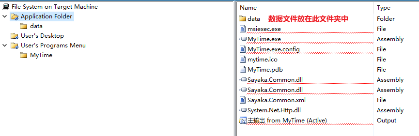

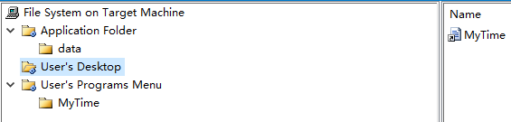

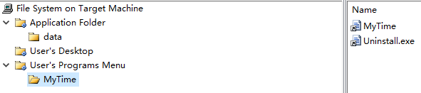

# 读取数据

1. 在App.config文件标签`<configuration></configuration>`中添加

2. ```
   <connectionStrings>
   	<add name="ConStr" connectionString="server=.\SQLEXPRESS;database=PerformanceAppraisalDb;uid=root;pwd=root"/>
   </connectionStrings>
   ```

3. 添加引用，添加”System.Configuration“

4. 在Program.cs文件添加using,`using 项目名.Utinity`和`using System.Configuration;`

5. 在Program.cs文件`static void Main(){}`中添加

6. ```
   SqlHelper.ConStr = ConfigurationManager.ConnectionStrings["ConStr"].ConnectionString;
   ```


# 添加类库

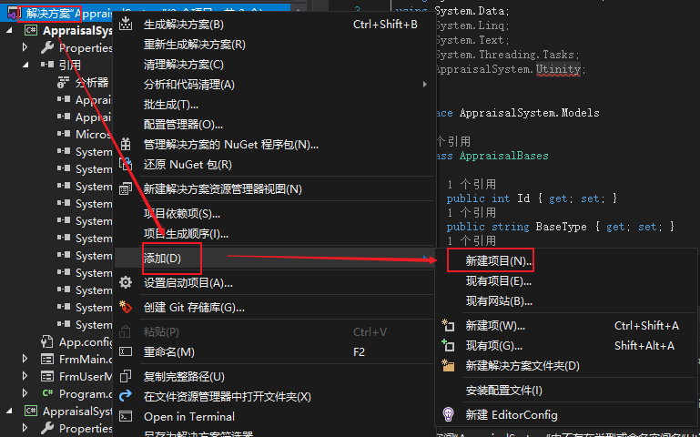

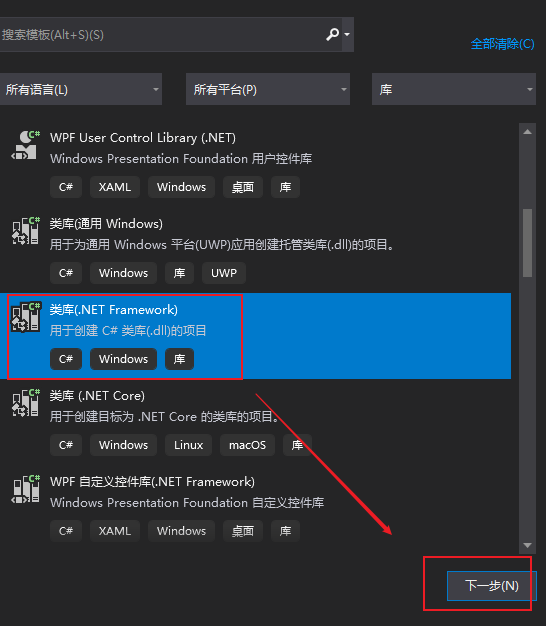

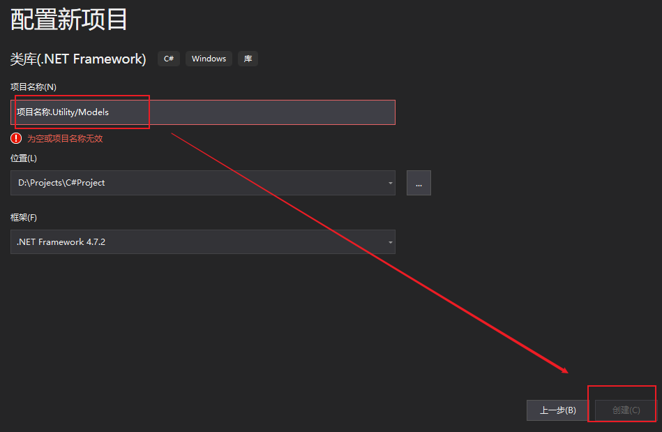

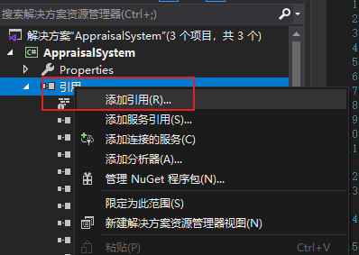

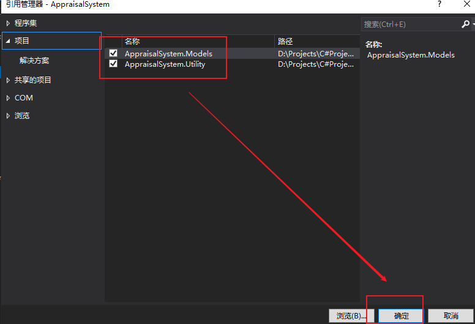


# 回顾

P162，163

数据窗口

```
using System;
using System.Collections.Generic;
using System.ComponentModel;
using System.Data;
using System.Drawing;
using System.Linq;
using System.Text;
using System.Threading.Tasks;
using System.Windows.Forms;
using AppraisalSystem.Models;

namespace AppraisalSystem
{
    public partial class FrmUserManager : Form
    {
        public FrmUserManager()
        {
            InitializeComponent();
        }

        private void FrmUserManager_Load(object sender, EventArgs e)
        {
            BindCbx();
            BindDgv();
        }

        private void BindDgv()
        {
            string userName = txtUserName.Text.Trim();
            int baseTypeId = (int)cbxBase.SelectedValue;
            bool isStop = chkIsStop.Checked;
            dgvUserAppraisal.AutoGenerateColumns = false;
            if (baseTypeId == 0)
            {
                dgvUserAppraisal.DataSource = UserAppraisalBases.GetListJoinAppraisal().FindAll(m => m.UserName.Contains(userName) && m.IsDel == isStop);

            }
            else
            {
                dgvUserAppraisal.DataSource = UserAppraisalBases.GetListJoinAppraisal().FindAll(m => m.UserName.Contains(userName) && m.BaseTypeId == baseTypeId && m.IsDel == isStop);

            }
        }

        private void BindCbx()
        {
            List<AppraisalBases> appraisalBases = new List<AppraisalBases>();
            //appraisalBases.Add(new AppraisalBases
            //{
            //    Id = 0,
            //    BaseType = "-查询所有-",
            //    AppraisalBase = 0,
            //    IsDel=false
            //});
            //appraisalBases.AddRange(AppraisalBases.ListAll());
            appraisalBases = AppraisalBases.ListAll();
            appraisalBases.Insert(0, new AppraisalBases
            {
                Id = 0,
                BaseType = "-查询所有-",
                AppraisalBase = 0,
                IsDel = false
            });
            cbxBase.DataSource = appraisalBases;
            cbxBase.DisplayMember = "BaseType";
            cbxBase.ValueMember = "Id";
            //cbxBase.Text = "-查询所有-";
            //cbxBase.Items.Add("-查询所有-");
            //foreach(var appraisalBase in appraisalBases)
            //{
            //    cbxBase.Items.Add(appraisalBase.BaseType);
            //}
        }

        private void btnSearch_Click(object sender, EventArgs e)
        {
            BindDgv();
        }

        private void dgvUserAppraisal_MouseDown(object sender, MouseEventArgs e)
        {
            if (e.Button == MouseButtons.Right)
            {
                tsmAdd.Visible = true;
                tsmEdit.Visible = false;
                tsmStart.Visible = false;
                tsmStop.Visible = false;
            }
        }

        private void dgvUserAppraisal_CellMouseDown(object sender, DataGridViewCellMouseEventArgs e)
        {
            if (e.Button == MouseButtons.Right)
            {
                if (e.RowIndex > -1)
                {
                    dgvUserAppraisal.Rows[e.RowIndex].Selected = true;
                    tsmAdd.Visible = true;
                    tsmEdit.Visible = true;
                    bool isDel= (bool)dgvUserAppraisal.SelectedRows[0].Cells["IsDel"].Value;
                    if (isDel)
                    {
                        tsmStart.Visible = true;
                    }
                    else
                    {
                        tsmStop.Visible = false;
                    }
                    
                }
            }
        }
    }
}

```

bases

```
using System;
using System.Collections.Generic;
using System.Data;
using System.Linq;
using System.Text;
using System.Threading.Tasks;


namespace AppraisalSystem.Models
{
    class AppraisalBases
    {
        public int Id { get; set; }
        public string BaseType { get; set; }
        public int AppraisalBase { get; set; }
        public bool IsDel { get; set; }
        public static List<AppraisalBases> ListAll()
        {
            List<AppraisalBases> appraisalBases = new List<AppraisalBases>();
            DataTable dt = SqlHelper.ExecuteTable("SELECT * FROM AppraisalBases");
            foreach(DataRow dr in dt.Rows)
            {
                appraisalBases.Add(ToModel(dr));
            }
            return appraisalBases;

        }
        private static AppraisalBases ToModel(DataRow dr)
        {
            AppraisalBases appraisalBases = new AppraisalBases();
            appraisalBases.Id = (int)dr["Id"];
            appraisalBases.BaseType = dr["BaseType"].ToString();
            appraisalBases.AppraisalBase = (int)dr["AppraisalBase"];
            appraisalBases.IsDel = (bool)dr["IsDel"];
            return appraisalBases;
        }
    }
}

```


# 类Utility

### DbHelper

```
using System;
using System.Collections.Generic;
using System.Linq;
using System.Text;
using System.Threading.Tasks;
using System.Data;
using System.Data.SqlClient;

namespace AppraisalSystem.Utinity
{
    public class SqlHelper
    {
        public static string ConStr { get; set; }

        public static DataTable ExecuteTable(string cmdText)
        {
            using (SqlConnection conn = new SqlConnection(ConStr))
            {
                conn.Open();
                SqlCommand cmd = new SqlCommand(cmdText, conn);
                SqlDataAdapter sda = new SqlDataAdapter(cmd);
                DataSet ds = new DataSet();
                sda.Fill(ds);
                return ds.Tables[0];
            }
        }
        public static int ExecuteNoQuery(string cmdText)
        {
            using (SqlConnection conn = new SqlConnection(ConStr))
            {
                conn.Open();
                SqlCommand cmd = new SqlCommand(cmdText, conn);
                int rows = cmd.ExecuteNonQuery();
                if (rows <= 0)
                {
                    throw new Exception("数据库操作失败");
                }
                return rows;
            }
        }
    }
}

```

### ToModel

```
using System;
using System.Collections.Generic;
using System.Linq;
using System.Text;
using System.Threading.Tasks;
using System.Data;

namespace AppraisalSystem.Utility
{
    public static class ToModel
    {
        public static TModel DataRowToModel<TModel>(this DataRow dr)
        {
            Type type = typeof(TModel);
            TModel md = (TModel)Activator.CreateInstance(type);
            foreach(var prop in type.GetProperties())
            {
                prop.SetValue(md, dr[prop.Name]);
            }
            return md;
        }
    }
}

```


