# 教程

https://www.bilibili.com/video/BV1Ps411U7tS

# 软件

Visual studio 2019 community

# 新建C项目

1. 文件-新建-项目-空项目-输出项目名
2. 右击“源文件”文件夹-添加-新建项-点击c++文件（.cpp）-名称中输入“项目名.c”-点击“添加”

## 文件

.c   	源文件

.h  	头文件

# 快捷键

| 功能 | VS快捷键 |
| ---- | -------- |
| 编译 | Ctrl+F5  |
|      |          |
|      |          |


# 补码

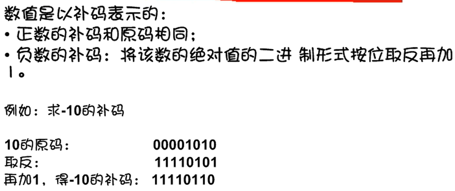

# 格式字符串

%d开头 		十进制整数

%0开头	 	八进制整数

%0x开头 	 十六进制整数（a~f小写）

%0X 开头	 十六进制整数（A~F大写）

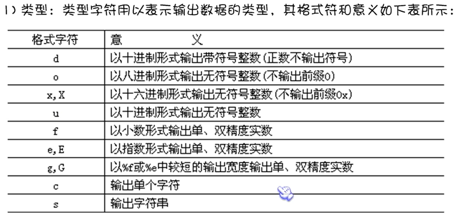

# 整型%d

## Int 整数

 int a,b,c;  		整数

Long x; 	长整型

unsigned p;	无符号整型变量

##  整型变量

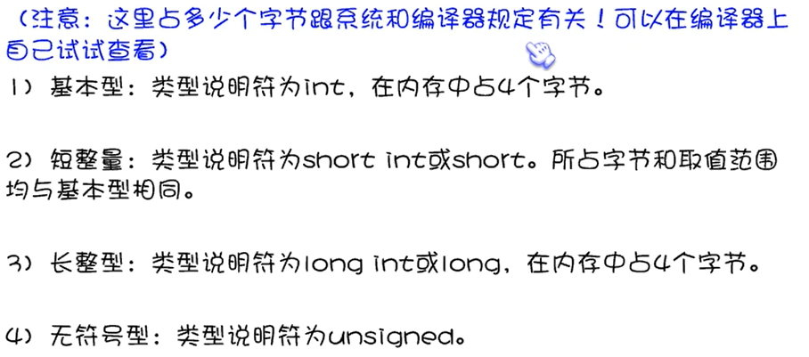

# 浮点数%f

Float 			小数 浮点数

Double 		双浮点数（双精度）

long double 长双精度

3.5E2 			等于3.5×10^2^（3.7E-2，等于3.7×10^-2^）


%e 科学技术发标书的浮点数，e小写

%E 科学技术发表示的浮点数，E大写

# 字符型%c

Char 	字符 

char c ='A'   (c其实是储存了“A”对应的的ASCⅡ码值“65”)

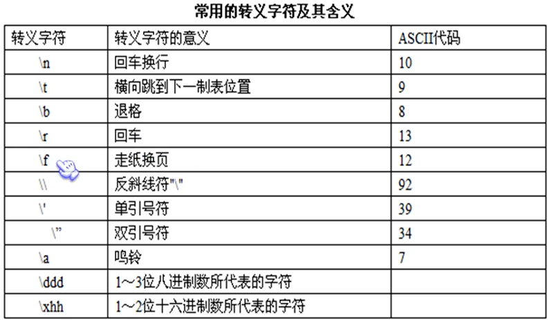

# 字符串型%s

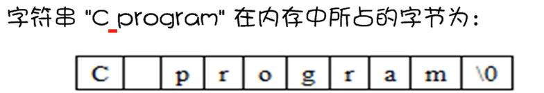

# 逻辑运算符

&&	与

||	或

！	非

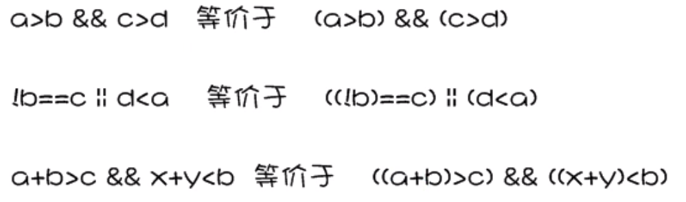

# 注意点

## %

%d，%i代表整数，%f-浮点，%s,字符串，%c,char. %p 指针，%fL 长long，%e科学计数，%g 小数或科学计数。

## 常量

#define 标识符 常量;

#define PRICE 30;      	//用PRICE代表30

## 变量

int k = 3;

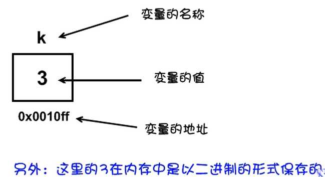

## 字符数据的输入输出

#### putchar函数（键盘输出函数）

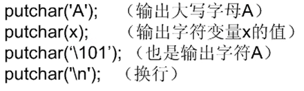

#### getchar函数（键盘输入函数）

1. 要求用户输入

## 输入

int a;

scanf("%d,%d",&a,&b);     //读取两个整型变量，分别赋值给a,b

1. 要求用户输入
2. scanf会吸收换行符，换行符也等于字符

## 跳过符号*

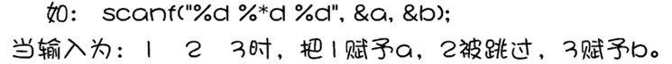


## 宽度

a=1;

printf(""%5d",a);		整数5个宽度（不足的在整数前留空格）

%7.2f							浮点数7个宽度，保留2位小数

%g								是根据数值不同自动选择%f或%e

## 长度（l和h）

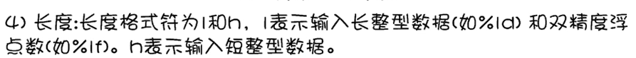

## 表示地址&

&a 	表示a的地址

## 让程序停一下，按任意键继续

```
#include <conio.h>
getch();
```

## 绝对值

```
#include <math.h>
fabs(t);      		//t的绝对值
```

## 素数

1. 即质数
2. 只有两个正因数（1和自己，只能被1和自己整除）

## 算数math

```
 sqrt(m);     //m开根号
add(a,b)	//a+b
square(3)	//3的平方

#include <math.h>
pow(x,y)	//x的y次方
```

## 输入错误，重新输入

```
#include <stdio.h>

void main() {
	int n=9;
	printf("Please input a number:\n");
	scanf("%d", &n);
	while (scanf("%d", &n) != 1) {     //当输入正确，scanf的值才为1
		printf("Illegal input!\nPlease input again!\n");
		getchar();
	}
}
```

## 遇到回车不执行??

```
while((c=getchar()) != EOF){}
```

## 数据存储类型

```
static int i  	//程序开始就在内存中占好位置，不可用于外部其他文件
auto int i		//程序调用时在内存中分配变量（动态局部变量）离开函数消失
register int i	//在寄存器（cpu）中读取，速度较快。当寄存器空间满，自动变为auto。离开函数消失
extern int i	//外部变量，可用于外部其他文件
```

## 声明和定义

1. 需要建立存储空间的称为“定义”
2. 不需要建立存储空间的称为“声明”

```
int a 		//既是声明，又是定义
extern a	//是声明，不是定义
```

## 字符串拷贝

```
#include <string.h>
strcpy(stu.name,"Fish.com!");   //stu.name = "Fishc.com!";
```

## 定义

```
void main(){
	NUM num;   	//将NUM用num代替，下面写num就行
}
```


# 强制类型转换

（float)a	把a转换为浮点型

（int)(x+u) 把x+y的结果转换为整型

# 运算

%  余数（7%2，余数为1）

++i  		自增1再参与其他运算

--i			自减1再参与其他运算

i++	  	先参与运算，再自增1

i--	  	  先参与运算，再自减1

`a+=5		等于a=a+5`

`x*=y+7	等于x=(y+7)*x`

`r%=p	等于r=r%p`

`y=(x=a+b),(b+c) 	等于y=b+c`

## 运算符的优先级

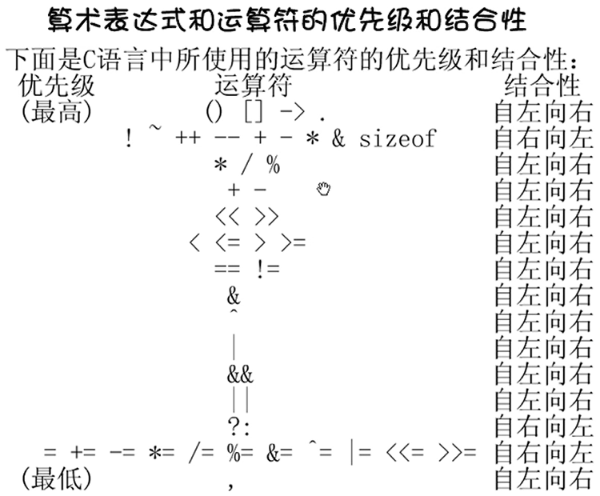

# 分支结构程序

## 判断语句

### if

```
if(){}
```

```
//if为真，只会执行后面的一条语句
if(max<b) max=b;
```

### if else

```
if(){}else{}

if(){}
else if(){}
else if(){}
else{}
```

### switch

```
switch(a){
	case 1: printf("");break;    //a等于1
	case 2: printf("");break;
	case 3: printf("");break;
	default:printf("Error\n");			//可省略
}
```

## 循环语句

### while

```
while(i<=100){
	sum = sum+i;
	i++;
}
```

### do while

1. 先执行循环，再判断

```
do{
	i++;
}while(i<=100);
```

### for语句

```
for(循环变量赋初值;循环条件;循环变量增量){语句}

for( ; ; ){}

for(i=1;i<100;i++){}
```


### goto

1. 和if搭配使用
2. 一般不使用，层次不清，不易读
3. 

# 数组

```
类型说明符 数组名 [常量表达式]
int a[10];
int a[5] = {2,5,4,3,6};

//[]可不写常量
int a[] = {3,4,5,2,3};

//数组所有元素赋值为0
int a[10] = {0};
```

## 二维数组

```
float a[3][4],b[4][6];

float a[2][3] = {{3,4,8},{5,6,5}}   //推荐写法
或
float a[2][3] = {3,4,8,5,6,5}   //不足个数则补0

float a[3][4] = {{3},{6},{4}} 	//第一行则默认为{3,0,0,0}  第二行则默认为{6,0,0,0}
```

# 函数

## 函数调用

```
#include <stdio.h>

void main() {
	printstar();
}
void printstar(){
	printf("******\n");
}
```

## viod

1. 不带回值的函数

## 分配内存空间函数

```
//malloc
void *malloc(unsigned int size);
//分配一个长度为size的空间
//若未能成功执行(如内存空间不足)，则返回NULL
```

```
//calloc
void *calloc(unsigned n, unsigned size);
//分配n个长度为size的空间
//若未能成功执行(如内存空间不足)，则返回NULL
```

## 释放内存空间函数

```
//free
void free(void *p);
//p是最近一次调用malloc或calloc函数返回的值
//free函数无返回值
```


# 指针

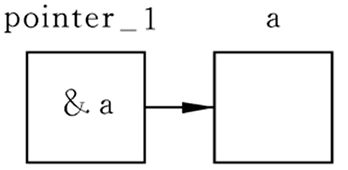

==指针变量和变量必须是同一类型！（如 int）==

1. “指针” 是变量的地址。
2. “指针变量” 是特殊变量，是地址。用来存放正常变量的地址。
3. “指针变量”可为空。

## 操作符

```
*	取值操作符
&	取址操作符

都是“自右向左”运算
```

定义一个指针变量				int *pointer   （这个指针变量名为"pointer"）

用来存放整型变量i的地址	pointer = &i

取值操作符*						 printf("%d\n", *pointer)

## 数组元素的指针


## 指向函数的指针

```
int *a(int x,int y);
```

```
int max(int,int);
int (*p)();
int a,b,c;
p = max;
scanf("%d%d",&a,&b);
c = (*p)(a,b);
printf("%d%d%d",a,b,c);
```

## 小结

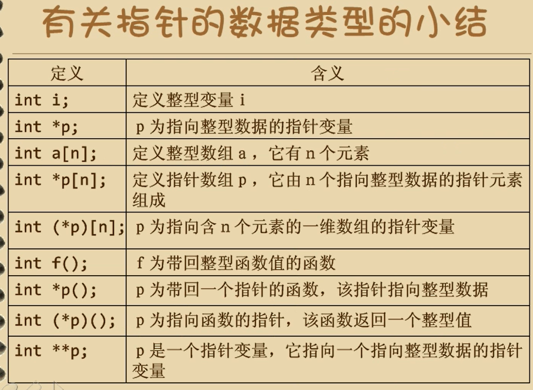

# 预处理#

1. 宏名一般用大写

2. 可嵌套

   ```
   #define PI 3.14
   #define S PI*r*r
   ```

## 可定义函数

```
#define M(y) y*y+3*y
k = M(5); 		//5*5+3*5
```

## 加()保证严谨

```
#define SQ(y) (y)*(y)  		//加括号保证严谨性
sq = SQ(a+1);				//(a+1)*(a+1),如果定义未加括号则为 a+1*a+1
```


```
#define 标识符 字符串
```

```
#define PI 3.14   (以下...中PI被替换成3.14)
...;
...;
...;
#undef PI		(以下...中PI将不被替换成3.14)
...;
...;
...;
```

## typeof

```
#define PIN1 char*		//PIN1代替char*
typeof char* PIN2		//PIN2代理char*
```

# 结构体与共用体

## 写法

```
struct 结构名
{
	成员列表
}；

、、写法1
struct student1{
	char name[20];
	char sex;
	int age;
};

//写法2
struct{
	char name[20];
	char sex;
	int age;
}student1,student2={"Jane",'M',16};

//写法3
struct{
	char name[20];
	char sex;
	int age;
}student[2]={{"Jane",'M',16},
			{"Lin",'F',28}
			};
```

## 结构体嵌套

```
#include <stdio.h>

void main() {
	struct date{
		int month;
		int day;
		int year;
	};


	struct{
		int num;
		char *name;
		char sex;
		int age;
		float score;
		struct date birthday;		//嵌套
	}boy1,boy2;

	boy1.num = 100;
	boy1.name = "Jane";
	boy1.birthday.month = 4;
	scanf("%c %f",&boy1.sex,&boy1.score);
	printf("%d %s %c %f,%d\n",boy1.num,boy1.name,boy1.sex,boy1.score,boy1.birthday.month);		
}
```

# typedef定义类型

```
typedef char* STRING;	//将char*用STRING代替，下面用STRING写
```

```
typedef int (*POINTER)();
```


```
typedef struct{
	int month;
	int day;
	int year;
}DATE;
```


# 链表

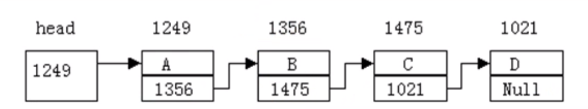

# 文件操作

## 文件的打开

```
//fopen函数
FILE *fp;
fp = fopen(文件名，使用打开方式)；
//打开方式：读、写
```

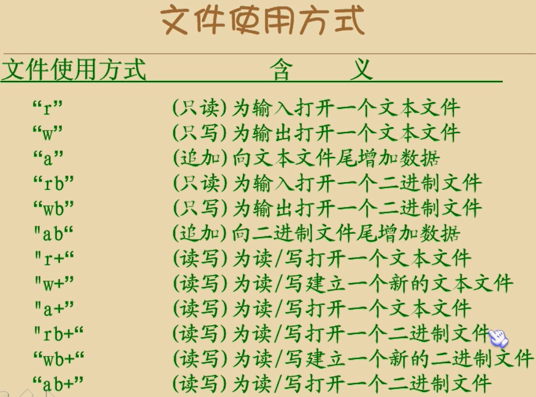

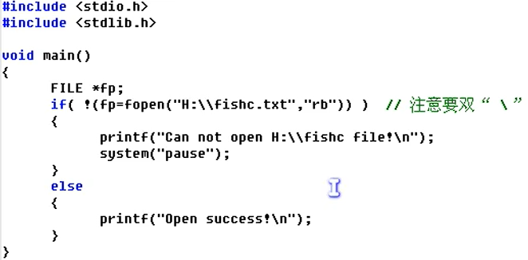

## 文件的关闭

```
//fclose函数

```

## 文件字符的输入与输出函数

输入	fputc()

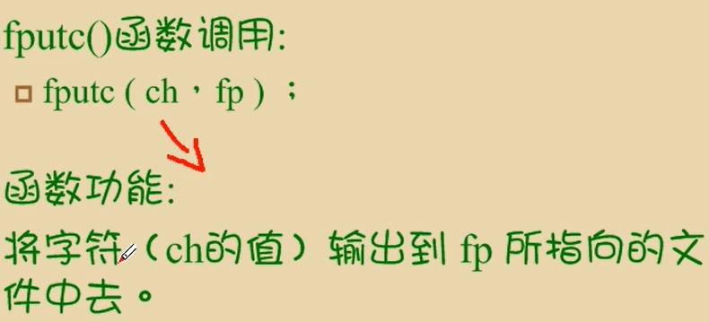

# 位运算

## 位运算符和位运算

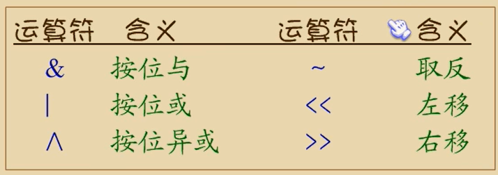

```
c = a^b
//两个二进制，从0位开始比。一个为0一个为1，则结果为1，否则为0.
```


```
a = a<<2
a <<=2
//左移1位相当于乘以2，左移两位相当于乘以4
//将的二进制数左移两位，右边补0
//左移溢出则舍弃
```


# 举例

## 顺序结构程序设计举例

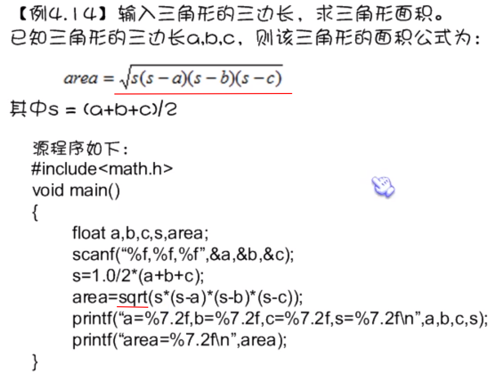

## 递归

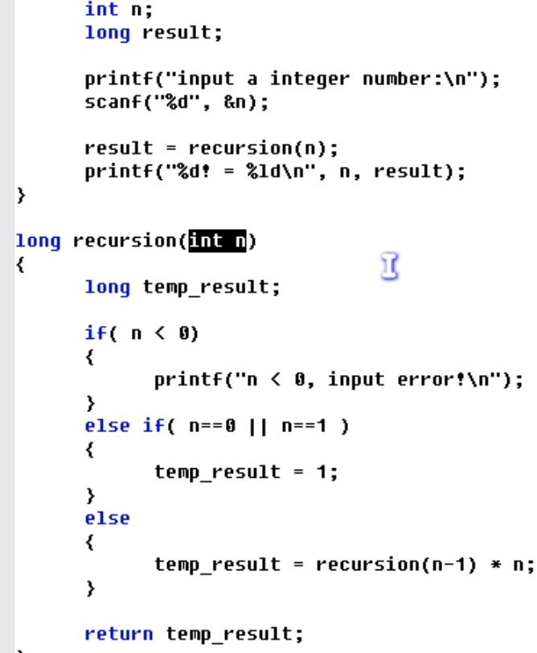

## 输入多个学生号码和分数，输入0结束（指针）

```
#include <stdio.h>
#include <malloc.h>
#include <stdlib.h> 

#define LEN sizeof(struct student)

struct student *creat();
void print(struct student *head);

struct student{
	int num;
	float score;
	struct student *next;
};

int n;

void main() {
	struct student *stu;
	
	stu = creat();
	print(stu);
	
	printf("\n\n");
	system("pause");
	}

struct student *creat(){
	struct stuent *head;
	struct student *p1,*p2;
	
	p1 = p2 = (struct student *)malloc(LEN);
	
	printf("Please enter the num:");
	scanf("%d",&p1->num);
	printf("Please enter the score:");
	scanf("%f",&p1->score);
	
	head = NULL;
	n=0;
	
	while(0 != p1->num){
		n++;
		if(1 == n){
			head  = p1;
		}else{
			p2->next = p1;
		}
		p2=p1;
		p1 = (struct student *)malloc(LEN);
		
		printf("\nPlease enter the num:");
		scanf("%d",&p1->num);
		printf("Please enter the score:");
		scanf("%f",&p1->score);
	}
	p2->next = NULL;
	return head;

}

void print(struct student *head){
	struct student *p;
	printf("\nThere are %d records!\n\n",n);
	
	p=head;
	if(NULL != head){
		do{
			printf("学号为%d的成绩是：%f\n",p->num,p->score);
			p=p->next;
		}while(NULL != p);
	}
}
```


# 待解决问题

1. 什么时候用scanf，什么时候用getchar
2. 指针

# 定义#define

## 如果定义

```
#define a

#ifdef a
	c = x+y;
#else
	c = x-y;
#endif
```

## 如果未定义

```
#ifndef a
	c = x+y;
#else
	c = x-y;
#endif
```

# 头文件源文件(.h.cpp)

## test.h

```
#include <stdio.h>

void testFun();
```

## test.cpp

```
#include "test.h"

void testFun(){
	int a =10;
}
```

# 绘图，编写软件

## 鼠标事件

 ```
while (1)
	{
		//定义鼠标变量，获取信息
		MOUSEMSG m = GetMouseMsg();
		switch (m.uMsg)
		{
			//window message _ left button down
		case WM_LBUTTONDOWN:
			circle(m.x, m.y, 10);	//画圆
			break;
		case WM_RBUTTONDOWN:
			rectangle(m.x + 5, m.y + 5, m.x - 5, m.y - 5);	//画矩形
			break;
			// WM_MOUSEMOVE		鼠标移动
		}

	}
 ```

## 播放音乐的函数

```
//包含多媒体库
#include <mmsystem.h>
//包括静态资源
#pragma comment(lib,"winmm.lib")

mciSendString("指令",0,0,0);
//例
mciSendString("open 1.mp3", 0, 0, 0);
//指令如下
play:播放
open:打开
close:关闭
pause:暂停
resume:继续
```

## 案例(按钮播放音乐.cpp)

1. 文件-属性-配置属性-高级-字集符（使用多字字节符集）
2. 文件-属性-配置属性-C/C++-常规-SDL检查-（否（/sdl-））
3. 将backgound.jpg放在*.cpp同目录下
4. 将2.mp3放在*.cpp同目录下

```
#include <graphics.h>
#include <stdio.h>
#include <string.h>
//包含多媒体库
#include <mmsystem.h>
//包括静态资源
#pragma comment(lib,"winmm.lib")

struct button {
	int x;
	int y;
	int width;
	int height;
	COLORREF color;
	char* pText;
};
//初始化按钮的属性
struct button* createButton(int x, int y, int width, int height, COLORREF color, const char* pText)
{
	struct button* pB = (struct button*)malloc(sizeof(struct button));
	pB->x = x;
	pB->y = y;
	pB->width = width;
	pB->height = height;
	pB->color = color;
	pB->pText = (char*)malloc(strlen(pText)+1);
	strcpy(pB->pText, pText);
	return pB;
}
//画按钮：矩形 rectangle(int x,int y,int xx,int yy);
void drawButton(struct button* pB)
{
	setfillcolor(pB->color);
	settextstyle(35, 0, "楷体");
	setlinecolor(BLACK);
	settextcolor(BLACK);	//设置文字颜色
	setbkmode(TRANSPARENT);		//设置文字背景为透明
	fillrectangle(pB->x, pB->y, pB->x + pB->width, pB->y + pB->height);
	outtextxy(pB->x + 20, pB->y + 10, pB->pText);	//字体在按钮中的偏移

}

//判断鼠标在不在按钮中
int mouseInButton(struct button* pB, MOUSEMSG m)
{	
	//在里面改为红色
	if (pB->x <= m.x && m.x <= pB->x + pB->width && pB->y <= m.y && m.y <= pB->y  + pB->height)
	{	
		pB->color = RED;
		return 1;
	}
	pB->color = YELLOW;
	return 0;
}
//判断是否点击按钮
int clickButton(struct button* pB, MOUSEMSG m)
{	
	//鼠标在按钮中，并且按下左键
	if (mouseInButton(pB, m)&&m.uMsg==WM_LBUTTONDOWN) 
	{
		return 1;
	}
	return 0;
}

int main() {
	initgraph(800, 600);
	IMAGE mm;
	loadimage(&mm, "background.jpg", 800, 600);
	
	struct button* button1 = createButton(300, 150, 180, 50, YELLOW, "播放音乐");	//画一个实体按钮
	
	struct button* button2 = createButton(300, 210, 180, 50, YELLOW, "暂停音乐");	//画一个实体按钮
	
	struct button* button3 = createButton(300, 270, 180, 50, YELLOW, "继续播放");	//画一个实体按钮
	
	struct button* button4 = createButton(300, 330, 180, 50, YELLOW, "关闭音乐");	//画一个实体按钮
	
	while (1)
	{	
		BeginBatchDraw();
		putimage(0, 0, &mm);
		drawButton(button1);			//执行画命令
		drawButton(button2);			//执行画命令
		drawButton(button3);			//执行画命令
		drawButton(button4);			//执行画命令

		MOUSEMSG m = GetMouseMsg();
		if (clickButton(button1,m))
		{
			mciSendString("open 2.mp3", 0, 0, 0);
			mciSendString("play 2.mp3", 0, 0, 0);
		}
		if (clickButton(button2, m))
		{
			mciSendString("pause 2.mp3", 0, 0, 0);
		}
		if (clickButton(button3, m))
		{
			mciSendString("resume 2.mp3", 0, 0, 0);
		}
		if (clickButton(button4, m))
		{
			mciSendString("close 2.mp3", 0, 0, 0);
		}
		EndBatchDraw();
	}

	

	closegraph();
	return 0;

}

```

## 设置软件图标

1. visual studio 2019
2. 写好程序-点击“本地windows调试器”
3. 右击左侧栏项目名-添加-资源
4. 选择*.icon文件，在点击“本地windows调试器”