+ 程序 = 数据结构 + 算法


# 教程

https://www.bilibili.com/video/BV1nJ411V7bd

# 注意点

### 引用符号

&

### 取地址

```
&a
```

### 存储密度


# 类c语言补充

## C语言

### 数组定义


### 内存动态分配


## 类C语言


### 传值方式

#### 传实参（形参变、实参不发生变化）


#### 传指针（形参变、实参发生变化）

+ 交换m、n地址指向的内容


#### 传指针（形参变、实参不发生变化）

+ 交换m、n指向的地址


#### 数组名作参数（形参变、实参发生变化）


#### 引用类型作参数（形参变、实参发生变化）

+ 引用符号&


# 预定义常量和类型


+ 例子


# 数据

### 抽象数据（ADT）


# ==逻辑结构==

对象的特性及关系

# 1. 线性表


#### 线性表的操作


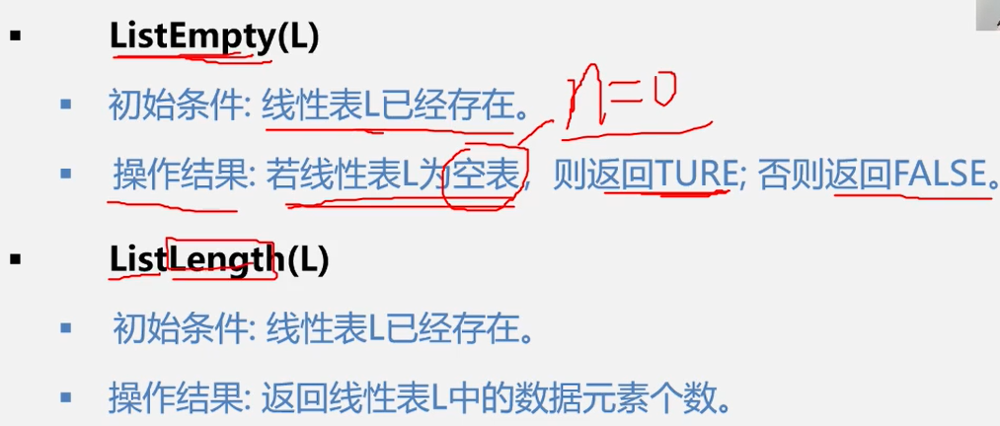


#### 定义线性表的模板


+ 例子


## 1.1 顺序表

包括线性表、链表

### 操作顺序表


### 顺序表的优缺点


### 顺序表的算法

#### 顺序表的初始化


#### 销毁顺序表


#### 清空顺序表


#### 求顺序表长度


#### 判断顺序表是否为空


#### 顺序表的取值


#### 顺序表按值查找

+ if


+ while


#### 顺序表的插入


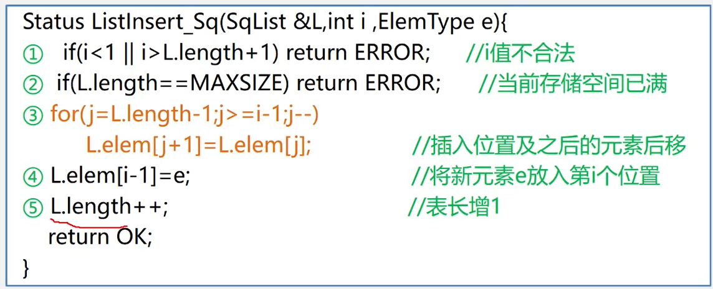

##### 插入的平均移动次数


#### 顺序表的删除


##### 平均删除次数


## 1.2 链表


### 链表术语


### 链表的特点


## 1.2.1 单链表


### 单链表的定义和表示


### 单链表的存储结构


### 例子


### ==单链表算法！！！==

#### 单链表初始化（空链表）


#### 判断单链表是否为空


#### 销毁单链表


#### 清空单链表


#### 求单链表的表长


#### 取单链表第i个元素


#### 单链表查找（按值查）

+ 获取该数据所在的位置（地址）


+ 获取该数据所在的位置序号


#### 单链表插入


#### 单链表删除第i个结点


#### 单链表的建立

##### 头插法


##### 尾插法


### 单链表操作的时间效率


## 1.2.2 循环链表


### 找头结点、尾结点


### 循环链表的合并


## 1.2.3 双向链表

### 定义


### 双向链表的插入


### 双向链表的删除


## 单链表、循环链表和双链表的时间效率比较


##  顺序表和链表的比较


## 线性表的应用

### 线性表的合并


### 有序表的合并（顺序表实现）


### 有序表合并（链表实现）


## 多项式运算

### 一元多项式运算


### 稀疏多项式的运算


## 案例：图书信息管理系统


# 2. 栈（stack）

+ 特殊的线性表（操作受限）

+ 后进先出(Last in first out)（LIFO）

### 定义


### 栈案例：进制转换


### 栈案例：括号匹配检验


### 栈案例：表达式求值


### 栈的抽象数据类型定义


### 栈的操作


### 栈的存储方式


空栈、满栈


上溢、下溢


### 顺序栈的算法

#### 顺序栈的定义


#### 顺序栈的初始化

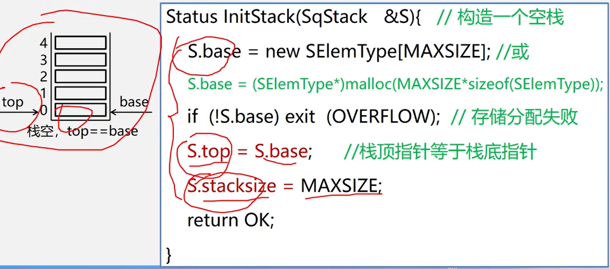

#### 顺序栈是否为空


#### 顺序栈长度


#### 顺序栈清空


#### 顺序栈的销毁


#### 顺序栈的入栈


#### 顺序栈的出栈


### 链栈的定义


### 链栈的算法

#### 链栈初始化


#### 链栈是否为空


#### 链栈入栈


#### 链栈出栈


#### 链栈取栈顶元素


### 递归

#### 递归的定义


#### 递归问题：分治法


#### 递归的优缺点


#### 函数的调用过程


### 栈与递归


# 3. 队列（queue）

+ 特殊的线性表（操作受限）

+ 先进先出(First in first out)（FIFO）

### 定义


### 队列应用


### 队列的抽象数据类型定义


### 顺序队列（base）


### 循环队列

真溢出、假溢出


### 循环队列判断队空、队满

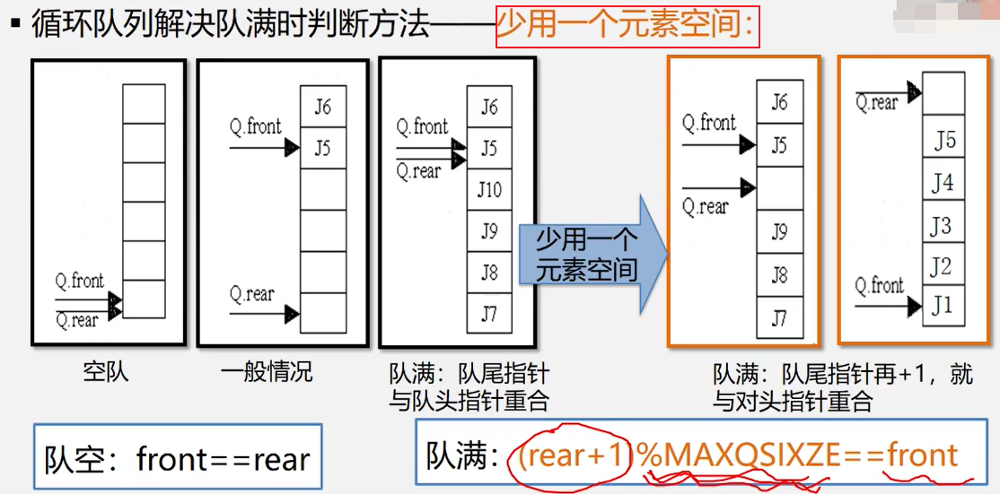

### 循环队列算法

#### 循环队列类型定义


#### 循环队列初始化


#### 循环队列的长度


#### 循环队列的入队


#### 循环队列的出队


#### 取队头元素


### 链队列


### 链队列算法

#### 链队列定义


#### 链队列初始化


#### 链队列销毁


#### 链队列的入队


#### 链队列出队

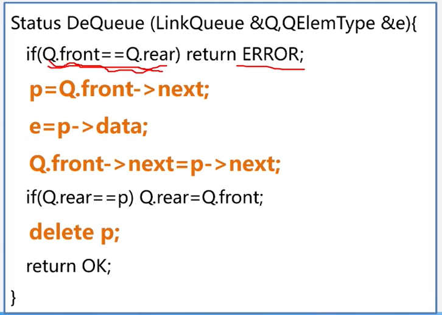

#### 链队列队头元素


# 串

+ 内容受限的线性表
+ 内容只能为字符

### 串的定义


+ 子串、真子串、空格串


+ 串相等


### 串的类型定义、运算


### 串顺序存储（教常用）

+ 第一个位置不存储字符
+ 便于查找


### 串链式存储

+ 便于修改


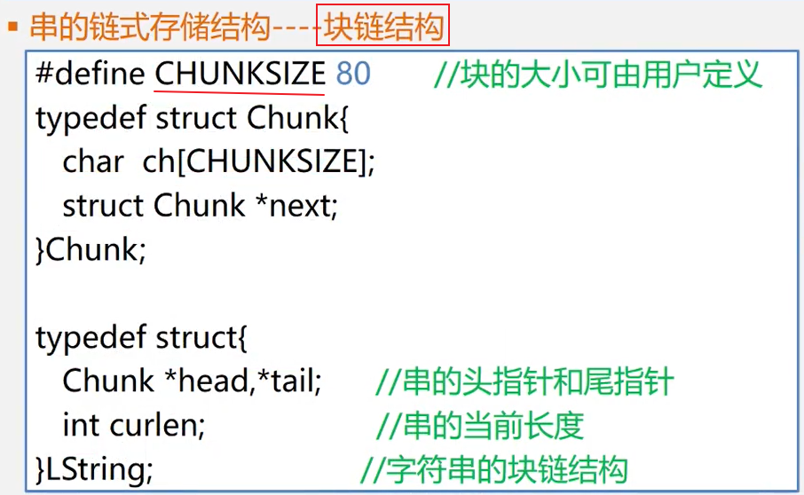

### 串的模式匹配算法


#### BF算法


##### BF算法时间复杂度


### KMP算法

+ i不需要回溯，主串一直往下读


+ next改进（nextval）


# 数组

+ 线性结构的推广（严格来说是非线性结构）

### 二维数组


### 数组的抽象数据类型定义


### 二维数组存储位置

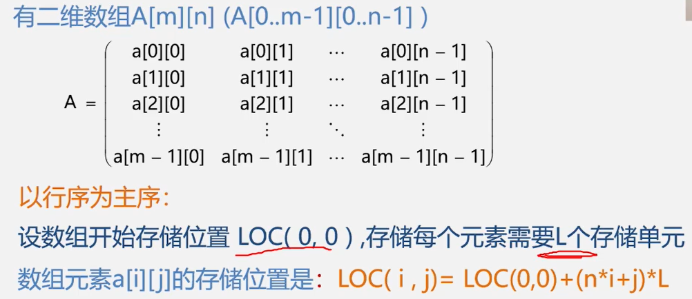

### 对称矩阵的压缩存储

### 对角矩阵的压缩存储

### 稀疏矩阵的压缩存储

#### 三元组方法

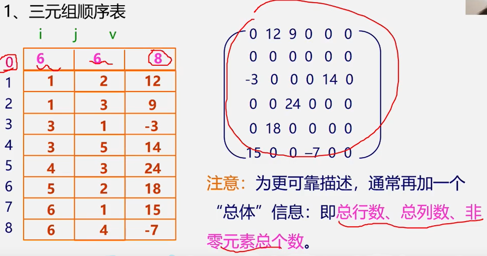

#### 十字链表方法


# 广义表

### 广义表定义

+ 线性结构的推广（严格来说是非线性结构）

+ 每个元素可能是原子，也可能是一个广义表


### 广义表性质


# 树

### 树的基本术语


## 二叉树

### 二叉树抽象数据类型定义

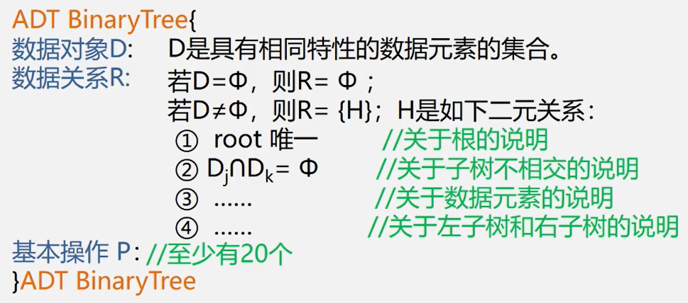


### 二叉树性质


## 满二叉树

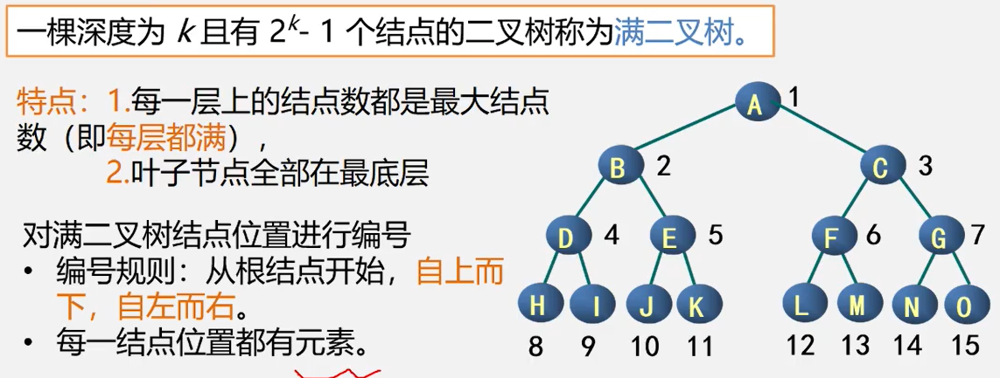

## 完全二叉树


## 二叉树的存储结构

### 二叉树的顺序存储


+ 例子


### 二叉树的链式存储


### 三叉链表


## 遍历二叉树


### 先序遍历


### 例子：写出三种遍历（先序，中序，后序）


## 二叉树算法

### 先序遍历（递归）


### 中序遍历（递归）


### 中序遍历（栈）


### 后序遍历（递归）


### 层次遍历


### 建立二叉树（先序遍历）


### 复制二叉树（先序遍历）


### 计算二叉树深度


### 计算二叉树结点总数


### 计算二叉树叶子结点数


## 线索二叉树


+ 增加一个头结点


### 先序线索二叉树


## 树的存储结构

### 双亲表示法


### 孩子链表

+ 找孩子容易，找双亲难

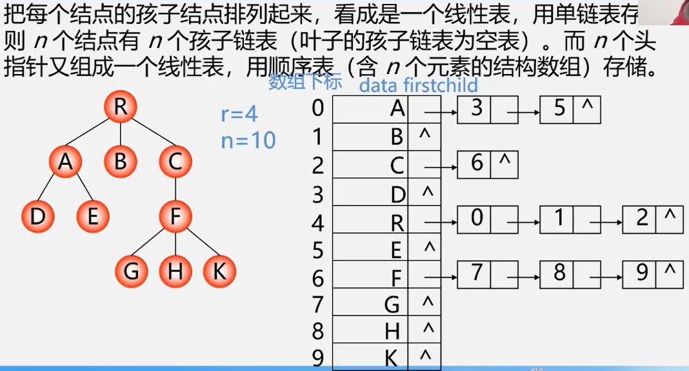


### 带双亲孩子链表


### 孩子兄弟表示法（二叉树表示法，二叉链表表示法）

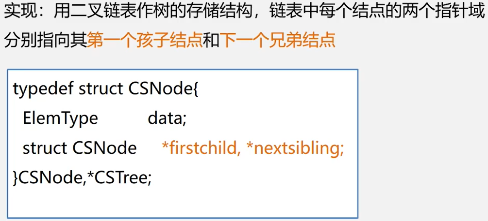

## 树与二叉树的转换

### 1. 树转为二叉树

+ 通过孩子兄弟方法转换


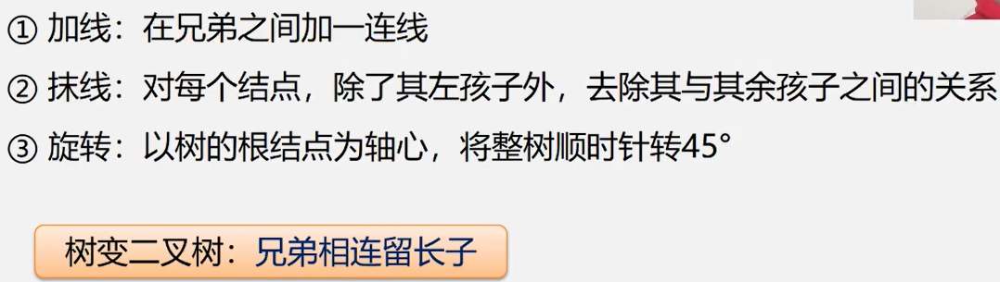


### 2. 二叉树转为树


## 森林和二叉树转换

### 1. 森林转换成二叉树


### 2. 二叉树转换为森林


## 树与森林的遍历

### 树的遍历


### 森林的遍历

#### 1. 先序遍历


#### 2. 中序遍历


# 哈弗曼树

## 哈弗曼树定义


## 树的路径长度（TL）


## 权、带权路径长度


## 哈夫曼算法

### 口诀


### 构造哈弗曼树


### 构造哈弗曼树算法实现


+


## 哈夫曼编码（HC）

前缀编码

最优前缀码


### 哈夫曼编码算法


## 哈夫曼解码


# 图

## 图的定义及术语


#### 完全图


#### 稀疏图、稠密图、网、邻接、关联


#### 顶点的度、入度、出度


#### 有向树

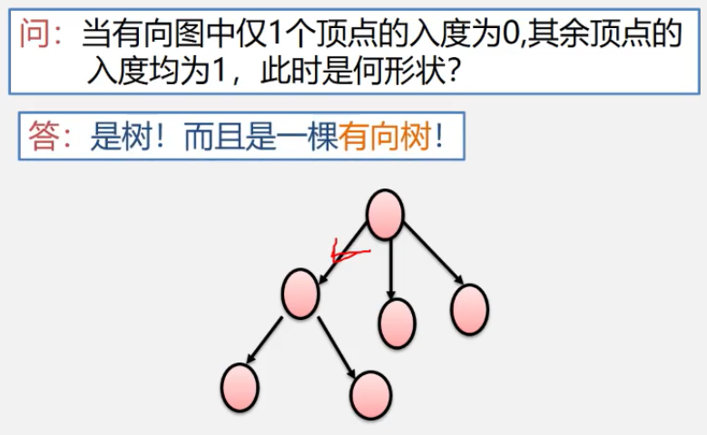

#### 路径、路径长度、回路、简单路径、简单回路（简单环）


#### 连通图（强连通图）


#### 权和网


#### 子图


#### 联通分量（强联通分量）


#### 极小联通子图、生成树、生成森林

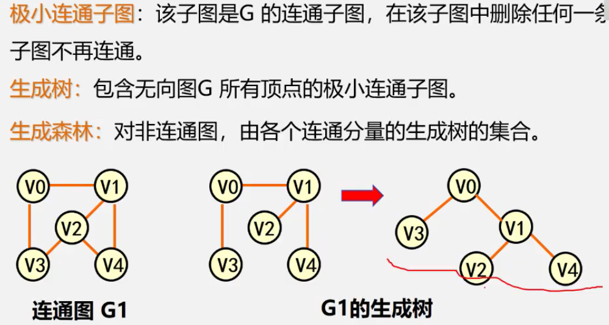

## 邻接矩阵（表示稠密图）

### 邻接矩阵定义存储结构

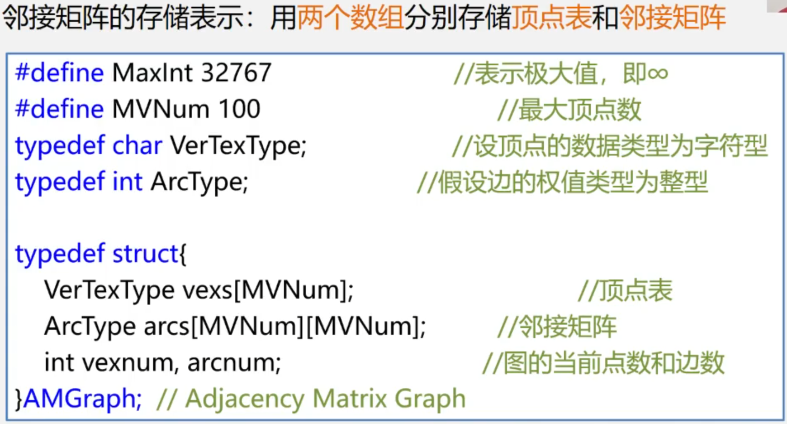

### 算法（图的存储）

#### 邻接矩阵表示创建无向网


#### 查找顶点

+ 查找图中相同顶点的下标


## 邻接表（表示稀疏图）


### 无向图邻接表


### 有向图邻接表


### 邻接表缺点


### 算法：图的邻接表存储

#### 顶点的结点结构


#### 弧(边)的结点结构


#### 图的结构定义


#### 算法：邻接表创建无向网


 

## 十字链表


## 邻接多重表

 

## 图的遍历

### 深度优先搜索(Depth_First Search-DFS)

一条道走到黑


#### 算法实现：深度优先搜索


### 广度优先搜索（Breadth_First Search-BFS）


#### 算法实现：广度优先搜索


## 生成树

### 生成树定义


### 无向图生成树


### 最小生成树的定义


### MST


### 构造最小生成树算法

#### 普里姆算法

通过MST进行


#### 克鲁斯卡尔算法

最小生成树可能不唯一


#### 算法比较


## 最短路径

### 算法

#### 单源最短路径-Dijkstra算法


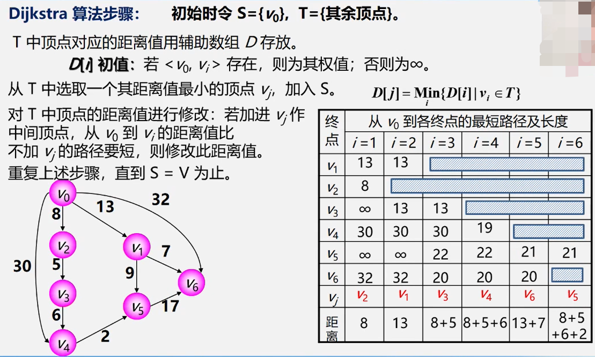

#### 所有顶点间的最短路径-Floyd算法


## 拓扑排序

+ AOV（vertex）

+ 如果图中存在换，则不能输出全部顶点


## 关键路径

+ AOE（edge）


### 求关键路径


# 查找

## 查找基本概念

### 平均查找长度


## 1. 线性表的查找


### 顺序查找


### 折半查找

+ 只用于有序表，且限于顺序存储结构
+ 比顺序查找效率高


### 分块查找


### 线性表查找方法比较


## 2. 树表的查找

### 二叉排序树

#### 定义


#### 二叉排序树的存储结构


+ 递归算法


+ 时间复杂度


### 平衡二叉树(AVL)


#### 变换


## 3. 散列表的查找（哈希表）


### 线性探测法


### 二次探测法（开放定址法）


### 链地址法


+ 优点


### 散列表的查找

# 排序

+ 存储结构，记录序列以顺序表存储


## 插入排序


### 直接插入排序


### 二分插入排序（折半）


### 希尔排序


## 交换排序

### 冒泡排序


### 快速排序


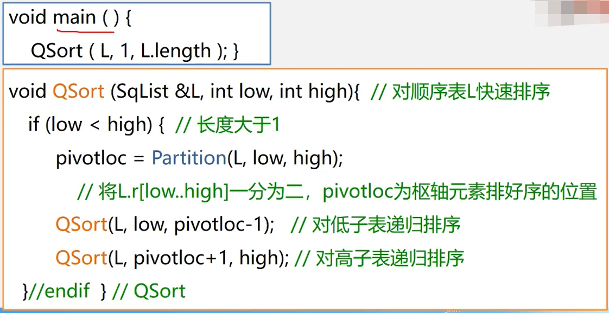


## 选择排序

### 简单选择排序


### 堆排序


## 归并排序


## 基数排序

分配+收集


## 外部排序

略

## 各种排序比较


# 堆

## 定义


## 例子


# ==存储结构==

有效的组织计算机存储


# ==算法==

有效的实现对象之间的"运算"关系

## 算法设计要求

+  正确性
+ 可行性
+ 鲁棒性、健壮性
+ 高效性

## 算法时间复杂度

求嵌套层数最多的语句，比如 n^2^或n^3^...

## 平均查找长度（ASL)


