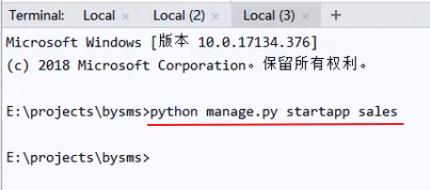

# 教程

https://www.bilibili.com/video/BV1AE41117Up

# 安装

1. pip install django

   ```
   pip install -i https://pypi.douban.com/simple django
   ```

   查看安装状态：python -m django --version

2. DOS进入到项目目录

   （d:

   cd \OneDrive\python projects\Django-project）

3. 初始化项目文件：输入django-admin startproject bysms       #（bysms为项目名）

4. 运行Django web服务：DOS进入项目文件根目录 cd bysms

   ​										输入：python manage.py runserver 0.0.0.0:80

5. 创建app




6. 创建数据库：DOS项目根目录输入python manage.py migrate

   从sqlite3修改到MySQL：修改settings.py里的DATABASES信息，加上数据库配置项（账号等）

7. 创建公共的app: python manage.py startapp common

8. 创建表common定义（表变动）：在根目录输入 python manage.py makemigrations common

   将表变动提交到数据库里：python manage.py migrate

9. 创建管理员账号：python manage.py createsuperuser

   user:admin

   email:327983969@qq.com

   password:88888888

   登陆网址：http://127.0.0.1/admin

10. 将表显示在admin界面中

    在相应app的models.py中加入： from django.contrib import admin

    ​														 admin.site.register(Customer)

# 注意点

```
# 加上null=True,blank=True 表示没有内容可为空
qq = models.CharField(max_length=30,null=True,blank=True)
```

