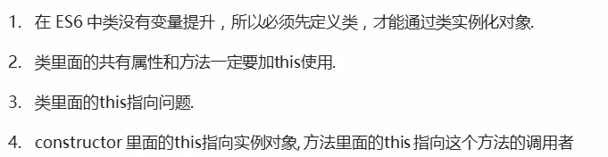
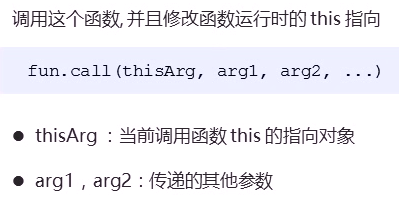
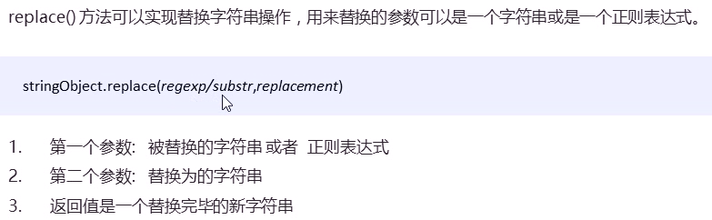
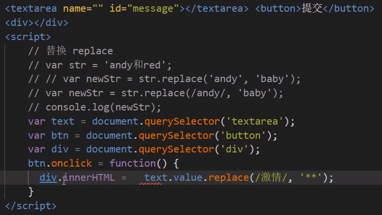
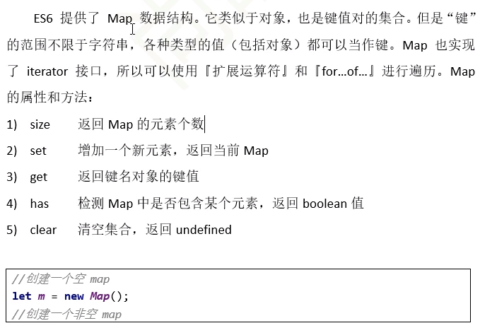

# 教程

ES6: https://www.bilibili.com/video/BV1Kt411w7MP  P35

ES6+: https://www.bilibili.com/video/BV1uK411H7on    P53未

# 注意点

1. 定时器的this永远指向window
2. 双击禁止选中文字

```
window.getSelection?window.getSelection().removeAllRanges():document.selection.empty();
```

```
#判断前者是否属于后者
console.log(f instanceof Object);
```


# ES6

## 创建类


## 类添加方法


## 继承


### super


## 类get、set


## 类的注意点



###### 案例：tab栏切换

## 构造函数


### 静态成员


### prototype


## 对象原型__proto__


### constructor

指向原构造函数

### 构造函数、实例、原型对象关系


### 原型链


### 构造函数this指向

1. 指向对象实例

2. 构造函数里的原型对象也指向实例对象

## call()

1. 括号里面填谁，this就指向谁



### 继承父构造函数的属性


## 类的本质

1. 函数，是构造函数更简单的写法
2. 有prototype,constructor
3. 也可以通过原型对象添加方法 Star.prototype.sing= function(){console.log('冰雨');}

## 数组方法

##### forEach()


##### filter()


### some()


## trim()


## Object.defineProperty方法


## 函数的定义和调用


## this指向


## apply()


## bind()


## 严格模式


###  为整个脚本开启严格模式


### 为函数开启严格模式


## 高阶函数


## 闭包


###### 案例：计算打车价格


## 递归函数（自己调用自己）


###### 案例：


## 浅拷贝

其中拷贝的方法只是拷贝方法地址，如果原对象

```
Object.assign(o,obj)    #将obj拷贝给o
```

## 深拷贝

方法也拷贝一份，产生新的内存空间地址

封装函数


## 正则表达式

### 语法


### 测试


### 字符

#### 边界符


### []


### -


### 取反


### 括号总结


### 预定义类


### 常用正则表达式


###### 案例：表单验证

### 正则替换



### 全局匹配g，忽略大小写i


###### 案例：敏感词替换




# ES6+

## let声明变量

不可重复声明，var可以重复声明

块级作用域

不存在变量提升

不影响作用域链

## const声明常量

一定要赋初始值

一般常量使用大写

常量的值不能修改

块儿级作用域

对于数组和对象的元素修改，不算对常量的修改，不会报错

## 解构赋值


## 模板字符串

符号包起来    ``

内容中可以出现换行符

变量拼接


## 对象简化写法


## 箭头函数

1. this是静态的，this始终指向函数声明时所在作用域下的this值

2. 不能作为构造实例化对象

3. 不能使用aruments变量

4. 箭头函数简写
   1. 省略小括号，当形参有且只有一个
   2. 省略花括号，当代码体只有一条语句，此时return必须省略
5. 适合与this无关的回调，定时器，数组方法回调
6. 不适合于this有关的回调，事件回调，对象的方法


## 函数参数的默认值

1. 具有默认值的参数，一般位置要靠后


## 剩余参数

1. ​    ...args（相当于ES5中arguments）
2. 必须要放到参数最后


## spread扩展运算符...


##### 扩展运算符-合并


##### 扩展运算符-克隆


##### 扩展运算符-将伪数组转为真正的数组


## Array扩展方法

### Array.from()


### array.find()


### array.findindex()


### array.includes()


## String的扩展方法

### 模板字符串``


### startsWith()和endsWith()


### repeat()


## Symbol


 

##### 对象添加Symbol类型的属性


##### Symbol内置值


## 迭代器

完全按自己意愿实现Symbol迭代

## 生成器

1. 是一个特殊的函数
2. 异步编程 纯回调函数


## 生成器函数实例

1. 解决回调地狱

2. 用户数据=>订单数据=>商品数据，有调用顺序


## Promise


### Promise用nodejs读取文件


### Promise封装AJAX请求


## set()


	


### 去重、交集、并集、差集


## map()



## 数值扩展


## 对象方法的扩展


## 模块化

### 暴露模块


### 引入模块

s

## async函数


## await表达式


