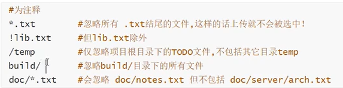

# Git

## Windows

### 下载

http://npm.taobao.org/mirrors/git-for-windows/

+ 选最新稳定版：v2.31.1.windows.1/  
  + windows选：Git-2.31.1-64-bit.exe  
  + Linux选：Git-2.31.1-64-bit.tar.bz2   

### 安装

+ 先安装Notepad++
+ 安装Git，其中一步“Choosing the default editor used by Git"选”Use Notepad++“

### 卸载

+ 我的电脑-属性-高级系统设置-环境变量-path
+ 删除所有带Git的环境变量
+ 卸载Git

## Mac

下载地址：git-scm.com/download/mac

点击网页的蓝色“Installer”，跳转页面点击“Download”进行下载

## 操作

### 配置

+ ==必须设置用户名、邮箱==
  + git config --global user.name "Johnny"
  + git config --global user.email “327983969@qq.com”

+ 查看配置：
  + git config -l

+ 查看系统配置：
  + git config --system --list
  + 文件在Git\etc\gitconfig

+ 查看全局（用户）配置：
  + git config --global --list

  + 文件在C:\user\name\gitconfig

### 工作区域、文件操作流程

+ 工作目录：平时存放代码的地方
+ 暂存区：临时存放改动
+ 资源库、仓库区：安全存放数据的位置
+ 远程git仓库：代码托管的服务器


### 命令

| 功能                   | 命令                                                       |
| ---------------------- | ---------------------------------------------------------- |
| 初始化仓库             | git init                                                   |
| 克隆仓库               | git clone 克隆连接                                         |
| 显示当前目录           | pwd                                                        |
| 创建文件               | touch demo.py                                              |
| 删除文件               | rm demo.py                                                 |
| 创建文件夹             | mkdir 文件夹名                                             |
| 删除文件夹             | rm -r 文件夹名                                             |
| 移动文件               | mv demo01.py test  #将文件移动到test文件夹中               |
| 查看状态               | git status                                                 |
| 添加到暂存区           | git add .                                                  |
| 添加到本地仓库         | git commit -m "消息内容 或 文件名"                         |
| 添加到远程仓库         | git push  #再次push需要先git pull一下                      |
| 查看分支（版本）       | git branch                                                 |
| 查看远程分支           | git branch -r                                              |
| 新建分支（版本）       | git branch 分支名                                          |
| 切换分支               | git checkout -b 分支名                                     |
| 合并指定分支到当前分支 | git merge 分支名                                           |
| 删除远程分支           | git push origin --delete 分支名<br />git branch -dr 分支名 |

### 本地仓库搭建

+ 初始化：git init

### 远程仓库、免密登陆

+ 进入文件夹C:\Users\zhonghua.deng\\.ssh(没有就创建这个文件夹)
+ 右击打开"git bash"
+ 输入"ssh-keygen -t rsa",回车回车回车（Mac输入ssh-keygen -t rsa -C "创建的git global邮箱"）
+ notepad++打开生成的"id_rsa.pub"，复制所有内容
+ 打开"Gitee或Github"-设置-安全设置-SSH公钥-黏贴到"公钥"文本框中，确定
+ 新建仓库，复制克隆链接
+ 在本地文件夹将仓库克隆到本地“git clone 链接”
+ 写代码或者将代码复制到此文件夹中
+ `git add .` `git commit -m .` `git push`上传到远程仓库

### 忽略文件

这些文件忽略，不提交到仓库

+ 创建文件“.gitignore”
+ 在里面填需要忽略的文件



### ==上传、下载Github==

```shell
# 本地文件添加到暂存区
git add .
# 提交到远程仓库,m为提交信息
git commit -m .
# 上传到远程仓库（本地删除文件，提交远程也会相应删除）
git push

# 从远程仓库下载文件
git pull

# 查看文件状态
git status
```

# Github

## 搜索

多条件**空格**分开

### 名字中搜索关键字

```
in:name 关键字
```

### 在描述里搜

```
in:description 关键字
```

### 在详情里搜

```
in:readme 关键字
```

### 火热程度

```
stars:>3000
```

### 语言

```
language:java
```

### 更新时间

```
pushed:>2020-09-01
```

