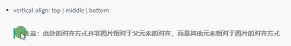

# VSCode设置

### 自动格式化代码

文件=>首选项=>设置

输入emmet.include

用户中点击setting.json

{}中加入

“editor.formatOnType”:true,

“editor.formatOnSave”:true

保存


### 插件

Open in browser

Auto rename tag

小程序开发插件：小程序开发助手、minapp、vetur

# 注意点

Base.css

Common.css

Header中logo要加h1，可隐藏

Vertical-align: middle;  图片与文字一起居中


## 锚点标签,跳转位置

```
<h1 id="111">标题</h1>
...
<a href="#111">跳转</a>
```


# 字体标签

```
//加粗
<b></b>
<strong></strong>

//上标
<sup></sup>

//下标
<sub></sub>

//删除线
<s></s>

//下划线
<u></u>

//斜体
<i></i>
<em></em>

//代码
<code></code>

//引用
<cite></cite>
```

# 格式化标签

```
//分隔线
<hr/>

//预格式化标签(打进去什么就显示什么格式，包括空格回车)
<pre></pre>
```


# 常用模块名

快捷导航栏  shortcut

头部    header

标志    logo

购物车  shopcar

搜索  search

热点词  hotwords

导航   nav

导航左侧  dropdown 包含.dd  .dt

导航右侧  navitems

页面底部  footer

页面底部服务模块  mod_service

页面底部帮助模块  mod_help

页面底部版权模块  mod_copyright

# HTML5

### 语法

table  比如p table生成<p></p>

.ni

\#hao

ul>li

p+div

.demo*5  生成5个一样的demo

.demo$5  生成顺序5个demo类

div{文字}  按table生成<div>文字div>

div{$}*5

### 单标签

`<br />` 强制换行

`<div></div>  `盒子标签

`<span></span> `盒子标签

`  ` 图片，高，宽，边框

` `图片，图片损坏提示，鼠标放在图上提示

`<a href="链接地址或者下载链接" targer="_blank">链接文字或图片</a>  ` 链接

`Ctrl+/ `给文字添加注释

`&nbsp;  `空格

`&lt; `小于

`&gt; `大于

### input

```
<input type="text/count/date/button/radio/checked/hidden/submit/reset/file/password/image" name="与后端一致" value="">
```


### 表格

tr定义行

td定义格

```
<table>
<thead> <tr><th></th> <th></th> <th></th></tr>  </thead>
  <tbody>
	<tr><td></td> <td></td> <td></td></tr>
	<tr><td></td> <td></td> <td></td></tr>
  </tbody>
</table>
```


跨行合并: `rowspan`

跨列合并: `colspan`

例：`<td colspan="2"></td>`

  最后删除多余的单元格

### 无序列表

1. 小圆点可用type修改形状样式

```
<ul type="circle/disk/square">
  <li></li>
  <li></li>
</ul>
```

### 有序列表

1. 可用type修改序号显示样式

```
<ol type="i/I/a/A">
  <li></li>
  <li></li>
</ol>
```

### 自定义列表

```
<dl>
 <dt></dt>
 <dd></dd>
 <dd></dd>
</dl>
```

### 表单域
```

<form action="url地址" method="提交方式" name="表单域名称">

	用户名：<input type=”text” name=”username” value=”请输入用户名“” maxlength=”12”><br>
	密码：<input type=”password”><br>
	性别：男<input type="radio" name="sex" value="男" checked="checked"> 

​            女<input type="radio" name="sex">  单选

	爱好：吃饭<input type=”checkbox”> 睡觉<input type=”checkbox”> 打豆豆<input type=”checkbox”><br>   多选

	<input type=”submit” value=”免费注册“>

	<input type=”reset” value=”重新填写“>

</form>
```

### 下拉列表

```
<select>
  <option></option>
  <option></option>
  <option></option>
</select>
```

### 文本域
```
<form>
  <textarea cols=”50” rows=”5” readonly></textarea>
</form>
```
### iframe

页面嵌入另一个页面

```
<a href="http://www.baidu.com" target="iframe-test">显示百度</a>
<iframe name='iframe-test' width='1000' height='1000'></iframe>

<iframe name='iframe-test' width='1000' height='1000' src='http://www/so.com'></iframe>
```


# CSS3

### 优先级

style > id > class > 标签

### CSS书写顺序

1、 布局属性

2、 自身属性

3、 文字属性

4、 其他属性

### CSS外部样式表

将样式写到CSS文件中，在html的head中输入

`<link rel="stylesheet" href="CSS文件名">`

### 通用限制代码

==Base.css==

```
*{
  Padding: 0;
  Margin: 0;
  Box-sizing:border-box;
}
```

或

```
Html,body,ul,li,ol,dl,dd,dt,p,h1,h2,h3,h4,h5,h6,form,fieldset,legend,img,section {margin:0;padding:0; box-sizing:border-box;}
```
##### 去除链接下划线

```
A {

Text-decoration: none;

}
```

==Common.css==

版心.w

```
.w {

  Width:1000px;

  Margin: 0 auto;

}
```

```
.fl {

  Float: left;

}

.fr {

  Float:right;

}
```

##### 去掉列表圆点

`List-style: none;`

###  语法

tac    table等于text-align: center;

w 宽

h 高

h100   table等于hieght: 100px;

ti2em    text-indent: 2em;

### *类标签class*

红背景盒子

<style>

.box {

   width: 100px;

   height: 100px;

}

.red {

  

  background-color: red;

}

.font30 {

  font-size: 30px;

}

</style>

`<div class=” box red font30”>斯蒂芬是否是</div>`

 

### ID选择器, 只能被调用一次

<style>

\#red {

  

  background-color: red;

}

</style>

`<div id=”red”>斯蒂芬是否是</div>`

### 通配选择器，选择所有标签 *

<style>

\* {

  color: red;

}

</style>

`<div>斯蒂芬是否是</div>`

 

### 修改字体，粗细，倾斜


p {

  font-family:”宋体”;

  font-weight: 700;      700=bold也就是粗体，400正常。

  font-style: italic;         normal改正常

}


`<p>斯蒂芬是否是</p>`

==字体复合属性写法,必须遵守顺序==


p {

  例font: font-style font-weight font-size/line-height font-family  字体简写

  font: italic 700 16px/24px ‘Microsoft Yahei’;

}


`<p>斯蒂芬是否是</p>`

### 文本样式字体属性


##### 颜色

color: red;

color: #ff0000;

color: rgb(255,0,0);

 

##### 对齐文本

 ```
div {

  text-align: center;        right,left

}
 ```

##### 装饰文本

 ```
div {

   text-decoration: underline;  overline, line-through删除线，none不要线（链接）

}
 ```

##### 文本缩进

```
p {

  text-indent: 2em; 两个文字大小 10px缩进10像素

}
```

##### 行间距

 ```
p {

  line-height: 26px;

}
 ```

##### 行内样式表

`<div style=”color: red; font-size: 12px;”>文字></div>`

### 后代选择器
```
ul li a {
  color: pink;
}

 

.ni li {
  colot:pink;
}


ul>li		// >只对下一级有效
```

### 并集选择器

`div, p{}`

### ==伪类选择器，顺序不能颠倒 LVHA==

`a: link`    选择未访问链接

`a: visited`   选择已访问链接

`a: hover`   选择鼠标指针位于其上的链接

`a: active`   选择活动链接，鼠标按下去为弹起的链接

```
a:hover{
	color:blue;
}
```


### focus伪类选择器 （光标定在哪改变属性）

`input: focus {}`

### 行内块元素

`` `<input />` `<td>`

### 转换为块元素

`display:block;`

### 转换为行内元素

`display: inline;`

### 转换为行内块

`display: inline-block;`

### 背景样式属性


#### 背景平铺

背景平铺`background-repeat: repeat;`

背景不平铺`background-repeat: no-repeat;`

背景X轴平铺`background-repeat: repeat-x;`

背景Y轴平铺`background-repeat: repeat-y;`

背景复合型写法` background: `

### 图片样式



# 盒子

##### 盒子边框（影响盒子大小）


border-width: 5px;

border-style: solid实线边框 dashed虚线边框 dotted点线边框
 border-color: pink

 

边框复合型写法

 `border：1px solid red;`

 

单独边框线 border-top buttom上 下边框 border-left right 左 右边框

 

表格细线边框 

table, td，th {

   border: 1px solid pink;

   ==border-collapse=”collapse”   合并边框==

}

##### 内边距padding（影响盒子大小）

padding-left: 20px;

##### 内边距复合型写法

​        ` padding: 5px; `上下左右5像素页边距

​       `  padding: 5px 10px; `上下5像素，左右10像素

​        ` padding: 5px 10px 20px;`上5 左右10 下20

​         `padding: 5px 10px 20px 30px; `上5 右10 下20 左30

##### 外边距margin

`margin-bottom:20px; `下外边距20像素

##### 外边距复合型写法

​        ` margin: 5px; `上下左右5像素外边距距

​       `  margin: 5px 10px; `上下5像素，左右10像素

​       `  margin: 5px 10px 20px; `上5 左右10 下20

​       `  margin: 5px 10px 20px 30px; `上5 右10 下20 左30

##### 盒子水平居中

盒子必须指定宽度

盒子左右边距设置为auto

`margin-left: auto;  margin-right: auto;`

`margin:auto;`

`margin: 0 auto;`

##### 盒内盒边距

为父盒定义上边框

为父盒定义上内边距

==为父盒添加overflow: hidden多出父盒子的部分隐藏==

##### 清除内外边距

\* {       *为通配符

 padding: 0;  清除外边距

 margin:0;   清除内边距

}

 

##### 圆角边框

`border-radius: 10px;   50%;`

`border-radius: 10px 20px;`   对角 对角

`border-radius: 5px 10px 20px 30px;  `顺时针角度

`border-top-right-radius: 5px; ` 右上角圆角

 

##### ==盒子阴影==

`box-shadow: 10px 10px 10px 10px rgba(0,0,0,0.5) `

 左右位置，上下位置，模糊距离，阴影尺寸，阴影颜色，内置外置（inset outset）

##### ==文字阴影==

`text-shadow: 10px 10px 10px rgba(0,0,0,0.5)`

​      左右位置，上下位置，模糊距离，阴影颜色

##### 浮动float

`float: none left right`

##### ==清除浮动  （闭合浮动）==

clear: both； (both用的最多)  left right

1.  在最后一个浮动元素后面加`<div style="clear:both"></div>`

2. 给父级添加`overflow: hidden;`

3. 给父级添加`:after`
```
.clearfix:after {
​     content:””;
​     display: block;
​     height: 0;
​     clear: both;
​     visibility: hidden;
}
.clearfix {
   *zoom: 1;
}
```
4. 给父级添加 ，双伪元素清除浮动
```
.clearfix:before,
.clearfix:after {
​    content:””;
​    display: table;
}
.clearfix:after {
  clear: both;
}
.clearfix {
   *zoom：1；
}
```
5.  伪元素清除浮动：：after
```
.clearfix::after {
Content: ‘’;
Display:block;
Height:0;
Clear:both;
Visibility: hidden;
}
```
6.  伪元素清除浮动（闭合）


```
.clearfix::before, .clearfix::after {
Content: ‘’;
Display:table;
  }
.clearfix::after {
Clear:both;
}
```
# 定位

### 定位模式 position

Static   静态定位

Relative  相对自己原来的位置定位  ==占有原来位置==

Absolute 绝对定位  ==父级或祖级必须有定位，不占有原来位置，left right必写==

Fixed   固定定位  ==不占有原来位置==，不随网页下拉而改变位置

Sticky   粘性定位  ==占有原来位置==，top:10px向下拖动网页时,盒子距离顶部小于10px后，盒子定在top10px处

 

### 定位叠放次序

z-index:1;     数值越大越在上

 

### 定位特殊性

==给元素加定位后，直接可以设置宽高数值，不加数值默认为内容大小==

 

==绝对定位（固定定位）会压住下面的文字==

 

==浮动的元素不会压住下面标准元素的文字==

# 元素的显示与隐藏

### Display属性,==不保留位置==

Display:none;   隐藏元素

Display：block;  显示元素，转换为块元素

### Visibility, ==保留位置==

Visibility : inherit 跟随父级显示与隐藏

​     Visible 课件

​     Hidden 隐藏

### Overflow溢出，==多出的部分显示隐藏==

Overflow: visible

Auto   在需要的时候加滚动条

Hidden

​     Scroll   溢出部分显示滚动条

# 精灵图

.box {

Width: 50px;

Height:50px;

Background: url(图像路径) no-repeat x偏移 y偏移   背景简写

}

# 字体图标

使用：

1. 将下载的字体图标里fonts文件夹复制到html文件的根目录

2. 从文字style.css文件中从开始到block,将字体申明复制到Style里，url里加../找fonts文件夹

3.  Div {

​         Font-family:” icomoon”;

​         }

4. `<div>去下载的demo.html中找到你需要的图标对应的方框，黏贴过来</div>`

 


# 小三角

.box {

  Position: relative;

}

.box .sanjiao {

   Position: absolute;

   Top:-20px;

   Left:0;

   Line-height: 0;

   Font-size: 0;

 Border: 10px solid transparent;

Border-top-color: pink;

 

}

# 鼠标样式

Sursor: defulf 默认

Sursor: pointer 小手

Sursor: move  移动

Sursor: text  文本

Sursor:not-allowed 禁止

# text轮廓线outline

Input {

Outline:none；

}

# 文本域防拖拽

Textarea {resize: none; }

# 垂直对其方式

Vertical-align: baseline

​      Top

​      Middle

​      Buttom

# 去除图片底部默认空白

Vertical-align: Buttom

或者display:block;

溢出文字省略号

# 单行文本溢出省略号

White-apace: nowrap;    强制一行内显示文本

Overflow：hidden     超出部分隐藏

Text-overflow: ellipsis    文字用省略号替代超出部分

经过盒子显示边框

.box {

  Position:relative  飞起。  如果父级加了position：relative则改为zoom:1;

  Border: 1px solid red;

}

# 直角三角, 一般用<i></i>

.box {

  Width: 0;

  Heigh: 0;

  Border-color: transparent red transparent transparent

  Border-style: solid;

  Border-width: 22px 8px 0 0;

}

# HTML5新特性

```
<header>

<nav>

<artivle>内容标签

<section>定义文档某个区域

<aside>侧边栏标签

<footer>尾部标签
```

## 多媒体标签

```
<header>

<nav>

<artivle>内容标签

<section>定义文档某个区域

<aside>侧边栏标签

<footer>尾部标签
```

```
Autoplay=”autoplay”自动播放 不支持就加个 muted=”muted”

Loop=”loop 循环

Preload: auto/none 是否加载，如果autoplay忽略此属性

Poster=imgurl 加载等待时画面
<audio src=”文件地址” controls=”controls”></audio>
Autoplay=”autoplay”自动播放

Loop=”loop 循环
```

 

## Input

Email, url, date, time, month, week, number, tel, search, color

## 表单属性

```
<form>

   <Input type=”search” required=”required”必须写内容 placeholder=”文本框提示内容”

   Autofocus=”autofocus”自动定光标 autocomplete: “on/off”显示以前的提交记录>

   <input type=”file” multiple=”multiple”选多个文件>上传文件

   <input type= “submit” value=”提交”> 提交按钮

</form>
```


# CSS3新特性

## 属性选择器

 ```
<style>
Input[value] {
    Color: blue;
  }
</style>
 ```


```
<style>

  Input[type=text] {

​    Color: blue;

  }

</style>
```

 

```
Div<class^=icon   #将icon1,icon2,icon3等等以icon开头的都选择出来 
```


 

## 子嗣选择器(结构伪类选择器)

E: first-child

E:last-child

E: nth-child（3） 选择第三个孩子

E: nth-child（even） 选择偶数孩子

E: nth-child（odd）  选择奇数孩子

E: nth-child（n）   从第0个孩子一直往下找，都添加效果

E: nth-child（3n，n+5，-n+5）  将第3,6,9个孩子添加效果

 

E: nth-of-type(n)   用于有多种孩子的情况

 

## 伪元素选择器  （属于行内元素）

`：：before` 在元素内部的前面插入内容

`：：after  `在元素内部的后面插入内容

Element：：before{ 

​    Content:’内容’;      必写

} 

 

## CSS3盒子模型

```
Box-sizing:border-box;  #盒子大小为盒子的width，不会因为padding和border变大
```

## 图片模糊（滤镜）

Filter: blur(5px);  模糊处理，处置越大越模糊  blur可以换成其他公式

## Calc 函数

Width :clac(100% - 80px);

## 过渡

Transition: 要过渡的属性 花费时间 运动曲线 何时开始；   # 过渡简写

Transition: all 花费时间 运动曲线 何时开始     #给所有属性进行变化

#（过度写在本身上，谁要过渡给谁加）

Transition: 要过渡的属性 花费时间 运动曲线 何时开始， 要过渡的属性 花费时间 运动曲线 何时开始；  #几个属性变化用逗号分开

## 运动曲线

​     linear 匀速

​     Ease 逐渐慢下来   （默认）

​     Ease-in 加速

​     Ease-out 减速

​     Ease-in-out 先加速后减速

 

,bar:hover .bar_in {

   Width:80%;

}

 

## Favicon图标（logo）

Favicon.ico

转换网址：[www.bitbug.net](http://www.bitbug.net)

放在根目录下

```
<head>
    <link rel=”shortcut icon” href=”favicon.ico” type=”image/x-icon”/>
</head>
```


## 网站三大标签

1、`Title`: 网站名-网站的介绍（尽量不要超过30个汉字）放在title中

2、`Description`网站说明：我们是…、我们提供…、xxx网作为、电话：021…之类语句，放在head中

  例<meta name=”description”content=” 我们是…、我们提供…、xxx网作为、电话：021…”/>

3、`keywords`关键字：6~8个关键词，用逗号隔开

  例<meta name=”keywords”content=” xxx、xxx、xxx、xxx”/>

## 注册页面

Register.html

注册专区  registerarea

注册内容  reg-form

错误的   error

成功的    success

默认的   defult

## 2D转换

不会影响其他元素的位置

Transform: translate() ratate() scale()   有顺序  转换简写

## 2D转换之移动

Transform:translate (x,y);  可以填（50%，50%）相对于自身长度50%

Transform:translatex (n);

Transform:translatey (n);

# 2D转换之旋转

Transform: rotate(45deg);  顺时针旋转45度

Transform-origin: left buttom;  以左下角为圆心旋转

Transform-origin: 50px 50px;  以图形内50px,50px为远点旋转

Img:hover {transform: ratate(360deg)} 鼠标放上去旋转360

# 2D转换之缩放

Transform: scale(2,3)  宽2倍，高3倍

Transform:scale(2)   为原来2倍

# 动画

#### 第一种0-100%

```
@keyframes 动画名称 {
 0% {
   Width:100px;
 }
 100% {
   Width:200px;
 }
```


 

```
Div {
Animation-动画名称： move;     #调用动画
Animation-duration: 3s;      #持续时间
}
```


#### 第二种from to

```
@keyframes 动画名称 {
 From{
   Width:100px;
 }
 To {
   Width:200px;
 }
```


# 动画属性

Animation: 名称 时间 曲线 何时开始 次数 正反方向 起始结束状态  动画简写

@keyframes        规定动画

Animation         所有动画属性，除了animation-play-state

Animation-name      规定动画名称

Animation-duration     完成一个周期花费时间

Animation-timing-function  曲线,ease慢快慢,linear匀速,ease-in低速开始,ease低速结束,ease-in-out低速开始和结束,steps()指定时间函数中的间隔数量（步长）

Animation-delay      动画何时开始

Animation-iteration-count  播放次数，默认1，还有infinite

Animation-direction     下一周期是否逆向， normal, alternate逆播放

Animation-play-state     运行或暂停，running, paused 鼠标经过

Animation-fill-mode     动画结束后状态，保持forwards,回到起始wards

 

Opacity:1;  透明度百分之百

# 3D转换

近大远小

物体后面遮挡不可见

# 3D移动

Transform:translate3d(x,y,z); 

Transform: translateX(100px);

# 透视，近大远小

```
Perspective：100px;    #写在被观察元素的父盒子上
```

# 3D旋转

Transform:rotateX(45deg)

Transform:rotate3d(x,y,z,deg)

Transform:rotate3d(1,0,0,45deg)  沿着X轴旋转45度

# 3D呈现

Transform-style: flat;  #子元素默认不开启3D空间，给父盒子

Transform-style: preserve-3d;  #子元素开启3D空间，给父盒子

浏览器私有前缀

-moz-    火狐浏览器

-ms-    IE浏览器

-webkit-   Safari,Chrome浏览器

-o-      Opera

写法： -moz-border-radius: 10px;