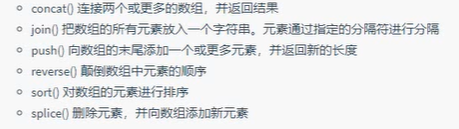

# 引入JS文件

```
<script src=”my.js“></script>
```

Alert(‘内容’)；    弹窗内容

Console.log(msg)  浏览器控制台打印输出信息，后台看

Prompt(into)   弹出输入框，用户可输入

Onclik=”alert(‘内容’)”;   点击出弹窗

# 声明变量（去内存申请空间）

Var age;   声明一个age的变量

Var age=’18’   变量的初始化,可不加’‘，有中文必须加‘‘

 

# 变量命名规范

区分大小写

不能数字开头

首字母小写，后面单词首字母大写

只准许特殊符号￥或_开头

1、 变量是一个容器，用来储存数据

2、 先声明，后赋值

 

JS的变量数据类型只有程序在运行过程中，根据等号右边的值来确定的（数字型，字符串型）

# 简单数据类型

Number  数值型，包括整型，浮点型          默认0

Boolean  布尔值  true false等价1和0        默认false

String   字符串型 带引号 ‘“”“”’外单内双，或者外双内单都可以

Undefined  声明了a但未给值   var a;

Null    var a= null;  声明a为空值

 

Var num= 010; 得8,程序中数字前面加0表示八进制。

十六进制 0~9 a~f  数字前面加0x表示十六进制

# 数字型范围

Alart(Number.MAX_VALUE); 最大值

Alart(Number.MIN_VALUE)； 最小值

# 数字型特殊值

Alart(Infinity);   无穷大

Alart(-Infinity);  无穷小

Alart(NaN);    非数值

IsNaN 判断是否为非数字类型，不是为false,是为true   Not a Number

# 字符串转义字符

`\n` 换行 newline

`\\ ` 输出斜杠

`\”`  输出双引号

`\t`  tab缩进

`\b`  空格，blank

 

#### 检测获取字符串长度 length

var str=‘my name is lilei’;;

Console.log(str.length);

#### 字符串的拼接 + （数值相加，字符相连）引引加加

Console.log(‘沙漠’+’骆驼‘)；

例

Var age=prompt(‘请输入你的年龄:’);   弹出输入年龄框

Var str=‘你已经’+age+’岁啦‘;

alert(str);           弹窗出结果

 

#### typeof  检测数据类型

var mun=10;

console.log(typeof num);

# 字符类型转换

#### 转换为字符串

1、toString()       alert(num.toString());

2、String() 强制转换    alert(String(num));

3、加号拼接字符串    alert(num+’字符串’)；

#### 转换为数字型

1、 parseInt(String)  函数    转换为整数

2、 parseFloat(String) 函数    转换为浮点数

3、 number()   强制转换函数

4、 js隐式转换（-*/）  算术运算隐式

 

#### 转换为布尔型

Boolean（）  函数

代表空、否定的值为false,如”、0、NaN、null、undelined, 其余均为true

#### 运算符

\+ - * / %余

#### 递增，递减

++num   先自加1，再返回原值

num++   先返回原值，后自加1

#### 比较运算符

\>=   大于等于

==    等于

!=     不等于

=== !==  全等，要求值和数据类型一致

#### 逻辑运算符

&&    逻辑与 and

||   逻辑或 or

!     逻辑非 not

#### 短路运算，逻辑与

123&&456   表达式1为真，返回表达式2  结果：456

1&&456    表达式1为假，返回表达式1  结果：0

#### 短路运算，逻辑或

表达式1为真，返回表达式1，不计算表达式2

表达式1为假，返回表达式2

#### 赋值运算符

==

+=    num=num+2; // num+=2;

-=    num=num-2; // num-=2; 

*=

/=

%=    取模后再赋值

#### 运算符优先级

1、小括号      （）

2、一元运算符    ++ -- ！

3、算数运算符    先*/%后+-

4、关系运算符    >  >=  <  <=

5、相等运算符    ==  !=  ===   !==

6、逻辑运算符    先&&后||

7、赋值运算符    =

8、逗号运算符    ，

# if else分支语句

if (条件表达式) {

   执行语句1

} else {

   执行语句2

}

if多分支语句 (多用于范围判断的情况)（分支较少时，比switch语句更效率）

if (表达式1) {

   语句1

} else if (表达式2) {

   语句2

} else if (表达式3) {

   语句3

} else {

​    语句4

}

# 三元表达式

条件表达式？表达式1：表达式2；

// 条件表达式为真，则返回表达式1，若条件表达式为假，则返回表达式2

# switch分支语句

（经常处理比较确定值的情况）（相比if语句直接执行条件语句，效率较高）

switch(表达式) {

​     case value1：

​     执行语句1；

​     break;

​     case value2：

​     执行语句2；

​     break;

​     ……

​     default:

​     执行最后语句；

}

# for循环

for (初始化变量；条件表达式；操作表达式) {

   //循环体

}


###### 案例:1~100能被三整除的数之和)

```
var result = 0;

for (var i=1; i<=100; i++) {

   if (i % 3 == 0) {

​     result = result + i;      // result+=i;

   }

}
```


###### 案例：求所有同学总成绩和平均分

```
var num = prompt(‘请输入班级总人数：’)

var sum = 0;

var average = 0;

for ( var i=1; i<=num; i++) {

   var score = prompt(‘请输入第’+ i +’个学生的成绩‘);

   sum = sum + parseFloat(score);

}

average = sum / num;

alert(‘班级的总成绩为’ + sum);

alert(‘班级的平均分为’ + average);
```


###### 案例，打印5颗★

var str = ‘’

for (var i=1; i<=5; i++) {

  str = str + ‘★‘;

}

console.log(str);

# 双重for循环 （打印5行星星）

var str = ‘ ’

for (var i=1; i<=5; i++) {         //外层循环控制行数

   for(var j=1l j<=5; j++) {       //内层循环控制列数

​        str=str+’ ★’

   }

   str=str + ‘\n’

}

# while循环

（先判断，再执行循环体）

while(条件表达式) {

​    //循环体

}

do while循环体（先执行一次循环体，再判断）

do {

  //循环体

} while (条件表达式)

# continue关键字

for (var i=1; i<=5; i++) {

   if (i=3) {            //当i=3时，继续执行i++，不执行console.log

​      continue;

   }

   console.log(‘我正在吃第’+ i +’个包子’)

}

# break关键字

for (var i=1; i<=5; i++) {

   if (i=3) {            //当i=3时，退出循环，不再继续。

​      break;

   }

   console.log(‘我正在吃第’+ i +’个包子’)

}

# 数组Array



```
var ar1 = {1,2,5,3}
var ar2 = {9,6,8,5}

var ar3 = ar1.concat(ar2);

var ar3 = ar1.join("|");	//每个元素间加|


```

# splice()

```
ar1.splice(要删除元素下标,要删几个元素,要插入的内容);
```

```
//删除第三个元素后的所有元素
ar1.splice(2)

//删除多个元素，从第二元素开始删除2个元素
ar1.splice(1,2)

//添加数组,在第二个元素位置添加数组
ar1.splice(1,0,[11,22])

//替换数组，将第二个元素替换成333
ar1.splice(1,1,333)

//添加元素，在第一个位置添加111
ar1.splice(0,0,111)
```


#### 创建数组

1、var arr = new Array();

2、var arr = [1,2,3,4,5,’你好’，true];      //更常用

获取数组元素

console.log(arr[2]);  //获取第三个元素     元素位置0,1,2,3…

#### 遍历：讲每个数据都返回一次

var arr = [13,434,43242,4242,123,555]

for (var i=0; i<arr.length; i++) {

  console.log(arr[i]);

}

###### 案例，取数组中的最大值

```
var arr = [3,53,65,34,67,34];

var max = arr[0];

for (i=1; I<arr.length; i++) {

   if (arr[i] > max ) {

​       max = arr[i];

   }

}

console.log(‘该数组里的最大值为：’ + max);
```


#### 追加数组元素

var arr = [123,433,32,1];

arr[4] = 999;      //增加数组元素

arr[0] = 111;      //替换原来的数组元素

###### 案例： 筛选数组中大于10的数

```
var arr = [1,4,7,44,3,98,8];

var newArr = [];    //默认newArr.length 长度为0

for (i=0; i<arr.length; i++) {

   if( arr[i] > 10) {

​      newArr[newArr.length] = arr[i];

   }

}

console.log(newArr);
```

###### 案例：数组内容反向存放

```
var arr = [1,2,3,4,5,6,7,8,9];

var newArr = [];

for (i = newArr.length-1, i>=0; i--){

   newArr[newArr.length] = arr[i];

}

console.log(newArr);
```

# 集合、字典

```
var kv1 = {a:"A",b:"B"}	//js的对象，键不加引号

var kv1 = {"aa":"A","bb":"B"}	//json的对象，键加引号
```

```
var kv1 = [{"aa":"A","bb":"B"},{"cc":"C","dd":"D"}]	//json的对象数组
```


# 冒泡排序

var arr = [5,4,3,2,1];

for (i=0; i<=arr.length -1; i++) {       //外层循环管趟数

   for(var j=0; j<=arr.length-i-1; j++) {   //里层循环管每趟交换次数

​      if (arr[j] > arr[j+1]) {

​          var tem = arr[j];

​          arr[j] = arr[j+1];

​          arr[j+1] = tem;

​      }

   }

}

# 函数

#### 函数的使用

function 函数名（形参1，形参2…）{    //函数名为动词  函数不调用自己不执行

​      //函数体

}

函数名（实参1，实参2…）；  //调用函数名,如实参多于形参，则取到形参的个数

#### 函数的返回值

function 函数名 （形参） {

​     return 需要返回的结果；

}

console.log(函数名（）)；

###### 案例，得出数组的最大值[23,5,25,65,35,40]

function getArrMax(arr) {

   var max = var[0];

   for (var i=1; i<arr.length; i++) {

​      if(arr[i]>max) {

​          max=arr[i];  

​      }  

   }

   reture max;

}

var re = getArrMax([23,5,25,65,35,40]);

console.log(re);

arguments （只有函数才有，并且已内置）

function getMax() {

​    var max = arguments[0];

​    for(var i=1; i<arguments.length; i++) {

​        if(arguments[i]>max) {

​          max=arguments[i];

​        }

​    }

​    return max;

}

console.log(getMax(1,2,3));

## sort 排序

## reverse 翻转

## 函数的声明方式

var fun = function() {

   console.log(‘函数表达式’)；

}

fun();

# 匿名方法

没有函数名的方法

```
var fun1 = function (param1){
	alert(param1);
}
fun1("hello");		//使用
```

```
(function(param1,param2){
	...
})(1,2);		//定义并调用
```

# JS作用域（互不冲突）

全局变量：在浏览器关闭时销毁，比较占内存

局部变量（函数中），在函数中没有var声明得变量为全局变量。

​           函数得形参也可看作是局部变量

​           当我们程序执行完毕时销毁

# 预解析

1、JS引擎运行JS分为两步：  预解析  代码执行

（1）预解析：js引擎会把js里所有得var还有function提升到当前作用域得最前面

 （2）代码执行：按照代码书写得顺序从上往下执行

2、预解析分为 变量预解析（变量提升） 和 函数预解析（函数提升）

  (1)变量提升：就是把所有得变量声明提升到当前得作用域最前面

  (2)函数提升：把函数声明提升到当前作用域最前面，不调用函数

# 对象

属性（特征）和方法（行为）的集合

#### 创建对象

var obj = {

uname: ‘张三’,

age: 18,

sex: ‘男’,

sayHi: function() {

​    console.log(Hi~);

}

}

console.log(obj.age);      //调用对象属性  方法1

console.log(obj[‘sex’]);     //调用对象属性  方法2

obj.sayHi();         //调用对象的方法

#### 添加对象的属性和方法

var obj = new object();

obj.uname = ‘张三’；

obj.sayHi = function() {

   console.log(hi~);

}

#### 构造函数创建对象（泛指）

function Star(uname,age,sex){      //构造函数名首字母大写

​    this.name = uname;

​    this.age = age;

​    this.sex = sex;

​    this.sing = function(sang) {

​       console.log(sang);

​     }

}

var ldh = new Star（’张三’，18，‘男’）；       //调用构造函数

console.log(ldh.uname);

ldh.sing(‘冰雨’)；

# 遍历对象for…in/of

```
var obj={2,3,6,6}
for(var k in obj) {
   console.log(k);       //没有键，得到下标索引。0,1,2,3
   console.log(obj[k]);     //得到属性值
}
```

```
var kv2 = {"1":"2","3":"4"}
for(const key in kv2){
	//获取每个元素的键、值
	console.log(key);
	console.log(kv2[key])
}
```

```
var kv2 = [{1:2},{3:4}]
for(const kv of kv2){
	//获得每个元素的值,即{1:2}和{3:4}这两个元素
}
```


# Math

console.log(Math.PI);

console.log(Math.max(1,44,25,23));

console.log(Math.abs(-3));        //abs 绝对值  3

console.log(Math.floor(1.9));       //向下取整  1

console.log(Math.ceil(1.9));       //向上取整  2

console.log(Math.round(1.9));      //四舍五入 2

console.log(Math.random());      //随机数 [0,1)即 0<=X<1

###### 案例：取两个数之间的随机整数

function getRandom (min,max) {

  return Math.floor(Math.random()*(max-min+1) + min;

}

console.log(getRandom(1,10));

从1970.01.01到现在多少毫秒

console.log(Date.now());

var date = +new Date();      //比较常用

###### 案例：倒计时

function countDown(time) {

   var nowTime = +new Date();      //返回当前时间的毫秒

   var inputTime = +new Date(time);   //返回用户输入时间的毫秒

   var times = (inputTime – nowTime)/1000;

   var d = parseInt(times/60/60/24);

   d = d<10 ? ‘0’+d : d;

   var h = parseInt(times/60/60%24);

   h = h<10 ? ‘0’+h : h;

   var m = parseInt(times/60%60);

  m = m<10 ? ‘0’+m : m;

   var s = parseInt(times%60);

   s = s<10 ? ‘0’+s : s;

   return d +‘天’+ h +‘时’+m+ ‘分’+s+‘秒’；

}

console.log(countdown(‘2020-5-1 18:00:00’));

# 数组对象

`var arr = new Array(2); `   //2表示长度为2的两个空数组元素

`var arr = new Array(2,3) `  //小括号内大于1个元素，则相当于[2,3]

#### 检测是否为数组

instanceof

console.log(obj instanceof Array);

console.log(Array.isArray(obj));       // H5新增方法，ie9以上支持

#### 添加删除元素

1、push()  在我们数组的末尾 添加一个或多个元素

arr.push(4,‘你好’);     //返回原数变化后的长度

2、unshift   在我们数组的开头 添加一个或多个元素

 arr.unshift(3,6);    //返回原数变化 后的长度

3、 pop() 可以删除数组的最后一个元素,一次删除一个

arr.pop() ;  //删除那个元素返回哪个元素

4、shift()  删除数组第一个元素

  arr.shift();  //删除那个元素返回哪个元素 

#### 翻转数组

var arr = [3,5,2];

arr.reverse();

console.log(arr);

#### 数组排序

var arr = [3,5,2,77,5,33];

arr.sort(function(a,b){

  return a-b;     //降序为b-a

});

console.log(arr);

#### 获取数组元素索引号indexOf()

var arr = [‘green’,’blue’,’red’,’pink’];

console.log(arr.indexOf(pink));

console.log(arr.lastindexOf(pink));    //lastindexOf从最后元素查找，返回索引号相同

###### 案例：查找相同的元素

var str= “afoadfooevaooraoba”;

var index = str.indexOf(‘o’);

var num = 0;

while(index !== -1) {

   console.log(index);

   num++;

   index = str.indexOf(‘o’,index+1);

}

console.log(‘o出现的次数为：’+num);

###### 案例：数组去重

```
#遍历旧数组，拿着旧数组元素去新数组中查询，不存在添加，否则不添加

function unique(arr) {

   var newArr = [];

   for (var i=0; i<arr.length; i++) {

​      if(newArr.indexof(arr[i]) === -1) {

​        newArr.push(arr[i]);

​      }

   }

   return newArr;

}

var demo = unique([‘c’,’d’,g’’,’r’,’c’,’r’,’h’,’t’,’c’,’y’]);

console.log(demo);
```


#### 数组转换为字符串

1、toString()

var arr = [1,2,3];

console.log(arr.toString());

2、join(分隔符)    //默认分隔符为，

var arr = [‘blue’，‘red’，‘yellow’];

console.log(arr.join(‘-’));      //输出为blue-red-yellow

# 基本包装类型

将简单数据类型包装成复杂数据类型，这样基本数据类型就有了属性和方法。

var temp=new String（‘andy’）;

str = temp;

temp = null;      //销毁临时变量

# 字符串操作方法

#### 1、截取

```
#去掉字符
substr('起始的位置',截取几个字符)；
```

#### 2、替换   

只会替换重复的第一个字符

replace(‘被替换的字符’,’替换为字符’)；

#### 3、字符转换为数组

 ```
#分割符分割成数组
split('=')
 ```

# Promise

```
//pending 未实现未打破
//fulfilled 实现
//rejected  打破
#下面reslove对应fulfilled,reject对应rejected

let getMarried = (age) =>{
	return new Promise((reslove,reject)=>{     
		setTimeout(()=>{
			if(age>=22){
				reslove("可以结婚")；
			}else{
				reject("年级还小")；
			}
		},1000);
	})
}

const a =getMarried(22)
.then(result=>{console.log(result);})
.catch(err => console.log(err))
```

