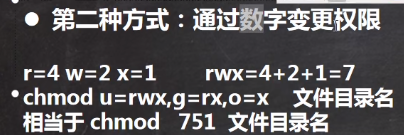

# 教程

https://www.bilibili.com/video/BV1Sv411r7vd

P58未

# 软件

1. 设置BIOS：开机进入BIOS-security-virtualization Technology设置为enabled

2. AMware15.5（安装参考P5）

   https://www.nocmd.com/windows/740.html

   YG5H2-ANZ0H-M8ERY-TXZZZ-YKRV8

   UG5J2-0ME12-M89WY-NPWXX-WQH88 

   UA5DR-2ZD4H-089FY-6YQ5T-YPRX6

3. Cenos7.6（安装参考P6）

   https://vault.centos.org/7.6.1810/isos/x86_64/
   
4. Xshell（远程登陆） Xftp(远程传输）

   https://netsarang.com/en/free-for-home-school

# 注意点

```
/bin 命令
/sbin 超级管理员命令
/root 超管文件
/home 用户文件夹
/lib  系统开机所需动态链接共享库，类似于windows的DLL文件，几乎所有程序都用到共享库
/lost+found 通常为空，非法关机，存放文件 
/etc 系统管理需要的配置文件和子目录，比如安装mysql数据库my.conf
/usr  用户应用程序放在此目录下，相当于ProgramFiles文件夹
/boot 系统启动时的文件
/proc 内存的映射（勿动）
/srv  存放服务启动需要提供的数据（勿动）
/sys  安装了2.6内核中出现的文件系统sysfs(勿动)
/temp 存放临时文件
/dev  设备管理器，将硬件以文件形式储存
/mnt  让用户临时挂载别的文件系统，比如文件共享
/opt  给注意额外安装软件所摆放的目录，如安装Oracle数据库
/usr/local 给主机额外安装软件的目录
/var 存放不断扩充的文件，修改的，日志类
/selinux[security-enhanced linux]  安全子系统，控制程序访问特定文件

```

```
//写脚本
vim my.sh
//执行脚本
./my.sh    ???
```

```
//查看所有进程
ps -ef
```

# 安装软件

```shell
apt install nginx
nginx -V
service nginx start/stop
```

# 命令，快捷键

```
-p	//
-r	//recursion	递归
-f	//force		强制（不提示）
-l	//line		单列
-a	//all		所有（包括隐藏）
-h	//human		改成人看的习惯显示
-n	//number	显示行号
-i	//			忽略大小写
-g	//
ls	//list
```

| 功能                                                         | 命令                                                         |
| ------------------------------------------------------------ | ------------------------------------------------------------ |
| 添加用户jack                                                 | useradd jack                                                 |
| 添加用户king，用户文件夹为test                               | useradd -d /home/test king                                   |
| 给用户设置密码                                               | passwd jack 回车                                             |
| 删除用户jack,删除家目录                                      | userdel - r jack                                             |
| 删除用户jack, 不删除家目录                                   | userdel jack                                                 |
| 查询用户信息                                                 | id root                                                      |
| 查询当前用户                                                 | who am i                                                     |
| 显示当前目录                                                 | pwd                                                          |
| 查看IP                                                       | ifconfig                                                     |
| 立即关机                                                     | shutdown -h now                                              |
| 1分钟关机                                                    | shutdown -h 1                                                |
| 立即重启                                                     | shutdown -r now                                              |
| 关机                                                         | halt                                                         |
| 重启                                                         | reboot                                                       |
| 内存数据同步到磁盘                                           | sync                                                         |
| 切换账户                                                     | su - root                                                    |
| 注销(在Xshell中才可使用)                                     | logout                                                       |
| 增加组                                                       | groupadd wudang                                              |
| 删除组                                                       | groupdel wudang                                              |
| 在组中创建用户                                               | useradd -g wudang zwj                                        |
| 改变用户的组                                                 | usermod -g mojiao zwj                                        |
| 查看所有文件（包括隐藏文件）                                 | ls -a                                                        |
| 单列列出文件                                                 | ls -l （ ll 相同效果）                                       |
| 查看所有文件，单列列出                                       | ls -la  ( ls -al )                                           |
| 查看home下所有文件，单列列出                                 | ls -la /home                                                 |
| 创建文件并进入(可修改)                                       | vim hello.java                                               |
| 查看文件(不可修改，安全)                                     | cat hello.java                                               |
| 查看文件（显示行号，不可修改）                               | cat -n hello.java                                            |
| 查看文件（**翻阅，一般都带more**）详见大标题\| more          | cat -n hello.java \| more                                    |
| 创建文件                                                     | touch hi.txt                                                 |
| 查阅文件                                                     | more /home/hello.java                                        |
| 查阅文件                                                     | less /home/hello.java                                        |
| 显示文件开头(默认显示前10行)                                 | head /home/hi.txt                                            |
| 查看文件头5行内容                                            | head -n 5 /home/hi.txt                                       |
| 显示文件末尾（默认显示末10行）                               | tail /home/hi.txt                                            |
| 查看文件末5行内容                                            | tail -n 5 /home/hi.txt                                       |
| 实时最终文档更新（末尾变化）                                 | tail f /home/hi.txt                                          |
| 切换到目录                                                   | cd                                                           |
| 切换到用户家目录                                             | cd ~                                                         |
| 返回上级目录                                                 | cd ..                                                        |
| 切换到根目录                                                 | cd /                                                         |
| 创建目录                                                     | mkdir /home/dog                                              |
| 创建多级目录                                                 | mkdir -p /home/animal/tiger                                  |
| 删除空目录                                                   | rmdir /home/dog                                              |
| 删除非空目录（animal里有内容）                               | rmdir -rf /home/animal                                       |
| 拷贝文件（将hello.txt复制到bbb文件夹下）<br />                  需要先进入hello.txt所在文件夹 | cp hello.txt bbb/                                            |
| 拷贝整个文件夹（包括文件夹内容）<br />                  将home整个文件夹拷贝到opt下 | cp -r /home/bbb/ /opt/                                       |
| 拷贝整个文件夹（默认覆盖原来文件）                           | \cp -r /home/bbb/ /opt/                                      |
| 删除文件                                                     | rm hello.txt                                                 |
| 删除文件不提示                                               | rm -f hello.txt                                              |
| 删除整个文件夹内容，递归，不提示                             | rm -rf /home/bbb                                             |
| 重命名                                                       | mv oldNamefile newNamefile                                   |
| 移动文件                                                     | mv /temp/movefile /targetFolder                              |
| 移动并且重命名文件                                           | mv /temp/a.txt /targetFolder/b.txt                           |
| 移动整个目录                                                 | mv /opt/yiji/ /home/                                         |
| 移动整个目录并重命名                                         | mv /opt/yiji/ /home/sanji                                    |
| 输出环境变量                                                 | echo $PATH<br />echo $HOSTNAME                               |
| 输出内容                                                     | echo "hello world"                                           |
| 输出重定向(将hi**覆盖**到a.txt的内容)(没a.txt则创建)         | \><br />echo "hi" > /home/a.txt                              |
| 输出重定向(将hi**追加**到a.txt的内容结尾处)                  | \>><br />echo "nihao" >> /home/a.txt                         |
| 将文件1内容覆盖文件2内容                                     | cat 文件1 > 文件2                                            |
| 软链接，符号链接（类似快捷方式，跳转）                       | ln -s /root/ /home/myroot<br />(点击myroot，跳转到/root)     |
| 列出历史操作                                                 | history                                                      |
| 查看最近10个历史操作                                         | history 10<br />!5 再次操作列出的行标5的指令                 |
| 显示当前日期                                                 | date                                                         |
| 显示当前年份                                                 | date +%Y                                                     |
| 显示当前月份                                                 | date +%m                                                     |
| 显示当前哪一天                                               | date +%d                                                     |
| 显示当前年月日时分秒                                         | date "+%y-%m-%d %H:%M:%S"                                    |
| 设置系统当前时间                                             | date -s "2020-12-30 11:12:02"                                |
| 日历                                                         | cal                                                          |
| 2020整年日历                                                 | cal 2020                                                     |
| 查找                                                         | find [搜索范围] [选项]<br />选项：-name -user -size<br />例：find /home -name hi.txt<br />例：find /home -name *.txt<br />例：find /home -size +200M(k,M,G) |
| 定位文件路径                                                 | locate<br />备注：第一次运行前，使用uodatedb指令创建locate数据库 |
| 查看指令在哪个目录                                           | which ls                                                     |
| 过滤查找                                                     | grep<br />例：cat a.txt \| grep -n "hello"  显示行号<br />例：cat a.txt \| grep -ni "hello"  显示行号，忽略大小写 |
| 查找是否有wudang这个组                                       | cat /etc/group \| grep wudang                                |
| 压缩                                                         | gzip 文件<br />备注：只能压缩成*.gz                          |
| 解压缩                                                       | gunzip 文件.gz                                               |
| 压缩                                                         | zip 文件<br />例：zip -r myhome.zip /home/ (将home文件夹所有内容压缩成myhome.zip) |
| 解压缩                                                       | unzip 文件.zip<br />例：unzip -d /opt/tmp myhome.zip（将myhome.zip解压到/opt/tmp下） |
| 打包（压缩，解压缩）                                         | tar [选项] XXX.tar.gz 打包内容<br />-c 产生.tar打包文件<br />-v 显示详细信息<br />-f 指定压缩后的文件名<br />-z 打包同时压缩<br />-x 解包.tar文件<br />例：tar -zcvf pc.tar.gz /home/a.txt /home/b.txt<br />例：tar -zxvf pc.tar.gz (解压)<br />例：tar -zxvf /home/myhome.tar.gz -C /opt  (解压到指定目录) |
| 修改文件所有者                                               | chown 用户名 文件名                                          |
| 修改文件所在组                                               | chgrp 组名 文件名/目录<br />-R 子目录生效                    |
| 修改用户所在组                                               | usermod -g 组名 用户名                                       |
| 修改用户登录的初始目录                                       | usermod -d 目录名 用户名                                     |
| 修改权限                                                     | chmod u-x,g+w /home/abc.txt                                  |
| 修改文件所有者                                               | chown newowner 文件/文件目录<br />-R  子目录生效             |
| 修改文件所有者和所在组                                       | chown newowner:newgroup 文件/文件目录<br />-R  子目录生效    |
|                                                              |                                                              |
| 清除屏幕                                                     | clear                                                        |
| 查看系统内核版本                                             | uname -r                                                     |
| 查看系统配置                                                 | cat /etc/os-release                                          |
| 查看磁盘空间                                                 | df -h                                                        |
| 退出                                                         | Ctrl + C                                                     |

# more

1. 查看较大文件用less,不用more


# less

1. 比more更强大
2. 按需加载
3. 查看较大文件用less，不用more


# 虚拟机克隆

# 虚拟机快照

# 虚拟机迁移删除

# vmtools（安装参考P11）

主机和虚拟机共享文件夹，文件传输

1. 右击桌面CenOS7 x86_64,选“弹出”
2. VMware菜单-VM-reinstall VMware Tools
3. 不出现文件夹就cancel install,再reinstall VMware Tools
4. 将文件夹中的VMwareTools-10.3.21-14772444.tar.gz复制到‘计算机-opt下’
5. 。。。
6. 。。。。

# 远程登录

#### Xshell

1. Linux终端中ifconfig查出IP（XXX.XXX.XXX.XXX）
2. 主机中cmd中PING XXX.XXX.XXX.XXX看看能否PING通

3. 打开Xshell--新建--名称输入XXX.XXX.XXX.XXX（主机必须XXX.XXX.XXX.XXX，名称可改），确定
4. 点击All section下的主机名，选择“接受并保存“
5. 输入用户名密码（如root），确定
6. 输入ls测试

# 远程文件传输

#### Xftp

1. Linux终端中ifconfig查出IP（XXX.XXX.XXX.XXX）
2. 主机中cmd中PING XXX.XXX.XXX.XXX看看能否PING通

3. 打开Xshell--新建--名称输入XXX.XXX.XXX.XXX（主机必须XXX.XXX.XXX.XXX，名称可改），确定
4. 协议：SFTP，端口号：22
5. 点击主机名，选择“连接“
6. 输入用户名密码（如root），确定
7. 左边windows,右边linux
8. 右侧选择到需要复制的目录，左侧右击文件选“传输”，即可传送文件

# VI和VIM

模式


1. vim hello.java  （创建文件，此时不可输入）
2. 输入“i”（插入模式，可编辑）
3. 写完代码，ESC，：，wq（保存退出）
4. 输入ls可看到文件hello.java
5. 再次编辑输入“vim hello.java”


#### VIM快捷键

| 功能         | 命令                        |
| ------------ | --------------------------- |
| 复制         | yy    5yy                   |
| 黏贴         | p                           |
| 删除         | dd   5dd                    |
| 查单词       | ESC    /单词（n查找下一个） |
| 设置行号     | :set nu       :set nonu     |
| 跳到首、末端 | 首gg   末g                  |
| 撤销         | 一般模式下   u              |
| 定光标到某行 | 20  shift+g                 |
| 保存退出     | :wq                         |
| 退出         | :q                          |
| 退出不保存   | :q!                         |

# 用户管理

## 用户和组相关文件

```
/etc/passwd
用户的配置文件，记录用户的配置信息
（用户名：口令：用户标识号：组标识号：注释性描述：主目录：登陆Shell）
查看vim /etc/passwd
```

```
/etc/shadow
口令的配置文件
（登录名：加密口令：最后一次修改时间：最小时间间隔：最大时间间隔：警告时间：不活动时间：失效时间：标志）
查看vim /etc/shadow
```

```
/etc/group
组的配置文件，记录Linux包含组的信息
（组名：口令：组标识号：组内用户列表）
查看vim /etc/group
```

# 运行级别


## 切换级别

```
init 3
```

| 功能                         | 快捷键                                             |
| ---------------------------- | -------------------------------------------------- |
| 级别3                        | multi-user.target                                  |
| 级别5                        | graphical.target                                   |
| 查询当前级别                 | systemctl get-default                              |
| 设置默认运行级别<u>**3**</u> | systemctl set-default <u>**multi-user**</u>.target |

# 找回root密码（CentOS7以后）


# 组管理和权限管理


# 修改权限

```
r=4
w=2
x=1
```




# 帮助指令

```
//查询ls的用法
man ls
```

# crond任务调度（循环定时）

1. 要设置好文件和用户执行权限
2. 进入crontab（crontab -e）
3. 设置定时任务（如1：* /1 \*\*\*\* /home/my.sh   如2：* /1 \*\*\*\* ls -l /etc/ > /tmp/to.txt）

| 功能                          | 命令 |
| ----------------------------- | ---- |
| 编辑crontab定时任务           | -e   |
| 查询crontab                   | -l   |
| 删除当前用户所有的crontab任务 | -r   |

```
******
```


## 案例


# at定时任务（一次性）

1. atd每隔60秒执行一次，检查别的任务
2. 对其他任务只会执行一次

```
at [选项][时间]
Ctrl+D 结束at命令的输入
```

```
//检测atd是否在运行
ps -ef | grep atd
```

```
//删除任务
atrm [任务序号]
```


#### at命令选项


#### at时间定义


#### 案例

```
//两天后的下午5点执行 /bin/ls/home
at 5pm + 2 days "回车"
/bin/ls/home  "Ctrl+D" "Ctrl+D"

//明天下午5点
at 5pm tomorrow

//两分钟后
ar now + 2 minutes
```


# 回顾

P32 覆盖文件

# Nginx

### 在linux中裸装Nginx

```shell
# 安装
apt install nginx

# 查看版本，是否安装成功
nginx -V

# 开启、关闭
service nginx start/stop

# 安装路径
cd /etc/nginx/

# 日志文件路径
cd /var/log/nginx/
# 删除所有日志
rm * -r

# 主页路径
cd /usr/share/nginx/html/
```

