# 教程

https://www.bilibili.com/video/BV1JE411g7XF

P8,9回看。

P13未，作业全部重做

# 符号

预测值的平均值读：f/bar

预测值读：f/star

最优值读：f/head

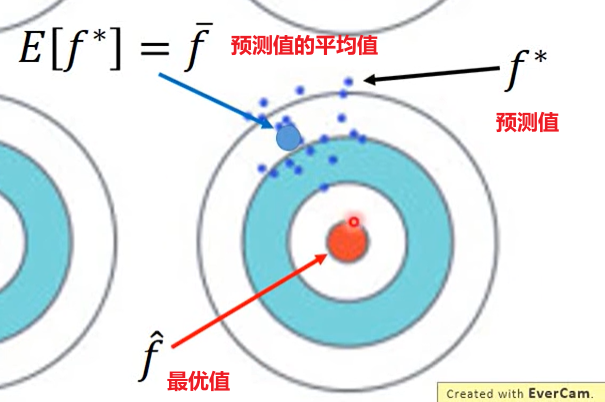

# 原因

bias大 => 欠拟合Underfitting =>增加特征

Variance大 => 过拟合Overfitting => 增加数据，正则化

# 熵、交叉熵

### 熵

+ 概率越小，信息量越大

+ 信息量为：−log(p(x0))

| 序号 | 事件         | 概率p | 信息量I         |
| ---- | ------------ | ----- | --------------- |
| A    | 电脑正常开机 | 0.7   | -log(p(A))=0.36 |
| B    | 电脑无法开机 | 0.2   | -log(p(B))=1.61 |
| C    | 电脑爆炸了   | 0.1   | -log(p(C))=2.30 |

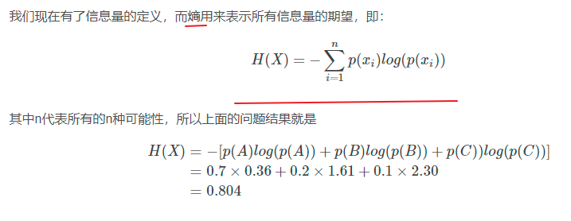

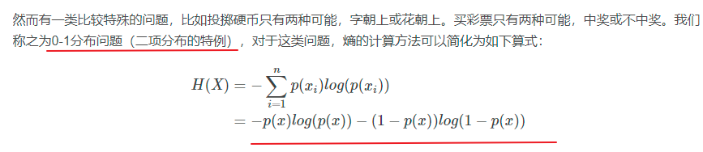

### 相对熵（KL散度）

+ P往往用来表示样本的真实分布，比如[1,0,0]表示当前样本属于第一类。
+ Q用来表示模型所预测的分布，比如[0.7,0.2,0.1]

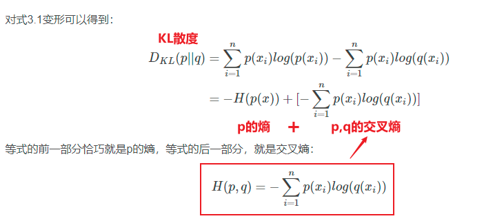

+ 例子：识别图片，图片上有一直青蛙，一直老鼠。求预测值的loss

| *          | 猫   | 青蛙 | 老鼠 |
| ---------- | ---- | ---- | ---- |
| Label标签  | 0    | 1    | 1    |
| Pred预测值 | 0.1  | 0.7  | 0.8  |

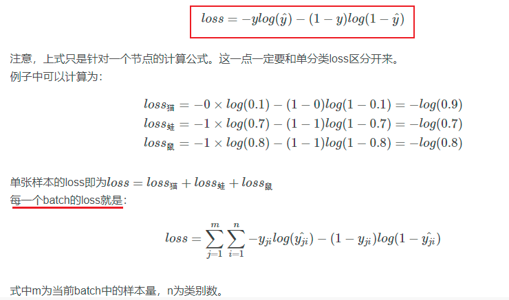

# Softmax

目的：结果为多类，算出美类最后的概率值，并且所有概率值的和为1

转换：将多分类的输出值转换为范围在[0, 1]和为1的概率分布。

公式：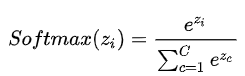

# 生成模型和判别模型的区别

Generative and Creminative

#### 判别式模型举例：

要确定一个羊是山羊还是绵羊，用判别模型的方法是从历史数据中学习到模型，然后通过提取这只羊的特征来预测出这只羊是山羊的概率，是绵羊的概率。

#### 生成式模型举例：

利用生成模型是根据山羊的特征首先学习出一个山羊的模型，然后根据绵羊的特征学习出一个绵羊的模型，然后从这只羊中提取特征，放到山羊模型中看概率是多少，在放到绵羊模型中看概率是多少，哪个大就是哪个。

#### 总结：

判别式模型是：根据一只羊的特征可以直接给出这只羊的概率（比如logistic regression，这概率大于0.5时则为正例，否则为反例）

生成式模型是：要都试一试，最大的概率的那个就是最后结果~

# Linear Regretion

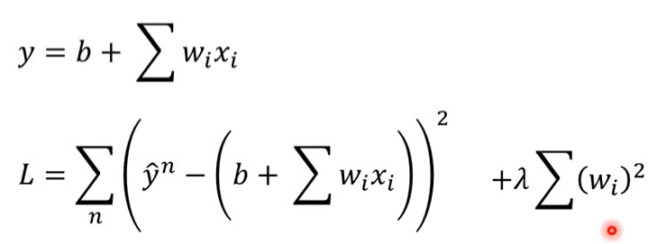

# Gradient Descent

### Adagrad

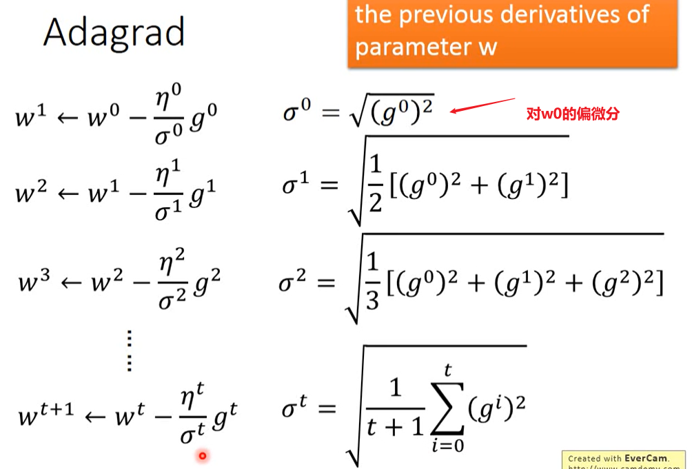

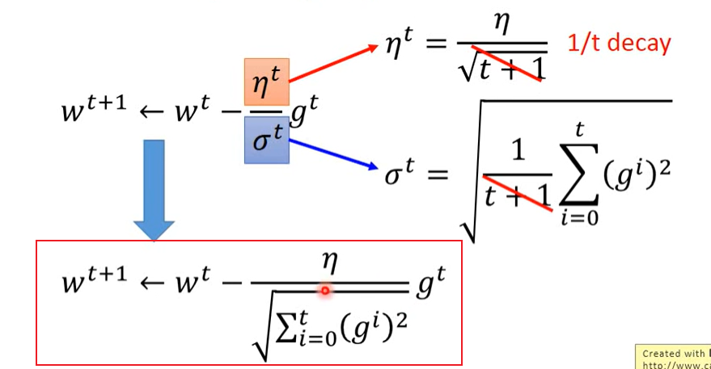

### Feature Scaling缩放比例

为了梯度下降更效率，更快，少走弯路

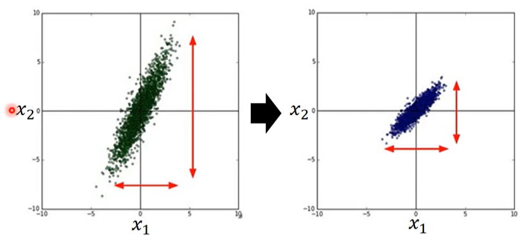

# Classification

### 贝叶斯公式、全概率公式

朴素贝叶斯前提是：相互独立

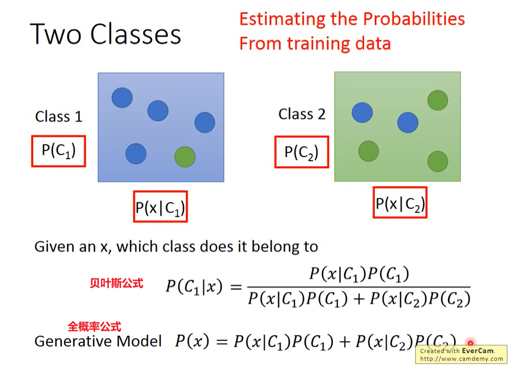

### 高斯分布、正态分布

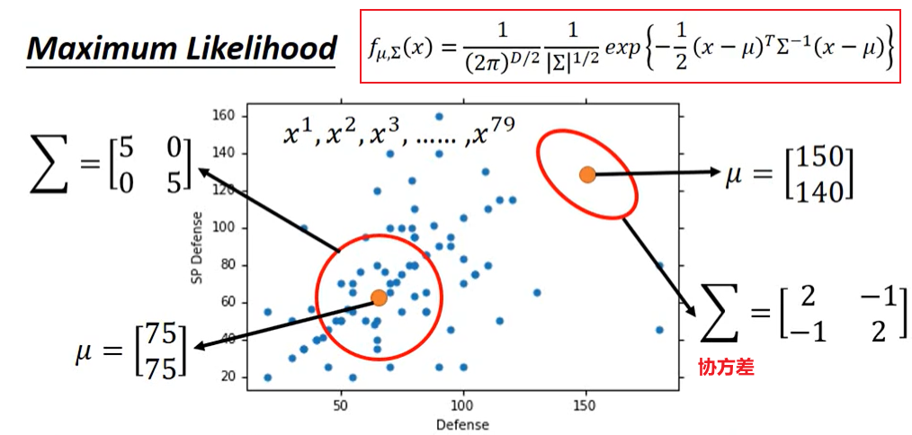

# Logistic Regression

### 交叉熵

1. 所以当越不可能的事件发生了，我们获取到的信息量就越大。越可能发生的事件发生了，我们获取到的信息量就越小。

两个函数的分布相同，交叉熵为0

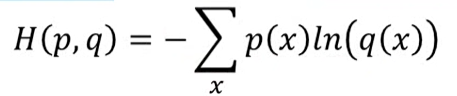

# GAN

Generator

Discriminator

先训练D => 训练G => 训练D => 训练G => 训练D => 训练G => 训练D => 训练G......

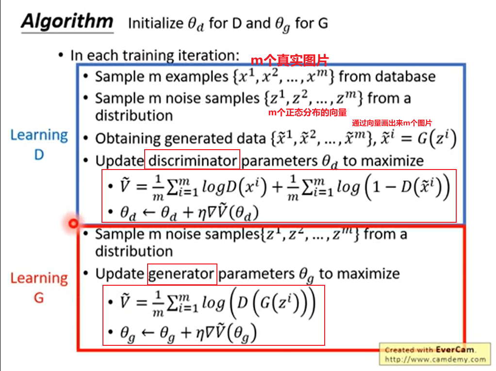

