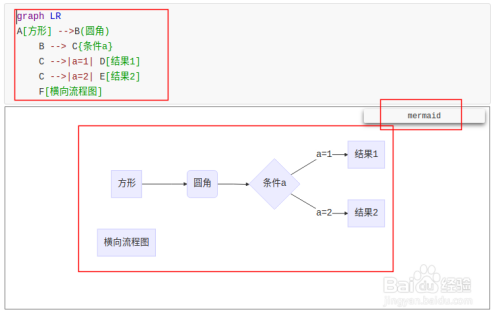
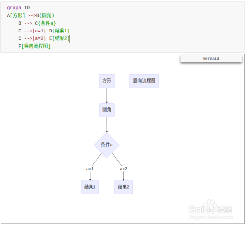
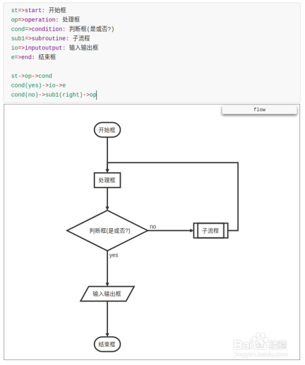
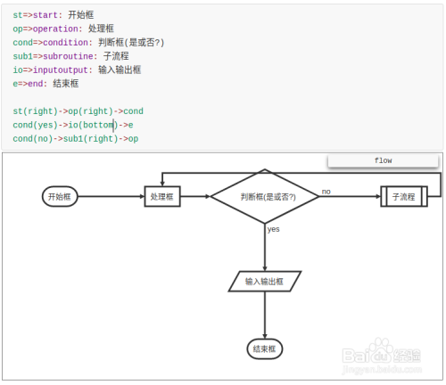
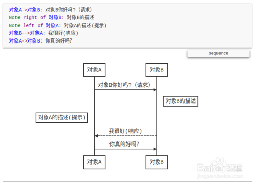
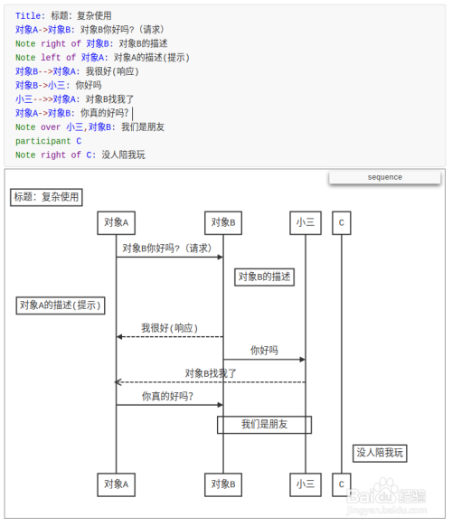
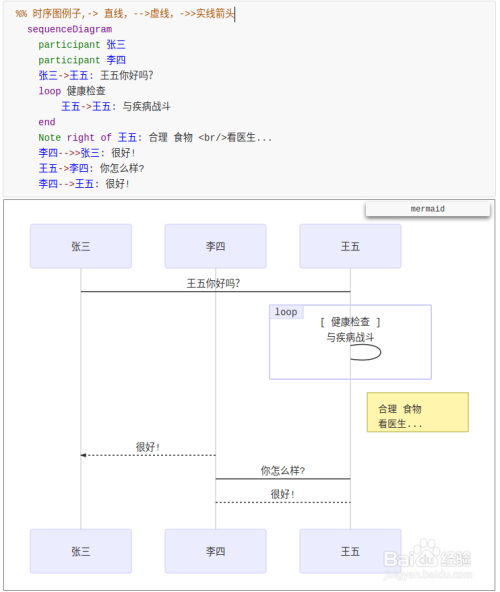
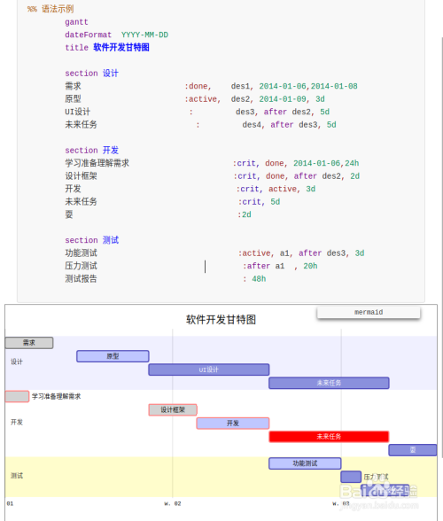

# 一级标题，＃号空格


+ 无需列表，+空格
  + asdf
    + sdfsadf
      + sfddsf


1. 有序列表，1加英文点.

   **加粗前后俩*号**`Ctrl B`

   *斜体前后一星号*

   ***加粗斜体前后三星号***

   > 文字说明，大于号空格

   [超链接文字用中括号后面跟（放链接）](https://www.baidu.com)：`Ctrl K`

   插入图片：`Shift Ctrl I`
   
   

```python
print("hello 代码···python回车")
```

`不编译*用两个反*引号框起来,就是ESC下面的键`

~~删除线~~

<u>下划线</u>：`Ctrl U`

==高亮==

这是^上标^：`^上标内容^`

这是~下标~：`~下标内容~`

插入表格：`Ctrl T`

| adfa   | adfadf | afdafd |
| ------ | ------ | ------ |
| adfadf | afdaf  | afdaf  |

引用：`Shift Ctrl Q`

> sdfaf
>
> > adfaf
> >
> > > adfaf
> > >
> > > > adfdaf

分割线`---`

---

- [ ] 任务列表：`空格-空格[空格]空格`

注释[^1]:`[^注释内容]`

emoji图标：`:up等`:arrow_up:

目录生成：`[toc]`

[toc]

```flow

```

### 思维导图

```
​```mermaid

graph LR

A[方形] -->B(圆角)

    B --> C{条件a}

    C -->|a=1| D[结果1]

    C -->|a=2| E[结果2]

    F[横向流程图]

​```
```



```
​```mermaid

graph TD

A[方形] -->B(圆角)

    B --> C{条件a}

    C -->|a=1| D[结果1]

    C -->|a=2| E[结果2]

    F[竖向流程图]

​```
```



```
标准流程图源码格式：

​```flow

st=>start: 开始框

op=>operation: 处理框

cond=>condition: 判断框(是或否?)

sub1=>subroutine: 子流程

io=>inputoutput: 输入输出框

e=>end: 结束框

st->op->cond

cond(yes)->io->e

cond(no)->sub1(right)->op

​```
```



```
标准流程图源码格式（横向）：

​```flow

st=>start: 开始框

op=>operation: 处理框

cond=>condition: 判断框(是或否?)

sub1=>subroutine: 子流程

io=>inputoutput: 输入输出框

e=>end: 结束框

st(right)->op(right)->cond

cond(yes)->io(bottom)->e

cond(no)->sub1(right)->op

​```
```



```
UML时序图源码样例：

​```sequence

对象A->对象B: 对象B你好吗?（请求）

Note right of 对象B: 对象B的描述

Note left of 对象A: 对象A的描述(提示)

对象B-->对象A: 我很好(响应)

对象A->对象B: 你真的好吗？

​```
```



```
UML时序图源码复杂样例：

​```sequence

Title: 标题：复杂使用

对象A->对象B: 对象B你好吗?（请求）

Note right of 对象B: 对象B的描述

Note left of 对象A: 对象A的描述(提示)

对象B-->对象A: 我很好(响应)

对象B->小三: 你好吗

小三-->>对象A: 对象B找我了

对象A->对象B: 你真的好吗？

Note over 小三,对象B: 我们是朋友

participant C

Note right of C: 没人陪我玩

​```
```



```
UML标准时序图样例：

​```mermaid

%% 时序图例子,-> 直线，-->虚线，->>实线箭头

  sequenceDiagram

    participant 张三

    participant 李四

    张三->王五: 王五你好吗？

    loop 健康检查

        王五->王五: 与疾病战斗

    end

    Note right of 王五: 合理 食物 <br/>看医生...

    李四-->>张三: 很好!

    王五->李四: 你怎么样?

    李四-->王五: 很好!

​```
```



```
甘特图样例：

​```mermaid

%% 语法示例

        gantt

        dateFormat  YYYY-MM-DD

        title 软件开发甘特图

        section 设计

        需求                      :done,    des1, 2014-01-06,2014-01-08

        原型                      :active,  des2, 2014-01-09, 3d

        UI设计                     :         des3, after des2, 5d

    未来任务                     :         des4, after des3, 5d

        section 开发

        学习准备理解需求                      :crit, done, 2014-01-06,24h

        设计框架                             :crit, done, after des2, 2d

        开发                                 :crit, active, 3d

        未来任务                              :crit, 5d

        耍                                   :2d

    

        section 测试

        功能测试                              :active, a1, after des3, 3d

        压力测试                               :after a1  , 20h

        测试报告                               : 48h

​```
```



# Typora修改样式

1. 进入typora当前主题文件夹C:\Users\...\AppData\Roaming\Typora\themes
2. 打开主题css文件，比如"github.css"
3. 修改样式

### 修改引用样式

```css
blockquote {
    border-left: 4px solid #3D9140;
    padding: 8px 15px 8px;
    color: #333333;
    background-color: #F5F5F5;
}

# 原样式
blockquote {
    border-left: 4px solid #dfe2e5;
    padding: 0 15px;
    color: #777777;
}
```


