# 教程

1. 高等数学，P142完结

https://www.bilibili.com/video/BV1Eb411u7Fw?t=2&p=54

2. 线性代数，P42完结

https://www.bilibili.com/video/BV1aW411Q7x1

3. 概率论与数理统计，P61-未（下面不容易懂，脑子清楚的时候看）

https://www.bilibili.com/video/BV1ot411y7mU?p=61

# 符号

α：Alpha，音标bai /ælfə/，中文读音为“阿尔法”

β：beta，音标/'beitə/，中文读音为“贝塔”

δ：delta，音标/'deltə/，中文读音为“得尔塔”

ε：epsilon，音标/ep'silon/，中文读音为“艾普西隆”

η：eta，音标/'i:tə/，中文读音为“伊塔”

θ：theta，音标/'θi:tə/，中文读音为“西塔”

ξ：xi，音标/ksi/，中文读音为“克西”

μ：mu，音标/mju:/，中文读音为“谬”

λ：lambda，音标/'læmdə/，中文读音为“拉姆达”

ρ：Rho，读作[rəʊ]，中文音译：柔

σ：sigma，中文音译：“西格玛”

+ 任意


+ 存在


+ 连乘


# 公式

### 球面积

$$
球面积：V=$\frac{4}{3}$πr^2
$$

 

### sinx比ax的极限


### 一元二次方程求解

$$
ax^2＋bx＋c=0
$$

$$
解：x=\frac{-b\pm\sqrt{b^2-4ac}}{2a}
$$

### 其他公式1


### 二阶行列式


### 克莱姆法则Cramer

方程的个数等于未知量的个数


+ 齐次方程


### 雅可比行列式


### 椭圆面积


### 圆锥的体积

v = 1/3sh

### 球的体积

v = 4/3πr^3^

### 球的面积

s = 4πr^2^

### 向量的力做功功率


# 定理

### 两线相垂直，斜率积为-1


### 关于y=x对称函数的对称两点，斜率积为1

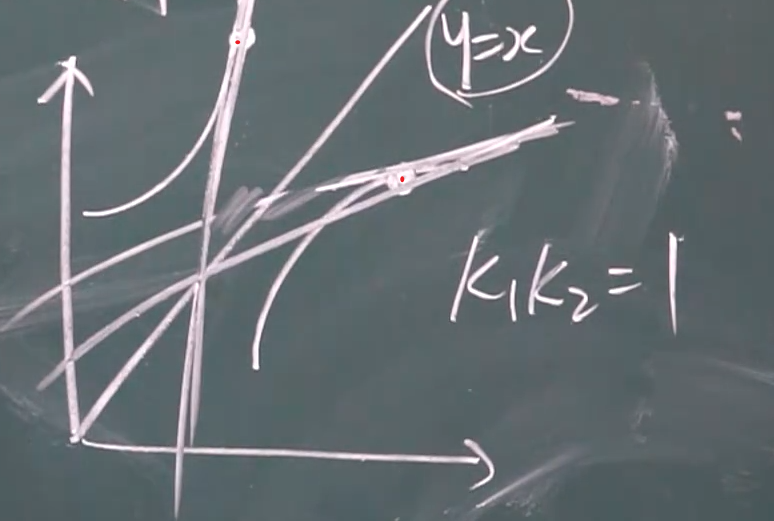

### 函数的导数等于此函数的反函数的导数分之1


### 导函数存在定理

原函数连续且光滑

### 原函数存在定理

导函数连续

# 补充

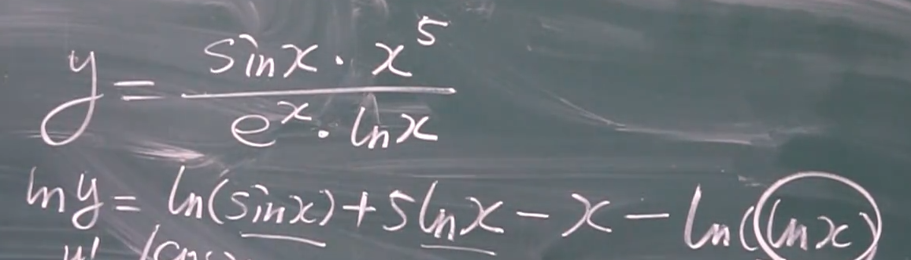


# 三角函数

sin^2^=1 - cos^2^


sinα = 对边/斜边   （直角三角形）

cscα = 1/sinα		余割


cosα = 临边/斜边   （直角三角形）

secα = 1/cosα		正割


tanα = 对边/邻边   （直角三角形）

tanα=sinα/cosα

cotα=cosα/sinα

cotα = 1/tanα

```
y = arcsinX
X = sinT
则 Y = T
```


对角公式


# 象限

1. 共四个象限
2. x轴下面第二第三象限为负数

α属于第三象限（为负）

# 阶乘

```
4! = 4*3*2*1
```

# ==离散数学==

### 教程

https://www.bilibili.com/video/BV1cs411H7sz

### 符号

+ 析取：v  （或）
+ 合取：∧ （与）

### 等价公式P11


### 范式

 


### 极小项、极大项


 

### 真值表技术


### 解题方法


### 推理定律-基本蕴涵关系


### CP证明法


### 间接证明法（反证法，归谬法）


### 个体域（P16）


### 谓词


### 四类符号


### 合式公式


### 自由变元、约束变元


### 闭式


### 谓词的基本等价公式


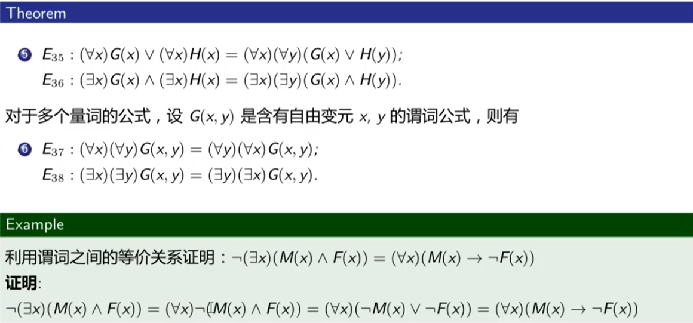

### 前束范式

量词


### 推理定律


### 全称量词消去规则(US)


### 存在量词的消去规则(ES)


### 全称量词的推广规则(UG)

+ 用来定量


### 存在量词的推广规则（EG）

+ 用来定量


## 关系

### 序偶


### 笛卡尔积


### 前域、后域、二元关系


### 对称性、反对称性(P32)


### 传递性


### ==总结：关系性质的判定方法==

自反性、反自反性、对称性、反对称性、传递性


### 保守性


### 关系的闭包 

+ 自反闭包	r(R)
+ 对称闭包    s(R)
+ 传递闭包    t(R)


### 等价关系-==分类==(P35)


### 等价类

### 商集

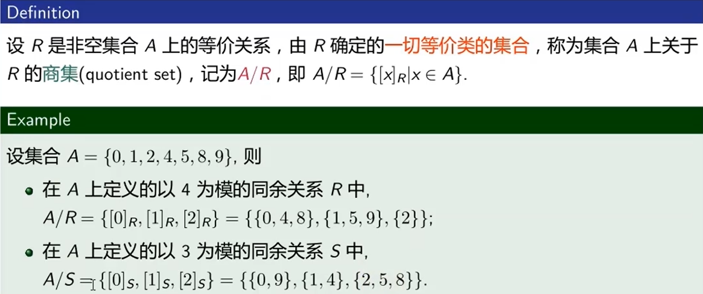

### 集合的划分


### 偏序关系-==排序==


### 哈斯图


### 极大元、极小元


### 拟序关系


### 全序关系、线序关系、链


### 良序关系


### 总结：关系

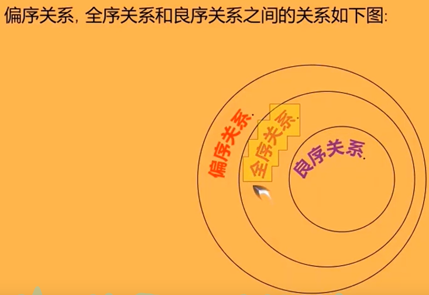

## 函数

### 函数的类型

单射、满射、双射


### 函数的运算

## 图论

### 图的定义


### 图的表示


### 赋权图

+ 边好节点都有权值


### 图的综合分类


### 子图

子图、真子图、生成子图、导出子图


### 完全图


### 补图


### 补图的邻接矩阵


### 通路、回路


### 通路数量求解

​	

### 联通分支


### 点割集、割点


### 边割集、割边


### 有向图的连通性


### 有序、k元树


### 满k元树的性质


### 最优树


### 哈夫曼算法


### 欧拉图


### 无向欧拉图的判定


### 有向欧拉图的判定


### 哈密顿图


### 偶图


# ==高等数学==

# 微积分


# 实数

包括有理数和无理数

1. 有理数：整数、分数、无线循环小数
2. 无理数：值等于无线不循环小数，包括根号数

# 集合


## 集合的运算


# 区间

区间就是特殊的集合


# 对数


# 极限


==a为极限==

# 反函数

关于x=y对称即为**反函数**


# 反三角函数

##### Y = sinX

```
Y = sinX
Y = arcsinX 	互为反函数
```


##### Y = cosX


##### Y = tanX


##### Y = cotX


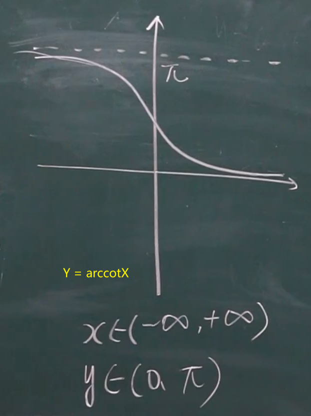

# 双曲函数？？？

# 无穷小无穷大

##### 无穷小

1. 趋于0即是无穷小，不是-1000...
2. 0是无穷小
3. 无穷小 + 或 - 或 * 无穷小，结果都为无穷小
4. 无穷小/无穷小，结果不一定为无穷小，要看谁趋于0的速度快
5. 常数*无穷小，结果为无穷小

##### 无穷大∞

1. ​	+∞，-∞都是无穷大
2. ​    ∞*∞是无穷大，+，-，/都不一定
3. ​    常数*∞，不一定为无穷大

# 极限存在准则

##### 夹逼准则


##### 重要极限1


​	

##### 准则二

e

单调有界数列必有极限


​																						||


# 无穷小的比较


定理2： 1. 两个无穷小比的极限时，分子分母可以用等价无穷小替换

			   2. 分子或分母是若干因子的乘积，可对其中1个或几个因子做等价无穷小的替换

***

==无穷小*有界函数 = 无穷小==

# 连续性与间断点

##### 连续性


##### 间断点

可去间断点

无穷间断点

跳跃间断点


##### 闭区间上连续函数的性质


#  导数

==函数的图光滑、连续==

可导一定连续

连续不一定可导


## 导数的表达形式


## 例（重要）


==***通过例子得==

==***三角函数求导==

==***==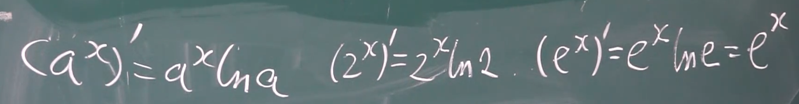

==***==


## 单侧导数


## 求导法则（和差积商）

 

##### 例子

 

## 三角函数求导***

 


## 函数的导数等于此函数的反函数的导数分之1


## 复合函数求导（洋葱法则）

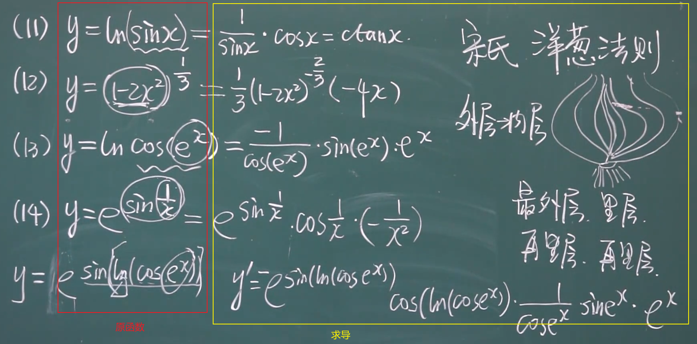

## ==导数公式==

y=6x的导数是6


## 高阶导数


## 隐函数求导


# 法线

X的法线是-1/X     (负的倒数)


 

# 微分

可微的条件：可微<=>可导


## 复合函数的微分


dy= 函数的导数*dx

## 公式

##### 当遇到左边的求微分，可以用右边的代替。差距很小


## 微分中值定理

#### 罗尔定理


#### 拉格朗日中值定理


#### 柯西中值定理


# 洛必达法则（一般要多次求导）


#### 定理1


**例**


#### 定理2


# 泰勒公式（需回顾P34）


### 马克劳林


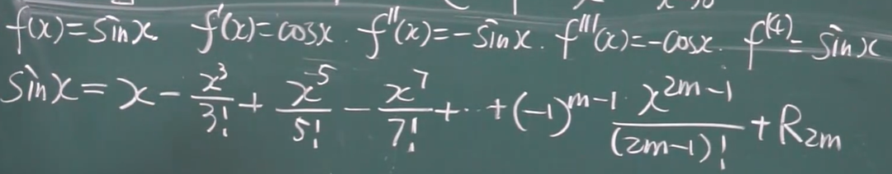


# 函数图形的描绘


##### 例


# 不定积分

定义：求原函数的全体


### 几何含义

一组平行的曲线族

### 不定积分的性质


**性质列子**


## 积分表


## 第一类换元积分法(凑)


==dx，d的里卖弄可以任意加减常数==

**例子**


## 第二类换元积分法


### 转换公式技巧


**例**


## 分部积分法

### 公式


### 死记硬背


**例子**


## 有理函数积分


**例子**


# 定积分

### 定义


### 几何意义


### 矩形法


### 梯形法


### 抛物线法，不考虑

### 定积分性质


定积分中值定理（）


## 微积分

### 积分上限函数


#### 定理


### 公式


**例子**


## 牛顿莱布尼茨公式


**例**


## 定积分换元法

将x替换，带进去


**例子**


！！！


## 定积分的分部积分


**例子**


## 无穷限的反常积分


## 无界函数的反常积分


## 伽马函数


## 定积分的应用


判断用X为变量的函数还是Y为变量的函数↓


组合图形求积分，看每段谁在上面谁在下面↓


### 旋转体体积


### 平面曲线的弧长P59？？？

# 微分方程


### 可分离变量的微分方程


**例子**


### 齐次方程

可化为齐次方程：x的次方*y的次方（x的次方+y的次方的和在每处都相等）


### 一阶线性微分方程


### 伯努利方程


### 可降阶的高阶微分方程


### 常系数齐次线性微分方程

# 向量代数与空间解析几何

### 向量及线性运算

##### 向量


##### 运算


### 空间直角坐标系


**例子**


### 向量模（两点距离）


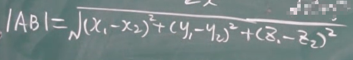

### 方向角（方向余弦）


**例子**


### 投影


##### 性质


### 数量积

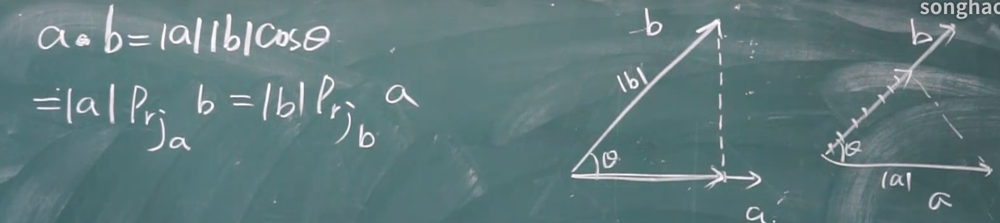


### 向量积

 


 


### 余弦定理


### 平面及其方程


### 平面的一般方程


 

### 两平面的夹角


### 空间直线及其方程

两平面相交即为一条空间直线


### 两直线的夹角&直线与平面的夹角

 

# 曲面

## 空间曲线及其方程


## 旋转曲面

 沿着什么轴旋转，什么轴就不动

## 二次曲面


==沿Y轴伸缩2倍，y就取1/2y（几倍的倒数）==


 

## 曲面及其方程


## 柱面


# 多元函数

### 平面点集


### 邻域


### 内点、外点、边界点、聚点


### 开集、闭集、连通集


### 区域、闭区域


### 有界集、无界集


### n维空间


### 多元函数的极限


以任意不同方式逼近，极限不相等，则此点极限不存在


# 偏导数（多元函数求导）

对x的偏导数


对y的偏导数

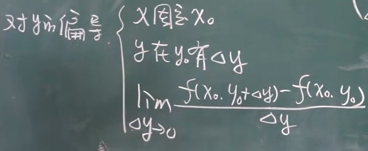


## 求偏导


## 偏导几何含义


## 多元复合函数的求导法则


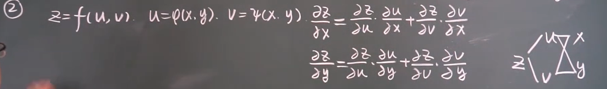


**例子**


## 隐函数的求导公式

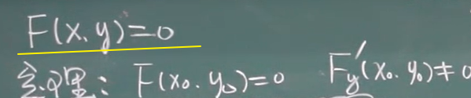


**例子**


## 一元向量值函数及其导数

### 极限


### 求导法则


## 空间曲线的切线与法平面


**例子**


## 曲面的切平面与法线


**例子**


## 方向导数


### 定理


## 多元函数结论


## 梯度

这一点，它的方向导数取最大值的方向。方向就是梯度方向

梯度方向就是等值线在这一点的法线方向


梯度方向就是等值线在这一点的法线方向


**例子**


# 多元函数的极值


驻点


**例子**


# 数量场、向量场


# 多元函数的最值


# 条件极值、拉格朗日乘数法


**例子**


# 二重积分

即：求曲顶柱体的体积


## 定义


## 二重积分的性质


## 二重积分的计算(直角坐标系)


**例子**


## 极坐标

### 线


### 面


## 二重积分(极坐标)


**例子**


## 二重积分换元法


### 什么时候换元


# 三重积分

## 三重积分的定义


## 三重积分计算（直角坐标系）

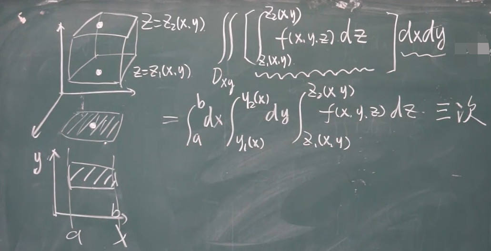

# 柱面坐标


# 球面坐标


# 重积分的应用

### 曲面的面积


### 球质心


### 求转动惯量


### 求引力


# 曲线积分

### 对弧长的曲线积分


### 曲线积分的计算


### 对坐标的曲线积分


### 对坐标的曲线积分计算


### 两类曲线积分的联系

# 格林公式

### 格林公式的定义和性质


定理

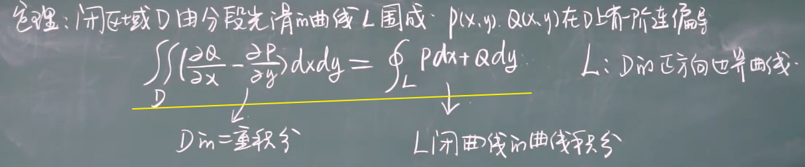

### 格林公式的计算


**例子**


# 常数项级数

#### 目的：

1. 看级数是收敛的还是发散的
2. 和是多少


#### 性质


# 调和级数


# 等比级数

==-1 < x < 1==


# 正项级数


定理


比较收敛法改进


**列子**


根值审敛法(柯西判别法)


# 交错级数


莱布尼茨定理


# 任意项级数


 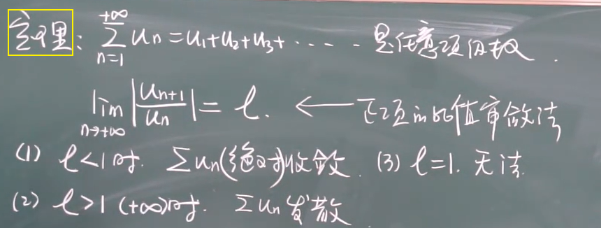

# 幂级数

**目的**

1. 在什么区域上收敛
2. 和函数是什么


收敛半径

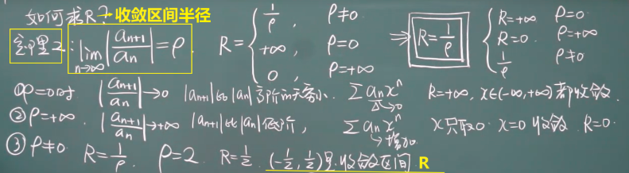

**例子**


**幂级数的运算**


**例子**


# 函数展成幂级数


泰勒级数↑

麦克老林展开式↓


**公式**！！！


# ==线性代数==

# 排列


逆序数


偶排列：N等于偶数

奇排列：N等于奇数


对换


#### 定理


# n阶行列式


+ 3阶行列式


### 定义

+ 第一种定义


例子


+ 第二种定义


+ 第三种定义

只考正负号


例子

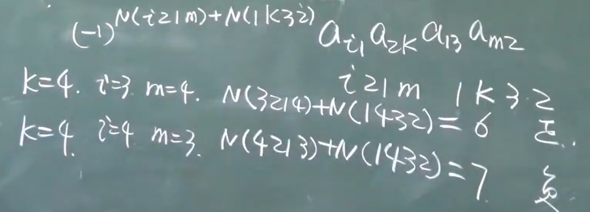

### 性质

+ 转置


+ 例子


### 行列式按行(列)展开

+ 余子式M


+ 代数余子式A


+ 按行(列)展开    --降阶


例子↑


### 异乘变零定理


### 拉普拉斯定理

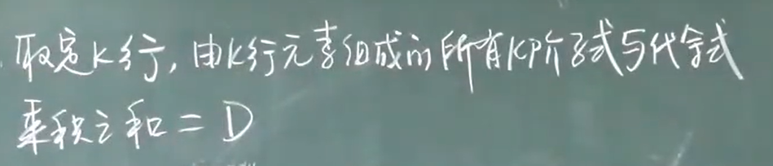

+ 子式、余子式


例子


### 行列式相乘定理

同阶行列式才能用此定理


例子


### 行列式的计算

化成上三角，再计算

+ 三叉型行列式计算


+ 范德蒙德行列式


例子↑


+ 反对称行列式


+ 对称行列式


# 矩阵

### 定义


### 矩阵、行列式区别


### 各种矩阵

两个矩阵相等的前提必须是同型矩阵（除了0矩阵）


### 矩阵运算


+ 乘法


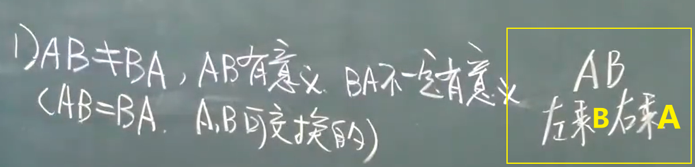


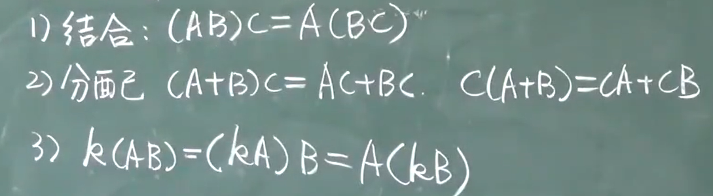

例子


+ 幂运算

A必须是方阵


+ 转置


### 特殊矩阵

+ 数量矩阵


+ 对角型矩阵


+ 对称矩阵


例子


+ 反对称矩阵


### 逆矩阵

用初等变换法求逆矩阵


不要把矩阵放在分母上


+ 方阵的行列式


例子


+ 伴随矩阵

只要方阵才有伴随矩阵


+ 如何判断可逆？


例子


### 矩阵方程


+ 性质


### 分块矩阵

+ 概念


+ 标准型


+ 分块计算


例子


+ 分块矩阵求转置


### 初等变换

+ 本质
  + 对矩阵的变化
+ 行、列变换，用→相连


+ 定理


+ 等价


### 初等方阵

1. 三种初等方阵均可逆
2. 其逆矩阵也是初等方阵
3. 初等方阵的转置也是初等方阵


例子

1. 左乘相当于行变换
2. 右乘为列变换

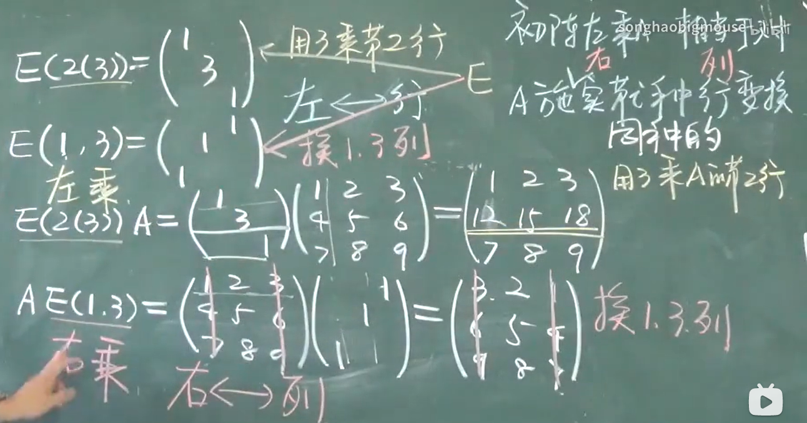

+ 定理3

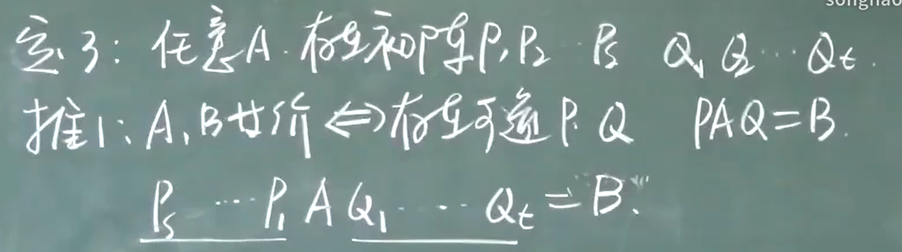

+ 定理4


+ 定理5


+ 初等行变换法

==求逆矩阵！！！==

只做行变换


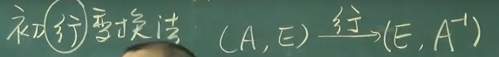

例子

左边化不成单位矩阵，说明A不可逆


### 矩阵的秩

+ 定义


+ 定理


+ 秩的性质


### 阶梯型矩阵！！！


### 行简化阶梯型！！！


# n维向量及其运算

+ n维向量定义


### 向量间的线性关系


+ 定理


例子


#### 向量组的等价


#### 线性相关与线性无关


+ 结论


#### 定理


### 向量组的秩

+ 极大线性无关组（秩）


+ 秩的数量


+ 行秩与列秩


+ 如何求极大线性无关组
  + 化成行简化阶梯型


# 线性方程组


+ 增广型矩阵


+ 方程组中m,n的含义


+ 解线性方程组的方法


例子


### 齐次线性方程组的解


例子


### 方程组解的结构

#### 齐次方程组的解的结构

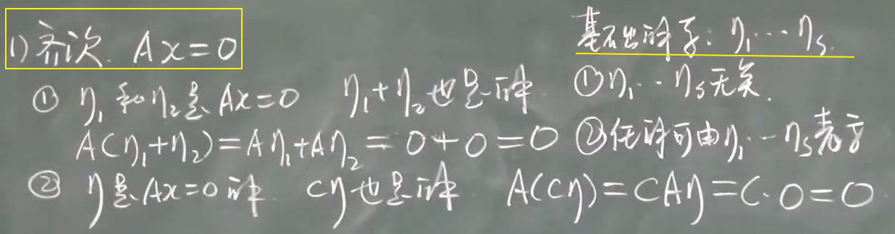

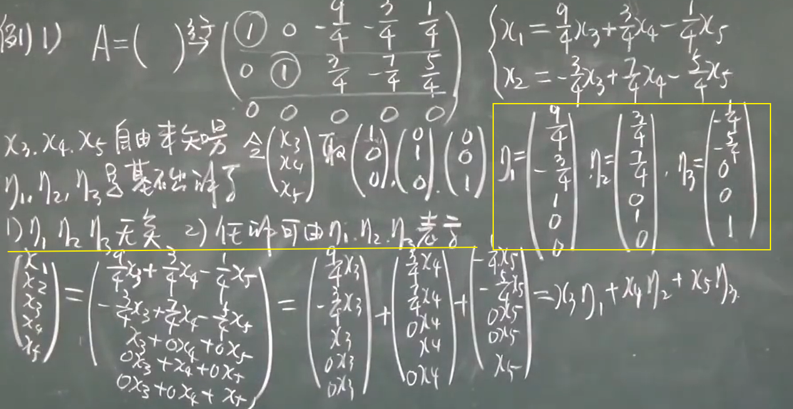


+ 秩的结论，其中一个


#### 非齐次方程组的解的结构


+ 非齐次方程组的解的结构，解题步骤


# 矩阵的特征值与特征向量（方阵）

==Aα = λα==

+ 目的
  + 求特征值λ
  + 求特征向量α
+ 定义


+ 如何解

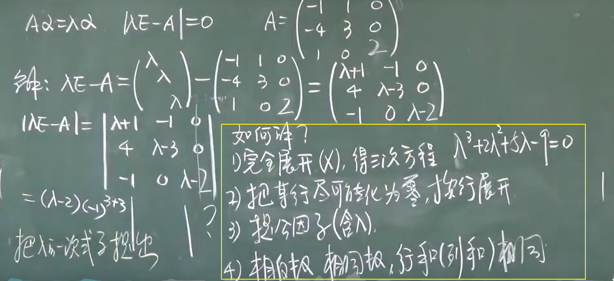

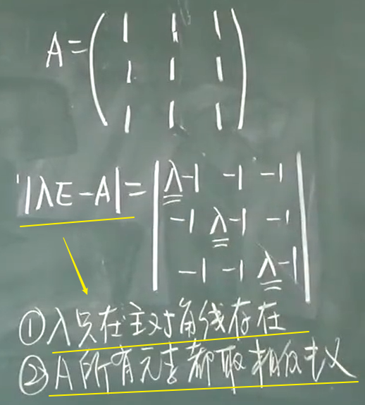

+ 标准阶梯步骤


### 特征值与特征向量的性质


+ 性质


例子


### 相似矩阵、可对角化的条件

#### 相似


性质


#### 对角型


例子


### 实对称矩阵的对角化

#### 内积


+ 性质（内积）


#### 长度（范数，摸）


+ 单位向量


+ 性质


 

#### 正交（垂直）


#### 正交向量组

不含零向量


#### 标准正交向量组


+ 定理


#### 施密特正交化


#### 正交矩阵


+ 性质


+ 定理


#### 实对称矩阵的对角化

+ 定理


+ 正交相似


+ 单位化（向量）


+ 例子


# 二次型

### 定义


### 二次型转化成矩阵表达式

+ 二次型→矩阵表达式


+ 矩阵表达式→二次型


### 线性替换


### 合同


+ 性质


### 化二次型为标准型（配方法）


### 化二次型为标准型（初等变换、正交替换）


#### 初等变换法，例子


#### 正交替换法


## 规范型

系数先是1，1，1...再-1，-1，-1...再是0...

y下标必须依次递增


# 矩形关系总结


# ==概率论与数理统计==

# 一、

# 随机试验与随机事件

随机试验


事件


# 样本空间


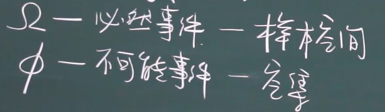

# 事件间的关系

### 包含


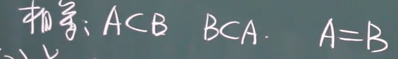

### 并（和）


### 交（积）


### 差


### 无限可列个


### 互不相容事件


### 对立事件


### 逆事件


### 完备事件组


### 运算律


### 例子

1

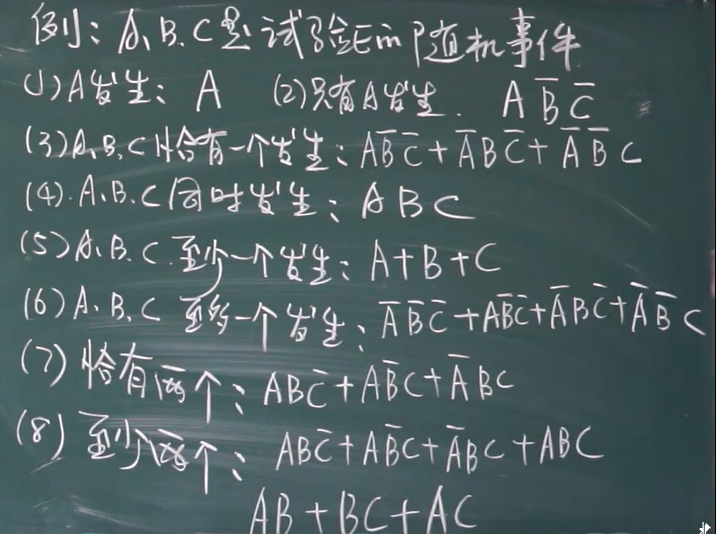

2


# 事件的概率P

### 概率


# 古典概率模型

+ 条件


+ 公式


### 排列组合


### 不重复排列

+ 排列


+ 全排列


### 重复排列


#### 组合


### 古典性质


# 几何概率模型


例子


# 频率与概率


+ 性质


# 公理化


+ 性质


# 条件概率

### 定义


### 方法


# 乘法公式


例子


# 全概率公式


# 贝叶斯公式

+ 目的
  + 知道结果推原因
  + 求每个原因的大小


# 事件的独立性

+ 定义


+ 定理

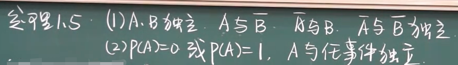

### 三个事件独立


例子


# 伯努利模型

结果只有两种

+ 目的

  求n重伯努利


+ 定理、公式


+ 例子


# 二

# 随机变量

+ 定义


# 离散型随机变量及其概率分布

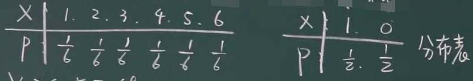


+ 例子


# 连续性随机变量及其概率密度函数


频率/组距


### 概率密度函数


# 分布函数

### 离散、连续型的分布函数

+ 定义


+ 性质


+ 公式


### 例子（离散型）

+ 例1


+ 例2


+ 例3


### 分布函数求概率（离散型）


### 例子（连续型）


+ 例1


+ 例2


# 分布

### 所有分布的两个函数

1.  f(x) ：密度函数
2. F(x)：分布函数

### 0-1分布

1. ==两种结果==
2. 试验只做一次


+ 例子


### 几何分布（首次发生）

==第k次首次发生==


+ 例子


### 二项分布

==n次试验，发生了k次==


+ 定义


+ 例1


### 泊松分布

==λ = n * P==

1. 离散型
2. K取0，1，2，3，4...等


+ 例1


+ 例2


### 超几何分布


+ 定义


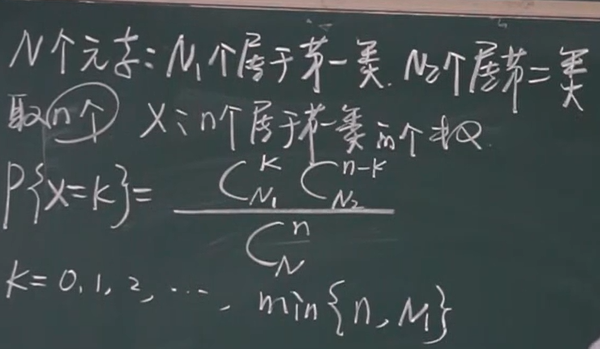

+ 例子


### 均匀分布

+ 定义


+ 例子


### 指数分布

+ 定义


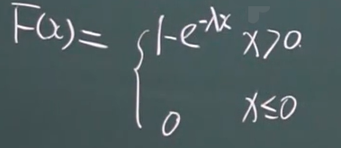

+ 应用场景
  + 服务时间
  + 寿命

+ 例1


### 正态分布（高斯分布）

+ 定义


+ 性质


### 标准正态分布

+ 定义


+ 性质


x>5和x<-5，看做密度函数等于0

x<-5，看做分布函数等于0,x>5，看做分布函数等于1

#### 正态分布化成标准正态分布


+ 例1


+ 例2


#### 上α分位数

+ 定义


# 三

# 随机变量函数的分布

+ 定义

  用随机变量X，构造的函数Y，函数Y的分布


### 离散型  随机变量函数的分布


### 连续型  随机变量函数的分布


+ 定理


+ 例子


# 二维随机变量及其分布函数


### 分布函数


+ 结论


### 边缘分布函数


# 二维离散型的联合分布及其边缘分布

### 联合分布


### 边缘分布（离散型）


# 二维连续型的联合分布及其边缘分布

### 联合分布函数

+ 定义


+ 性质


+ 例1


### 边缘密度函数（连续型）


+ 例子


+ 结论


# 条件分布


### 离散型的条件分布


### 连续型的条件分布

+ 定义


# 随机变量的独立性

+ 定义


### 二维离散的独立性

+ 判断

  有一个不等于，就不是独立 


### 二维连续的独立性

+ 判断

  不符合下面的等式，就不是独立


+ 例子


# 二维随机变量函数的分布

### 二维离散型随机变量函数的分布

+ 例1


+ 例2


+ 泊松分布


### 二维连续型随机变量函数的分布


+ 卷积公式1


+ 卷积公式2


+ 例子


# 四

# 数学期望（有点平均的意思）


### 离散型随机变量的数学期望

+ 定义


+ 例子


### 连续型随机变量的数学期望

+ 定义


+ 例1


+ 例2


# 随机变量函数的期望


+ 例子


### 二维变量函数的期望

+ 定义


+ 例子


# 数学期望的性质


+ 例子


# 条件期望


### 离散条件期望


+ 例子


### 连续条件期望


# 方差

+ 定义

  偏离程度

  标准差


+ 公式


+ 例1


+ 例2


### 方差的性质


# 常见离散型的期望与方差

### 0-1分布的期望与方差


### 二项分布的期望与方差


 

### 几何分布的期望与方差


### 泊松分布的期望与方差


# 常见连续型的期望与方差

### 均匀分布


### 指数分布


### 正态分布


# 所有分布总结！！！


# 协方差

### 定义


+ 例子


### 性质


+ 标准化


# 相关系数（线性关系)

+ 定义


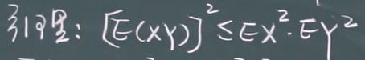

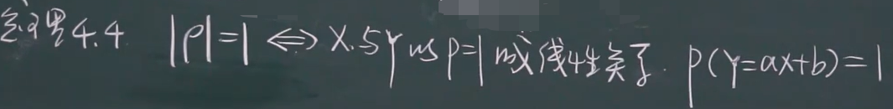


# 中心矩与原点矩

### 原点矩


### 中心矩


# 五

# 大数定律


### 切比雪夫不等式

+ 定理


+ 例


### 切比雪夫大数定律


+ 定理


### 伯努利大数定律

次数够多，频率逼近概率


### 辛钦大数定律


# 中心极限定理


+ 定理


+ 例子


# 六

# 总体与样本


# 统计量


# 常用统计量


+ 定理


# 抽样分布？？？

### 卡方分布？？？？？？？？？？？？？？？？？？？？？？


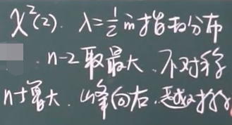

+ 定理


+ 上α分位数


### t分布

+ 定理


+ 上α分位数


### F分布


+ 例子


