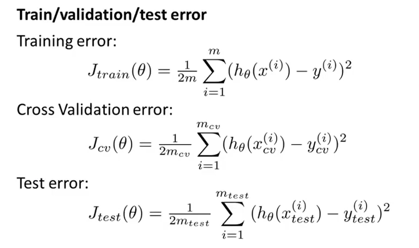
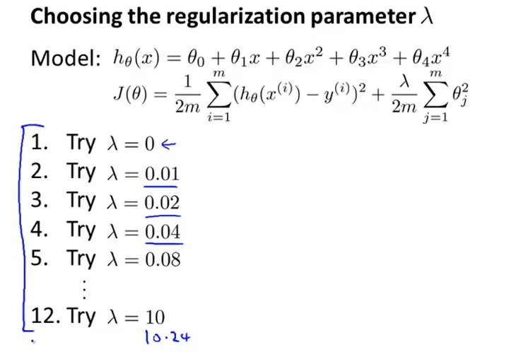

# 教程

1. 吴恩达

   https://www.bilibili.com/video/BV164411b7dx?p=6&spm_id_from=pageDriver

   P59未,建议学完高数，线性代数，概率论与数理统计重新看

   回顾：P51-53，P73，P83-87（PCA）

2. 李宏毅

   https://www.bilibili.com/video/BV1JE411g7XF?t=927

   讲的有意思，P8未

# 软件

1. pytorch

   1. 卸载python

   2. 安装anaconda(查看GPU算力Geforce RTX2060 7.5)，安装后配置环境

      1. https://repo.anaconda.com/archive/ 

         （anaconda下载地址）

         ```
         //成功选项
         Anaconda3-5.2.0-windows-x86 64.exe
         
         ```

      //成功选项
         详见网址
      https://blog.csdn.net/ziqingnian/article/details/109099682

         ```
      
         ```

   3. 进入“Anaconda Prompt”，输入“python”回车查看版本,比如3.8.5版本。

   4. 输入“conda create -n pytorch python=3.8”,回车创建pytorch环境用来安装pytorch。输入“y”确定安装

   5. 输入“conda activate pytorch”进入环境。

   6. 输入“pip list”,查看是否有pytorch.没有则进行下一步。

   7. 进入“https://pytorch.org”，选择自己的安装配置（打开NVIDIA控制面板，点击 帮助——系统信息——组件，可以看到cuda支持版本，可兼容低版本cuda），复制安装命令。如：“conda install pytorch torchvision torchaudio cudatoolkit=10.2 -c pytorch”

   8. 在“Anaconda Prompt”窗口，pytorch环境下，黏贴上一步命令回车，输入"y"，安装。（如果安装过慢，考虑离线安装pytorch包和cudatoolkit包）(或者考虑清华源安装)

      ```
      //成功选项
      详见网址
      https://blog.csdn.net/ziqingnian/article/details/109099682
      ```

      

2. 安装后，在pytorch下输入“pip list”,查看是否有“torch”，有则进行下一步

3. 在pytorch环境下，输入“python”回车，再输入“import torch”

   4. 输入“torch.cuda.is_available()”，返回Ture则说明支持GPY

5. 安装Jupyter

   1. 在pytorch环境下，输入“conda install nb_conda”回车
   2. 输入“y”回车
   3. 安装完后输入“jupyter notebook”回车
   4. 在弹出网页右上角选择“New”,选择“Python [conda env:pytorch]”
   5. 弹出网页中“输入import torch”，按“shift+回车”（运行且跳转到下个代码块）

6. pycharm：setting-python interpreter,设置为C:\Users\zhonghua.deng\Anaconda3\python.exe

   1. https://www.jetbrains.com/zh-cn/pycharm/download/#section=windows （pycharm下载地址）

7. tensorflow

# Jupyter项目创建

1. 打开anaconda prompt
2. conda activate pytorch
3. jupyter notebook

# 注意点

```
//anaconda base环境中已安装项目列表
conda list
```

```
//anaconda pytorch环境中列表
pip list
```

| 功能 | 命令              |
| ---- | ----------------- |
| 打开 | dir(pytorch.3)    |
| 查询 | help(pytorch.3.a) |
|      |                   |

# 加载数据

Dataset：

1. 提供一种方式去获取数据及其label
2. 告诉我们总共有多少数据

Dataloader

1. 为后面的网络提供不同的数据形式

# 函数

### 假设函数、代价函数


### 损失函数Cost Function

### 梯度下降

+ 损失函数


+ 遍历每个系数，进行减少


+ 一个参数


+ θ0、θ1的偏导的梯度下降


+ ==θ下标大于等于1！！！==


#### 学习率α


### 线性回归


### 归一化

将特征缩小到相似的范围


### 正规方程


### 逻辑回归


逻辑回归损失函数


==逻辑回归最终损失函数==


### 正则化

1. 为了减少某些特征值的影响（通过减小特征值系数θ的大小）
2. 放置曲线过度弯曲（过拟）


#### 自从选择λ


θ越来越小

### 回归的正则化


### 反向传播算法


### 梯度检测

### sigmoid函数


### 交叉验证误差



### 多变量高斯分布


### 常见优化函数

+ RMSprop


### Relu激活函数


# 准确率、召回率

+ 临界值F1


# 判断误差原因

### 偏差和方差


### λ


+ 如何选择λ




### 高偏差、高方差


### 误差越来越大


# 神经元


### 代价函数

+ k代表所有输出中第k个输出


# 看曲线


# 如何调参


# 解决过拟合

### 1. 增加训练数据

### 2. 正则化

### 3. Dropout

类似随机森林


# 建立模型步骤

1. 首先在短时间内建立大概模型
2. 再根据误差决定是否要修改（偏差、方差）
3. 画图
4. 通过检查错误，来判断和启发


