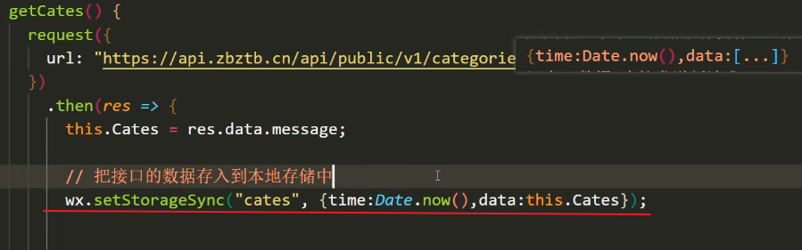
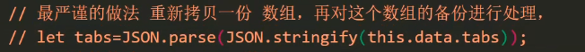
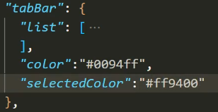
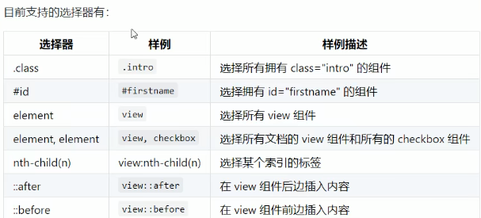
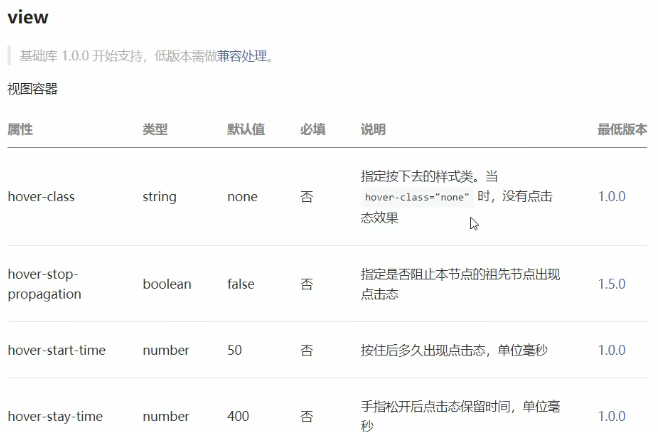
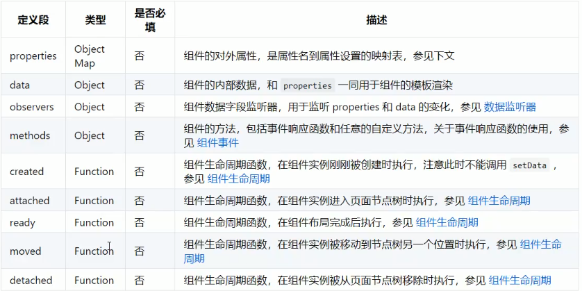
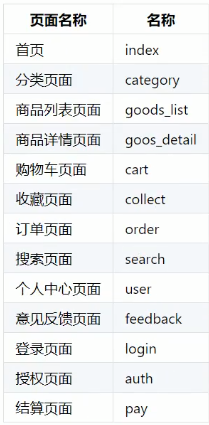
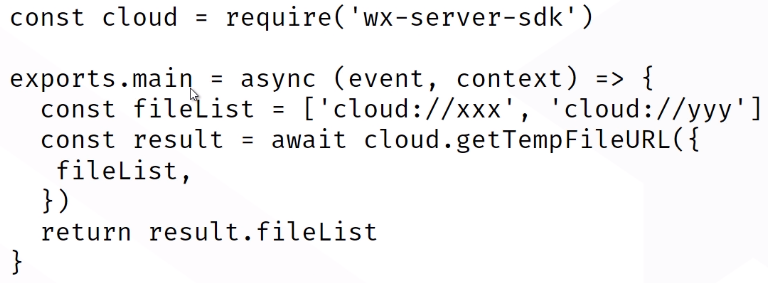
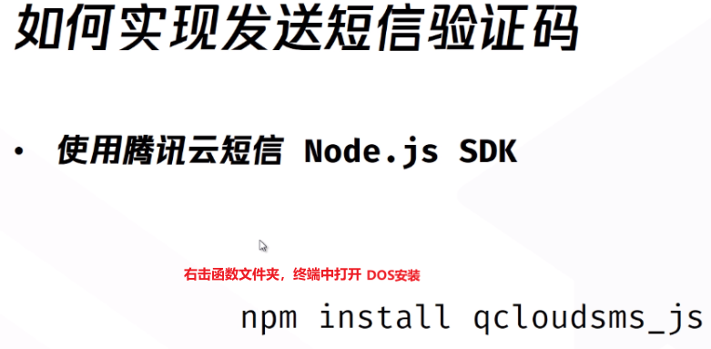
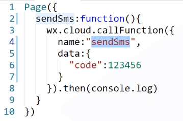

# 教程

https://www.bilibili.com/video/BV1nE41117BQ

(完成)

https://www.bilibili.com/video/BV1YJ411W7YA

（P92-P109)

https://www.bilibili.com/video/BV1Kt41177EH

（主要讲云开发，云函数）


# 工具

## 微信开发者工具

https://developers.weixin.qq.com/miniprogram/dev/devtools/download.html

appleid: wx256bed9d5acb3d8c


## VSCode

插件：

小程序开发助手

easy less    #设置见：样式WXSS-使用less

# iconfont字体图标

1. 阿里巴巴图标网站
2. 选择需要的图标加入购物车
3. 将购物车图标加入项目
4. 进入项目，点击“font class”,点击“查看在线连接”
5. 浏览器打开连接，全选复制
6. style文件夹下，iconfont.wxss中黏贴保存
7. 全局app.wxss中引入（代表所有页面都可引入）

```
@import"./styles/iconfont.wxss";
```

8. 使用：哪里需要使用就类名加入.iconfont和对应图标的类名。


# 接口文档

https://www.showdoc.cc/128719739414963?page_id=2612486239891213

# 初始化项目（云开发）

1. 微信开发者工具选择空文件夹，填入appID，选择“云开发”，点"新建"
2. 进入后选择"app.json",删除除index外的所有页面，关闭开发者工具
3. 找到项目根目录，进入"miniprogram"，删除image和style文件夹
4. 进入pages文件夹，删除所有文件夹
5. 回到开发者工具，删除"pages/index/index"和"style": "v2"保存，再输入"pages/index/index"保存
6. 进入"app.wxss",删除所有内容，保存
7. 进入"版本管理"，点"初始化Git仓库"，点"确定"
8. 点击"云开发"，创建云环境
9. 点"app.js"，填入"env: 'my-env-id'"
10. 选择文件夹"cloudfunctions",右击选择环境
11. 右击"miniprogram"选择"在外部终端窗口中打开"
12. 在dos中输入"npm i vant-weapp -S --production"，回车
13. 安装好后miniprogram中出现"package-lock.json"文件
14. dos中输入"npm init -y",回车
15. 安装好后miniprogram中出现"package.json"配置文件
16. 在微信开发者工具右上角点击“详情”-“本地设置”-勾选“使用npm模块”
17. 在微信开发者工具工具栏选择“工具”，点击“构建npm”

# 注意点

```
/* 文字水平对齐 */
justify-content: center;
/* 两边放置对齐 */
justify-content: space-between;
```

```
/* 文字垂直对齐 */
align-items: center;
```

```
#上下方向伸缩
display: flex;
flex-direction: column;
```

```
#滑动单元格删除swipecell
#父盒子遍历任务列表，字元素滑动删除键添加如下
<view slot="right" data-id="{{item._id}}" bindtap="onDelete">删除</view>
```

```
#DatetimePocker中onChange()的用法
onChange(e) {
    let timeArray = e.detail.getValues()
    this.setData({
      tempDate: `${timeArray[0]}-${timeArray[1]}-${timeArray[2]}  			     ${timeArray[3]}:${timeArray[4]}`
    })
},
```

```
//拼接1  concat
todos.where({ openid: this.data.openid, taskStatus: '未完成' }).skip(this.pageData.skip).get().then(res => {
   console.log(res);
   let oldData = this.data.tasks;
   this.setData({
     tasks: oldData.concat(res.data)
   }, res => {
     this.pageData.skip = this.pageData.skip + 20
     wx.hideLoading();
     callback();
   })
})

//拼接2  ...args
          success: res => {
            console.log(res.result);
            this.setData({
              reservationList: [...this.data.reservationList, ...res.result.data],
              pagenum1: this.data.pagenum1 + 1
            })
          }
```

```
#this.setData回调
        this.setData({
          newMemberList: res.result.data
        }, res => {
          console.log(11);
        })
```

```
//提取数组的部分字段组成一个新数组
let studentsinfo=[];
that.data.studentlist.forEach(item => {
  let newdata = {};
  newdata.id = item.id;
  newdata.name = item.name;
  studentsinfo.push(newdata);
});

//适合组件picker例子
		let studentsinfo = [];
        res.result.data.forEach(item => {
          // let newMember = {};
          // newMember.uname = item.uname;
          // newMember.idNo = item.idNo;
          studentsinfo.push(`${item.uname}：${item.idNo}`);
        })
        this.setData({
          columns: studentsinfo
        }, res1 => {
          console.log(11);
        })
```

```
//毫秒进行日期格式化
  onInput(event) {
    console.log(event.detail);
    var now = new Date(event.detail);
    var year = now.getFullYear();
    var mm = now.getMonth() + 1;     //月
    if (mm < 10) {
      mm = "0" + mm;
    }
    var dd = now.getDate();          //日
    if (dd < 10) {
      dd = "0" + dd;
    }
    var hh = now.getHours();         //时
    if (hh < 10) {
      hh = "0" + hh;
    }
    var ii = now.getMinutes();       //分
    if (ii < 10) {
      ii = "0" + ii;
    }
    var ss = now.getSeconds();       //秒
    if (ss < 10) {
      ss = "0" + ss;
    }
    this.setData({
      tempDate: `${year}-${mm}-${dd} ${hh}:${ii}:${ss}`,
    });

  },
```

```
//异步函数，回调函数
1.
    wx.cloud.callFunction({
      name: 'modifyData',
      data: {
        tablename: 'todos',
        where: {
          _id: this.pageData._id
        },
        data: {
          title: event.detail.value.title,
        }
      },
      success: res => {
        wx.hideLoading();
        wx.navigateBack({
          delta: 1
        })
      }
    })
2.
    wx.cloud.callFunction({
      name: 'modifyData',
      data: {
        tablename: 'todos',
        where: {
          _id: this.pageData._id
        },
        data: {
          title: event.detail.value.title,
          taskDetail: event.detail.value.taskDetail,
          distination: event.detail.value.distination,
          time: event.detail.value.time,
          taskStatus: event.detail.value.taskStatus,
          location: this.pageData.locationObj
        }
      }
    }).then(res=>{
    
    })
```

```
//云函数获取当前用户的openid
touser:cloud.getWXContext().OPENID
```

```
		//1.存用户信息到本地存储
        wx.setStorageSync('OpenId', res.data.OpenId)
        //2.存用户信息到全局变量
        var app = getApp();
        app.globalData.openid = res.data.openid
//获取当前用户的头像和昵称,全局变量
headImage: app.globalData.userInfo.avatarUrl,
userName: app.globalData.userInfo.nickName,
```

```
//获取创建数据的当前时间
createTime: db.serverDate()
```

```
//去除两端空格
name.trim()
```


```
#内容超出自动换行
flex-wrap:wrap;
```

```
/* 颜色等于文字颜色 */
border-bottom: 10rpx solid currentColor;
```

```
页面.js 回调函数放在JS文件data:{}同等级下
组件.js 回调函数放在JS文件methods:{}下
```

```
const   定义变量
```

```
#数组的遍历  遍历的时候修改了v，也会导致原数组被修改
[].forEach
```

```
<slot></slot>标签就是一个占位符/插槽
```

```
mode    #渲染模式
widthFix   #和父元素的宽高等比发生变化
mode="widthFix"
```

```
scroll-view    #页面滚动
```

```
vw  #视图宽
vh  #视图高
50vh #视图高得一半
```

```
#some用法，其中一个为true，则为true
let isCollect = collect.some(v=>{})
```

```
if(){

}else if(){

}else{}
```

```
#生成随机数
`${Math.floor(Math.random()*10000000)}.png`
```

```
#转换字符串
queryResult: JSON.stringify(res.data, null, 2)
```

```
#跳转页面带参数
url="/pages/myAgent/myAgent?idNo={{userData.idNo}}"
```

```
#缓存技术
```





```
``拼接年月日时间，见下图
```


==注意下面空格必须加==

```
#计算注意点  加~''
height: ~'calc( 100vh - 90rpx )';
```

```
//防抖功能，设置定时器
```


```
//定时器，搜索
  TimeId: -1,
  onChange3(e) {
    console.log(e.detail);
    const value = e.detail;
    if (!value.trim()) {
      return;
    }
    clearTimeout(this.TimeId)
    this.TimeId = setTimeout(() => {
      this.handleSearch(value);
    }, 1000);
  },
  handleConfirmMgr(e) {
    console.log(e);
  },
```


```
#伸缩盒子自动换行
display: flex;
flex-wrap: wrap;
```

```
#存储数据 #获取数据
web:  localStorage.setItem("key","value");   localStorage.getItem("key");
      toString()把数据变成字符串，存进去
      
小程序：wx.setStorageSync("key","value");      wx.getStorageSync("key");
      不需要转换类型
```

```
      .goods_name {
          display: -webkit-box;          ?????????????
          overflow: hidden;
          -webkit-box-orient: vertical;   ?????????????
          -webkit-line-clamp: 2;           ?????????????

      }
```




wx:key="*this"          ？？？？？？？？？？？？？？？？？

# 问题点

## 接口不合规解决方案

1. 进入小程序管理页面

https://mp.weixin.qq.com/

2. 左侧选“开发”
3. “开发设置”
4. 服务器域名，将对应域名进行添加
5. 重启微信开发者工具

## 组件wxss中书写选择器，程序报错

```
/* 组件 custom-component.js */
Component({
  options: {
    addGlobalClass: true,
  }
})
```


# 操作

## 添加页面，页面顺序

app.json文件中

```
 "pages": [
  "pages/works/works",
  "pages/index/index",
  "pages/my/my",
  "pages/logs/logs"  #需要添加往下加
 ],
```

## 顶部导航栏

```
  "navigationBarBackgroundColor": "#fff",
  "navigationBarTitleText": "歪歪空间",
  "navigationBarTextStyle": "black",
  "enablePullDownRefresh": true
```

### 顶部导航栏标题

修改对应 页面名.json中的文件

## 底部导航栏tabBar

```
 "tabBar": {
  "list": [
   {
    "pagePath": "pages/index/index",
    "text": "首页",
    "iconPath": "icon/_home.png",
    "selectedIconPath": "icon/home.png"
   }
  ]
 }
```

### 底部导航栏字体图标颜色等

与list同级书写，只能写16进制，不能写名称red



## 内部搜索

sitemap.json

# 模板语法

## 数据绑定

`text`相当于web中的`span`标签，行内元素，不换行

`view`相当于wb中的`div`标签，块级元素，会换行


## 运算

```
<view>{{1+1}}</view>
<view>{{'1'+'1'}}</view>
<view>{{10%2===0 ? '偶数' : '奇数'}}</view>
```


## *列表渲染P15

wx:for

```
<view wx:for="{{list}}" wx:for-item="item" wx:for-index="index">
    索引:{{index}}
    --
    值:{{item.name}}
</view>
```

`wx:for-item="item" wx:for-index="index"`只有一层循环时，可省略


## *block标签	

占位符标签

## 条件渲染

### wx:if     

#当标签不是频繁切换显示，将标签移除

```
<view>
    <view wx:if="{{true}}">显示</view>
    <view wx:if="{{fale}}">隐藏</view>
    
    <view wx:if="{{true}}">显示</view>
    <view wx:elif="{{false}}">隐藏</view>
    <view wx:else>前面都不满足即显示</view>
</view>
```

### hidden  

#当标签频繁切换显示，将标签隐藏，不要和样式display一起使用

```
<view hidden>隐藏</view>
<view hidden="{{true}}">隐藏</view>
```

## 事件绑定P18P19

绑定关键字`bindinput`

绑定按键`bindtap`

```
文本框输入内容赋值给数字，点+和-按钮进行加减数字
#wxml
<input type="text" bindinput="handleInput" />
<button bindtap="handleTap" data-operation="{{1}}">+</button>
<button bindtap="handleTap" data-operation="{{-1}}">-</button>
<view>{{num}}</view>
#js
Page({
  data: {
    num: 0
  },
  //输入框input执行逻辑
  handleInput(e) {
    // console.log(e.detail.value);
    this.setData({
      num: e.detail.value
    })
  },
  handleTap(e) {
    // console.log(e);
    const operation = e.currentTarget.dataset.operation;
    this.setData({
      num: this.data.num + operation
    })
  }
})
```


# 样式WXSS

## 尺寸单位rpx

==固定750rpx==

```
#假如机型宽度375px,要设置100px的盒子
width:calc(710rpx*100/375);
```

## 样式导入

```
@import "../../styles/common.wxss";
```

## 选择器

不支持通配符 *



## 使用less


第三步：VSCode，左下角设置-设置-右上角

输入

```
"less.compile":{
	"outExt":	".wxss"
}
```

# 常见组件

## view



## text

长按文字复制，只有text才能实现此功能

```
<text selectable>你好</text>
```

对文本内容进行解码

```
<text decode>&nbsp</text>    #加了为空格，不加即显示&nbsp
```

## image

```
<image mode="aspectFit" src="" />        #aspectFit等比缩放,确保长边能完全显示
<image mode="aspectFill" src="" />        #aspectFit等比缩放,确保短边能完全显示
<image lazy-load src="" />        #当图片出现在视口之内，再加载
```

上传网址：图床

 https://images.ac.cn失效

默认宽度320px,高度240px


## swiper轮播图

默认高度150px

```
<swiper>
    <swiper-item ><image mode=widthFix src="https://..." /></swiper-item>
    <swiper-item ><image mode=widthFix src="https://..." /></swiper-item>
    <swiper-item ><image mode=widthFix src="https://..." /></swiper-item>
</swiper>
```

```
swiper{
  width: 100%;
  height: calc(100vw*图片高/图片宽);
}
image{
  width:100%;
}
```

### 属性


## navigato导航标签

### 跳转


## rich-text富文本标签

```
page({
	data:{
		html:'<div><p></p></div>'
	}
})
<rich-text nodes="{{html}}"></rich-text>
```

## button

size: mini/default

type:控制颜色 #defualt白色/primary绿色/warn红色

plain：边框


## 开放能力

```
<button open-type="contact">我是按钮</button>
```


## icon图标

```
<icon type="success" size="23" color="yellow"></icon>
```


## radio单选框

```
<radio-group>
    <radio value="male">男</radio>
    <radio value="famale">女</radio>
</radio-group>
```


## checkbox复选框


# 自定义组件

## 创建

右键myHeader文件夹，点“创建components”，即可创建4个文件


## 声明

哪个页面要使用组建，就在页面json文件中声明

```
{
  "usingComponents": {
    "Tabs": "../../components/Tabs/Tabs"
  }
}
```

## 使用

在使用页面的html文件中使用

```
<Tabs></Tabs>
```

## *样式优化P37-38

案例：Tabs组件


## *父向子传递数据

通过标签属性来传递

```
#Tabsml
<Tabs aaa="a234f"></Tabs>
#Tabsjs
Properties: {
	aaa:{
		type:Sring;
		value:""
	}
}
#demoml
<view>
	{{aaa}}
</view>
```

## *子向父传递数据 

## 其他用法



# 小程序生命周期

## 应用生命周期


## 页面生命周期


# 小程序第三方框架

## 腾讯wepy

类似vue

## 美团 mpvue

类似vue

## 京东 taro

类似react

## 滴滴 chameleon

## uni-app

类似vue

## 原生框架mina

# 搭建项目

## 新建小程序项目

appid

## 搭建目录结构


## 项目页面



## 引入字体图标

1. 阿里巴巴图标网站
2. 选择需要的图标加入购物车
3. 将购物车图标加入项目
4. 进入项目，点击“font class”,点击“查看在线连接”
5. 浏览器打开连接，全选复制
6. style文件夹下，iconfont.wxss中黏贴保存
7. 全局app.wxss中引入（代表所有页面都可引入）

```
@import"./styles/iconfont.wxss";
```

8. 使用：哪里需要使用就类名加入.iconfont和对应图标的类名。


## 搭建项目tabbar结构

## 通配符

```
page,view,text,swiper,swiper-item,image,navigator {
    padding: 0;
    margin: 0;
    box-sizing: border-box;
}
```

## 主题颜色

```
#定义主题颜色
page {
    --themeColor: #003382;
}
#使用主题颜色	wxss
view{
	color:var(--themeColor);
}
```

# 启动页面

编译页面的时候，让当前编译页面改为启动页面，方便。

左侧展示框点击编译页面=>工具栏=>分类页面=>添加编译模式

# 必须回顾！

es7使用（P66）

收获地址全选取消，是否代码正确（P84)

try(P85)

# 云开发

## 使用NPM模块(vant-weapp)

```
右击"miniprogram"选择"在外部终端窗口中打开"
在dos中输入"npm i vant-weapp -S --production"，回车
安装好后miniprogram中出现"package-lock.json"文件
dos中输入"npm init -y",回车
安装好后miniprogram中出现"package.json"配置文件
在微信开发者工具右上角点击“详情”-“本地设置”-勾选“使用npm模块”
在微信开发者工具工具栏选择“工具”，点击“构建npm”
```

```
"usingComponents": {
    "van-button": "vant-weapp/button/index",
    "van-cell": "vant-weapp/cell/index",
    "van-cell-group": "vant-weapp/cell-group/index",
    "van-icon": "vant-weapp/icon/index",
    "van-row": "vant-weapp/row/index",
    "van-col": "vant-weapp/col/index",
    "van-popup": "vant-weapp/popup/index",
    "van-transition": "vant-weapp/transition/index",
    "van-checkbox": "vant-weapp/checkbox/index",
    "van-checkbox-group": "vant-weapp/checkbox-group/index",
    "van-datetime-picker": "vant-weapp/datetime-picker/index",
    "van-field": "vant-weapp/field/index",
    "van-picker": "vant-weapp/picker/index",
    "van-rate": "vant-weapp/rate/index",
    "van-search": "vant-weapp/search/index",
    "van-slider": "vant-weapp/slider/index",
    "van-stepper": "vant-weapp/stepper/index",
    "van-switch": "vant-weapp/switch/index",
    "van-action-sheet": "vant-weapp/action-sheet/index",
    "van-dialog": "vant-weapp/dialog/index",
    "van-loading": "vant-weapp/loading/index",
    "van-notify": "vant-weapp/notify/index",
    "van-overlay": "vant-weapp/overlay/index",
    "van-swipe-cell": "vant-weapp/swipe-cell/index",
    "van-toast": "vant-weapp/toast/index",
    "van-collapse": "vant-weapp/collapse/index",
    "van-collapse-item": "vant-weapp/collapse-item/index",
    "van-notice-bar": "vant-weapp/notice-bar/index",
    "van-panel": "vant-weapp/panel/index",
    "van-progress": "vant-weapp/progress/index",
    "van-steps": "vant-weapp/steps/index",
    "van-tag": "vant-weapp/tag/index",
    "van-tree-select": "vant-weapp/tree-select/index",
    "van-nav-bar": "vant-weapp/nav-bar/index",
    "van-tab": "vant-weapp/tab/index",
    "van-tabs": "vant-weapp/tabs/index",
    "van-tabbar": "vant-weapp/tabbar/index",
    "van-tabbar-item": "vant-weapp/tabbar-item/index",
    "van-area": "vant-weapp/area/index",
    "van-card": "vant-weapp/card/index",
    "van-submit-bar": "vant-weapp/submit-bar/index",
    "van-goods-action": "vant-weapp/goods-action/index",
    "van-goods-action-icon": "vant-weapp/goods-action-icon/index",
    "van-goods-action-button": "vant-weapp/goods-action-button/index"
  },
```


## 步骤

1. 创建项目填写真实AppID，选择云开发
2. 在界面点击“云开发”，在‘云开发控制台’内创建云环境（名字不可更改，最多创建两个）
3. 在app.js中填入相关云开发环境

```
wx.cloud.init({
        env: 'dvp-2dvp2',
        traceUser: true,
      })
```

### 安装wx-server-sdk依赖

1. 安装node -v
2. 安装npm -v
3. 在VSCode，右击"cloudfunctions"文件夹，选择在终端中打开，输入npm install --save wx-server-sdk@latest回车

### login安装依赖

微信开发者工具中，选择"cloudfunctions"下的"login"文件夹，右击选择"上传并部署：在云端中安装依赖"

## 注意点

```
getWXContext   #获取用户信息
```


## 云储存


## 云数据库


## 创建数据


## 查询数据

	


## 云正则表达式


### 正则查询


## 地理位置索引


## 地理位置索引查询


## 权限


## 生产文件临时连接


## 云函数定时触发器（* * * * * * *）


右击云函数，上传触发器

## 云待办


## 获取位置

1. 在app.js中添加获取位置的permission,放在"window"同级

```
"permission": {
    "scope.userLocation": {
    "desc": "小程序想要获取您的位置"
}
```

## 云函数

### 云函数查询数据（写完部署）


##### 1. 页面的js（此处页面有个按钮bind了callFunction）


##### 2. 云函数的js,写好云函数内容，右击云函数文件夹，“上传并部署：云端	”


### 云函数新增数据（写完部署）


### 云函数删除数据（写完部署）


### 云函数编辑数据（写完部署）


### 上传文件（写完部署）


#### 上传、下载、临时链接、删除文件


#### 下载文件


#### 获取文件临时连接



#### 删除文件


## 云函数通过HTTP访问第三方服务器

1. 右击云函数文件夹，在终端中打开，输入"npm install got"


## 云函数访问第三方数据库

1. 右击云函数文件夹，在终端中打开，输入"npm install mysql2"


## 云函数：云开发下的用户管理


## 云函数中生成二维码

1. 右击云函数文件夹，在终端中打开，输入"npm install wx-js-utils"


#### 1. 页面js（按钮bind了getQR）


#### 2. 云函数js


## 云函数中生成小程序码

1. 右击云函数文件夹，在终端中打开，输入"npm install wx-js-utils" 


## 云函数推送模板消息


创建云函数“templateMessage”

右击云函数文件夹，在终端中打开，输入"npm install wx-js-utils" 

获取appId和appSecret


获取模板id(template_id)


云函数js中编辑


上传并部署

## 云函数短信应用




演示




## 发送邮件验证码


## 云开发微信支付

https://www.npmjs.com/package/tenpay

1. 右击云函数文件夹，在终端中打开，键入"npm i tenpay"

## 分享消息卡片


## 云数据库

```
onQuery: function() {
    const db = wx.cloud.database()
    
    // 查询当前用户所有的 counters
    //db.collection('counters').get().then(res => { console.log(res.data) })
    
    //查询所有数据并显示含有count字段的数据
    //db.collection('counters').field({count:true}).get().then(res => { console.log(res.data) })
    
    //查询在(不在)指定数组范围内的数据
    db.collection('counters').where({
    	  //查询count为0或count为100的数据
     	  count: _.in([0,100])
     	  //查询count不为0或count不为100的数据
     	 // count: _.nin([0,100])
    }).get({
      success: res => {
        this.setData({
          queryResult: JSON.stringify(res.data, null, 2)
```

# 云函数云数据传参(my)

```
#modifyData
      wx.cloud.callFunction({
      name: 'modifyData',               //云函数名
      data: {
        tablename: 'test',              //数据库名
        where: { name: '张三' },         //在哪里
        data: { age: 12, tall: 100 }     //改的数据，逗号隔开
      },
      success: res => {
        console.log(res);
      }
      })

#云函数代码
const cloud = require('wx-server-sdk')

cloud.init()
const db = cloud.database()
const _ = db.command

exports.main = async (event, context) => {
  return await db.collection(event.tablename).where(event.where).update({
    data:event.data
  })
}

//getData
      wx.cloud.callFunction({
      name: 'getData',               //云函数名
      data: {
        tablename: 'test',              //数据库名
        where: { name: '张三' },         //在哪里
        skip: 5                     //跳过几条数据获取(不可省略)
        field: {uname: true},        //选取某些字段，提高效率(可省略)
        limit:20                     //获取的数据数，（不可省略）
      },
      success: res => {
        console.log(res);
      }
      })

```

P63

# 云函数云数据传参(my)

```
//JS内容
wx.cloud.callFunction({
          name: 'deleteFile',               //云函数名
          data: {
            fileList: ['url1', 'url2']   //删除的一个或多个fileID
          },
          success: res => {
            console.log(res);
          }
        })
// 云函数代码
const cloud = require('wx-server-sdk')

exports.main = async (event, context) => {
  const fileList = event.fileList

  const result = await cloud.deleteFile({
    fileList: fileIDs,
  })
  return result.fileList
}
```

# 云函数消息推送（my）

```
//获取openid,可放在onShow中
getOpenid(){
    wx.cloud.callFunction({
      name:'login',
    }).then(res=>{
      console.log('成功',res.result.openid);
      this.data.openid = res.result.openid
    }).catch(res=>{
      console.log('失败',res);
    })
  },
  //获取授权
  shouquan(){
    wx.requestSubscribeMessage({
      tmplIds: ['34FryWIKlyMriveHG8xxjuXVeErmmB3yJUT3TeCXlrg'],
      success: (result) => {console.log('授权成功',result);
      },
      fail: (result) => {console.log('授权失败',result);
      },
      complete: (res) => {},
    })
  },
  //调用云函数发送消息，可以放在授权成功里
  sendOne(){
    wx.cloud.callFunction({
      name:'sendMessage',
      data:{
        openid:this.data.openid,
        title:'测试一下哈',
        date:'2020-09-01'
      }
    }).then(res=>{
      console.log('发送成功',res);
    }).catch(err=>{
      console.log('发送失败',err);
      
    })
  },
//推送消息云函数
const cloud = require('wx-server-sdk')
cloud.init({
  env: cloud.DYNAMIC_CURRENT_ENV
})

exports.main = async (event, context) => {
  try {
    const result = await cloud.openapi.subscribeMessage.send({
      touser:event.openid,  //推送给哪个用户
      page:'/pages/index/index', //点击消息跳转到哪个页面
      data:{
        //推送的内容
        //和模板详情中对应
        thing2:{
          value:event.title
        },
        date4:{
          value:event.date
        }
      },
      templateId:'34FryWIKlyMriveHG8xxjuXVeErmmB3yJUT3TeCXlrg'
    })
    console.log(result);
    return result
  } catch(err) {
    console.log(err);
    return err
    
  }
}

//推送给多用户
let users = ['openid1','openid2']
users.forEach(item=>{
	this.sendMessage(item,title,date)  //封装好的发送推送消息函数
})
```


# UniQMember备忘

1. addTodo提交时上传图片后将图片的fileID加入到todos数据中
2. todo删除时同时删除图片数据
3. addTodo提交后，跳转到todoInfo，点返回。页面数据不刷新（是否addTodo提交后直接跳到todo页面？）
4. 离职人员
   1. 任然放在上级代理下，显示离职状态
   2. 放在离职人员列表中
5. 

