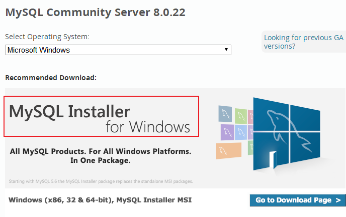
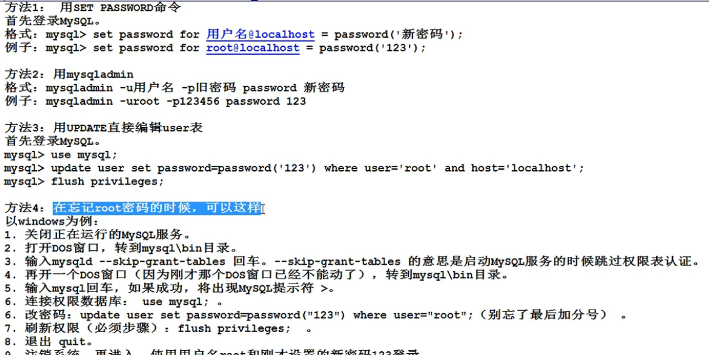

# 安装

https://dev.mysql.com/downloads/mysql/




安装选开发者模式

安装好后将安装目录下bin的目录添加到环境变量中

C:\Program Files\MySQL\MySQL Server 8.0\bin

# 工具

workbench

navicat

# 基本信息

端口3306

超级管理员root

# 卸载

1. 卸载软件
2. 删除C盘Program file下MySql目录
3. 删除C盘ProgramData下MySQL目录

# 忘记密码



# 语言


# 数据类型

整数：`int`

字符串：`varchar`

日期：`date`

# 命令

登录：`mysql -uroot -p`

查看数据库：`show databases;`

创建数据库：`create database databasename;`

使用数据库：`use databasename;`

查看当前数据库的表：`show tables;`

初始化数据：`source D:\folder\databasename.sql`

删库：`drop database databasename;`

查看表结构：`desc tablename;`

表数据：`select * from tablename;`

查询当前使用的数据库：`select database();`

查询MySQL版本：`select version();`

结束语句：`\c`

退出：`exit`

查看创建表的语句：`show create table tablename;`

## 查询


```
select 字段名1,字段名2,字段名3,...from 表名;

#比如，从表中查名字对应薪资列表
select name,sal from tablename;
#差名字对应年薪,并重命名
select name,sal*12 as yearsal from tablename;
select name,sal*12 as '年薪' from tablename;  #中文加''
select name,sal*12 '年薪' from tablename;   #as可以省略
select * from tablename;   #查询全部表 java中不建议使用*，填入全部字段

#不区分大小写
```

## 条件查询

```
select
	字段,字段...
from
	表名
where
	条件;
	
#查询员工工资等于5000的员工姓名
select name form tablename where sal = 5000;
#查询员工工资大于等于3000的员工姓名
select name form tablename where sal >= 3000;
#(<>,!=)查询员工工资不等于3000的员工姓名
select name form tablename where sal <> 3000;
select name form tablename where sal != 3000;
#(and between)查询员工工资小于等于3000大于等于1000的员工姓名
select name form tablename where sal <= 3000 and >=1000;
select name form tablename where sal between 1000 and 3000; #左闭右闭
#(between)查询员工名首字母在A和C之间的人名
select name form tablename where name between A and C; #左闭右开
#(null)查看没有工资的人
select name,sal from tablename where sal is null;   #0不是null
#查看Simon的工资
select sal form tablename where name = 'Simon';
#(in, or)找出岗位为MANAGER和SALESMAN的员工
select name,job from tablename where job = 'NAMAGER' or job = 'SALESMAN';
select name,job from tablename where job in ('NAMAGER','SALESMAN');
#(not in)找出岗位不是MANAGER和SALESMAN的员工
select name,job from tablename where job not in ('NAMAGER','SALESMAN');

#(%,_)模糊查询,%代表任意多个字符，_代表任意一个字符
#找出名字中第二个字母为a的人
select name form tablename where name like '_a%';
#找出名字中带有o的人
select name form tablename where name like '%o%';
#找出姓张的人
select name form tablename where name like '张%';
```

## 排序

```
select
	元素
from
	表
order by
	元素

#  asc升序
#  desc降序
```

```
#按照工资升序排，找出员工和薪资 默认升序
select name, sal from tablename order by sal;
#按照工资降序排，找出员工和薪资
select name, sal from tablename order by sal desc;
#按照工资降序排，工资相同再按照补贴降序排
select name, sal from tablename order by sal desc,butie desc;
#根据第二列排序
select name, sal from tablename order by 2;
#找出岗位为salesman,按照薪资降序排序
select name,job,sal from tablename where job='salesman' order by sal desc;
```

## 分组函数

```
count 计数
sum 求和
avg 平均值
max 最大值
min 最小值


select count(*),sum(sal),avg(sal) from tablename;

#自动忽略null
#不能用在where语句中
#count(元素)  计算不为null的条数
#count(*)  计算所有条数
```

```
#求工资总和
select sum(sal) from tablename;
#求总人数
select count(name) from tablename;
select count(*) from tablename;

#求年薪(如果津贴comm为null,则改为0)
select name,(sal+ifnull(comm,0) * 12 as yearsal from tablename;

#找出工资高于平均工资的员工
select name,sal from tablename where sal >(select avg(sal) from tablename)
```

## 空处理函数

```
ifnull(可能为null的数据,被当作什么处理)
```

## 分组

```
group by   #按照某个或者某些字段进行分组
           #在where之后执行
           #select后只能跟参加分组的字段和分组语句
           
#找出每个工作岗位的最高薪资
select max(sal),job from tablename group by job;
#找出每个部门每个岗位的最高薪资(多分组语句)
select deptno,job,max(sal) from tablename group by deptno,job;
```

```
having     #对分组过后的数据再次过滤

#找出每个部门的最高薪资，要求薪资大于3000的数据
select max(sal),deptno from tablename where sal > 3000 group by deptno;
#找出每个部门的平均薪资，要求薪资大于3000的数据
select avg(sal),deptno from tablename group by deptno having avg(sal) > 3000;
```

## 执行顺序

```
select    5
	...
from      1
	...
there     2
	...
group by  3
	...
having	  4
	...
order by  6
	...
```

## 去除重复记录

```
#distinct 
select distinct job from tablename;
#只能出现在所有字段的最前面

#统计岗位的数量
select count(distinct job) from tablename;
```

## 连接查询

### 表的别名

```
select n.name,d.dept from nametable n,depttable d;
#执行效率高
#可读性好
```

### 等值连接

```
#SQL92(太老，不用，做了解)
#找出每个员工的部门名称，要求显示员工名和部门名   #加条件
select n.name,d.dept from nametable n,depttable d where n.deptno = d.deptno;
```

```
#SQL99(常用)
select n.name,d.dept from nametable n join depttable d on n.deptno = d.deptno;

#语法
...
	A
(inner)join   # inner省略，带inner可读性好一点
	B
on
	...
where
	...
```

### 非等值连接

```
#连接条件为非等量关系
```

```
#找出每个员工的工资等级，要求显示员工名、工资、工资等级
select
	n.name,n.sal,n.grade
from
	nametable n
(inner)join
	saltable s
on
	e.sal between s.xiaosal and s. dasal;
```

### 自连接

```
#一张表看作两张表，自己连自己
#表取两个别名
```

```
#找出每个员工的上级领导，要求显示员工名和对应的领导名
select
	a.name,b.name
from
	nametable a
(inner)join
	nametable b
on
	a.mgr = b.nameno;   #a表的领导编号 = b表的名字编号
	
#大老板的数据被省略
```

### 外连接

```
#副表没有数据与主表匹配，则显示null
#左连接：左表为主表
#右连接：右表为主表
```

```
#找出每个员工的上级领导，要求显示员工名和对应的领导名
select
	a.name,b.name
from
	nametable a
left (outer) join   # outer可省略
	nametable b
on
	a.mgr = b.nameno;   #a表的领导编号 = b表的名字编号

#找出没有员工的部门
select
	d.*
from
	nametable a
left (outer) join   # outer可省略
	depttable d
on
	a.deptno = b.deptno
where
	a.deptno is null;
```

```
#三张表连接查询
#找出每个员工的部门名称及工资等级、上级领导
select
	n.name,d.dept,s.grade
from
	nametable n
join
	depttable d
on
	n.deptno = d.deptno
join
	saltable s
on
	s.sal between s.zuixiaosal and s.zuidasal
left join            #left外连接，指的是n表！
	nametable na
on
	n.mgrno = na.nameno;
```

## 子查询

```
#from后面嵌套子查询

#找出每个部门的平均薪水的薪资等级
select
	t.*,s.grade
from
	(select deptno,vag(sal) as avgsal from nametable group by deptno) t
join
	salgratetable s
on
	t.avarage between s.xiaosal and s.dasal;	
```

```
#select 后面嵌套子查询

#找出每个员工所在的部门名称，要求显示员工名和部门名
```

```
#union  将查询结果集相加
```

```
# limit  分页查询！！！
#MySQL中特有的命令
#放在SQL语句最后

#语法
limit startIndex, length

#取出工资前五名的员工
select name,sal from nametable order by sal desc limit 0,5;
select name,sal from nametable order by sal desc limit 5;  #第一个默认为0

#标准分页！！！

#每条显示3个记录
pageSize*（pageNo - 1),pageSize
```

## 创建表

```
create table tablename(
	字段名1 数据类型1，
	字段名2 数据类型2 defalt 1，
	字段名3 数据类型3，
);
```

```
int(长度)                     #整数
bigint(长度)                  #长整数
float(有效数字位数，小数位)      #数值型
double(有效数字位数，小数位)     #数值型
char(长度)                    #定长字符串
varchar(长度)                 #变长字符串(最多存225个字符)
date                         #日期
time                         #日期型，时分秒
dateTime                     #日期
BLOB                         #二进制大对象(存储图片、视频等流媒体信息)
CLOB                         #字符大对象(存储较大文本，如可存储4G字符串)
```

```
表名在数据库中一般建议以t_或tbl_开始
```

## 插入数据

```
insert into 表名(字段名1，字段名2，字段名3) valus(值1,值,2,值3)
```

```
#正常写法
insert into user ( name,phone,department,post,city,status ) values ( 
'张三',1314567891,'总部','系统管理员','杭州市','在职'); 
#字段名可以不写
insert into user values ( '张三',1314567891,'总部','系统管理员','杭州市','在职'); 
#新数据只写一个字段
insert into user ( name) values ( '张三');
#一次插入多个值
insert into user ( name) values ('张三')，('李四');
```


