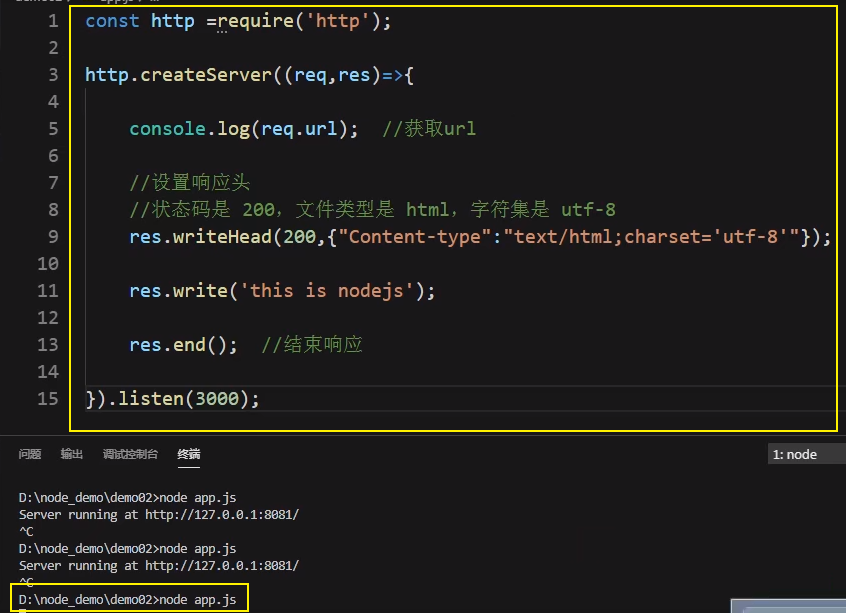
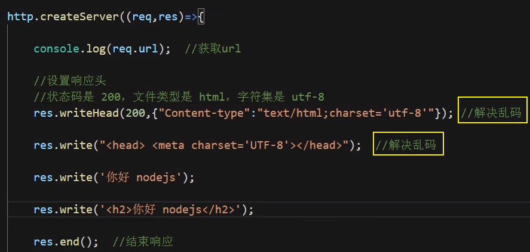
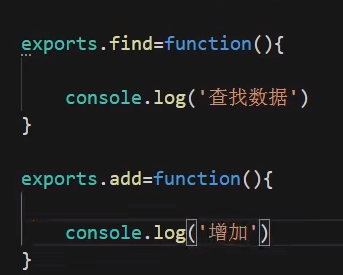

# 教程

https://www.bilibili.com/video/BV11t411k79h


# 工具

1. 安装nodejs

   http://nodejs.cn/

2. DOS中安装自动服务(文件更新，自动重启)”nmp install -g supervisor“

   如不能成功安装，则百度搜CNPM，用里面的命令进行安装（P3)

3. VSCode

   插件：Node-Snippets

# 使用



# 解决乱码



# 暴露

```
module.exports = obj;
或者
export.xxx = obj;
```

