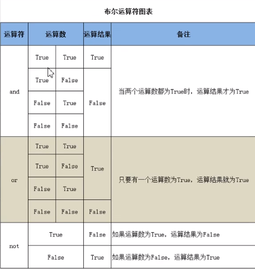
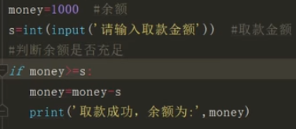
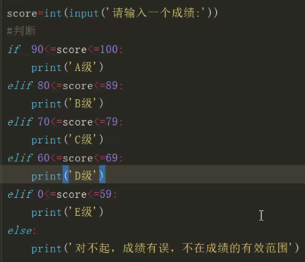
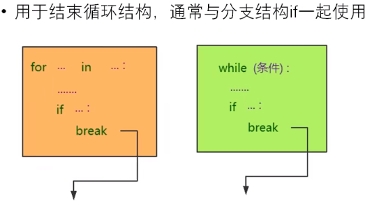
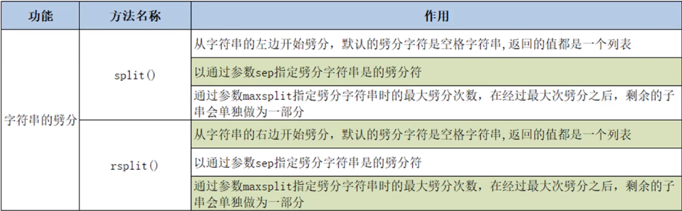
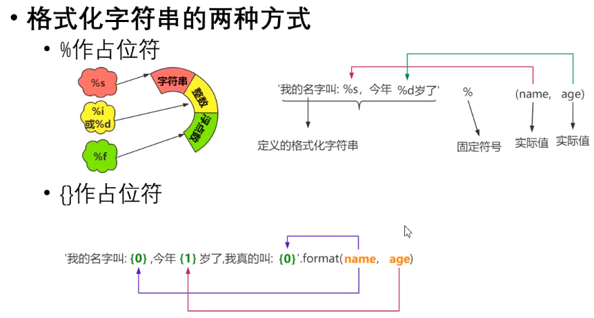
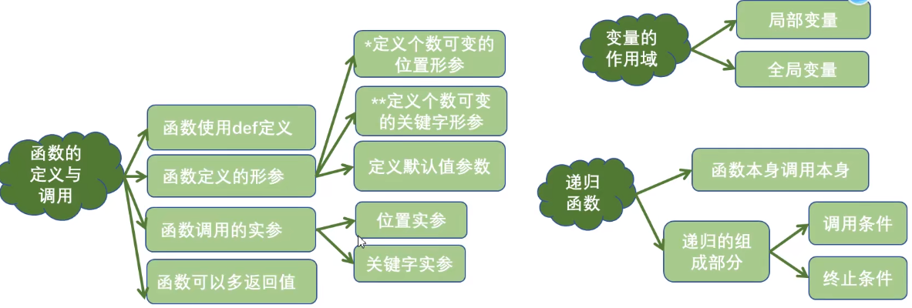
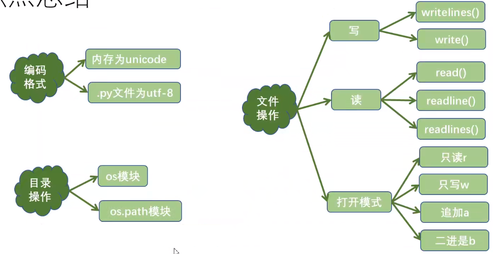

# 教程

https://www.bilibili.com/video/BV1wD4y1o7AS?p=26

重看了：从P107-134

回顾：P119，121，134

# 方向


# 工具

安装anaconda(参考md（neural network）)

Pycharm（免费）

https://www.jetbrains.com/zh-cn/pycharm/download/#section=windows

# 注意点

##### 随机数

```
import random
a = random.randint(20,35)
```

```
import random
b = random.random()	#取0-1间的随机小数
```

##### 显示命令的源码

```
Ctrl + B
```

##### 取小数位数

1、round

```
a = 32.3423566
b = round(a,2)	#取两位小数
print(b)	#32.34
```

2、round.0-1间的小数，取三位小数

```

a = round(random.random(),3)
```

3、"%.2f"

```

a = "%.2f"%random.random()
```

##### 按键等于某个字母

```
#用户按下q键，退出
while True:
	if ord('q') == cv.waitKey(0):
		break
```

### 字符串拼接

```
print('%s %s' % ('Hello', 'world'))
>>> Hello world
```

```
# 简洁版
s1 = 'Hello {}! My name is {}.'.format('World', 'Python猫')
print(s1)
>>>Hello World! My name is Python猫.
 
# 对号入座版
s2 = 'Hello {0}! My name is {1}.'.format('World', 'Python猫')
s3 = 'Hello {name1}! My name is {name2}.'.format(name1='World', name2='Python猫')
print(s2)
>>>Hello World! My name is Python猫.
print(s3)
>>>Hello World! My name is Python猫.
```

```
str_list = ['Hello', 'world']
str_join1 = ' '.join(str_list)
str_join2 = '-'.join(str_list)
print(str_join1) >>>Hello world
print(str_join2) >>>Hello-world
```

我比较喜欢这个方法f

```
name ='world'
myname ='python_cat'
words =f'Hello {name}. My name is {myname}.'
print(words)
>>> Hello world. My name is python_cat.
```

# 使用DOS运行

#### 使用DOS直接运行

1. 输入python回车
2. 输入运行代码，如1 + 1，回车
3. exit() 退出

#### DOS运行Python文件

1. cd desktop  `要运行的Python文件目录`
2. python text.py

# 注释

单行注释：`#空格`，`选中按Ctrl+/`

多行注释：`'''前后三个单引号，或者前后三个双引号'''`

# 二进制0b

8bit=1byte     #8位等于1字节，1bit可能是1也可能是0

1024byte=1kb   #千字节

1024kb=1MB

1024MB=1GB

1024GB=1TB

==二进制前面加0b==

==八进制前面加0o==

==十六进制前面加0x==

# 标识符和保留字


# 变量

name='马丽亚'

print(name)

1. 变量为储存数据的盒子
2. 变量包括id,type,value


# 数据类型


### 整数类型


n1=90

print(n1,type(n1))

### 浮点类型


from decimal import Decimal

print(Decimal('1.1')+Decimal('2.2')）

### 布尔类型


### 字符串类型


# 数据类型转换


age=20  

name='张三'

print('我叫'+name+'今年'+str(age)+'岁')        #str(age) 将整数类型转换为字符串类型，才能相连不会报错

# 代码

### print

print(520)

print ('hello world')

print(3+1)

print('hello','world')   #不进行换行输出，同行输出

# 将文件输出到文件中

1. 所指定的盘符存在
2. 使用file=  的形式
3. a+  #如果文件不存在就创建，存在就在文件后追加 

fp=open('D:/text.txt','a+')

print('helloworld',file=fp)

fp.close()

# 转义字符


print('hello==\n==world')     #换行

print('hello==\t==world')      #四个空格位置，四个四个排列自动补空格位

print('hello==\r==world')      #回车，输出为world，world将hello覆盖了

print('hello==\b==world')     #退一格

`print('http:\\\\www.baidu.com') `   #其中两个\为转义符

print('老师说：\‘大家好\’')    #为了输出‘，需要在前面加转义符\

# 原字符

1. 不希望字符串中的转义字符起作用，就在字符串前加r或R
2. 最后一个字符不能是反斜线，如print(r'hello\nworld==\\==')报错

print(==r=='hello\nworld')     #转义字符\n不再起作用

# 第三章

### input


a=int(input('请输入第一个加数：'))

b=int(input('请输入第二个加数：'))

print(a+b)

### 运算符


##### 算术运算符


print(11//2)    #5，整除

print(-9//4)    #-3，==一正一负向下取整==

print(11%2)    #1，取余

print(2**3)     #8，2的3次方

print(9%-4)     #-3   ==余数=被除数-除数*商==

print(-9%4)     #3    ==余数=被除数-除数*商==


##### 赋值运算符


a=20 

a+=30             #即a=a+30

print(a)           #50

==交换值==    a,b=b,a                   #解包赋值

##### 比较运算符


#####  布尔运算符




s='helloworld'

print('w' in s)             #True

##### 位运算符


print(4<<1)             #8，向左移动一位相当于乘以一次2

print(4>>2)             #1，向右移动两位，相当于除以两次2

##### 运算符的优先级


算术运算》位运算》比较运算》布尔运算》赋值运算符     ==有括号先算括号内==

# 第四章

### 对象的布尔值


### 程序的组织结构


##### 顺序结构


##### 选择结构 


###### 单分支结构




###### 双分支结构


###### 多分支结构




# 第五章

### 内置函数range()


r=range(1,10,2)

print(list(r))      #[1,3,5,7,9]

### while循环


##### while循环执行流程


###### 1到100偶数和

```
sum=0
a=1
while a<=100：
​    if a%2==0:
​    sum+=a
a+=1
print('1-100偶数和'，sum)
```

### for-in循环


```
for i in range(10):
print(i)            #   输出0,1,2,3,4,5,6,7，8,9    每个数字一行

for _ in range(5):
print('我是帅哥')    #输出5行  我是帅哥

sum=1
for item in range(1,101):
​    if item%2==0:
​        sum+=item
print('1到100之间的偶数和为:',sum)
```


### break语句




### continue语句


### else语句

 

### 嵌套循环


###### 99乘法表

```python
for i in range(1,10):
    for j in range(1,i+1):
        print(i,'*',j,'=',i*j,end='\t')
    print()
```

### 总结


# 第六章(列表)

### 列表取步长

```
list1 = [1,3,5,3,4,4,3,7,3]
list2 = list1[::3]	//每三个间隔取一个值
```


### 列表的创建

第一种方法

```python
lst=['hello','world',98]
```

第二种方法

```
lst2=lis(['hello','world',98])
```

### 列表的特点


### 列表的查询


```python
lst=['hello','world',98,'hello']
print(lst.index('hello'))
print(lst.index('hello',1,4))
```

### 列表的切片操作


### 列表元素的增加


### 列表元素的删除


###### 切片删除

```python
lst=['hello','world',98,'nihao']
new_lst=lst[1:3]
print(new_lst)       #['world', 98]
lst[1:3]=[]
print(lst)       #['hello', 'nihao']
```

###### 清除列表所有元素

```
lst=['hello','world',98,'nihao']
lst.clear()
print(lst)
```

###### 将列表对象删除del

```
lst=['hello','world',98,'nihao']
del lst
print(lst)        #无对象，报错
```

### 列表元素的修改

指定位置修改

```
lst=['hello','world',98,'nihao']
lst[3]=100
print(lst)        #['hello', 'world', 98, 100]
```

切片修改

```
lst=['hello','world',98,'nihao']
lst[1:2]=[10,20]
print(lst)        #['hello', 10, 20, 98, 'nihao']
```

### 列表排序


###### 不产生新对象（新id）,sort()

```
lst=[50,40,60,10,90]
lst.sort()
print(lst)      #[10, 40, 50, 60, 90]
```

```
lst=[50,40,60,10,90]
lst.sort(reverse=True)
print(lst)      #[90, 60, 50, 40, 10]
```

###### 产生对象（新id)，sorted()

```
lst=[50,40,60,10,90]
new_lst=sorted(lst)
print(new_lst)      #[10, 40, 50, 60, 90]
```

```
lst=[50,40,60,10,90]
desc_lst=sorted(lst,reverse=True)
print(desc_lst)      #[90, 60, 50, 40, 10]
```

### 列表生成式


```
lst=[i*i for i in range(1,10)]
print(lst)   #[1, 4, 9, 16, 25, 36, 49, 64, 81]
```

### 总结


# 第七章(字典)

### 字典


### 字典创建


```
scores={'张三':100,'李四':98,'王五':60}
print(scores)
```

```
student=dict(name='jack',age=20)
print(student)
```

### 字典的常用操作


```
scores={'张三':100,'李四':98,'王五':60}
print(scores['张三'])     #100 若查无结果报错
```

```
scores={'张三':100,'李四':98,'王五':60}
print(scores.get('张三'))   #100 若查无结果显示None
```


```
scores={'张三':100,'李四':98,'王五':60}
print('张三' in scores)  #True  判断
```

```
scores={'张三':100,'李四':98,'王五':60}
del scores['张三']
print(scores)  #{'李四': 98, '王五': 60} 删除
```

```
scores={'张三':100,'李四':98,'王五':60}
scores['陈六']=150
print(scores)  #{'张三': 100, '李四': 98, '王五': 60, '陈六': 150}  新增
```

```
scores={'张三':100,'李四':98,'王五':60}
scores['陈六']=150
print(scores)
scores['陈六']=180
print(scores) #{'张三': 100, '李四': 98, '王五': 60, '陈六': 180}  修改
```


```
scores={'张三':100,'李四':98,'王五':60}
keys=scores.keys()
print(keys) #['张三', '李四', '王五']
```


### 字典的特点


### 字典生成式???


```
items=['Apple','Banana','Pear']
prices=[20,40,30]
d={item:price for item,price in zip(items,prices)}
print(d)  #{'Apple': 20, 'Banana': 40, 'Pear': 30}
```

### 总结


# 第八章(元组、集合)

### 元组的创建


### 元组遍历


### 集合


==集合内的元素不允许重复==

==集合内的元素是无序的==

### 集合的创建


### 集合的相关操作


```
print(100 in s)
```

```
s.pop()
```

### 集合间的关系


```
s1={1,3,5,7,8,9}
s2={1,3,5}
s3={1,3,10}
print(s2.issubset(s1))   #True    子集
print(s1.issuperset(s2)) #True    超集
print(s2.isdisjoint(s3)) #False   是否没有交集
print(s2.intersection(s3)) #{1, 3}  交集
print(s2 & s3) ##{1, 3}  交集，等同intersection
print(s2.union(s3)) #{1, 3, 5, 10} 并集
print(s2 | s3) #{1, 3, 5, 10} 并集,等同union
print(s2.difference(s3)) #{5} 差集
print(s2 - s3) #{5} 差集,等同difference
print(s2.symmetric_difference(s3)) #{10, 5} 对称差集
print(s2 ^ s3) #{10, 5} 对称差集,等同symmetric_difference
```

### 集合生成式


### 总结


# 列表、字典、元组、集合总结（6-8章）


# 第九章

### 字符串的驻留机制


###### 字符串驻留机制的优缺点


### 字符串的常用操作

###### 查询


###### 大小写转换


###### 内容对齐


```
s='hello,Python'
print(s.center(20,'*')) #****hello,Python****
```

###### 劈分操作



```
s='hello world Python'
lst=s.split()
print(lst) #['hello', 'world', 'Python']
```

```
s='hello|world|Python'
print(s.split(sep='|')) #['hello', 'world', 'Python']
```

```
s='hello|world|Python'
print(s.split(sep='|',maxsplit=1)) #['hello', 'world|Python']
```

###### 判断


###### 替换、合并


```
s='hello,world,world,world'
print(s.replace('world','nihao',2)) #hello,nihao,nihao,world
```

```
s=['hello','world','world']
print('|'.join(s)) #hello|world|world
```

###### 字符串的比较


###### 字符串的切片操作


### 格式化字符串,占位符{}



```
x_labels = ["{}Year".format(i) for i in range(10,20)]
```

```
name='张三'
age=20
print('我叫%s,今年%d岁'%(name,age)) #我叫张三,今年20岁
```

```
name='张三'
age=20
print('我叫{0},今年{1}岁'.format(name,age)) #我叫张三,今年20岁
```

```
name='张三'
age=20
print(f'我叫{name},今年{age}岁') #我叫张三,今年20岁
```

```
print('%10d' % 99) #10为宽度
print('%.3f' % 3.1415926) #3.142   .3保留三位小数
```

```
print('{0:.3}'.format(3.1415926)) #3.14  .3表示的是一共三位数
print('{0:.3f}'.format(3.1415926)) #3.142  .3f表示三位小数
print('{:10.3f}'.format(3.1415926)) #     3.142  10位，位小数???
```

### 字符串编码转换


###### 编码

```
s='天涯共此时'
print(s.encode(encoding='GBK')) #GBK一个中文占两字节
print(s.encode(encoding='UTF-8')) #UTF-8 一个中文占三个字节
```

###### 解码

```
s='天涯共此时'
byte=s.encode(encoding='GBK')  #编码
print(byte.decode(encoding='GBK')) #解码
```

### 总结


# 第十章

### 函数的创建和调用


### 函数的参数传递


==在函数调用过程中，进行参数的传递==

==如果是不可变对象，在函数体的修改不会影响实参的值,如n1=89==

==如果是可变对象，在函数体的修改会影响实参的值，如n2=[10.20.30]==

### 函数的返回值


### 函数的参数定义


### 函数的参数总结


```
def fun1(a,b,*,c,d):  #在*之后的参数，只能采用关键字参数传递
```

### 变量的作用域


```
def fun1():
    global  age #函数内变量使用global声明，就变了全局变量
```

### 递归函数


```
def fac(n):
    if n==1:
        return 1
    else:
        return n*fac(n-1)
print(fac(6)) #720
```

### 总结

###### 斐波那契数列

```
def fib(n):
    if n==1:
        return 1
    elif n==2:
        return 1
    else:
        return fib(n-1)+fib(n-2)
print(fib(6)) #8
```



# 第十一章

### Bug的分类

###### 语法错误


###### 思路不清


###### 被动掉坑


```
try:
    a=int(input('请输入第一个整数：'))
    b=int(input('请输入第二个整数：'))
    result=a/b
    print('结果为：',result)
except ZeroDivisionError
    print('对不起，除数不允许为0')
except ValueError
    print('只能输入数字串')
```

### 异常处理机制

###### try...except..else


```
try:
    a=int(input('请输入第一个整数：'))
    b=int(input('请输入第二个整数：'))
    result=a/b
except BaseException as e:
    print('出错了',e)
else:
    print('结果为：',result)
```

###### try...except...else...finally


###### traceback模块


### Bug自查


### 常见的异常类型


### Pycharm开发环境调试


### 总结


# 第十二章

### 编程思想


### 类与对象type


### *类的创建


==类首字母大写==

### *对象的创建


### *类属性、类方法、静态方法


### 动态绑定属性和方法


### 总结


# 第十三章

### 面向对象的三大特征

### 封装


### 继承


### 方法重写


### object类


### 多态


### 静态语言与动态语言


### 特殊方法和特殊属性


### 类的浅拷贝与深拷贝

```
copy2 = copy.copy(PC1)
copy3 = copy.deepcopy(PC1)
```


### 总结


# 第十四章

### 模块


### 模块创建与导入


### 以主程序形式运行

只有在此函数自己的模块中运行才会运行。

### 

```
if __name__ == '__main__':
```

# Python中的包


Python中常用的内置模块


### 第三方模块的安装与应用


### 模块schedule

1. cmd--pip install schedule

```
import schedule
import time

def job():
	print('哈哈')

schedule.every(3).seconds.do(job)	#每隔3秒运行一次job函数
while True:
	schedule.run_pending()
	time.sleep(1)		#休眠一秒
```


### 总结


### 编码格式


### 修改编码格式

比如在*.py最上面添加 #encoding#gbk ，即可把文件变为gbk的编码格式文件


```
file=open('a.txt','r')
print(file.readlines())
file.close()
```

### 常用的文件打开模式


```
file=open('a.txt','w')
file.write('Python')
file.close()
```

### 文件对象的常用方法


### with语句（上下文管理器）


```
with open('a.txt','r') as file
    print(file.read())
```

### 目录操作（OS模块）


```
import os
os.system('notepad.exe')
```

```
import os
os.startfile('C:\\ProgramData\\Microsoft\\Windows\\Start Menu\\Programs\\微信\\微信.exe')
```

### OS模块操作目录相关函数


==listdir(path),办公自动化==

### os.path模块操作目录相关函数


```
import os.path
print(os.path.basename((E:\\SDFS\\SDSDF\\SDFSDF\\ER\\demo13.py)))
```

```
#列出制定目录下的所有py文件
import os
path=os.getcwd()
lst=os.listdir(path)
for filename in lst:
    if filename.endswith('.py'):
        print(filename)
```

### walk

遍历当前目录和子目录  P134

### 总结



# 案例：学生信息录入系统

### 录入学生信息功能


###### 业务流程


### 删除学生信息功能


### 修改学生信息功能


# 格式

###### 颜色


###### 小数点个数


# 案例


任务3   random


任务4


# 爬虫

pip install requests

###### UA伪装：反反爬策略

###### 抓取sougou的搜索页面

```
import requests
if __name__=="__main__":
    #UA伪装，将对应的User-Agent封装到一个字典中
    headers = {
        'user-agent':'Mozilla/5.0 (Windows NT 10.0; Win64; x64) AppleWebKit/537.36 (KHTML, like Gecko) Chrome/85.0.4183.102 Safari/537.36'
    }
    #url='https://www.sogou.com/web?query=%E9%82%93%E4%B8%AD%E5%8D%8E'
    url = 'https://www.sogou.com/web'
    #处理URL携带的参数，封装到字典中
    kw = input('enter a word:')
    param = {
        'query':kw
    }
    #对指定URL发起的请求对应的url是携带参数的，并且请求过程中处理了参数
    response = requests.get(url=url,params=param,headers=headers) #UA伪装
    page_text = response.text
    filename = kw+'.html'
    with open(filename,'w',encoding='utf=8') as fp:
        fp.write(page_text)
    print(filename,'保存成功！')
```

###### 百度翻译

```
import requests
import json
if __name__=="__main__":
    post_url = 'https://fanyi.baidu.com/sug'
    headers = {
        'user-agent': 'Mozilla/5.0 (Windows NT 10.0; Win64; x64) AppleWebKit/537.36 (KHTML, like Gecko) Chrome/85.0.4183.102 Safari/537.36'
    }
    #post请求参数处理，与get请求一致
    word = input('enter a word:')
    data = {
        'kw':wordha
    }
    #请求发送
    response = requests.post(url=post_url,data=data,headers=headers)
    #获取相应数据：json(）方法返回的是obj（如果确认相应数据为json类型的才可以使用.json()
    dic_obj = response.json()
    #持久化存储
    filename = word+'.json'
    fp = open(filename,'w',encoding='utf-8')
    json.dump(dic_obj,fp=fp,ensure_ascii=False)
    print('Over!!!')
```