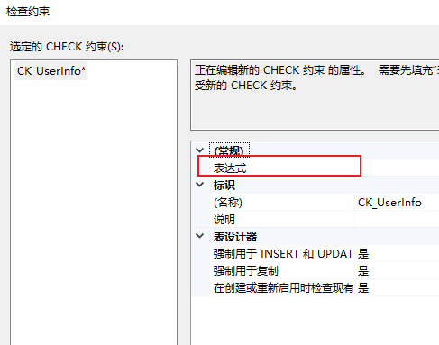
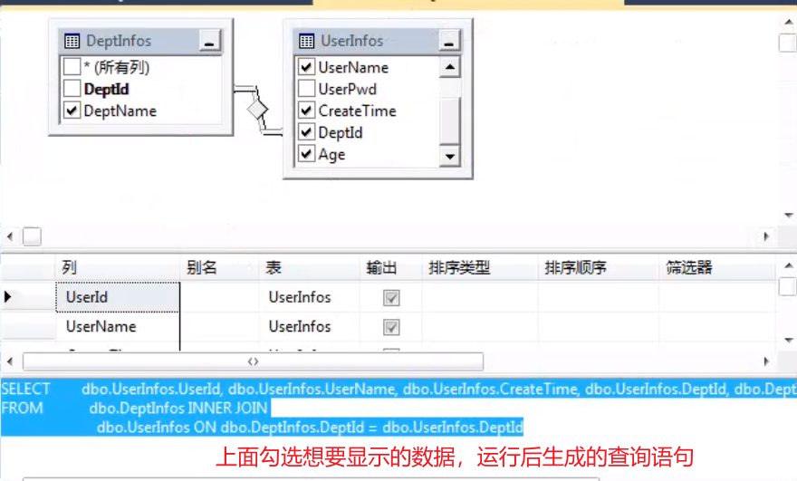
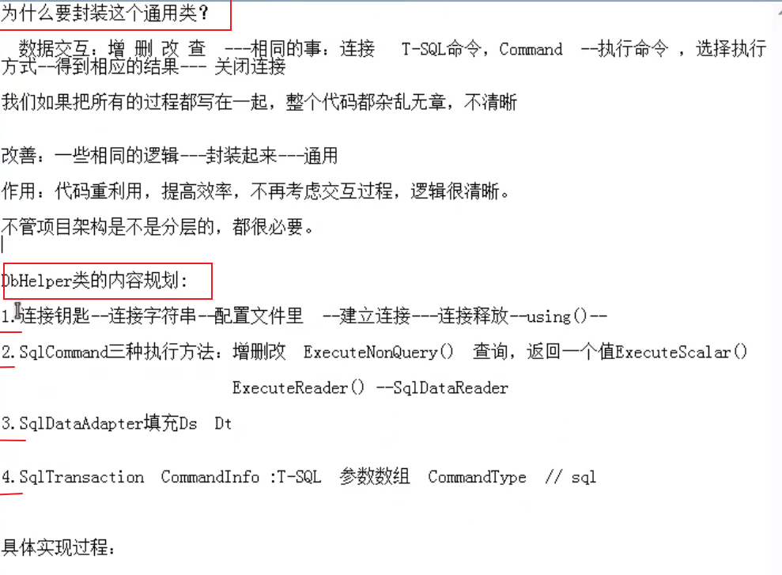

# 教程

https://www.bilibili.com/video/BV147411x7p1?t=581

回顾：SqlAdapter，事务等  P140-150

# 软件

#### SQLServer2012

秘钥：FH666-Y346V-7XFQ3-V69JM-RHW28

下载：https://www.onlinedown.net/soft/1229604.htm

视频安装教学：https://www.bilibili.com/video/BV11E41177xK?p=2&spm_id_from=pageDriver


#### SSMS


#### 18456报错


#### 233错误

1. 打开"SQL Server 2019 配置管理器"


2. 重启电脑

#### 不允许保存更改

更改列的类型时出现这个错误

1. 工具-选项
2. 设计器-表设计器和数据库设计器
3. 去掉“阻止保存要求重新创建表的更改”勾选

# 注意点

### 获取当前时间

```
getdate()
```

### 插入数据，拼接字符

```
insert into UserInfo(UserName,UserPwd,Age,DeptId) values('"+uName+"'，'"+uPwd+"','"+uAge+"','"+uDeptId+"')
```


# 创建数据库


# 数据库文件


# 文件组


# 数据类型及存储

##### decimal

```
decimal(18,2)	--18代表位数，2代表小数点后面两位
```


```
varchar(10)	--最多存5个中文字符，1个中文字符占2
nvarchar(10)	--最多存10个中文,一个中文字一个，一个字母也是一个
```


# 主键PrimaryKey、联合主键

#### 主键

此列的数据不能重复，不能为空

1个表只能有一个主键

#### 联合主键

多列设置主键，多列的内容不能重复

# 外键ForeignKey

1. 两个表建立关联的时创建
2. 一个列创建为外键，它在另一个表必须是主键
3. 一个表可有多个外键


# 标识列identity

```
identity(开始数字，增量)
```

1. 不能手动插入
2. 插入时，自动生成
3. 不带小数的数值型（整型）
4. 标识种子：比如1，增量：比如2
5. 在手动添加行数据时不用手动输入标识列数据

# 约束

1. 数据规则，违反则阻止

**Unique约束**: 确保表中数据没有相同值

**Check约束**: 通过逻辑表达式来判断数据的有效性。比如密码规则




**Defult约束**: 插入新数据行时，如果用户未指定数据，则系统将默认值赋给该列。比如Null

# 语言


# 功能

## 创建数据库

```
use master
go

--创建数据库
create database TestNewBase --新数据库名称
on primary   --主文件组
(
	name='TestNewBase',
	filename='D:\DataBase\SQLServerDatabase\TestNewBase.mdf',
	size=5MB,  --初始大小
	filegrowth=1MB  --增量
)
log on
(
	name='TestNewBase_log',
	filename='D:\DataBase\SQLServerDatabase\TestNewBase_log.ldf',
	size=1MB,  --初始大小
	filegrowth=10%  --增量
)
go
```

## 创建表

```
use TestDB  --在数据库TestDB里创建表
go

create table ProductInfo
(
	Id int identity(1001,1) primary key not null,  --标识列，主键，不允许有null
	ProNo varchar(50) not null,
	ProName nvarchar(50) not null,
	TypeId int not null,
	Price decimal(18,2) null,
	ProCount int default 0 null,   --设置默认值
)
go
```

## 删除表

```
use TestDB  --在数据库TestDB里创建表
go

drop table ProductInfo
go
```

## 修改表

##### 添加列

```
alter table ProductInfo add ProWeight decimal(18,2) null
```

##### 删除列

```
alter table ProductInfo drop column ProWeight 
```

##### 修改列数据类型

```
alter table ProductInfo alter column ProName nvarchar(50) not null  --将列ProName原本varchar改为nvarchar,null改成nut null
```

##### 修改列名（慎用）

```
exec sp_rename 'ProductInfo.ProCount','Count','column'  --将ProductInfo下的列ProCount修改为Count,最后一个属性为修改的列
```

## 创建主键

建表时加主键

```
use TestDB  --在数据库TestDB里创建表
go

create table ProductInfo
(
	Id int identity(1001,1) primary key not null,  --标识列，主键，不允许有null
)
go
```

建表后加主键

```
alter table ProductInfo add constaint PK_ID primary key(Id)   --在表ProductInfo里将Id创建为主键，这条规则叫PK_ID
```

## 创建外键

建表时加外键

```
use TestDB  --在数据库TestDB里创建表
go

create table ProductInfo
(
	
	TypeId int not null foreign key references ProductType(TypeId)  --将TypeId关联到表ProductType里的TypeId
)
go
```

建表后加外键

```
alter table ProductInfo add constaint FK_TypeId foreign key(TypeId) references ProductType(TypeId)   --在表ProductInfo里将TypeId创建为外键，关联到表ProductType。这条规则名叫FK_TypeId
```


## 约束

建表时加约束

```
use TestDB  --在数据库TestDB里创建表
go

create table ProductInfo
(
	
	TypeId int unique not null --加unique约束
	ProCount int default 0 null,   --defult约束
	Price decimal(18,2) check(Price<10000) null,   --check约束
)
go
```

建表后加unique约束

````
alter table ProductInfo add constaint IX_ID unique(Id,ProName)   --在表ProductInfo里将Id和ProName加unique约束，这条规则叫IX_ID
````

建表后加check约束

```
alter table ProductInfo add constaint CK_Price check(Price<100000)   --在表ProductInfo里加check约束，这条规则叫CK_Price
```

建表后加defult约束

```
alter table ProductInfo add constaint DF_ProCount defult(0) for ProCount   --在表ProductInfo里加defalut约束，这条规则叫DF_ProCount
```

## 数据编辑

#### 单条数据插入

1. 

```
use TestDB
go
insert into ProductType(TypeName) value('工具类')
```

2. 

```
usr TestDB
go
insert ProductType(TypeName)
select '鞋类'
```

#### 多条数据插入

```
insert into UserInfo(UserName,UserPwd,Age,DeptId) values('张三'，'123',20,1)
```

1. 单列

```
use TestDB
go
insert into ProductType(TypeName) value('工具类1'),('工具类2'),('工具类3')
```

2. 多列==union去重，union all允许重复==

```
use TestDB
go
insert TestTable(Id,MName,Age)
select 1,'aaa',23 union
select 2,'bbb',24 union
select 3,'ccc',25 union all
select 4,'ddd',26
```

#### 克隆数据

1. 目标表存在

```
--将表ProductType里的TypeName这一列的数据，追加到Test表中Mname这一列数据后面
insert into Test(MName)   --目标表
select TypeName from ProductType  --源表
```

2. 目标表不存在

```
select TypeName into Test2 from ProductType
```

#### 更新数据

主键不可修改

where 后用 and或or连接多个条件

```
update UserInfo set Mname='aaa',Age=30 where Id=5
```

#### 删除数据

where 后用 and或or连接多个条件

1. 
   1. delete删除后，增加数据标识符的值会接着删除前的值往后自增
   2. 不加where删除表中所有数据，标识符还有缓存

```
delete from UserInfo where Id=20
```

2. 
   1. truncate删除表中数据，表恢复初始状态，标识符清空
   2. 操作不会记录日志
   3. 不可恢复

```
truncate table UserInfo
```

## 查询

````
select * from UserInfo
````

```
select UName,Age from UserInfo
```

```
select * from UserInfo where UserName='root'
```

#### 别名(as , 空格 ，=)

```
select UserId as 编号,UserName 用户名,年龄=Age from UserInfo
```

#### 模糊查询

% (0个或多个字符)

```
select * from UserInfo  where UserName like '%ad%'   --ad可在开始、中间、结尾
select * from UserInfo  where UserName like '%ad'   --以ad结尾
```

_ (1个字符)

```
select * from UserInfo  where UserName like '_dmin'  
select * from UserInfo  where UserName like '_d_i_'  
select * from UserInfo  where UserName like '___'    --查询3个字符的数据，写三个_
```

[] (中括号中所有字符中一个)

```
select * from UserInfo  where UserName like 'ad[m|b|c]in' 
select * from UserInfo  where UserName like 'ad[mbc]in' 

x select * from UserInfo  where UserName like 'ad[a-n]in'   --a到n之间所有的一个
```

[^] (不包含中括号中的字符)

```
select * from UserInfo  where UserName like 'ad[^mbc]in' 
```

#### 查询范围

前面10条

```
select top 10 * from UserInfo
```

百分之10

```
select 10 percent * from UserInfo
```

给定条件

```
select * from UserInfo where Age>30
```

```
select * from UserInfo where Age between 20 and 30
```

子查询

```
select * from UserInfo where DeptId in(select DeptId from DeptInfo where DeptId >1)
```

## 排序

1. 主键默认有排序功能
2. 不写asc或desc默认升序
3. order by放在所有条件后执行

##### 升序asc

```
select UserId,UserName from UserInfo order by UserId asc
```

##### 降序desc

```
select UserId,UserName,Age from UserInfo order by Age desc
```

## 聚合函数

##### count 计数

```
select count(1) form UserInfo   --效果相同，用1效率高
select count(*) form UserInfo
```

##### sum 和

##### avg 平均数

##### max

##### min

## 分组

```
Select DeptId,count(1) 用户数 from UserInfo where Age>20 group by DeptId haveing DeptId>1 order by DeptId asc
```


## 连接查询

根据两个或多个表之间的关系，从这些表中查询数据

#### 内连接

inner join = > <

显式写法

```
select UserId,UserName,Age,DeptId from UserInfo U inner join DeptInfo D on D.DeptId=U.DeptId
```

隐式写法

```
select UserId,UserName,Age,DeptId from UserInfo U, DeptInfo D where D.DeptId=U.DeptId
```

#### 外连接 (outer可省略)

1. 左连接(两表数据连接，右表无值显示Null)

```
select UserId,UserNma,DeptId from UserInfo U left (outer) join DeptInfo D on D.DeptId=U.DeptId
```


2. 右链接(两表数据连接，左表无值显示Null)

```
select UserId,UserNma,DeptId from UserInfo U right (outer) join DeptInfo D on D.DeptId=U.DeptId
```


#### 全连接

两表数据连接，表无值显示Null

```
select UserId,UserNma,DeptId from UserInfo U full (outer) join DeptInfo D on D.DeptId=U.DeptId
```


#### 交叉连接(笛卡尔积)

1.    = 表1数据个数 * 表2数据个数

```
select * from UserInfo U cross join DeptInfo D 
```

2. where (显示匹配的行数)

```
select * from UserInfo U cross join DeptInfo D where D.DeptId=U.DeptId
```

## 类型转换

#### convert

```
select 'ab'+convert(varchar,2)
```

```
select convert(varchar(10),getdata(),126)   --126是日期显示类型，还有100类型
```

#### cast

```
select 'ab'+cast(2 as varchar)
```

## 字符串操作

#### CHARINDEX

```
select CHARINDEX('BC','ABCDR')   --BC在后面出现的位置是2,SQL中索引从1开始
```

#### PATINDEX

```
select CHARINDEX('%BC%','ABCDR')   --BC在后面出现的位置是2,SQL中索引从1开始
```

#### 大小写转换

小写

```
select lower('ABCD')
```

大写

```
select upper('sbdf')
```

#### 取长度

```
select len('ABC')
```

#### 去空格

```
select LTRIM('  ABC   ')  --去左边空格
```

```
select RTRIM('  ABC   ')  --去右边空格
```

#### 取子串

```
select LEFT('ADFSSDFSD',4)  --ADFS,左边取4个字符
```

```
select RIGHT('ADFSSDFSD',4)  --DFSD,右边取4个字符
```

```
select SUBSTRING('ABCDEFGHIJK',3,4)  --	从第3个位置取4个字符
```

#### 重复字符

```
select REPLICATE('abc',3)  --abcabcabc，重复abc四次
```

#### 翻转字符串

```
select REVERSE('abcd')  --dcba
```

#### 替换字符串

```
select REPLACE('ABCDEF','CD','SS')   --将字符串里的CD替换成SS
```

#### 指定位置替换

```
select STUFF('abcdefg',2,3,'tt')  --将字符串第二位开始3个字符替换成tt
```

# 索引

#### 聚集索引 Clustered

1. 逻辑顺序与物理顺序一致
2. 比非聚集索引效率高

#### 非聚集索引 NonClustered

1. 默认创建非聚集索引

#### 例

```
--聚集索引
create clustered index PK_UserInfo on UserInfo(UserId) with(drop_existing=on)  --drop_existing是否删除存在的同索引
```

```
--唯一，非聚集索引
create unique clustered index UQ_UserInfo on UserInfo(UserId) with(
																	pad_index=on,
																	fillfactor=50,  --创建索引时，每个索引页的数据占整个索引页数据的比例 
																	ignore_dup_key=on
																				)  

--读写比100：1   100
--读小于写：50-70
--读写各一半：80-90
```

# 视图



#### 标准视图

#### 索引视图

被具体化，创建索引，显著提高查询性能

会删除基础表的数据，慎用

#### 分区视图

一台或多台服务器水平连接一组成员表的分区数据

#### 脚本创建视图

```
--创建视图
create view vUserInfo as 
select UserId,UserName,UserAge,DeptId
from Userinfo u
inner join DeptInfo d
on d.DeptId=u.DeptId

go

--使用视图
select * from vUserInfo
```

```
分区视图，创建一个视图，去除两个表中的重复数据
create view vUserInfo as
select * from UserInfo1
uinon all
select *from UserInfo2
go
```

# 存储过程


#### 系统存储过程

master数据库

#### 自定义存储过程


#### 语法

```
--创建
create proc SearchUserInfo
as
beigin
  select UserId,UserName from vUserInfo
end
go

--调用
exec SearchUserInfo

--删除
drop proc SearchUserInfo
```

```
--创建带参数的
create proc AddUserInfo
@UserName varchar(50),
@UserPwd varchar(50),
@Age int
as 
begin
	declare @time datatime  --定义
	set @time = getdate()   --赋值
	insert into UserInfo(UserName,UserPwd,Age,CreateTime)
	values(@UserName,@UserPwd,@Age,@time);
	select * from UserInfo
end
go

--调用
exec AddUserInfo 'xiaoli','123123',33
```

# 触发器？？？


# Ado.Net

1. 一种数据访问技术，应用程序连接到数据库，并操作
2. 一个COM组件库，.net中数据，优先选择的访问接口


1. 

# SQLServer连接

#### 访问步骤

1. 连接到数据库
2. 打开连接
3. 创建执行命令对象(创建命令)
4. 执行命令
5. 关闭连接

#### SqlConnection属性方法

```
using System.Data.SqlClient;

//属性
SqlConnection conn = new SqlConnection();
conn.ConnectionString = "server=.\\SQLEXPRESS;database=TestDB;uid=root;pwd=root";
conn.Database;      //数据库名称
conn.DataSource;    //数据源，本地还是远程服务器（local/./IP,端口号）
conn.State;         //连接状态
conn.ConnectionTimeout; //等待时间，默认15s

//方法
conn.Open();
conn.CreateCommand();
conn.Close();       //关闭后可以再打开
conn.Dispose();     //释放连接，连接字符串也清空了
```

#### ==连接！！！==

```
using System.Data.SqlClient;

string connStr = "server=.\\SQLEXPRESS;database=TestDB;uid=root;pwd=root";
SqlConnection conn = new SqlConnection(connStr);

conn.Open();
conn.Close();       //关闭后可以再打开
```

#### 连接字符串

**Sql server身份验证**

数据源Data Source(server)，数据名Initial Catalog(database)，账号User Id(uid)，密码Password(pwd)

**Windows身份验证**

数据源Data Source(server)，数据名Initial Catalog(database)，Integrated Security=True/SSPI 或 Trusted_Connection=True

#### Oracle

数据源Data Source(server),账号User Id(uid)，密码Password(pwd)

#### MySQL

数据源Data Source(server)，数据名Initial Catalog(database)，账号User Id(uid)，密码Password(pwd)

#### Access

Provider=Microsoft.Jet.OLEDB.4.0, 数据源Data Source(server), 账号User Id(uid)，密码Password(pwd)

#### ==连接字符串，类写法==

```
SqlConnectionStringBuilder connStringBuilder = new SqlConnectionStringBuilder();
connStringBuilder.DataSource = ".\\SQLEXPRESS";
connStringBuilder.InitialCatalog = "TestDB";
connStringBuilder.UserID = "root";
connStringBuilder.Password = "root";

string connStr = connStringBuilder.ConnectionString;
```

#### ==连接字符串写入配置文件中==

1. 打开App.config

2. 将信息写到此文件中

3. ```
   <?xml version="1.0" encoding="utf-8" ?>
   <configuration>
       <startup> 
           <supportedRuntime version="v4.0" sku=".NETFramework,Version=v4.7.2" />
       </startup>
       
       //添加connectionStrings
   	<connectionStrings>
   		<add name="connStr" connectionString="server=.\SQLEXPRESS;database=TestDB;uid=root;pwd=root" providerName="System.Data.SqlClient"/>
   	</connectionStrings>
   	
   </configuration>
   ```

4. 添加引用“System.Configuration”

5. 在主程序中写

6. ```
   using System.Configuration;
   
               string connStr = ConfigurationManager.ConnectionStrings["connStr"].ConnectionString;
               try
               {
                   using(SqlConnection conn = new SqlConnection(connStr))
                   {
                       conn.Open();
                       {   
                           string sql = "select * from UserInfo";
                           SqlCommand cmd = new SqlCommand(sql,conn);
                           //cmd.Connection = conn;
                           //cmd.CommandText = sql;
                           //cmd.CommandType = CommandType.StoredProcedure; //如果是存储过程，必须设置
                       }
                       conn.Close();
                   }
               }
               catch(SqlException ex)
               {
   
               }
   ```

# SqlCommand

```
string connStr = "";
try
{
	using(SqlConnection conn = new SqlConnection(connStr))
	{
		 conn.Open();
		 {
		 	//第一种
		 	string sql = "select * from UserInfo";
            SqlCommand cmd = new SqlCommand();
            cmd.Connection = conn;
            cmd.CommandText = sql;
            
            //第二种
            string sql = "select * from UserInfo";
            SqlCommand cmd = new SqlCommand(sql);
            cmd.Connection = conn;
            
            //第三种, 推荐使用!!!
            string sql = "select * from UserInfo";
            SqlCommand cmd = new SqlCommand(sql，conn);
		 }
	}
}
catch(SqlException ex)
{

}
```

```
string sql
cmd.CommandType = CommandType.StoredProcedure; //如果是存储过程，必须设置
```

#### cmd.ExeccuteNonQuery();

1. 插入，修改，删除
2. 返回受影响的行数

**==SQL语句拼接字符==**

```
int count = 0;
string connStr = "";
SqlConnection conn = new SqlConnection(connStr);

string uName ="json";
string uPwd = "123";
int uAge = 20;
int uDeptId = 2;
string sql = "insert into UserInfo(UserName,UserPwd,Age,DeptId) values('"+uName+"'，'"+uPwd+"','"+uAge+"','"+uDeptId+"')";

SqlCommand cmd = new SqlCommand(sql，conn);
conn.Open(); 
count = cmd.ExeccuteNonQuery();		//返回受影响的行数
conn.Close();
if(count>0)
{
	Console.WriteLone("信息添加成功");
}
Console.ReadKey();
```

#### cmd.ExecuteScalar();

1. 执行查询或者储存
2. 返回查询结果第一行第一列的值
3. 作用：如 查询，返回一个值，比如计数，运算出的结果等。

```
object o = null;
string connStr = "";
SqlConnection conn = new SqlConnection(connStr);

string sql = "select count(1) from UserInfo";

SqlCommand cmd = new SqlCommand(sql，conn);
conn.Open(); 
o = cmd.ExecuteScalar();	//返回查询结果第一行第一列的值
conn.Close();
if(o != null)
{
	Console.WriteLone("信息查询成功："+o.ToString());
}
Console.ReadKey();
```

#### cmd.ExeccuteReader();

1. 返回一个对象
2. 耗用内存小
3. 实时读取
4. 数据必须是打开的时候才能读取，使用数据量小的情况
5. ==读取后必须关闭==

```
SqlDataReader dr = null;
string connStr = "";
SqlConnection conn = new SqlConnection(connStr);

string sql = "select UserId,UserName,UserAge from UserInfo";

SqlCommand cmd = new SqlCommand(sql，conn);
conn.Open(); 
dr = cmd.ExecuteReader();	//返回查询结果第一行第一列的值

while(dr.Read())
{
	int UserId = int.Parse(dr["UserId"].ToString());
	string UserName = dr["UserName"].ToString();
	int UserAge = int.Parse(dr["UserAge"].ToString());
	Console.WriteLine($"UserId:{UserId},UserName:{UserName},UserAge:{UserAge}");
}
dr.Close();

conn.Close();
if(o != null)
{
	Console.WriteLone("信息查询成功："+o.ToString());
}
Console.ReadKey();
```

```
dr = cmd.ExecuteReader(CommandBehavior.CloseConnection);
//dr.Close();也会关闭conn
//conn.Close();也会关闭dr
```

# SqlParameter

### 构造参数、输入参数

1. 参数

```
SqlParameter pra1 = new SqlParameter();
pra1.ParameterName = "@userName";   //参数名
pra1.SqlDbType = SqlDbType.VarChar; //数据类型
pra1.Value = "admin";    //值
pra1.Size = 20;    //大小
cmd.Parameters.Add(pra1);
```

2. 参数名，值

```
SqlParameter pra1 = new SqlParameter("@Age",24);
cmd.Parameters.Add(pra1);
或
cmd.Parameters.Add(new SqlParameter("@Age",24)); 
或
cmd.Parameters.AddWithValue("@Age",24);
```

3. 参数名，SqlDbType

```
SqlParameter pra1 = new SqlParameter("@Age",SqlDbType.Int);
cmd.Parameters.Add(pra1);
或
cmd.Parameters.Add(new SqlParameter("@Age",SqlDbType.Int)); 
```

4. 参数名，类型，大小

```
SqlParameter pra1 = new SqlParameter("@Age",SqlDbType.Int,100);
cmd.Parameters.Add(pra1);
或
cmd.Parameters.Add(new SqlParameter("@Age",SqlDbType.Int,100)); 
```

5. 参数名，类型，大小，源列名（对应datatable中的列）

```
SqlParameter pra1 = new SqlParameter("@Age",SqlDbType.Int,100,"uAge");
cmd.Parameters.Add(pra1);
或
cmd.Parameters.Add(new SqlParameter("@Age",SqlDbType.Int,100,"uAge")); 
```

### 输出参数

```
SqlParameter pra1 = new SqlParameter("@Age",SqlDbType.Int,100);
pra1.Direction = ParameterDirection.Output;
cmd.Parameters.Add(pra1);
```

### 输入输出参数

```
SqlParameter pra1 = new SqlParameter("@DeptName",SqlDbType.NVarChar,50);
pra1.Value="发"
pra1.Direction = ParameterDirection.InputOutput;
cmd.Parameters.Add(pra1);
```

### 多个参数

```
SqlParameter[] paras = {
    new SqlParameter("@UserId",31),
    new SqlParameter("@reValue",SqlDbType.Int,4)
};
paras[1].Direction = ParameterDirection.ReturnValue;
cmd.Parameters.AddRange(paras);
```

# SqlDataReader

1. 快速，轻量级，只读，遍历访问每一行数据，像一个方向，一行一行。不能修改数据
2. 不灵活，只适合数据小的清空。读取时，一直占用连接

**读取方式:** Read()获取第一行数据，再次调用Read()

**注意：** 

1.  连接对象要一直保持Opne状态。读取完毕后，要调用Close()

			2. 没有读取到末尾就要关闭reader对象时，先调用cmd.Cancel(), 再调用reader.Close()
   			3. 先调用reader.Close(), 然后才能获取参数的值。

**属性：**

1. Connection：获取余Reader相关的SqlConnection
2. FiedCount：当前行中的列数
3. HasRows：reader是否包含一行还是多行 true false
4. IsClosed：reader对象是否已关闭 true false
5. Item[int]：列序号，给定列序号的情况，获取指定列的值dr[1]  object
6. Item[String]：列名，获取指定列的值

**方法：**

1. Close() ：关闭dr
2. GetInt32(序列号) :根据数据类型想匹配的方法
3. GetFiedType[i]：获取数据类型的Type
4. GetName()：获取指定列的列名
5. GetOrdinal(列名)：获取指定列名的列序号
6. Read()：使dr前进到下一条记录
7. NextResult()：使dr前进到下一条记录

**读取1：**

```
using System.Configuration;

            string connStr = ConfigurationManager.ConnectionStrings["connStr"].ConnectionString;
            try
            {
                using(SqlConnection conn = new SqlConnection(connStr))
                {
                    conn.Open();
                    {
                        int userId = int.Parse(Console.ReadLine());
                        string sql = "select * from UserInfo";
                        SqlCommand cmd = new SqlCommand(sql,conn);
                        SqlDataReader dr = cmd.ExecuteReader(CommandBehavior.CloseConnection);
                        if(dr.HasRows)
                        {
                            int indexAge = dr.GetOrdinal("UserAge");  //如果不知道列序号，用这种方法获取
                            while (dr.Read())
                            {
                                int UserId = (int)dr[0];    //第一种方法，第一列，列序号
                                string UserName = dr["UserName"].ToString();  //第二种方法，直接写列名
                                int UserAge = dr.GetInt32(indexAge);  //第三种方法
                            }
                        }

                    }
                    conn.Close();
                }
            }
            catch(SqlException ex)
            {

            }
```

**读取2：**

```
创建一个类
```


# DataTable

**属性：**

1. Columns列集合
2. Rows行集合
3. Contraints约束的集合
4. DataSet
5. PrimaryKey主键

**方法：**

1. AcceptChanges()提交更改
2. RejectChanges()取消更改，回滚
3. Clear()清空数据
4. Copy()复制架构和数据
5. Clone()只复制架构，不复制数据
6. Load(IDataReader)通过提供的IDataReader，用某个数据源的值来填充DataTable
7. Merge(DataTable)  合并，指定的DataTable合并到当前DataTable里
8. NewRow() 创建一个DataRow
9. Reset() 重置DataTable
10. Select()  获取DataTable所有行的数组（条件，排序）

**写法：**

```
DataTable dt = new DataTable("UserInfo");  //创建并设置表名
DataTable dt1 = new DataTable("DeptInfo");

DataColumn dc = new DataColumn();
dc.ColumnName = "UserId";
dc.DataType = typeof(int);
dt.Columns.Add(dc);
或
dt.Columns.Add(“UserId",typeof(int));	//推荐写法!!!
dt.Columns.Add(“UserName",typeof(string));	

dt.PrimaryKey = new DataColumn[]{dt.Column[0]};		//设置主键
dt.Constraints.Add(new UniqueConstraint(dt.Column[1]));	//设置唯一约束
dt.Constrints.Add(new ForeignKeyConstraint(dt1.Columns[0],dt.Columns[1]));//设置外键约束

DataRow dr = dt.NewRow();
dr[0] = 1;
dr["UserName"] = "admin";
dr["Age"]=24;
dt.Rows.Add(dr);	//行添加到表中
```

# DataSet

数据在内存中的缓存，内存中的数据库


# DataRelation


# SqlDataAdapter???没仔细看完


# 连接池	

1. 默认启用连接池


```
Max Pool Size=100
Min Pool Size=0
Pooling = false/true;

```

#### 连接池共用

1. 字符串相同公用同一连接池，如果Max Pool Size=5, 则相同连接字符串的公用5个连接池
2. 不同字符串重开连接池

# 事务

整个过程中就错误，就回滚


### 开启事务


# DbHelper



# ==类！！！==

```
using System;
using System.Collections.Generic;
using System.Linq;
using System.Text;
using System.Threading.Tasks;
using System.Configuration;
using System.Data.SqlClient;
using System.Data;

namespace SQLServerConnection
{
    public class DbHelper
    {
        private static readonly string connStr = ConfigurationManager.ConnectionStrings["connStr"].ConnectionString;
        SqlConnection conn = null;

        public static int ExecuteNonQuery(string sql,int cmdType,params SqlParameter[] paras)   //cmdType，1代表存储语句，2代表存储过程
        {
            int count = 0;
            using(SqlConnection conn = new SqlConnection(connStr))
            {
                SqlCommand cmd = new SqlCommand(sql,conn);
                if(cmdType == 2)
                    cmd.CommandType = CommandType.StoredProcedure;
                if(paras != null && paras.Length > 0)
                cmd.Parameters.AddRange(paras);
                conn.Open();
                count = cmd.ExecuteNonQuery();
                cmd.Parameters.Clear();
                conn.Close();
                
            }
            return count;
        }
        public static object ExecuteScalar(string sql, int cmdType, params SqlParameter[] paras)
        {
            object o = null;
            using (SqlConnection conn = new SqlConnection(connStr))
            {
                SqlCommand cmd = new SqlCommand(sql, conn);
                if (cmdType == 2)
                    cmd.CommandType = CommandType.StoredProcedure;
                if (paras != null && paras.Length > 0)
                    cmd.Parameters.AddRange(paras);
                conn.Open();
                o = cmd.ExecuteScalar();
                cmd.Parameters.Clear();
                conn.Close();

            }
            return o;
        }
        public static SqlDataReader ExecuteReader(string sql, int cmdType, params SqlParameter[] paras)
        {
            SqlDataReader dr = null;
            SqlConnection conn = new SqlConnection(connStr);
            SqlCommand cmd = new SqlCommand(sql, conn);
            if (cmdType == 2)
                cmd.CommandType = CommandType.StoredProcedure;
            if (paras != null && paras.Length > 0)
                cmd.Parameters.AddRange(paras);
            try
            {
                conn.Open();
                dr = cmd.ExecuteReader(CommandBehavior.CloseConnection);
                cmd.Parameters.Clear();
            }
            catch(SqlException ex)
            {
                conn.Close();
                throw new Exception("执行查询异常", ex);
            }
            return dr; 
        }
        //填充DataSet
        public static DataSet GetDataSet(string sql, int cmdType, params SqlParameter[] paras)
        {
            DataSet ds = new DataSet();
            using (SqlConnection conn = new SqlConnection(connStr))
            {
                SqlCommand cmd = new SqlCommand(sql, conn);
                if (cmdType == 2)
                    cmd.CommandType = CommandType.StoredProcedure;
                if (paras != null && paras.Length > 0)
                    cmd.Parameters.AddRange(paras);
                SqlDataAdapter da = new SqlDataAdapter(cmd);
                conn.Open();
                da.Fill(ds);
                conn.Close();

            }
            return ds;
        }
        //填充DatTable,一个结果集
        public static DataTable GetDataTable(string sql, int cmdType, params SqlParameter[] paras)
        {
            DataTable dt = new DataTable();
            using (SqlConnection conn = new SqlConnection(connStr))
            {
                SqlCommand cmd = new SqlCommand(sql, conn);
                if (cmdType == 2)
                    cmd.CommandType = CommandType.StoredProcedure;
                if (paras != null && paras.Length > 0)
                    cmd.Parameters.AddRange(paras);
                SqlDataAdapter da = new SqlDataAdapter(cmd);
                conn.Open();
                da.Fill(dt);
                conn.Close();

            }
            return dt;
        }
        //事务操作,SQL语句：对应的都是增、删、改
        public static bool ExecuteTrans(List<string> listSQL)
        {
            using (SqlConnection conn = new SqlConnection(connStr))
            {
                conn.Open();
                SqlTransaction trans = conn.BeginTransaction();
                SqlCommand cmd = conn.CreateCommand();
                cmd.Transaction = trans;
                try
                {
                    for(int i=0;i<listSQL.Count;i++)
                    {
                        cmd.CommandText = listSQL[i];
                        cmd.ExecuteNonQuery();
                    }
                    trans.Commit();
                    return true;
                }
                catch(SqlException ex)
                {
                    trans.Rollback();
                    throw new Exception("执行事务出现异常", ex);
                }

            }
        }
    }
}

```

