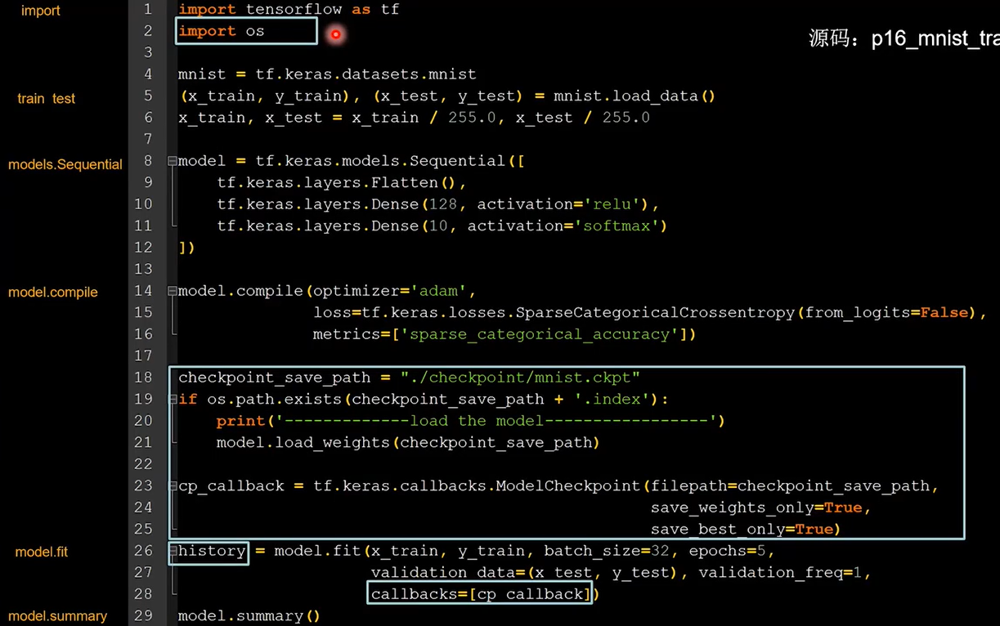
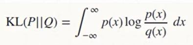
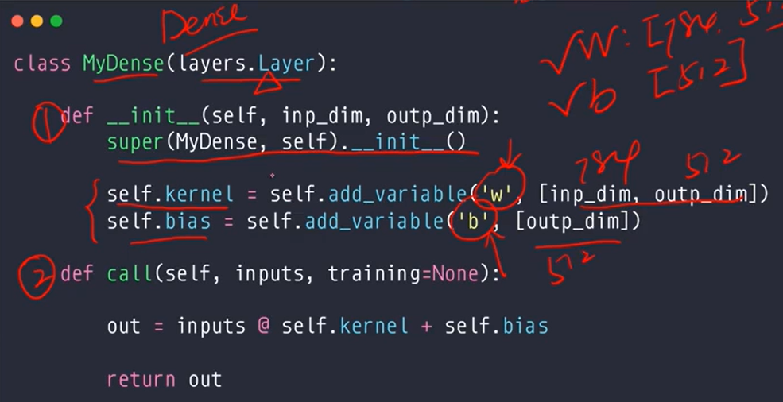
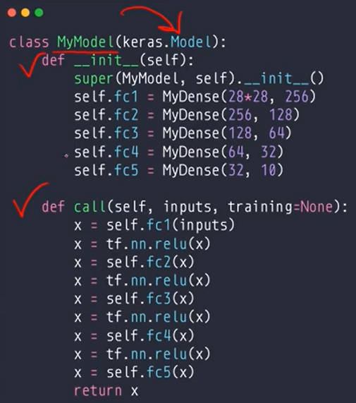
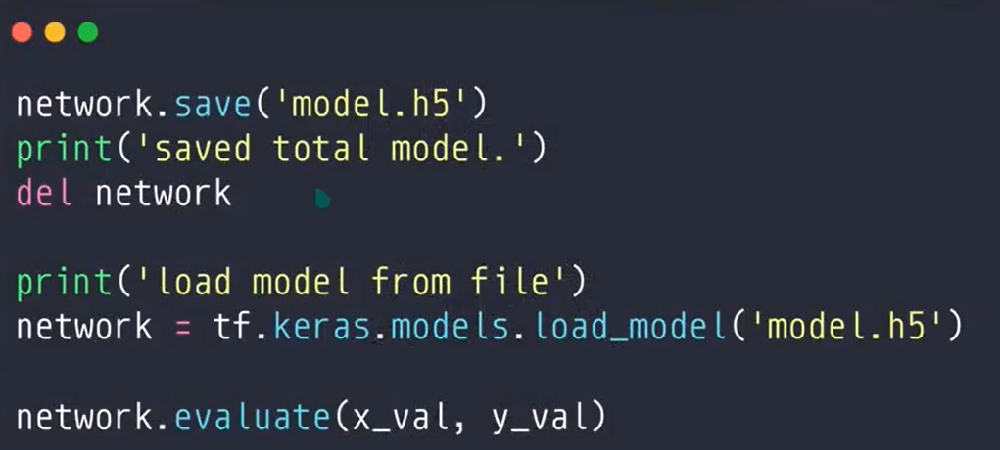

# 教程

### 生信曲线

https://www.bilibili.com/video/BV1HV411q7xD

P129-----未

回顾：P48，57，58

### 北京大学Tensorflow2.1

https://www.bilibili.com/video/BV1B7411L7Qt

案例：P12，

# 安装Tensorflow

```
pip install tensorflow -i https://mirrors.aliyun.com/pypi/simple
```

或

```
pip install tensorflow==1.8 -i https://mirrors.aliyun.com/pypi/simple
```

# 符号

α：Alpha，音标bai /ælfə/，中文读音为“阿尔法”

β：beta，音标/'beitə/，中文读音为“贝塔”

δ：delta，音标/'deltə/，中文读音为“得尔塔”

ε：epsilon，音标/ep'silon/，中文读音为“艾普西隆”

η：eta，音标/'i:tə/，中文读音为“伊塔”

θ：theta，音标/'θi:tə/，中文读音为“西塔”

ξ：xi，音标/ksi/，中文读音为“克西”

μ：mu，音标/mju:/，中文读音为“谬”

λ：lambda，音标/'læmdə/，中文读音为“拉姆达”

ρ：Rho，读作[rəʊ]，中文音译：柔

σ：sigma，中文音译：“西格玛”

# 数据地址

C:\Users\zhonghua.deng\.keras\datasets

# 注意点

### 去除提醒

```
import os
os.environ['TF_CPP_MIN_LOG_LEVEL'] = '2'
```

### 特定设备下创建Tensor

```
with tf.device("cpu"):
	a = tf.constant([1])
with tf.device("gpu"):
	b = tf.range(4)
#查找Tensor在哪个设备
a.device
#将另一个值在a的设备上创建
c = a.gpu()
```

### Tensor转换为numpy

```
a.numpy()
```

### Tensor转换为字符串

```
pred = tf.argmax(result, axis=1)
pred = pred.numpy()
pred = str(pred[0])
```

### ==其他数据类型转换为Tensor==

比如numpy数据类型转换为Tensor数据类型

```
aa = tf.convert_to_tensor(a)
```

```
aa = tf.convert_to_tensor(a,dtype=tf.int32)
```

### Tensor的数据类型转换

比如int32转换为bool行

```
tf.cast(aa,dtype=tf.bool)
```

转换为可训练的变量

```
b = tf.Variable(a)
```

### 维度

```
b.ndim()
```

```
tf.rank(b)
```

### 判断是否为Tensor类型

```
tf.is_tensor(b)  #推荐
```

```
isinstance(a,tf.Tensor)
```

### 转为独热编码

独热编码，如[0,1,0]，1在不同的位置，这个编码可以表示3种结果（如北京，上海，广州）

```
y = tf.one_hot(y,depth=10) #将y转换为10的onehot
```

```
train_label_onehot=tf.keras.utils.to_categorical(train_label)
```

### 修改学习速率adam

```
model.compile(optimizer=tf.keras.optimizers.Adam(learning_rate=0.01))
```

### 打散、打乱

```
idx = tf.range(10)
idx = tf.random.shuffle(idx)
```

### loss损失函数

```
loss = tf.keras.losses.mse(y,out)
```

```
loss = tf,reduce_mean(loss)
```

### 图片矩阵

```
Image:[b,h,w,c]
[图片数量，像素高度，像素宽度，RGB为3/灰度为1]
```


### tf.linspace(-10,10,10)

从-10到10创建等差序列，生成10个数

### 可训练变量

```
w = tf.Variable(tf.random.normal([2,2],mean=0,stddev=1))
```

### 特征与标签配对、绑定、切片

```
data = tf.data.Dataset.from_tensor_slices((输入标签,标签))
```

### with结构

+ 记录计算过程

```
with tf.GradientTape() as tape:
	grad = tape.gradient(函数,对谁求导)
```

### enumerate遍历

+ 遍历每个元素(如列表、元组、字符串)
+ 组合为：索引 元素

```
seq = ['one','two','three']

for i,element in enumerate(seq):
	prin(i,lement)
```

### 遍历文件夹图片

```
import os

for imgName in os.listdir('./images'):
	img_path = os.path.join('./images',imgName)
```


### 更新参数assign_sub

+ 先用tf.Variable定义变量为可训练

```
w = tf.Variable(4)
w.assign_sub(1)  #参数w自减1,也就是w = w-1
prin(w)  #3
```

### 返回[0,1)之间的随机数

```
np.random.RandomState.rand(维度)
```

### 展开

```
data1.ravel()  #将data1变为1维数组
```

```
data.flatten()
```

```
list1 = df['Actors'].str.split(',').tolist() #将每个电影的演员表以逗号为分隔转换成列表
flatten_list = [i for j in list1 for i in j]  #只适用于二维矩阵
```

### 等间隔取数

可以放n个数据data1,data2,data3......

```
data1,data2 = np.mgrid[1:3:1,2:4:2]
```


### 配对、组合

```
np.c_[数组1,数组2]  #将数组1的第一个与数组2的第一个配对...
```

### 不打印省略号...

```
np.set_printoptions(threshold=超过多少省略号显示)
np.set_printoptions(threshold=np.inf)  #np.inf表示无限大
```

### 冻结模型参数

```
def freeze_vgg_model(self):
	for layer in self.base_model.layers:
		layer.trainable=False
```

### 检测图片

```
from tensorflow.python.keras.preprocessing.image import load_image,image_to_array

def predict(self,model):
	model.load_weight('./chpt/.....ckpt')
	image = load_img('./.../...jpg',target_size=(224,224))
	image = img_to_array(image)   #图片转换为数组
	print(image.shape)
	# 转换为4维 [224,224,3] => [1,224,224,3]
	img = image.reshape([1,image.shape[0],image.shape[1],image.shape[2]])
```

### ==读取xml标记内容，保存到pkl中==

+ 从xml中读取到图片名、标记物体类别、标记物体位置信息。

+ 以字典（图片名：标记物体类别、标记物体位置）形式保存到pickle文件中, 变成序列化的数据

+ ```
  '000154.jpg': array([0.864   , 0.27466667, 0.992   , 0.288   , 0.    ,0.   , 1.   , 0.   ],[0.082   , 0.19466667, 0.762   , 0.704   , 0.   ,0.   , 0.   , 0.    ])
  ```

```
from xml.etree import ElementTree as ET
import os
import numpy as np
import pickle

class XmlProces(object):
    def __init__(self,file_path):
        self.xml_path=file_path
        self.num_classes = 4
        self.data = dict()

    def on_hot(self,name):
        one_hot_vector = [0] * self.num_classes
        if name == 'dog':
            one_hot_vector[0]=1
        elif name == 'chair':
            one_hot_vector[1]=1
        elif name =='person':
            one_hot_vector[2]=1
        elif name =='car':
            one_hot_vector[2]=1
        else:
            print('unknown label: %s' % name)
        return one_hot_vector

    def process_xml(self):
        for filename in os.listdir(self.xml_path):
            et = ET.parse(self.xml_path+filename)
            # 根元素
            root = et.getroot()
            # 获取其中元素
            image_name = root.find('filename').text
            size = root.find('size')
            width = float(size.find('width').text)
            height = float(size.find('height').text)
            # 获取图像每个物体的坐标
            bounding_boxes=[]
            one_hot_classes=[]
            for object_tree in root.findall('object'):
                for bounding_box in object_tree.iter('bndbox'):
                    xmin = float(bounding_box.find('xmin').text)/width
                    ymin = float(bounding_box.find('ymin').text)/height
                    xmax = float(bounding_box.find('xmax').text) / width
                    ymax = float(bounding_box.find('ymax').text) / width
                bounding_box = [xmin,ymin,xmax,ymax]
                bounding_boxes.append(bounding_box)
                # print(bounding_boxes)
                # 将类别进行one_hot编码
                object_name = object_tree.find('name').text
                one_hot_class = self.on_hot(object_name)
                one_hot_classes.append(one_hot_class)
                # print(one_hot_classes)
            # 拼接图片中的类别onehot和框位置
            bounding_boxes = np.asarray(bounding_boxes)
            one_hot_classes = np.asarray(one_hot_classes)
            image_data = np.hstack((bounding_boxes,one_hot_classes))
            print(image_data)
            # 将信息和对应名字保存为字典
            self.data[image_name] = image_data
        return None

if __name__ == '__main__':
    xp = XmlProces(f'D:\DataBase\commoditySets\Annotations/')
    xp.process_xml()
    # 打印位置、onehot信息和对应名字字典
    print(xp.data)
    pickle.dump(xp.data,open('./commodity_groundtruth.pkl','wb'))
```

### 设置模块包、import问题

+ 右击文件夹 =>  mark directory as => sources root

### 开启会话

```
tf.InteractiveSession()
```

### 图片转为数组

```
from PIL import Image 
import numpy as np

image = Image.open("/home/yang/图片/dog.jpg") # 用PIL中的Image.open打开图像
image_arr = np.array(image) # 转化成numpy数组
```

### 将图片转化为黑白图片

```
from PIL import Image

img = Image.open("Koala.jpg")   # 读取图片
img = img.convert("L")   # 转化为黑白图片
```

### 拼接路径（路径和路径）

```
export_path = os.path.join(tf.compat.as_bytes(path),tf.compat.as_bytes(str(version)))
```


# 标签软件

labelimg

https://github.com/tzutalin/labelImg

# 问题解决方案

### 梯度爆炸

梯度/模*15


# 上、下标含义


# ==激活函数==

### sigmoid

导数：σ'=σ(1-σ)


### tanh


+ 导数


### Relu


### Leaky Relu


### 激活函数的选择建议


# ==欠拟合、过拟合==

### 欠拟合


### 过拟合


#### 正则化L2方法

+ 防止过拟合

##### 方法1


##### 方法2（推荐，较灵活）


#### dropout方法

+ 防止过拟合
+ 可在每个隐藏层后添加一层dropout层

```
model.add(tf.keras.layers.Dropout(0.5))  #0.5即50%
```

#### Early stopping方法

+ 防止过拟合

# 优化器optimizer

### 1. SGD随机梯度下降


### 2. SGDM

+ 含momentum的SGD
+ 在SGD基础上增加一阶动量


### 3. Adagrad


### 4. RMSProp


### 5. Adam


# ==六步法、代码提纲==

神经网络八股功能

### 1. import 模块

### 2. train,test数据集

1. 获取数据

   ```
   pd.read_csv()
   ```

   + 自制数据集
   + 数据增强

2. 处理数据

   + 缺失值处理

     ```
     #缺失的数据是？，将？替换成nan再处理
     data1 = data1.replace(to_replace="?",value=np.nan)
     #删除缺失样本
     data1.dropna(inplace=True)
     #查看数据中每列是否存在缺失值
     data1.isnull().any()
     ```

   + 等等

3. 准备特征值、目标值

   1. ```
      #特征值:影响目标值的因素
      x = data1[["age","sex"]]
      x = data1.iloc[:,1,-1]
      ```
      
   2. ```
      #目标值：最终要求的值
      y = data1["survived"]
      ```

4. 划分数据集

   ```
   from sklearn.model_selection import train_test_split
   train_test_split(*.data,*.target,random_state=22)
   ```

5. 特征工程

   + 无量纲化-标准化-归一化

     ```
     from sklearn.preprocessing import StandardScaler
     transfer = StandardScaler()
     x_train = transfer.fit_transform(x_train)
     x_test = transfer.transform(x_test)
     ```

   + 标准差

   + 字典特征抽取

   + 等等

### 3_1. model=tf.keras.models.Sequential([网络结构])

1. 搭建网络结构
   + 拉直层：tf.keras.layers.Flatten()
   + 全连接层：tf.keras.layers.Dense(神经元个数,activation='激活函数',kernel_regularizer=哪种正则化)
     + 激活函数：relu、softmax、sigmoid、tanh
     + 正则：tf.keras.regularizer.l1()、tf.keras.regularizer.l2()
   + 卷积层：tf.keras.layers.Conv2D(filters=卷积核个数,kernel_size=卷积核大小,strides=卷积步长,padding='valid'or'same')
   + LSTM层：tf.keras.layers.LSTM()
2. 逐层描述每层网络

### 3_2. 用class类封装神经网络结构

1. class搭建网络结构

```
from tensorflow.keras.layers import Dense
from tensorflow.keras import Model

class MyModel(Model):
    def __init__(self):
        super(MyModel,self).__init__()
        定义神经网络结构块
        self.d1=Dense(3,......)  #举例
    def __call__(self,x):
        调用网络结构块，实现前向传播
        y=self.d1(x)  #举例
        return y
# 调用，实例化
model = MyModel()
```

### 4. model.compile(optimizer=优化器,loss=损失函数,metrics=['准确率'])

1. 配置训练方法

2. 选择优化器
   + 'sgd' or tf.keras.optimizer.SGD(lr=学习率,momentum=动量参数)
   + 'adagrad' or tf.keras.optimizer.Adagrad(lr=学习率)
   + 'adadelta' or tf.keras.optimizer.Adadelta(lr=学习率)
   + 'adam' or tf.keras.optimizer.Adam(lr=学习率,beta_1=0.9,beta_2=0.99)
   
3. 选择损失函数
   + 'mse' or tf.keras.losses.MeanSqueradError()
   + 'sparse_categorical_crossentropy' or tf.keras.losses.SparseCategoricalCrossentropy(from_logits=False)若预测结果输出前经过概率分布为False
   
4. 选择评测指标
   + 'accuracy'：y\_和y都是数值，如y_=[1]，y=[1]
   + 'categorical_accuracy'：y_和y都是独热码(概率分布)，如y\_=[0,1,0]，y=[0.256,0.695,0.048]
   + 'sparse_categorical_accuracy'：y_是数值，y是独热码(概率分布)，如y\_=[1]，y=[0.256,0.695,0.048]
   
5. 保存或者加载训练参数 `*.ckpt`

   

### 5. model.fit(训练集输入特征,训练集标签,batch_size=,epochs=,validation_data=(测试集输入特征,测试集标签),validation_split=从训练集划分多少给比例给测试集,validation_freq=多少次epoch测试一次,callbacks=[cp_callback])

1. 执行训练过程
2. validation_data和validation_split二选一
3. 告知训练集和测试集的特征、标签
4. 告知batch
5. 告知迭代次数
6. 断点续训 `callbacks=[cp_callback]`

---

这个是上面没有输入验证集的情况,进行打印验证

```
    def singlenn_evaluate(self):
        test_loss,test_acc = SingleNN.model.evaluate(self.x_test,self.y_test)
        print(test_loss,test_acc)
        return None
```

---

### 6. model.summary

1. 打印网络结构
2. 打印参数统计
3. 参数提取
4. acc,loss可视化

### 7. 参数提取，写入文件


### 8. acc/loss可视化


### 案例(鸢尾花_sequential方法)


### 案例(鸢尾花_class方法)


### 案例（minist_sequential方法）


### 案例（minist_class方法）


# ==神经网络八股功能扩展==


### ①读取自制数据，制作数据集

+ path：路径文件夹里很多训练图片
+ txt：每行空格前放了path文件夹里对应的图片名，空格后是图片对应的标签


### ②数据增强，扩充数据集


### ③断电续训，存取模型

读取模型、保存模型

```
load_weights
save_weights
callbacks
```




### ④参数提取，把参数存入文本


### ⑤acc/loss可视化，查看训练效果


### ⑥应用程序，给图识物


# ==保存、加载参数==

## ckpt（参数）


## ckpt

```python
import os
import numpy as np

def single_pridict(self):
    if os.path.exists("./ckpt/checkpoint"):
        SingleNN.model.load_weights("./ckpt/SingleNN")
    predictions = SingleNN.model.predict(self.x_test)
    return predictions

if __name__ == '__main__':
    snn = SingleNN()
    predictions = snn.single_pridict()
    print(predictions)
    # 打印结果为[1000,10]，找出第二维度上的最大值位置
    print(np.argmax(predictions,axis=1))
```


## h5（参数）

#### 直接保存

```
SingleNN.model.save_weights("./ckpt/SingleNN.h5")
```

#### 按epoch和acc最优保存

```
cp_callback = tf.keras.callbacks.ModelCheckpoint(filepath="./checkpoint/weights_{epoch:02d}-{val_sparse_categorical_accuracy:.2f}.hdf5",monitor='val_sparse_categorical_accuracy',
                                                 save_weights_only=True,
                                                 save_best_only=True,
                                                 mode='auto',
                                                 period=1)

history = model.fit(x_train, y_train, batch_size=32, epochs=5, validation_data=(x_test, y_test), validation_freq=1,callbacks=[cp_callback])
```

#### 按epoch和loss最优保存

```
cp_callback = tf.keras.callbacks.ModelCheckpoint(filepath="./checkpoint/weights_{epoch:02d}-{val_loss:.2f}.hdf5",
                                                 monitor='val_loss',
                                                 save_weights_only=True,
                                                 save_best_only=True,
                                                 mode='auto',
                                                 period=1)

history = model.fit(x_train, y_train, batch_size=32, epochs=5, validation_data=(x_test, y_test), validation_freq=1,callbacks=[cp_callback])
```

# ==保存、加载模型==

## 保存

```python
model = tf.keras.models.Sequential([
    tf.keras.layers.Flatten(),
    tf.keras.layers.Dense(128, activation='relu'),
    tf.keras.layers.Dense(10, activation='softmax')
])

checkpoint_save_path = "./checkpoint/mnist.ckpt"
model.load_weights(checkpoint_save_path)

# commodity为模型名称
def save_model_for_serving(version=1,path="./serving_model/commodity/"):
    export_path = os.path.join(tf.compat.as_bytes(path),tf.compat.as_bytes(str(version)))
    print('正在导出模型')
    tf.saved_model.save(model, export_path)
```


## 保存的例子

+ 手写图片2.png放在同目录下（字黑色，背景白色）

```python
import tensorflow as tf
import os
import numpy as np

np.set_printoptions(threshold=np.inf)

mnist = tf.keras.datasets.mnist
(x_train, y_train), (x_test, y_test) = mnist.load_data()
x_train, x_test = x_train / 255.0, x_test / 255.0

model = tf.keras.models.Sequential([
    tf.keras.layers.Flatten(),
    tf.keras.layers.Dense(128, activation='relu'),
    tf.keras.layers.Dense(10, activation='softmax')
])

model.compile(optimizer='adam',
              loss=tf.keras.losses.SparseCategoricalCrossentropy(from_logits=False),
              metrics=['sparse_categorical_accuracy'])

# checkpoint_save_path = "./checkpoint/mnist.ckpt"
# if os.path.exists(checkpoint_save_path + '.index'):
#     print('-------------load the model-----------------')
#     model.load_weights(checkpoint_save_path)
#
# cp_callback = tf.keras.callbacks.ModelCheckpoint(filepath=checkpoint_save_path,
#                                                  save_weights_only=True,
#                                                  save_best_only=True)

history = model.fit(x_train, y_train, batch_size=32, epochs=5, validation_data=(x_test, y_test), validation_freq=1)
model.summary()

model_path = "./ckpt/mnist.h5"
model.save(model_path)
```


## 加载模型的例子

+ 之前的保存操作在上面“保存模型的例子”

```
from PIL import Image
import numpy as np
import tensorflow as tf

# model_save_path = './checkpoint/mnist.ckpt'

model_path = "./ckpt/mnist.h5"

# model = tf.keras.models.Sequential([
#     tf.keras.layers.Flatten(),
#     tf.keras.layers.Dense(128, activation='relu'),
#     tf.keras.layers.Dense(10, activation='softmax')])

# model.load_weights(model_save_path)

model = tf.keras.models.load_model(model_path)

img_path = "data/images/2.png"
img = Image.open(img_path)
img = img.resize((28, 28), Image.ANTIALIAS)
img_arr = np.array(img.convert('L'))

for i in range(28):
    for j in range(28):
        if img_arr[i][j] < 200:
            img_arr[i][j] = 255
        else:
            img_arr[i][j] = 0

img_arr = img_arr / 255.0
x_predict = img_arr[tf.newaxis, ...]


result = model.predict(x_predict)
pred = tf.argmax(result,axis=1)
pred = pred.numpy()
print(pred)
```


# ==部署图片处理==

```
from PIL import Image
import numpy as np
import tensorflow as tf

model_save_path = './checkpoint/mnist.ckpt'

model = tf.keras.models.Sequential([
    tf.keras.layers.Flatten(),
    tf.keras.layers.Dense(128, activation='relu'),
    tf.keras.layers.Dense(10, activation='softmax')])

model.load_weights(model_save_path)

img_path = "./1.png"
img = Image.open(img_path)
img = img.resize((28, 28), Image.ANTIALIAS)
img_arr = np.array(img.convert('L'))

for i in range(28):
    for j in range(28):
        if img_arr[i][j] < 200:
            img_arr[i][j] = 255
        else:
            img_arr[i][j] = 0

img_arr = img_arr / 255.0
x_predict = img_arr[tf.newaxis, ...]


result = model.predict(x_predict)
pred = tf.argmax(result,axis=1)
print(pred)
```


# 压缩范围、输出方式

### tf.nn.softmax(out,axis=1)

将数据映射到 [0,1]，并且概率之和为1


### sigmoid

映射到 [0,1]

### tanh

映射到 [-1,1]


# ==读取文件数据==

### 本地图片数据读取

```
kearas.preprocessing.image import ImageDataGenerator
train_datagen = ImageDataGenerator(
	rescale=1.0/255.0,
	shear_range=
	zoom_range=
	horizontal_flip=
)
test_datagen = ImageDataGenerator(
	rescale=1.0/255.0,
	shear_range=
	zoom_range=
	horizontal_flip=
)
```

```
#读取本地
train_generator=train_datagen.flow_from_directory(directory=读取目录,
					target_size=(高,宽),
					batch_size=批数量大	小,
					class_mode='目标值格式binary/categorical/sparse',
					shuffle=True)
test_generator=test_datagen.flow_from_directory(directory=读取目录,
					target_size=(高,宽),
					batch_size=批数量大	小,
					class_mode='目标值格式binary/categorical/sparse',
					shuffle=True)
```

```
#图片文件夹格式
data/
	train/
		dogs/
			dog001.jpg
			...
		cats/
			cat00.jpg
			...
	validataion/
		dogs/
			dog001.jpg
```

```
model.fit_generator(
		train_generator,
		steps_per_epoch=2000,
		epochs=50,
		validation_data=validation_generator,
		validation_steps=800
)
```

### 获取图片数据、标注数据

```
from
```


# ==创建矩阵==

### 创建相同维度的矩阵

```
a = tf.zeros([2,3,3])
b = tf.zeros_like(a)
```

```
a = tf.zeros([2,3,3])
b = tf.zeros(a.shpe)
```

### 创建一个填充数据矩阵

```
a = tf.fill([2,2],9)
```

### ==创建一个平均值为1，方差为1的正态分布矩阵==

```
a = tf.random.normal([2,2],mean=1,stddv=1)
```

### 创建阶段是正态分布矩阵

+ 生成的数更集中一点

+ 取值范围在(μ-2σ.μ+2σ)，保证值在均值附近

```
tf.random.truncated_normal(维度,mean=均值,stddev=标准差)
```


### 创建一个0~1均匀分布的矩阵

```
a = tf.random.uniform([2,2],minval=0,maxval=1)
```

```
a = tf.random.uniform([10],maxval=10,dtype=tf.int32)
```

# 索引与切片

### 索引

+ 方法1


+ 方法2（推荐）


### 切片


#### 步长


#### 负步长（倒采样）


#### 省略号...


#### Selective Indexing

#### 从某个维度中取样gather


#### 从不同维度取样gather_nd


### tf.boolean_mask（默认0维度上）


# 维度变换

### 维度交换tf.transpose

（perm）


### 增加维度expand_dims


### 减少维度squeeze


# Broadcasting自动补充维度

方便计算


# 张量的合并与分割

### tf.concat  #合并。原有的维度上合并


### tf.split  #分割


### tf.stack  #合并。创建新维度上合并


### tf.unstack  #分割


# 数学运算

### 加减乘除

前提：维度相同

```
tf.add(张量1,张量2)
tf.subtract(张量1,张量2)
tf.multiply(张量1,张量2)
tf.divide(张量1,张量2)
```


### tf.math.log,  tf.exp

### log2, log10


### tf.pow次方，tf.sqart 根方，tf.square平方


### @， matmul  矩阵相乘


### tf.broadcast_to


# 数据统计

### tf.norm（默认ord=2，在所有维度上）

##### 向量范数，相当于求向量的模的大小


### tf.reduce_min/max/mean


### tf.argmax/argmin


### tf.equal


### tf.unique


# 张量排序

### Sort/argsort


### Topk 最大值


### Top-5 Acc.

# 填充与复制

### pad  填充


### tile 复制

1表示当前维度不复制，2表示当前维度复制一次


### broadcast_to  复制（相比tile，在运行时复制，不占内存）

# 张量限幅

### clip_by_value


### relu


### clip_by_norm  等比放缩

向量的方向不变，改变模的长度


### gradient clipping  解决梯度爆炸

通过裁减的方式，保持方向不变，等比缩放。解决梯度爆炸的问题

clip_by_global_norm

# 高阶操作

### where

```
a = tf.constant([1,2,3,1,1])
b = tf.constant([0,1,2,4,5])
c = tf.where(tf.greater(a,b),a,b) #若a>b,返回a对应位置的元素，否则返回b对应位置的元素
# 结果[1,2,3,4,5]
```

+ 预测y > 真实y_吗？  真则用第一个函数，假则用第二个函数


### scatter_nd

有目的性更新，更新替换到目标位置


### meshgrid？？？

并行生成一系列的坐标点

# 数据加载

### keras.datasets

1. boston housing

2. mnist/fashion mnist

3. cifar10/100

   

4. imdb

### tf.data.Dataset.from_tensor_slices


该函数是dataset核心函数之一，它的作用是把给定的元组、列表和张量等数据进行特征切片。切片的范围是从最外层维度开始的。

如果有多个特征进行组合，那么一次切片是把每个组合的最外维度的数据切开，分成一组一组的。


随机打散（按照x和y为一对组合后，进行打散数据。打散后x对应y还是原来的）


### 数据预处理


### .batch


### StopIteration  阻止迭代死循环


### .repeat()


### 综合案例


# 全连接层


# 梯度下降

```
#创建梯度环境
with tf.GradientTape() as tape:
	w = tf.Variable(tf.constant(3.0))
	loss = tf.pow(w,2)
	grad = tape.gradient(loss,w)
print(grad)
```


# ==损失函数及其梯度==

### MSE


### Cross Entropy 交叉熵

熵越小，越不确定，信息量越大

熵越大，分布越稳定

#### 熵


#### 交叉熵

预测越准，交叉熵越小


#### KL散度




### softmax


### softmax与交叉熵结合


# 反向传播

### 单输出感知机梯度


### 多输出感知机梯度


### 反向传播算法


# 过程

1. 导入

   ```
   import tensorflow as tf
   import pandas as pd
   import numpy as np
   import matplotlib.pyplot as plt
   %matplotlib inline
   ```

2. 建立模型

   ```
   model=tf.keras.Sequential()
   ```

3. 添加层

   + model.add一次为添加一层隐藏层，参数分别为输入个数，输出个数，以及激活函数
   + 上一层的个数为下一层的输入个数
   + Dense构造ax1+bx2+cx3+d，第一个参数为输出单元数，input_shape=(3,)为3个特征值。Dense第三个参数为activation激活函数(relu、softmax)

   ```
   model.add(tf.keras.layers.Dense(4,input_shape=(15,),activation='relu'))
   model.add(tf.keras.layers.Dense(4,activation='relu'))
   model.add(tf.keras.layers.Dense(1,activation='sigmoid'))
   ```

4. 查看模型框架

   ```
   model.summary()  
   ```

5. 优化器

   + optimizer学习速率， adam默认为0.001。loss(mse均方差、binary_crossentropy交叉熵、sparse_categorical_crossentropy)。metrics运行中计算

   ```
   model.compile(optimizer='adam',loss='mse、binary_crossentropy',metrics=['acc'])  
   
   ```

6. 训练模型

   + epochs迭代次数
   + validation_data验证数据，在训练过程可看到loss和acc的情况

   ```
   history=model.fit(x,y,epochs=30,validation_data=(test_img,test_label_onehot))   
   ```

7. 画图，检验训练过程，判断增加减少迭代次数

   ```
   history.history.keys()  #查看训练模型的key有哪些
   ```

   ```
   plt.plot(history.epoch,history.history.get('loss'),label='loss')  #查看迭代次数与损失值的图像
   plt.plot(history.epoch,history.history.get('acc'),label='acc')  #查看迭代次数与正确率的图像
   plt.legend()
   ```

8. 测试模型

   ```
   model.evaluate(test_img,test_label)
   ```

   ```
   model.predict(test_data)
   ```
   
9. 注释

## 过程案例

```
import os
os.environ['TF_CPP_MIN_LOG_LEVEL']='2'
import tensorflow as tf
from tensorflow import keras
from tensorflow.keras import datasets,layers,optimizers

(x,y),(x_val,y_val) = datasets.mnist.load_data()
x = tf.convert_to_tensor(x,dtype=tf.float32)/255.
y = tf.convert_to_tensor(y,dtype=tf.float32)
y = tf.one_hot(y,depth=10)
print(x.shape,y.shape)
train_dataset = tf.data.Dataset.from_tensor_slices((x,y))
train_dataset=train_dataset.batch(200)  # 一次加载200张图片

model = keras.Sequential([
    layers.Dense(512,activation='relu'),
    layers.Dense(256,activation='relu'),
    layers.Dense(10)
])

optimizers = optimizers.SGD(learning_rate=0.001)

def train_epoch(epoch):
    for step,(x,y) in enumerate(train_dataset):
        with tf.GradientTape() as tape:
            x= tf.reshape(x,(-1,28*28))
            out = model(x)
            loss = tf.reduce_sum(tf.square(out-y))/x.shape[0]
        grads = tape.gradient(loss,model.trainable_variables)
        optimizers.apply_gradients(zip(grads,model.trainable_variables))
        if step % 100 == 0:
            print(epoch,step,'loss:',loss.numpy())

def train():
    for epoch in range(30):
        train_epoch(epoch)

if __name__ == '__main__':
    train()
```

# ==案例==

## 鸢尾花神经网络案例（重要，背）

```
import os
os.environ['TF_CPP_MIN_LOG_LEVEL'] = '2'
from sklearn import datasets
from sklearn.model_selection import train_test_split
import tensorflow as tf

import matplotlib.pyplot as plt
import numpy as np
import pandas as pd
iris = datasets.load_iris()

# x_data = iris.data
# y_data = iris.target
# np.random.seed(116)
# np.random.shuffle(x_data)
# np.random.seed(116)
# np.random.shuffle(y_data)
# x_train = x_data[:-30]
# y_train = y_data[:-30]
# x_test = x_data[-30:]
# y_test = y_data[-30:]
#
# x_train = tf.cast(x_train,tf.float32)
# x_test = tf.cast(x_test,tf.float32)

x_train,x_test,y_train,y_test = train_test_split(iris.data,iris.target,random_state=6)

x_train = tf.cast(x_train,tf.float32)
x_test = tf.cast(x_test,tf.float32)

train_db = tf.data.Dataset.from_tensor_slices((x_train, y_train)).batch(32)
test_db = tf.data.Dataset.from_tensor_slices((x_test, y_test)).batch(32)

w1 = tf.Variable(tf.random.truncated_normal([4, 3], stddev=0.1, seed=1))
b1 = tf.Variable(tf.random.truncated_normal([3], stddev=0.1, seed=1))
lr = 0.1
train_loss_results = []
test_acc = []
epoch = 500
loss_all = 0
# print(w1.dtype,b1.dtype)
for epoch in range(epoch):
    for step, (x_train, y_train) in enumerate(train_db):
        with tf.GradientTape() as tape:
            y = tf.matmul(x_train, w1) + b1
            y = tf.nn.softmax(y)
            y_ = tf.one_hot(y_train, depth=3)
            loss = tf.reduce_mean(tf.square(y_ - y))
            loss_all += loss.numpy()
        grads = tape.gradient(loss, [w1, b1])
        w1.assign_sub(lr * grads[0])
        b1.assign_sub(lr * grads[1])
    print('Epoch{},loss:{}'.format(epoch, loss_all / 4))
    train_loss_results.append(loss_all / 4)
    loss_all = 0

    # 测试
    total_correct, total_number = 0, 0
    for x_test, y_test in test_db:
        y = tf.matmul(x_test, w1) + b1
        y = tf.nn.softmax(y)
        pred = tf.argmax(y, axis=1)
        pred = tf.cast(pred, dtype=y_test.dtype)
        correct = tf.cast(tf.equal(pred, y_test), dtype=tf.int32)
        correct = tf.reduce_sum(correct)
        total_correct += int(correct)
        total_number += x_test.shape[0]
    acc = total_correct / total_number
    test_acc.append(acc)
    print('Test_acc:', acc)
    print('-' * 100)

# 绘制loss
plt.figure(figsize=(20, 8), dpi=80)
plt.title('Loss Function Curve')
plt.xlabel('Epoch')
plt.ylabel('Loss')
plt.plot(train_loss_results, label='$Loss$')
plt.legend()
plt.show()

# 绘制Accuracy
plt.figure(figsize=(20, 8), dpi=80)
plt.title('Acc Curve')
plt.xlabel('Epoch')
plt.ylabel('Loss')
plt.plot(test_acc, label='$Accuracy$')
plt.legend()
plt.show()
```

## 梯度下降案例mnist

```
import os
os.environ['TF_CPP_MIN_LOG_LEVEL'] = '2'
import tensorflow as tf
from tensorflow import keras
from tensorflow.keras import datasets

# 加载数据集x:[60k,28,28] y:[60k]
(x,y),_ = datasets.mnist.load_data()
# 转换为tensor类型. 缩小数据范围0~255 → 0~1
x = tf.convert_to_tensor(x,dtype=tf.float32)/255.
y = tf.convert_to_tensor(y,dtype=tf.int32)
# print(x.shape,y.shape,x.dtype,y.dtype)
# print(tf.reduce_min(x),tf.reduce_max(x))
# print(tf.reduce_min(y),tf.reduce_max(y))
train_db = tf.data.Dataset.from_tensor_slices((x,y)).batch(128)
train_iter = iter(train_db)
sample = next(train_iter)
print('batch:',sample[0].shape,sample[1].shape)
# 神经网络
w1 = tf.Variable(tf.random.truncated_normal([784,256],stddev=0.1))
b1 = tf.Variable(tf.zeros([256]))
w2 = tf.Variable(tf.random.truncated_normal([256,128],stddev=0.1))
b2 = tf.Variable(tf.zeros([128]))
w3 = tf.Variable(tf.random.truncated_normal([128,10],stddev=0.1))
b3 = tf.Variable(tf.zeros([10]))

# 学习速率
lr = 1e-3
for epoch in range(10):
    for step,(x,y) in enumerate(train_db):
        # x:(128, 28, 28) y:(128,)
        # [b,28,28] => [b,28*28]
        x = tf.reshape(x,[-1,28*28])
        with tf.GradientTape() as tape:
            # [b,784]@[784,256]+[256] => [b,256]+[256]
            h1 = x@w1 + tf.broadcast_to(b1,[x.shape[0],256])
            h1 = tf.nn.relu(h1)
            h2 = h1@w2 + b2
            h2 = tf.nn.relu(h2)
            out = h2@w3 + b3
            # 计算误差loss
            # out:[b,10]
            # y:[b] => [b,10]
            y_onehot = tf.one_hot(y,depth=10)
            loss = tf.square(y_onehot - out)
            loss = tf.reduce_mean(loss)
        # 计算梯度
        grads = tape.gradient(loss,[w1,b1,w2,b2,w3,b3])
        # w1 = w1 - lr * grads[0]
        w1.assign_sub(lr*grads[0])
        b1.assign_sub(lr * grads[1])
        w2.assign_sub(lr * grads[2])
        b2.assign_sub(lr * grads[3])
        w3.assign_sub(lr * grads[4])
        b3.assign_sub(lr * grads[5])

        if step % 100 == 0:
            print(epoch,step,'loss:',float(loss))

```

## 梯度下降案例fashion_mnist

```
import os
os.environ['TF_CPP_MIN_LOG_LEVEL'] = '2'
import tensorflow as tf
from tensorflow import keras
from tensorflow.keras import datasets, layers, optimizers, Sequential, metrics

def preprocess(x,y):
    x = tf.cast(x,dtype=tf.float32)/255.
    y = tf.cast(y,dtype=tf.int32)
    return x,y

# 获取数据
(x,y),(x_test, y_test) = datasets.fashion_mnist.load_data()
# print(x.shape,y.shape)

batchsz = 128
db = tf.data.Dataset.from_tensor_slices((x,y))
db = db.map(preprocess).shuffle(10000).batch(batchsz)
db_test = tf.data.Dataset.from_tensor_slices((x_test,y_test))
db_test = db_test.map(preprocess).batch(batchsz)

db_iter = iter(db)
sample = next(db_iter)
# print(sample[0].shape, sample[1].shape)

# 构建网络
model = Sequential([
    layers.Dense(256,activation=tf.nn.relu),  # 784 => 256
    layers.Dense(128,activation=tf.nn.relu),  # 256 => 128
    layers.Dense(64,activation=tf.nn.relu),  # 128 => 64
    layers.Dense(32,activation=tf.nn.relu),  # 64 => 32
    layers.Dense(10,activation=tf.nn.relu)  # 32 => 10
])
# 模型传入输入维度
model.build(input_shape=[None,28*28])
# 调试， 打印网络架构
model.summary()
# w = w - lr*grad
optimizer = optimizers.Adam(lr = 1e-3)

def main():
    for epoch in range(30):
        for step, (x,y) in enumerate(db):
            # x: [b,28,28] => [b,784]
            # y: [b]
            x = tf.reshape(x,[-1,28*28])
            with tf.GradientTape() as tape:
                # [b,784] => [b,10]
                logits = model(x)
                y_onehot = tf.one_hot(y,depth=10)
                loss_mse = tf.reduce_mean(tf.losses.MSE(y_onehot,logits))
                loss_ce = tf.reduce_mean(tf.losses.categorical_crossentropy(y_onehot,logits,from_logits=True))
            grads = tape.gradient(loss_ce, model.trainable_variables)
            # zip每对前一个是w后一个是lr*grad
            optimizer.apply_gradients(zip(grads,model.trainable_variables))

            if step % 100 ==0:
                print(epoch,step,'loss:',float(loss_ce),float(loss_mse))

        # test
        totol_correct = 0
        totol_num = 0
        x = tf.reshape(x,[-1,28*28])
        logits = model(x)
        # logits =>prob,[b,10]
        prob = tf.nn.softmax(logits,axis=1)
        # [b,10] => [b], int64 => int32
        pred = tf.argmax(prob,axis=1)
        pred = tf.cast(pred,dtype=tf.int32)
        # pred: [b]
        #y : [b]
        # correct :[b],True:equal
        correct = tf.equal(pred,y)
        correct = tf.reduce_sum(tf.cast(correct,dtype=tf.int32))
        totol_correct += int(correct)
        totol_num += x.shape[0]

        acc = totol_correct/totol_num
        print(epoch,'test acc:',acc)


if __name__ == '__main__':
    main()
```

## 自定义层、网络Cifar10

保存模型参数

```
import os
os.environ['TF_CPP_MIN_LOG_LEVEL'] = '2'
import tensorflow as tf
from tensorflow import keras
from tensorflow.keras import datasets,layers,optimizers,Sequential,metrics

def preprocess(x,y):
    x = tf.cast(x,dtype=tf.float32)/255.
    y = tf.cast(y,dtype=tf.int32)
    return x,y

batchsz = 128
(x,y),(x_val,y_val) = datasets.cifar10.load_data()
y = tf.squeeze(y)
y_val=tf.squeeze(y_val)
y = tf.one_hot(y,depth=10)
y_val = tf.one_hot(y_val,depth=10)
print('datasets:',x.shape,y.shape,x.min(),x.max())

train_db = tf.data.Dataset.from_tensor_slices((x,y))
train_db = train_db.map(preprocess).shuffle(10000).batch(batchsz)
test_db = tf.data.Dataset.from_tensor_slices((x_val,y_val))
test_db = test_db.map(preprocess).batch(batchsz)

sample = next(iter(train_db))
print('batch:',sample[0].shape, sample[1].shape)

class MyDense(layers.Layer):
    def __init__(self,inp_dim,out_dim):
        super(MyDense,self).__init__()
        self.kernel = self.add_variable('w',[inp_dim,out_dim])
        # self.bias = self.add_variable('b',[out_dim])


    def call(self, inputs, training=None):
        x = inputs @ self.kernel
        return x

# MyNetwork调用MyDense层
class MyNetwork(keras.Model):
    def __init__(self):
        super(MyNetwork,self).__init__()
        self.fc1 = MyDense(32*32*3,256)
        self.fc2 = MyDense(256,128)
        self.fc3 = MyDense(128, 64)
        self.fc4 = MyDense(64, 32)
        self.fc5 = MyDense(32, 10)

    def call(self,inputs,training=None):
        """
        :param inputs:[b,32,32,3]
        :param training:
        :return:
        """
        x = tf.reshape(inputs,[-1,32*32*3])
        x = self.fc1(x)
        x = self.fc2(x)
        x = self.fc3(x)
        x = self.fc4(x)
        x = self.fc5(x)
        return x

network = MyNetwork()
network.compile(optimizer=optimizers.Adam(lr=1e-3),
                loss=tf.losses.CategoricalCrossentropy(from_logits=True),
                metrics=['accuracy'])
network.fit(train_db,epochs=5,validation_data=test_db,validation_freq=1)

network.evaluate(test_db)
network.save_weights('ckpt/weight.ckpt')
del network
print('saved to ckpt/weight.ckpt')

network = MyNetwork()
network.compile(optimizer=optimizers.Adam(lr=1e-3),
                loss=tf.losses.CategoricalCrossentropy(from_logits=True),
                metrics=['accuracy'])
network.load_weights('ckpt/weight.ckpt')
print('loaded weights from file.')
network.evaluate(test_db)
```

## 卷积案例Cifar100(VGG)


```
import os
os.environ['TF_CPP_MIN_LOG_LEVEL'] = '2'
import tensorflow as tf
from tensorflow import keras
from tensorflow.keras import datasets, layers, optimizers, Sequential, metrics

tf.random.set_seed(2345)
conv_layers = [
    # 5 units of conv + max pooling
    layers.Conv2D(64,kernel_size=[3,3],padding="same",activation=tf.nn.relu),
    layers.Conv2D(64,kernel_size=[3,3],padding="same",activation=tf.nn.relu),
    layers.MaxPooling2D(pool_size=[2,2],strides=2,padding="same"),

    layers.Conv2D(128, kernel_size=[3, 3], padding="same", activation=tf.nn.relu),
    layers.Conv2D(128, kernel_size=[3, 3], padding="same", activation=tf.nn.relu),
    layers.MaxPooling2D(pool_size=[2, 2], strides=2, padding="same"),

    layers.Conv2D(256, kernel_size=[3, 3], padding="same", activation=tf.nn.relu),
    layers.Conv2D(256, kernel_size=[3, 3], padding="same", activation=tf.nn.relu),
    layers.MaxPooling2D(pool_size=[2, 2], strides=2, padding="same"),

    layers.Conv2D(512, kernel_size=[3, 3], padding="same", activation=tf.nn.relu),
    layers.Conv2D(512, kernel_size=[3, 3], padding="same", activation=tf.nn.relu),
    layers.MaxPooling2D(pool_size=[2, 2], strides=2, padding="same"),

    layers.Conv2D(512, kernel_size=[3, 3], padding="same", activation=tf.nn.relu),
    layers.Conv2D(512, kernel_size=[3, 3], padding="same", activation=tf.nn.relu),
    layers.MaxPooling2D(pool_size=[2, 2], strides=2, padding="same"),
]

# 预处理函数
def preprocess(x,y):
    x = tf.cast(x,dtype=tf.float32)/255.
    y = tf.cast(y,dtype=tf.int32)
    return x,y

# 数据加载
(x,y),(x_test,y_test) = datasets.cifar100.load_data()
y = tf.squeeze(y,axis=1)
y_test = tf.squeeze(y_test,axis=1)
print(x.shape,y.shape,x_test.shape,y_test.shape)

train_db = tf.data.Dataset.from_tensor_slices((x,y))
train_db = train_db.shuffle(1000).map(preprocess).batch(64)
test_db = tf.data.Dataset.from_tensor_slices((x_test,y_test))
test_db = test_db.map(preprocess).batch(64)

sample = next(iter(train_db))
print('sample:',sample[0].shape,sample[1].shape,tf.reduce_min(sample[0]),tf.reduce_max([0]))


def main():
    # [b,32,32,3] => [b,1,1,512]
    conv_net = Sequential(conv_layers)
    conv_net.build(input_shape=[None,32,32,3])
    # x = tf.random.normal([4,32,32,3])
    # out = conv_net(x)
    # print(out.shape)

    # 全连接
    fc_net = Sequential([
        layers.Dense(256,activation=tf.nn.relu),
        layers.Dense(128, activation=tf.nn.relu),
        layers.Dense(100, activation=None),
    ])
    conv_net.build(input_shape=[None,32,32,3])
    fc_net.build(input_shape=[None,512])

    # 优化器
    optimizer = optimizers.Adam(learning_rate=1e-4)

    # [1,2] + [3,4] => [1,2,3,4]
    variables = conv_net.trainable_variables + fc_net.trainable_variables

    for epoch in range(50):
        for step,(x,y) in enumerate(train_db):
            with tf.GradientTape() as tape:
                # [b,32,32,3] => [b,1,1,512]
                out = conv_net(x)
                # reshape flatten => [b,512]
                out = tf.reshape(out,[-1,512])
                # [b,512] => [b,100]
                logits = fc_net(out)
                # [b] => [b,100]
                y_onehot = tf.one_hot(y,depth=100)
                # compute loss
                loss = tf.losses.categorical_crossentropy(y_onehot,logits,from_logits=True)
                loss = tf.reduce_mean(loss)
            # 梯度求导，loss对各个参数的偏导
            grads = tape.gradient(loss,variables)
            optimizer.apply_gradients(zip(grads,variables))
            if step % 100 == 0:
                print(epoch,step,'loss:',float(loss))

        # 测试数据
        total_num = 0
        total_correct = 0
        for x,y in test_db:
            out = conv_net(x)
            out = tf.reshape(out,[-1,512])
            logits = fc_net(out)
            prob = tf.nn.softmax(logits,axis=1)
            pred = tf.argmax(prob,axis=1)
            pred = tf.cast(pred,dtype=tf.int32)
            correct = tf.cast(tf.equal(pred,y),dtype=tf.int32)
            correct = tf.reduce_sum(correct)

            total_num += x.shape[0]
            total_correct += int(correct)
        acc = total_correct/total_num
        print(epoch,'acc',acc)

if __name__ == '__main__':
    main()

```

## resnet_framework

ResNet框架

```
import os
os.environ['TF_CPP_MIN_LOG_LEVEL'] = '2'
import tensorflow as tf
from tensorflow import keras
from tensorflow.keras import datasets, layers, optimizers, Sequential, metrics

class BasicBlock(layers.Layer):
    def __init__(self,filter_num,stride=1):
        super(BasicBlock,self).__init__()
        self.conv1 = layers.Conv2D(filter_num,(3,3),strides=stride,padding='same')
        self.bn1 = layers.BatchNormalization()
        self.relu = layers.Activation('relu')

        self.conv2 = layers.Conv2D(filter_num,(3,3),strides=1,padding='same')
        self.bn2 = layers.BatchNormalization()

        if stride != 1:
            self.downsample = Sequential()
            self.downsample.add(layers.Conv2D(filter_num,(1,1),strides=stride))
        else:
            self.downsample = lambda x:x

    def call(self,inputs,training=None):
        out = self.conv1(inputs)
        out = self.bn1(out)
        out = self.relu(out)

        out = self.conv2(out)
        out = self.bn2(out)

        identity = self.downsample(inputs)

        output = layers.add([out,identity])
        output = tf.nn.relu(output)
        return output

class ResNet(keras.Model):
    def __init__(self,layer_dims,num_classes=100): # [2,2,2,2]
        super(ResNet, self).__init__()
        self.stem = Sequential([layers.Conv2D(64,(3,3),strides=(1,1)),
                                layers.BatchNormalization(),
                                layers.Activation('relu'),
                                layers.MaxPool2D(pool_size=(2,2),strides=(1,1),padding='same')])
        self.layer1 = self.build_resblock(64,layer_dims[0])
        self.layer2 = self.build_resblock(128,layer_dims[1],stride=2)
        self.layer3 = self.build_resblock(256,layer_dims[2],stride=2)
        self.layer4 = self.build_resblock(512,layer_dims[3],stride=2)

        # output:[b,512,h,w]
        self.avgpool = layers.GlobalAveragePooling2D()
        self.fc = layers.Dense(num_classes)

    def call(self,inputs,training=None):
        x = self.stem(inputs)
        x = self.layer1(x)
        x = self.layer2(x)
        x = self.layer3(x)
        x = self.layer4(x)

        #[b,c]
        x = self.avgpool(x)
        # [b,100]
        x = self.fc(x)
        return x


    def build_resblock(self, filter_num, blocks, stride=1):
        res_blocks = Sequential()
        res_blocks.add(BasicBlock(filter_num, stride))

        for _ in range(1, blocks):
            res_blocks.add(filter_num, stride=1)
        return res_blocks

def resnet18():
    return ResNet([2,2,2,2])

def resnet34():
    return ResNet([3,4,6,3])
```

## ResNet_Cifar100案例

```

```


# 函数式API、链式

```
input = keras.Input(shape=(28,28))
x1 = keras.layers.Flatten()(input)
x2 = keras.layers.Dense(10,activation='sigmoid')(x1)
output = keras.layers.Dense(1,activation='sigmoid')(x)
model = keras.Model(inputs=input,outputs=output)
```

# Tensorboard

1. anaconda进入特定环境

2. cd进入到工程目录

3. ```
   #conda环境中输入
   tensorboard --logdir logs
   ```

4. 写日志

   ```
      import datetime
      current_time = datetime.datetime.now().strftime("%Y%m%d-%H%M%S")
      log_dir = 'log/' + current_time
      summary_writer = tf.summary.create_file_writer(log_dir)
   ```

5. 写内容

   ```
   with summary_writer.as_default():
   	tf.summary.scalar('train-loss',float(loss_ce),step=step)
   ```
   
6. 回调代码 

   + 在model.fit的callback调用

   ````
   callback = keras.callbacks.TensorBoard(log_dir='./graph',
   										histogram_freq=1,
   										write_graph=True,
   										write_images=Ture)
   model.fit(callbacks=[callback])
   ````

   
# 自定义层或网络





# 模型的加载与保存

### save/load weights

1. 保留参数
2. load时，Sequential代码必须与之前save时一模一样


### save/load entire model

保存所有，较完整



### saved_model

1. 保存为.onnx文件
2. 可以用C++打开，并进行一个工厂的部署


# 交叉验证


# 动量？？？与学习率

### 动量Momentum

惯性 ：考虑到历史梯度下降方向的影响

其中Adam中自带momentum


### 学习率衰减learning rate dacay

```
学习率 = 初始学习率 * 衰减率**(当前轮数/多少轮衰减一次)
lr    = lr_base  * lr_decay**(current_epoch/lr_step)
```


# Early stopping、Dropout

+ 都是解决 过拟合 的方法

### Early stopping


### Dropout


# ==卷积神经网络CNN==

+ 输入特征图的深度（channel数）决定了当前层卷积核的深度
+ 当前卷积核的个数，决定当前层输出特征图的深度


### 全零填充padding


### tf描述卷积层


### 批标准化（BatchNormalization）


### 池化


### Dropout

+ 防止过拟合


### ==卷积是什么？步骤==

特征提取器，CBAPD


### 卷积神经网络搭建示例


### 经典卷积网络


#### InceptionNet


#### ResNet


# 卷积神经网络步骤

### 1. 卷积层


#### 方法1（推荐）


#### 方法2

更底层，更灵活。适用于底层研究，平时不建议使用。


### 2. 批标准化（BN）

1. 收敛速度变快
2. 更好的搜索最优解
3. 更稳定


#### forward update前向传播


### 3. 池化层Pooling

+ 池化用于减少特征数据量
+ 最大值池化额提取图片纹理
+ 均值池化可保留背景特征

#### 下采样MaxPool2D


#### 上采样UpSampling2D


### 4. Relu层

将黑色截掉


### 5. 全连接层

# ResNet

ResNet包含很多Basic Bock


### DenseNet

每一层都可能与前面的所有层接触


# 循环神经网络（北大）

+ 目的：预测

### 循环核


### 循环核按时间步展开


### 循环计算层


### tf描述循环计算层


### ==输入要求（三个维度）==


### 循环计算过程


### 案例：字母预测


### 案例：贵州茅台股票预测


# LSTM

### 计算过程


### tf描述LSTM层


### 案例：股票预测


# GRU（LSTM的优化）


### tf描述GRU


### 案例：股票预测


# 循环神经网络RNN


### 单层RNN


### 多层RNN


# Embedding编码


### 案例：字母预测


#  VAE-变分自动编码器？？？


### Denoising AutoEncoders


### Dropout AutoEncoders


### Adversarial AutoEncoders


# GAN-对抗生产网络

### 生成器

### 鉴别器


# 迁移学习

+ 数据、任务、模型相似
+ 旧领域学习过或训练好的模型
+ 应用于新领域进行训练

### 例

+ 原模型为1000分类，新模型为250分类。可将原模型全连接层的参数丢弃，其他保留，改为250分类进行训练
  + 如果新数据量大，可放开原模型的前面参数继续训练。
  + 如果新数据量小，将原模型前面参数冻结，只训练全连接层。

# 项目结构

### 数据采集层

数据收集标注

### 深度模型层

+ YOLO，SSD模型
+ 模型导出
+ Serving部署
+ 用户层：前端交互，(web后台)对接部署模型

# 目标检测

###  目标检测任务

+ 输入：图片
+ 输出：
  + 物体类别
  + 位置坐标
    + x,y,w,h：x,y为物体中心位置，w,h是左右，上下据中心的距离
    + xmin,ymin,xmax,ymax：物体左上角，右下角坐标
+ 评估指标：IOU

### Bounding box

+ Ground-truth bounding box
+ Predicted bounding box

### R-CNN

+ 多个目标检测
+ 候选区域方法
+ R-CNN步骤
  + 一张图片，找出2000个候选区域
  + 对候选区域做大小变换，输入AlexNet中，得到特征向量
    + 2000 x 4096
  + 经过20个类别SVM分类器（在神经网络出现前用这个）对2000个区域做判断，得[2000,20]得分矩阵
  + 对上面做非极大抑制NMS，去除不好的（取物体上所有框里面得分最高的A，与A重合IoU大于0.5的去除）
  + 修正bbox，回归微调

#### 检测评价指标

##### IoU交并比

+ 大于0.5


##### 平均精确率（MAP）

mAP = 所有类别的AP之和 / 类别的总个数

AP：PR曲线，AP就是这个曲线下的面积（RPC与AUC）

#### 缺点

+ 训练阶段多
+ 训练耗时
+ 处理速度慢
+ 图片形状变化

### Faster CNN

+ RPN区域生成网络
  + 生成anchors(bbox)
  + 通过softmax判断属于前景还是背景
  + 候选框调整regression 
  + 三种尺度{128,256,512},三种长宽比{1:1,1:2,2:1}。共9种候选框
  + 每个候选框与自己对应GT做回归，修正位置


# YOLO

### YOLO网络结构

GoogleNet + 4个卷积 + 2个全连接层

### 单元格意义

图片切割成7 * 7的网格,深度为30（10+20）

+ 预测物体类别，预测物体概率值
+ 每个单元格预测两个bbox位置xmin,ymin,xmax,ymax，和两个bbox置信度。4+1+4+1=10
+ 还有20类的预测结果。 

### YOLO损失

网格位置误差 + 置信度误差 + 类别概率误差

# SSD

### 结构

+ 输入图片要求300*300
+ 

### Detector & classifiler作用

作用：在不同尺度的特征图上来进行，更容易观察到更小的物体

+ PriorBox层，生成default boxes，默认候选框
+ Conv3 x 3: 生成localization, 4个位置偏移
+ Conv3 x 3: confidence, 21个类别置信度（要区分出背景）


### 优点

兼顾速度、精度

### 损失

softmax + smooth L1

置信损失 + 定位损失


### 总体流程


### 项目目录格式

+ ssd_detection
  + ssd
    + ckpt
    + image
    + nets
    + utils
    + train_ssd.py

# 数据集标记

### 教程：

python5里卷积-第五节-08

### 工具

labelimg

https://github.com/tzutalin/labelImg

### 需求

1. 商品图片
2. 需要被标记的物体有哪些

# OpenCV

### 教程

https://www.bilibili.com/video/BV1aE411F7KC?p=8&spm_id_from=pageDriver

### 下载安装OpenCV

1. https://opencv.org/releases/
2. (build文件夹里是库文件，sources是示例源码)
3. 目录opencv\sources\data\haarcascades下有下列文件等


### Anaconda环境安装包

dlib官网：https://pypi.python.org/pypi/dlib/

| 安装什么包                     | 命令                                                         |
| ------------------------------ | ------------------------------------------------------------ |
| OpenCV-Python                  | pip install opencv-python<br>使用import cv2                  |
| OpenCV(训练数据)               | pip install opencv-contrib-python                            |
| pillow                         | pip install pillow<br/>使用from PIL import Image             |
| dlib                           | pip install dlib<br>或<br>conda install -c conda-forge dlib <br>上面安装成功这个应该可以不装conda install -c conda-forge/label/cf201901 dlib<br>使用from dlib import face_recognition_model_v1 |
| face_recognition               | pip install face_recognition<br>pip install face_recongnition -i https://pypi.douban.com/simple (国内镜像) |
| scikit                         | pip install scikit-image                                     |
| win32.client有一个包包含了这个 | pip install pypiwin32<br>使用from win32com.client import Dispatch |
| cmake                          | pip install cmake                                            |

### 基础操作

```
import cv2 as cv

#读取图片
img = cv.imread('data/dzh.jpg')
#显示图片
cv.imshow('OpenCV_img',img)
#画矩形
# x,y,w,h=50,50,80,80
# cv.rectangle(img,(x,y,x+w,y+h),color=(0,255,0),thickness=2)
#画圆形，是否填充-1/1
cv.circle(img,center=(x+w//2,y+h//2),radius=w//2,color=(0,0,255),thickness=2，-1/1)
#写字,0.8为字体大小
cv.putText(img,'name',(x, y-5),cv.FONT_HERSHEY_COMPLEX,0.8,(255,0,0))
#修改图片尺寸
resize_img=cv.resize(img1,dsize=(400,360))
#输出图片尺寸
print(resize_img.shape)
#灰度转换
gray_img = cv.cvtColor(img,code=cv.COLOR_BGR2GRAY)
#显示灰度图片
cv.imshow('gray_img',gray_img)
#保存图片
cv.imwrite('gray_img.jpg',gray_img)
#等待键盘输入
cv.waitKey(0)
#释放内存
cv.destroyAllWindows()
```

### 打开视频摄像头失败

```
cap = cv2.VideoCapture(0)
        if not cap.isOpened():
            raise IOError(('打开本地视频或摄像头失败!'))
while True:
   flag, frame = cap.read()
   if not flag:
   		print('视频检测结束')
   		return 
```

### 字体

```
cv2.FONT_HERSHEY_SIMPLEX
cv2.FONT_HERSHEY_PLAIN
cv2.FONT_HERSHEY_DUPLEX
cv2.FONT_HERSHEY_COMPLEX
cv2.FONT_HERSHEY_TRIPLEX
cv2.FONT_HERSHEY_COMPLEX_SMALL
cv2.FONT_HERSHEY_SCRIPT_SIMPLEX
cv2.FONT_HERSHEY_SCRIPT_COMPLEX
```

### fps显示

```
cap = cv2.VideoCapture(0)
fps = 'FPS:' + str(cap.get(cv2.CAP_PROP_FPS))
```

### 用摄像头抓取图片

https://www.bilibili.com/video/BV1Tp4y1k7nk?p=3

```
```

### 给图片加黑边

https://www.bilibili.com/video/BV1Tp4y1k7nk?p=4

### 打开摄像头

```
import cv2
cap = cv2.VideoCapture(0)
while True:
    flag,frame = cap.read()
    cv2.imshow('frame',frame)
    # 等待键盘输入
    if cv2.waitKey(1) & 0xFF == ord("q"):
        break
#释放内存
cap.release()
cv.destroyAllWindows()
```

### 识别人脸

```
import cv2 as cv

#人脸检测操作函数
def face_detect_demo():
    # 灰度转换
    gray_img = cv.cvtColor(img1, cv.COLOR_BGR2GRAY)
    #加载特征数据
    face_detector = cv.CascadeClassifier(f'E:\Program Files (x86)\OpenCV\opencv\sources\data\haarcascades\haarcascade_frontalface_default.xml')
    faces = face_detector.detectMultiScale(gray_img)
    for x,y,w,h in faces:
        cv.rectangle(img1, (x, y), (x + w, y + h), color=(0, 255, 0), thickness=2)
    # 显示图片
    cv.imshow('OpenCV', img1)

#读取图片
img1 = cv.imread('data/dzh.jpg')
#调用人脸检测函数
face_detect_demo()
#等待键盘输入
while True:
    if ord('q') == cv.waitKey(0):
        break
#释放内存
cv.destroyAllWindows()
```

### 将图片转为灰度图片保存

1. path为原图片文件夹
2. data/grayImgFolder/为保存灰度图片的文件夹

```
import cv2 as cv
import os

def saveGrayImg(path):
    # 遍历文件夹中每个文件名f,放在列表中
    imagePaths = [os.path.join(path, f) for f in os.listdir(path)]
    for imagePath in imagePaths:
        id = os.path.split(imagePath)[1]
        #读取图片
        img = cv.imread(imagePath)
        #灰度转换
        gray_img = cv.cvtColor(img,code=cv.COLOR_BGR2GRAY)
        #保存图片
        cv.imwrite(f'data/grayImgFolder/{id}',gray_img)
    # #释放内存
    cv.destroyAllWindows()

path='data/imgFolder/'
saveGrayImg(path)
```

### 视频识别人脸

```
import cv2 as cv

#人脸检测操作函数
def face_detect_demo(img):
    # 灰度转换
    gray_img = cv.cvtColor(img, cv.COLOR_BGR2GRAY)
    #加载特征数据
    face_detector = cv.CascadeClassifier(f'E:\Program Files (x86)\OpenCV\opencv\sources\data\haarcascades\haarcascade_frontalface_default.xml')
    faces = face_detector.detectMultiScale(gray_img)
    for x,y,w,h in faces:
        cv.rectangle(img, (x, y), (x + w, y + h), color=(0, 255, 0), thickness=2)
        cv.circle(img, center=(x + w // 2, y + h // 2), radius=w // 2, color=(0, 0, 255), thickness=2)
    # 显示图片
    cv.imshow('OpenCV', img)

cap = cv.VideoCapture('data/opencv.mp4')
while True:
    flag,frame = cap.read()
    if not flag:     #如果视频到结尾
        break
    face_detect_demo(frame)  #将每帧图片放进去检测
    # 等待键盘输入
    if ord('q') == cv.waitKey(10):
        break
#释放内存q
cv.destroyAllWindows()
cap.release()
```

### 训练数据

1. 安装模块opencv-contrib-python

   ```
   pip install opencv-contrib-python
   ```

2. ```
   pip install pillow
   ```

==训练图片要用灰度照片？？？我用的彩色的先测试，如需用灰度图片，需要将转换成灰度写入下面代码，或者直接用灰度照片进行训练==

```
import os
import cv2
import sys
from PIL import Image
import numpy as np

def getImageAndLabels(path):
    facesSamples=[]
    ids=[]
    #遍历文件夹中每个文件名f,放在列表中
    imagePaths = [os.path.join(path,f) for f in os.listdir(path)]
    #检测人脸
    # 加载特征数据
    face_detector = cv2.CascadeClassifier(
        f'E:\Program Files(x86)\OpenCV\opencv\sources\data\haarcascades\haarcascade_frontalface_default.xml')
    #从图片列表中遍历图片
    for imagePath in imagePaths:
        #打开图片,用L模式打开
        PIL_img = Image.open(imagePath).convert('L')
        #将图片转化成数组
        img_numpy = np.array(PIL_img,'uint8')
        faces = face_detector.detectMultiScale(img_numpy)
        #获取每个图片的id
        id = int(os.path.split(imagePath)[1].split('.')[0])
        for x,y,w,h in faces:
            # 将人脸部分切片出来
            facesSamples.append(img_numpy[y:y+h,x:x+h])
            ids.append(id)
    return facesSamples,ids

if __name__ == '__main__':
    #图片路径
    path='data/imgFolder/'
    #获取图像数组和id标签数组
    faces,ids = getImageAndLabels(path)
    #获取循环对象
    recognizer = cv2.face.LBPHFaceRecognizer_create()
    #ids是列表，要转化成数组
    recognizer.train(faces,np.array(ids))
    #保存文件
    recognizer.write('trainer/trainer.yml')
```

### 用训练数据进行人脸检测

```
import cv2
import os
import numpy as np

#加载读取数据集文件
recognizer = cv2.face.LBPHFaceRecognizer_create()
recognizer.read('trainer/trainer.yml')
#准备识别的图片
img = cv2.imread('test2.jpg')
# 灰度转换
gray_img = cv2.cvtColor(img, cv2.COLOR_BGR2GRAY)
# 加载特征数据
face_detector = cv2.CascadeClassifier(
    f'E:\Program Files (x86)\OpenCV\opencv\sources\data\haarcascades\haarcascade_frontalface_default.xml')
faces = face_detector.detectMultiScale(gray_img)
for x, y, w, h in faces:
    cv2.rectangle(img, (x, y), (x + w, y + h), color=(0, 255, 0), thickness=2)
    #用训练数据人脸识别
    id,confidence = recognizer.predict(gray_img[y:y+h,x:x+w])
    print('标签id',id,'置信评分',confidence)
cv2.imshow('OPENCV_img',img)
cv2.waitKey(0)
cv2.destroyAllWindows()
```

### dlib人脸识别

下载人脸关键点检测器、人脸识别模型库

1. 下载地址：http://dlib.net/files/

2. 选择人脸关键点检测器'shape_predictor_68_face_landmarks.dat',解压

3. 选择人脸识别模型'dlib_face_recognition_resnet_model_v1.dat'解压

4. ```
   pip install scikit-image
   ```

5. ```
   pip install pypiwin32
   ```

#### 报错解决

##### 报错

```
DLL load failed while importing win32api: 找不到指定的模块
```

##### 解决

打开AnacondaPrompt，在你使用的环境下输入下列代码

```
python conda环境的绝对路径\Scripts\pywin32_postinstall.py -install
```

#### 代码

Step1: 训练数据，训练图片命名为  姓名_1.jpg的形式 

```
# 训练数据，训练图片命名为  姓名_1.jpg的形式 ========================================================================
import os, dlib, glob, numpy
from skimage import io


def faceNorm(descriptors, detector, sp_face, facerec_model, need_recognise_face_path):
    """
    计算目标脸与所有人群脸的欧式距离
    :param descriptors:
    :param detector:
    :param sp_face:
    :param facerec_model:
    :param need_recognise_face_path:
    :return: 返回目标脸与所有人群脸的欧式距离列表
    """
    # 对需识别人脸进行同样处理
    # 提取描述子，不再注释
    img = io.imread(need_recognise_face_path)
    dets = detector(img, 1)
    dist = []
    for k, d in enumerate(dets):
        shape = sp_face(img, d)
        face_descriptor = facerec_model.compute_face_descriptor(img, shape)
        d_test = numpy.array(face_descriptor)

        # 计算欧式距离
        for i in descriptors:
            dist_ = numpy.linalg.norm(i - d_test)
            dist.append(dist_)

    return dist


def faceModel(detector, sp_face, facerec_model, faces_folder_path):
    """
    构建人群脸描述库数据
    :param detector:
    :param sp_face:
    :param facerec_model:
    :param faces_folder_path:
    :return: 人群脸描述库列表
    """
    descriptors = []
    # 对文件夹下的每一个人脸进行:
    # 1.人脸检测
    # 2.关键点检测
    # 3.描述子提取
    print(len(glob.glob(os.path.join(faces_folder_path, "*.jpg"))))
    for f in glob.glob(os.path.join(faces_folder_path, "*.jpg")):
        # 候选人脸描述子list

        print("Processing file: {}".format(f))
        img = io.imread(f)

        # 1.人脸检测
        dets = detector(img, 1)
        print("Number of faces detected: {}".format(len(dets)))
        for k, d in enumerate(dets):
            # 2.关键点检测
            shape = sp_face(img, d)

            # 3.描述子提取，128D向量
            face_descriptor = facerec_model.compute_face_descriptor(img, shape)
            # 转换为numpy array
            v = numpy.array(face_descriptor)
            descriptors.append(v)

    return descriptors


def main():
    # 人脸关键点检测器路径
    shape_predictor_face_path = "data/dlibData/shape_predictor_68_face_landmarks.dat"

    # 人脸识别模型路径
    face_recognition_resnet_model_path = "data/dlibData/dlib_face_recognition_resnet_model_v1.dat"

    # 3.人脸库路径
    faces_folder_path = "data/facesData/"
    # 4.需识别的人脸路径
    need_recognise_face_path = "data/imgFolder/3.jpg"
    # need_recognise_face_path = "./FaceImages/zly.jpg"

    # 1.加载正脸检测器
    detector = dlib.get_frontal_face_detector()
    # 2.加载人脸关键点检测器
    sp_face = dlib.shape_predictor(shape_predictor_face_path)
    # 3. 加载人脸识别模型
    facerec_model = dlib.face_recognition_model_v1(face_recognition_resnet_model_path)

    # 人脸群的数据描述子list
    descriptors = faceModel(detector, sp_face, facerec_model, faces_folder_path)

    dist = faceNorm(descriptors, detector, sp_face, facerec_model, need_recognise_face_path)
    # 人脸群的对应人名列表
    candidate = ['dzh', 'men1', 'men2', 'men3', 'woman1', 'woman2']
    # 人群和距离组成一个dict
    c_d = dict(zip(candidate, dist))

    # 排序，取举例最近的作为是目标人（这个reverse=false，默认从小到大）
    cd_sorted = sorted(c_d.items(), key=lambda d: d[1])
    print('\n The person is: %s' % (cd_sorted[0][0]))


if __name__ == "__main__":
    main()
```

Step2: 调用视频检测人脸

```
# 检测视频人脸 ========================================================================
import cv2 as cv
import os
from win32com.client import Dispatch


print(os.getcwd())  # 获得当前目录
print('================================= 人脸识别程序 ==============================')
_input = input('按任意键开始！')
# 检查训练数据是否存在
exist = os.path.exists(os.getcwd() + '\\data\\trainer\\opencvDzhTrainer.yml')
if not exist:  # 文件不存在
    print('训练数据 trainer.yml 不存在，系统将退出！')
    input('请按任意键退出')
    quit()

# 获取所有图片的id和对应名称
names = {}


# {1:'贝提',1:'鲁姆',1:'杰米',1:'大卫',1:'米妮'}
def getNamesDic(imgPaths):
    for impath in imgPaths:
        # 获取每张图片的id
        splitStr = os.path.split(impath)  # 切分路径
        # print(splitStr)                  # ('C:\\Users\\Administrator\\Desktop\\python学习笔记\\facePics', '小明_1.jpg')
        fulnam = splitStr[1].split('.')[0]  # 小明_1
        idStr = fulnam.split('_')[1]  # 1
        nam = fulnam.split('_')[0]  # 小明
        id = int(idStr)
        names[id] = nam


imgPaths = []


def read_directory(directory_name):
    for filename in os.listdir(directory_name):
        picname = directory_name + "/" + filename
        imgPaths.append(picname)


# 图片文件夹
directory = os.getcwd() + '\\data\\dzhColorFace\\'
read_directory(directory)
getNamesDic(imgPaths)


# 使用文字转语音功能，发出问候音：xx,你好！
def welcome(id):
    msg = '你好，' + str(id)
    speaker = Dispatch('SAPI.SpVoice')
    speaker.Speak(msg)
    del speaker


# cv2.VideoCapture(0)代表调取摄像头资源，其中0代表电脑摄像头，1代表外接摄像头(usb摄像头)
# cap.read()按帧读取视频，ret,frame是获cap.read()方法的两个返回值。其中ret是布尔值，
# 如果读取帧是正确的则返回True，如果文件读取到结尾，它的返回值就为False，如果没有摄像头则返回False。frame就是每一帧的图像，是个三维矩阵。
print('正在打开摄像头...')
cap = cv.VideoCapture(0)  # 调用自己的摄像头
ret, frame = cap.read()
if not ret:
    cap = cv.VideoCapture(1)
    ret, frame = cap.read()
    if not ret:
        print('未发现电脑摄像头，或未能打开摄像头，将进行本地视频人脸识别')  # False
        cap = cv.VideoCapture('video.mkv')
        ret, frame = cap.read()
        if not ret:
            quit()


def face_detect_demo(img):
    # print(type(img))   # <class 'numpy.ndarray'>
    # 将图片灰度
    gray = cv.cvtColor(img, cv.COLOR_BGR2GRAY)

    # 加载训练数据集文件
    recognizer = cv.face.LBPHFaceRecognizer_create()
    recognizer.read('data\\trainer\\opencvDzhTrainer.yml')
    # 加载特征数据
    # 'D:\\opencv_3.4.7\\opencv\\sources\\data\\haarcascades\\haarcascade_frontalface_default.xml'
    #
    face_detector = cv.CascadeClassifier(f'E:\Program Files (x86)\OpenCV\opencv\sources\data\haarcascades\haarcascade_frontalface_default.xml')
    faces = face_detector.detectMultiScale(gray)

    for x, y, w, h in faces:
        cv.rectangle(img, (x, y), (x + w, y + h), color=(0, 0, 255), thickness=2)
        # 识别是哪一个
        id, confidence = recognizer.predict(gray[y:y + h, x:x + w])
        # 播放欢迎语音...
        if confidence < 50:
            print('标签id:', id, ' 置信评分:', confidence, end='\t')
            print('你好，', names[id])
            # 在人脸下画一个有名字的标签；cv2.putText 不支持中文所以这里换一种方法
            cv.putText(img, str(id), (x, y), cv.FONT_HERSHEY_SIMPLEX, 1.0, (255, 255, 255),
                       1)  # 图像，文字内容， 坐标 ，字体，大小，颜色，字体厚度
            ##font=ImageFont.truetype('msyh.ttc',20)     # 微软雅黑20号字体，此处未指定路径会从Windows字体目录查找
            ##img_pil = Image.fromarray(img)
            ##draw = ImageDraw.Draw(img_pil)
            ##d#raw.text( (x,y), names[id], font=font, fill=(255, 255, 255))
            ##frame = np.array(img_pil)
            welcome(names[id])
    cv.imshow('result', img)


print('加载人脸特征数据...')
while True:
    flag, frame = cap.read()
    # print('flag: ',flag,'frame.shape: ',frame.shape)   # flag:  True frame.shape:  (720, 1280, 3)
    if not flag:
        break
    # 将视频帧的大小调整为1/2以加快人脸识别处理
    # frame = cv.resize(frame, (0, 0), fx=0.5, fy=0.5)
    face_detect_demo(frame)
    if ord('q') == cv.waitKey(10):
        break

cv.destroyAllWindows()  # 释放内存
cap.release()  # 清理空间
```

### 用图像库里的照片识别视频人脸

```
import os
import face_recognition
import cv2

face_path = 'data/facesData'
user_names = []
faces_encodings_img = []
# 读取文件夹下所有文件
files = os.listdir(face_path)
for file_name in files:
    name,_ = os.path.splitext(file_name)
    user_names.append(name)
    img_path_name = os.path.join(face_path,file_name)
    face_rec = face_recognition.load_image_file(img_path_name)
    face_encoding = face_recognition.face_encodings(face_rec)[0]
    faces_encodings_img.append(face_encoding)
# 打开摄像头
video_capture = cv2.VideoCapture(0)
while True:
    ret,frame = video_capture.read()
    face_locations = face_recognition.face_locations(frame)
    faces_encodings_video = face_recognition.face_encodings(frame,face_locations)
    names =[]
    for faces_encoding1 in faces_encodings_video:
        matchs = face_recognition.compare_faces(faces_encodings_img,faces_encoding1)
        name = "Unknown"
        for index,is_match in enumerate(matchs):
            if is_match:
                name = user_names[index]
                break
        names.append(name)
    for (x,y,w,h),name in zip(face_locations,names):
        # 陌生人变为红色
        rectangle_color = (0,255,0)
        if name == "Unknown":
            rectangle_color = (0,0,255)
        cv2.rectangle(frame,(x,h),(y,w),rectangle_color,thickness=2)
        font = cv2.FONT_HERSHEY_DUPLEX
        cv2.putText(frame,name,(x,h),font,0.5,rectangle_color,2)
    cv2.imshow("Video", frame)
    if cv2.waitKey(1) & 0xFF == ord("q"):
        break

video_capture.release()
cv2.destroyAllWindows()


```

### 检测有人微信报警

### 安装包

```
pip install requests -i https://pypi.douban.com/simple
import requests
```

### 将IP加入公众号白名单

```
AppID = 'wx6e421ff7bfa8e762'
AppSecret = 'b152fff4eab9e4befce7674904711bcc'
url = f'https://api.weixin.qq.com/cgi-bin/token?grant_type=client_credential&appid={AppID}&secret={AppSecret}'
#调用前，要将电脑所在公网IP加入到公众号的开发-基本设置-白名单中
resp = requests.get(url).json()
access_token = resp.get('access_token')
```

### 设置客服消息

客服消息-客服消息-（客服消息-发消息）

# 百度API

### 网址

https://cloud.baidu.com

https://ai.baidu.com/

# ==flask部署机器学习模型==

### 云服务器安装docker并加速

```shell
# 见Docker.md
```

### docker安装tensorflow/serving

```shell
# docker拉取tensorflow镜像
docker pull tensorflow/serving

# -p 端口映射 主机：容器  8501提供HTTP服务，8500对外提供gRPC服务
# --mount source(linux路径) target(容器路径) 文件映射
# -e MODEL_NAME=模型名字 设备环境变量，被tf serving读取，用来寻找模型
# -t 创建一个伪终端，供程序运行
docker run -p 8501:8501 -p 8500:8500 --name testmodel --mount type=bind,source=/home/detectedmodel/mymodel,target=/models/mymodel -e MODEL_NAME=mymodel -t tensorflow/serving

# 查看容器
docker ps

# 停止容器进项
docker stop testmodel
```

### # 安装网页部署api

```
pip install tensorflow-serving-api -i https://pypi.douban.com/simple/
```

### # 安装grpc

```
pip install grpcio
```

### Dockerfile

```shell
# 在python基础上构建
FROM python:3.7-stretch
# 在镜像系统中/tmp目录下操作
WORKDIR /tmp
# 将主机当前目录下的txt文件复制到镜像系统/tmp目录下
COPY ./requirements.txt
# 运行安装依赖包
RUN pip install -r requirements.txt
# 暴露5000端口
EXPOSE 5000
#将工作目录切换到/app下
WORKDIR /app
# 将主机当前目录下start.sh文件复制到镜像/home目录下
COPY ./start.sh /home/start.sh
# 镜像在容器启动时执行命令，虚拟机开启后自动运行脚本
CMD ["/home/start.sh"]
```

### requirement.txt

```shell
grpcio==1.34.1
Flask==2.0.0
numpy==1.19.5
Pillow==8.2.0
tensorflow==2.5.0
tensorflow-serving-api==2.5.1
```

### start.sh

```shell
#!/bin/bash
gunicorn -w 2 -b 0.0.0.0:5000 main:app
```

### 创建tf-serving-web镜像

```shell
# 将Dockerfile、requirements.txt、start.sh复制到linux中指定目录，如/home/installweb
# 执行下面命令进行创建镜像
docker build -f Dockerfile -t tf-serving-web:0.1 .
```


### mian.py

```
import os
import sys

# Flask
from flask import Flask, redirect, url_for, request, render_template, Response, jsonify, redirect
from werkzeug.utils import secure_filename
from gevent.pywsgi import WSGIServer

# TensorFlow and tf.keras
import tensorflow as tf
from tensorflow import keras
import numpy as np
from tensorflow.keras.applications.imagenet_utils import preprocess_input, decode_predictions
from tensorflow.keras.models import load_model
from tensorflow.keras.preprocessing import image
from flask import Flask, render_template, request, redirect, url_for, make_response, jsonify
from werkzeug.utils import secure_filename
import os
import cv2
import time
from PIL import Image

from datetime import timedelta

app = Flask(__name__)
# 设置静态文件缓存过期时间
app.send_file_max_age_default = timedelta(seconds=1)

from tensorflow.keras.applications.mobilenet_v2 import MobileNetV2
model = MobileNetV2(weights='imagenet')

def model_predict(img_path, model):
    img = Image.open(img_path)
    x = img.resize((224, 224))

    # (1, 224, 224, 3)
    x = np.expand_dims(x, axis=0)
    print(x.shape)

    # Be careful how your trained model deals with the input
    # otherwise, it won't make correct prediction!
    x = preprocess_input(x, mode='tf')
    preds = model.predict(x)
    return preds

@app.route('/', methods=['POST', 'GET'])  # 添加路由
def upload():
    if request.method == 'POST':
        f = request.files['file']

        basepath = os.path.dirname(__file__)  # 当前文件所在路径

        upload_path = os.path.join(basepath, 'images', secure_filename(f.filename))  # 注意：没有的文件夹一定要先创建，不然会提示没有该路径
        f.save(upload_path)
        img = cv2.imread(upload_path)
        cv2.imwrite(os.path.join(basepath, 'images', 'test.jpg'), img)
        img_path = 'images/test.jpg'
        preds = model_predict(img_path, model)

        # Process your result for human
        # 0~1的概率
        pred_proba = "{:.3f}".format(np.amax(preds))  # Max probability
        # 返回 [[('n04350905', 'suit', 0.8558014)]]
        pred_class = decode_predictions(preds, top=1)  # ImageNet Decode

        result = str(pred_class[0][0][1])  # Convert to string
        result = result.replace('_', ' ').capitalize()
        return result

    return render_template('index.html')


if __name__ == '__main__':
    app.run(debug=True)
```

### index.html

```
<!DOCTYPE html>
<html lang="en">
<head>
    <meta charset="UTF-8">
    <title>Title</title>
</head>
<body>
    <form enctype='multipart/form-data' method="POST">
        <input id="file-upload" name="file" class="hidden" type="file" accept="image/x-png,image/gif,image/jpeg" />
        <input type="submit" value="提交" onclick="submitImage();">
        <label for="file-upload" id="file-drag" class="upload-box">
        <div id="upload-caption">Drop image here or click to select</div>
        
    </label>
    </form>
</body>
<footer>
    <script src="{{ url_for('static',filename='main.js') }}"></script>
  </footer>
</html>
```

### main.js

```
var fileSelect = document.getElementById("file-upload");


fileSelect.addEventListener("change", fileSelectHandler, false);

function fileSelectHandler(e) {
  // handle file selecting
  var files = e.target.files || e.dataTransfer.files;
  fileDragHover(e);
  for (var i = 0, f; (f = files[i]); i++) {
    previewFile(f);
  }
}


function previewFile(file) {
  // show the preview of the image
  console.log(file.name);
  var fileName = encodeURI(file.name);

  var reader = new FileReader();
  reader.readAsDataURL(file);
  reader.onloadend = () => {
    imagePreview.src = URL.createObjectURL(file);

    show(imagePreview);


  };
}
```

