# 教程

https://www.bilibili.com/video/BV12J411m7MG

# 文档

https://cn.vuejs.org

# VUE使用

```
<script src="https://cdn.jsdelivr.net/npm/vue/dist/vue.js"></script>
```

```
<body>
    <div id="app">
        {{message}}
    </div>
    <script src="https://cdn.jsdelivr.net/npm/vue/dist/vue.js"></script>
    <script>
        var app = new Vue({
            el: "#app",
            data: {
                message: "你好"
            }
        })
    </script>
</body>
```

# 本地应用(Vue指令)

## 内容绑定，事件绑定

### v-text设置文本

```
v-text="message+'!'"
{{message + '!'}}
```

### v-html

```
content:"<a href="">你好</a>"
<p v-html="content"></p>
#输出为“你好”
```

### v-on事件绑定

v-on可以用@代替

绑定方法定义在methods中

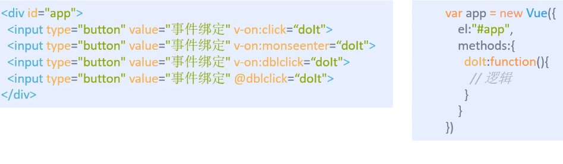

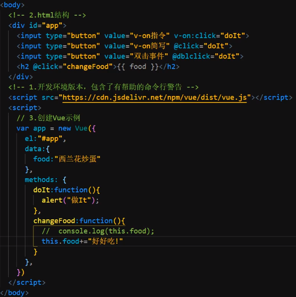

## 显示切换，属性绑定

### 计数器案例

### v-show

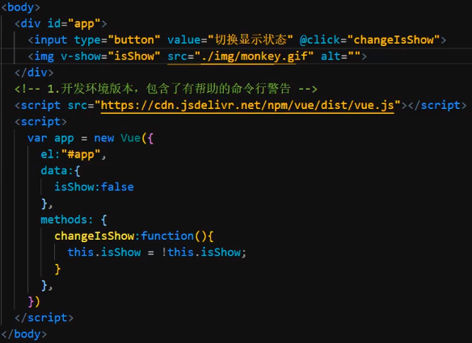

### v-if

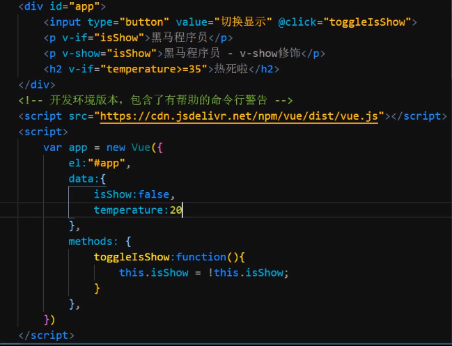

## 列表循环，表单元素绑定

### v-bind

设置元素属性（如：src,title,class）

v-bind可省略

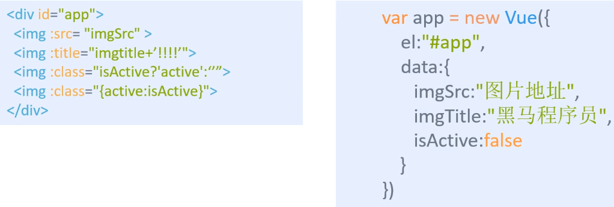

###### 图片切换案例

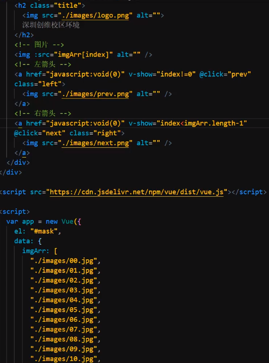

### v-for

根据数据生产列表结构

渲染数据


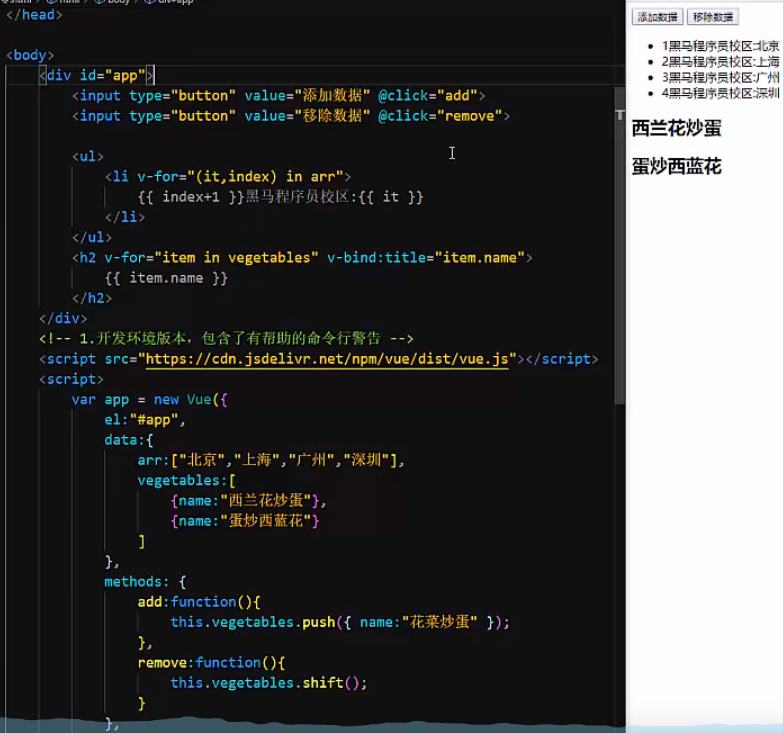

### v-on补充

传递自定义参数，事件修饰符

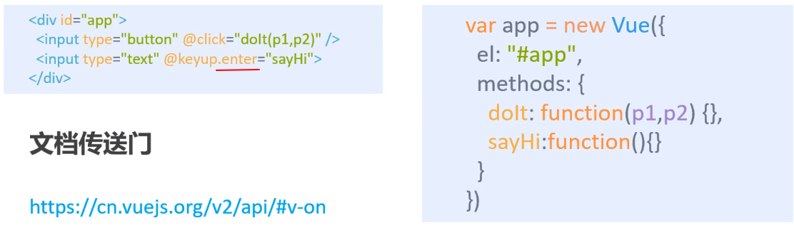

```
v-on splice(从第几个开始删，删几个)  #删除指定内容
```

### v-model

获取和设置表单元素的值（==双向数据绑定==）

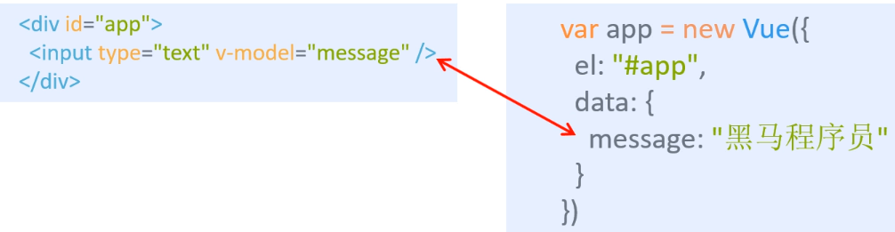

###### 案例：记事本

# 网络应用

## axios使用

```
<script src="https://unpkg.com/axios/dist/axios.min.js"></script>

axios.get(地址?key=value&key2=value2).then(function(){},function(err){})
axios.post(地址,{key:value,key2:value2}).then(function(response){},function(err){})
```

## axios加vue

```
<script src="https://cdn.jsdelivr.net/npm/vue/dist/vue.js"></script>
<script src="https://unpkg.com/axios/dist/axios.min.js"></script>
```

# 网络请求库

##### 随机获取笑话接口

```
https://autumnfish.cn/api/joke/list
```

##### 用户注册接口

```
https://autumnfish.cn/api/user/reg
```

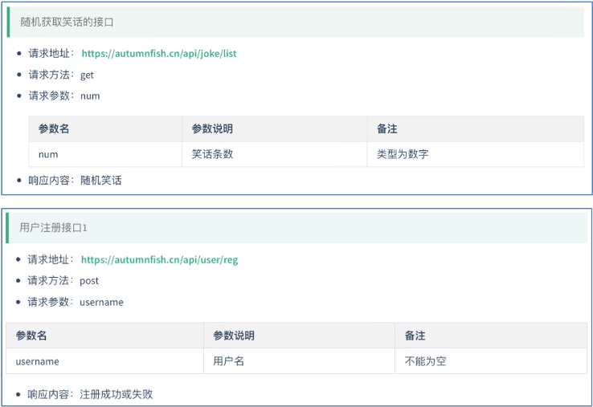

##### 天气接口

```
http://wthrcdn.etouch.cn/weather_mini
```

##### 歌曲搜索接口

```
https://autumnfish.cn/search
```

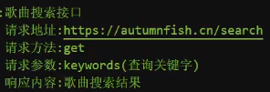

##### 歌曲url获取

```
https://autumnfish.cn/song/url
请求方法：get
请求参数个：id（歌曲id）
相应内容：歌曲url地址
```

##### 歌曲详情获取

```
https://autumnfish.cn/song/detail
请求方法：get
请求参数个：id（歌曲id）
相应内容：歌曲详情，包括封面
```

##### 歌曲评论获取

```
https://autumnfish.cn/comment/hot?type=0
请求方法：get
请求参数个：id（歌曲id,type固定为0）
相应内容：歌曲热门评论
```

##### MV获取

```
https://autumnfish.cn/mv/url
请求方法：get
请求参数个：id（mvid,为0即没有）
相应内容：mv地址
```

