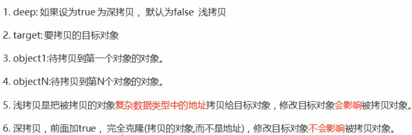

# 教程

https://www.bilibili.com/video/BV1oT4y1u7FS

# jQuery概述

https://jquery.com


## 优点


# jQuery使用

## 下载地址

https://www.jq22.com/jquery-info122

## 使用

### 引入

```
<script src="jquery-3.5.1.min.js"></script>
```

### 写

```
#非简写(等Dom元素加载完毕执行函数) 相当于DOMContentLoaded
$(document).ready(function () {
        $("div").hide();
      });
```

```
#简写(等Dom元素加载完毕执行函数) 相当于DOMContentLoaded
$(function(){
        $("div").hide();
      });
```

### 转换


## 插件

www.jq22.com

www.htmleaf.com   #推荐

### Bootstrap（重要）

有：菜单（交互式），模态框，tab栏切换 等，直接使用

https://v3.bootcss.com

# jQuery常用API

## 选择器

```
$("选择器")
```


### 隐式迭代


### 筛选选择器


```
$(function () {
        $("ul li:first").css("color","red");    #选ul下第一个li
        $("ul li:eq(2)").css("color","red");    #选ul下第三个li
});
```

### 筛选方法


###### 案例：下拉菜单

### 排他思想

```
$(function(){
	$("button").click(function(){
		$(this).css("color","red");
		$(this).siblings("button").css("color","");
	});
})
```

###### 案例：淘宝服饰精品案例P16


## 样式操作

### 返回原先值

```
$("div").css("color");
```

### 修改值

```
$("div").css("color","red");

$("div").css({
	width:400,
	height:400,
	backgroundColor:"red"
});
```

### 设置类样式

```
#添加类
$("div").addClass("current");
#移除类
$("div").removeClass("current");
#切换类
$("div").toggleClass("current");
```

###### 案例：tab栏切换

## 效果


### 显示隐藏


### 事件切换

```
hover([over,]out)
```

### 停止动画

```
stop()   #必须写在动画的前面
```

### 淡入淡出

```
fadeIn()
fadeOut()
fadeToggle()
```

#### 不透明度fadeTo


######  案例：下拉菜单

### 自定义动画

谁动谁加定位position:absolute;

```
ainimate(parmas,[speed],[easing],[fn])
```


## 属性操作

### 获取属性值

```
element.prop("属性名")
```

### 设置属性

```
prop("属性","属性值")
```

### 自定义属性

```
attr()
attr("属性","属性值")   #修改
```

### 数据缓存

```
data()
```

## 文本属性值


```
val()
```

## 元素操作

### 遍历元素

```
$("div").each(function(index,domEle){xxx;})
```

```
$.each(object,function(index,element){xxx;})
```

### 创建元素

```
$("<li></li>");
```

### 添加元素

```
#内部添加
element.append("内容")    #添加到最后面   $("ul").append("li")
element.prepend("内容")   #添加到最前面   $("ul").prepend("li")
#外部添加
element.after("内容")
element.before("内容")
```

### 删除元素

```
$("ul").remove();    #删除元素本身
$("ul").empty();     #删除元素子节点
$("ul").html("");    #清空匹配的元素内容
```

## 尺寸、位置操作

### 尺寸


### 位置

offset()


position()


scrollTop()       scrollLeft()

###### 案例：侧边栏滚动P72

# jQuery事件

## 事件注册

```
$("div").click(function(){});
```

## 事件处理

### 绑定事件

```
element.on(events,[selector],fn)
```


```
$("div").on({
	mouseenter: function(){
		$(this).css("background","skyblue");
	},
	click:function(){
		$(this).css("background","red");
	}
})
#不同事件触发相同事件
$("div").on("mouseenter mouseleave"，function(){
	alert(11);
})
```

```
#事件委托
#事件绑定在ul上，触发对象是里面的小li
$("ul").on("click","li",function(){})
```

### 解绑事件

```
$("div").off();   #为空，接触所有事件
$("div").off("click");  #接触点击事件
$("div").off("click","li");  #解绑事件委托
```

### 触发一次事件

```
one()    #触发一次，不需要解绑
```

### 自动触发事件

```
element.trigger("事件")
element.traggerHandler("事件")     #不会触发元素的默认行为
```

## 事件对象

```
event.preventDefault()  #阻止默认行为
return false            #阻止默认行为
event.stopPropagation() #阻止冒泡
```

# jQuery其他方法

## 拷贝对象

```
$.extend([deep],target,object1,[objextN])
```



## 多库共存

```
var xx = $.noConflict();
```


# 插件

### 地址

www.jq22.com

www.htmleaf.com   #推荐

### 使用（例：瀑布流）

1. 查看演示
2. 下载插件
3. 查看使用方法
4. 文件夹中index.html，右击查看源代码
5. 复制文件夹中js和css文件
6. 复制`<link...>, <style>,<script src="">,<script>,<html>中的</section>中内容`

### 懒加载P53

### 全屏滚动P54

gitHub: https://github.com/alvarotrigo/fullPage.js

中文翻译网站： http://www.dowebok.com/demop/2014/77/

### Bootstrap

1. 引入文件

```
<link rel="stylesheet" href="bootstrap/css/bootstrap.min.css">
<script src="js/jquery-3.5.1.min.js"></script>
<script src="bootstrap/js/bootstrap.min.js"></script>
```

2. 将按钮加入属性

```
<button type="button" data-toggle="modal" data-target="#myModal">Launch modal</button>
```

3. 将对应的盒子加上`id="myModal"`,和按钮的data-target属性一样


有：菜单（交互式），模态框，tab栏切换 等

https://v3.bootcss.com

```
<div class="container">
      #放入复制的body内容
</div>
```

## 综合案例：todoList

```
JSON.stringify()  #转换为字符串
JSON.parse()    #转换为对象
```

