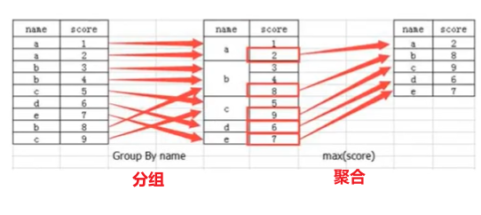
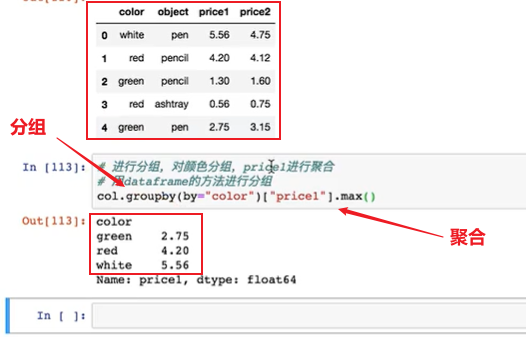

# 教程

### matplotlib、numpy、pandas

https://www.bilibili.com/video/BV1hx411d7jb

回顾：p31-35

### 特征工程（讲得好）

https://www.bilibili.com/video/BV1nt411r7tj?p=15&spm_id_from=pageDriver

P19未

# 练习

https://www.bilibili.com/video/BV1hx411d7jb

P29,36,39

# 软件

安装环境P8

ANACONDA

jupyter notebook

# 注意点

### 取前面4行

 `:4`

### 取后面5行

`-5:`

### 取步长

```
plt.xticks(list(x)[::2],x_labels[::2],rotation=90)    #步长为2
```

### 转换为整数

```
plt.xticks(list(x)[::2],x_labels[::2].astype(int),rotation=90)  //将小数标签转换为整数
```

### 格式化时间

```
#将带小数点的时间格式去除小数点2020-10-10 12:10:12.00
i.strftime("%Y%m%d") for i in dateData1
```

### 数据增加一列

```
data1["newColumn"] = dataColumn   #在数据data1中增加一个以datacolumn为数据的新列newColumn
```

### 合并表

```
tab5 = pd.merge(table1,table2,on=["user_id","user_id"])
```

### 将时间戳转换成时间格式

```
#将数据data里的time列的时间戳，转为以s为单位的时间格式
time = pd.to_datetime(data["time"],unit="s")
date = pd.DatatimeIndex(time)
date.day
date.year
```

### 统计数据中重复，或者出现的次数

```
data.groupby("age").count()
```

```
data.iloc[:,-1].value_counts()
```

#### series统计

```
sr.value_counts()
```


### 缺失值填补、null填补

```
data["age"].fillna(data["age"].mean,inplace=True)
```

### 数据转换成字典

```
data.to_dict(orient="records")
```


### 重新赋值0,1

```
data1 = np.where(age>18,1,0)   #数据中年龄大于18的都改为1，否则改为0
```

### 求逆矩阵

```
B = np.linalg.inv(A)
```

### 替换

```
data1 = data1.replace(to_replace="?",value=np.nan)
```

```
data1 = data.iloc[:,-1].replace(-1,0) #将数据中-1替换成0
```

### pandas设置中文

```
data = pd.read_csv('./train.csv', encoding = 'big5')
```

- 三个字节（0xef, 0xbb, 0xbf）表示UTF-8；
- 两个字节（0xff, 0xfe或者0xfe, 0xff）表示UTF-16（Unicode）；
- 无表示GB**。

### 删除换行符

```
line.trip('/n')
```

### 以逗号隔开分开

每行以逗号隔开，并取第二2以后的值

```
X_train = np.array([line.strip('\n').split(',')[1:] for line in f], dtype = float)
```

### ==创建矩阵==

```
data = np.random.standard_normal((2,4))
```

##### 创建全为0的矩阵，形状和data1一样，并添加1列全为0的数据

```
zeros_data = np.zeros((data1.shape[0],1)).astype(int) #data1数组后加1列值为0的数据
```

```
ones_data = np.ones((data2.shape[0],1)).astype(int)
```

##### 创建10~20，4行5列的整数矩阵

```
np.random.randint(10,20（4,5)）
```

##### 创建一个4行5列正态分布的矩阵（浮点数，平均为0，标准差为1）

```
np.random.randn(4,5)
```

##### 创建正态分布的矩阵

```
np.random.normal(均值，标准差，(size))
```

##### 创建均匀分布额矩阵

```
np.random.uniform(low,high,size())
```


### 给数据列加索引

```
data = np.random.standard_normal((3,4))
a = np.arange(data.shape[1])
#[0 1 2 3]
```

### jupyter notebook画图

```
import matplotlib.pyplot as plt
%matplotlib inline
```

### 均匀分布

```
data = [random.uniform(15,18) for i in 20]  #在15-18间生成20个均匀分布的数
```

### 取小数

```
np.round(data,2)  #取2位小数
```

### 展开矩阵、展平

```
data.flatten()
```

```
list1 = df['Actors'].str.split(',').tolist() #将每个电影的演员表以逗号为分隔转换成列表
flatten_list = [i for j in list1 for i in j]  #只适用于二维矩阵
```

```
flatten_list = np.array(list1).flatten()  #有待考证
```


### 避开nan，取行或列的平均值，并将nan赋值为平均值

#### numpy平均值

可以定义一个函数，return data

```
for i in range(data.shpe[1]):  #取列查看nan
	temp_col = data [:,i]
	nan_num = np.count_nonzero(tem_col != ten_col)  #值为nan的地方才不相等
	if nan_num != 0:
		tem_not_nan_col = tem_col[tem_col == ten_col]   #取列中所有不为nan的数
		temp_col[np.isnan(tem_col)] = tem_not_nan_col.mean() #将nan赋值为不为nan的均值
```

#### pands平均值 (推荐)

```
data['age'].mean()  #pandas会直接避开nan算均值
```

### 去重

去掉重复的数据

```
print(len(set(data['Director'].to_list())))  #将电影数据中导演这一列变成列表，并去重
```

```
print(len(data['Director'].unique()))
```

### 去除省略号(pycharm print)

```
import pandas as pd

pd.set_option('display.max_columns', 1000)
pd.set_option('display.width', 1000)
pd.set_option('display.max_colwidth', 1000)
```

### linspace

```
np.linspace(min,max,组数)
```

### matplotlib显示图片

```
plt.imshow(图片,cmap='gray')  #绘制灰度图
plt.show()
```


# matplotlib

1. 各种图标代码参考https://matplotlib.org/stable/gallery/index.html
2. 默认无法显示汉字
3. 刻度数和标签数必须相等


## ==画图三层结构==

#### 1、容器层

+ 画布层
+ 绘图区/坐标系

#### 2、辅助显示层

+ 注释

#### 3、图像层

+ plot折线图
+ scatter散点图
+ bar柱状图
+ histogram直方图
+ pie饼图

## ==画图步骤==

1. 准备数据
2. 创建画布
3. 绘制图像
4. 显示图像


## 设置图片大小


## 保存图片

必须写在plt.show()之前，写在后面只能保存空白图片，show()会释放资源。

```
from matplotlib import pyplot as plt

x = range(2,26,2)
y = [15,36,23,36,11,53,23,12,35,23,13,32]
plt.figure(figsize=(20,8),dpi=80)
plt.plot(x,y)
plt.savefig("./t1.png")		//保存图片
plt.show()
```

## 设置x轴刻度

刻度标签的数量 = 刻度的数量

```
plt.xticks(x,**kwargs)  #x为原来刻度，kwargs为要显示的数据
#例子
x_label = ["11点{}分".format(i) for i in x]
plt.xticks(x,x_label)
```

```
plt.xticks(range(2,25))
```

```
x_labels = [i/2 for i in range(4,49)]
plt.xticks(x_labels)
```

```
x_labels = ["{}年".format(i) for i in range(1990,2020)]
plt.xticks(x_labels)
```

##### 显示为年份

```
from matplotlib import pyplot as plt
import random

x = range(1990,2000)
y = [random.randint(20,35) for i in range(1990,2000)]
plt.figure(figsize=(20,8),dpi=80)
_x = x
x_labels = ["{}Year".format(i) for i in _x]
plt.xticks(x,x_labels)
plt.plot(x,y)
plt.show()
```

##### 旋转坐标轴标签==rotation==

```
x_labels = ["{}Year".format(i) for i in range(10,20)]
plt.xticks(x,x_labels,rotation=90)
```

##### 取步长，减少标签数量==[::2]==

```
from matplotlib import pyplot as plt
import random

x = range(1990,2020)
y = [random.randint(20,35) for i in range(1990,2020)]
plt.figure(figsize=(20,8),dpi=80)
_x = x
x_labels = ["{}Year".format(i) for i in _x]
plt.xticks(list(x)[::2],x_labels[::2],rotation=90)
plt.plot(x,y)
plt.show()

```

## ==设置显示中文==

方法1 （成功）

```
import matplotlib
matplotlib.rc("font", family='MicroSoft YaHei', weight="bold")
```

方法2 （未试过）

1. 下载字体“simhei.ttf”,点击安装

## 设置表名、X,Y轴的标签名

```
plt.xlabel("年份")
plt.ylabel("温度（C）")
plt.title("每年的温度变化表")
```

## 绘制网格

```
plt.grid(alpha=0.4)	//alpha网格透明度
```

```
plt.grid(linestyle="--",alpha=0.4)	//网格样式
```


## 绘制双线

```
from matplotlib import pyplot as plt
import matplotlib

matplotlib.rc("font", family='MicroSoft YaHei', weight="bold")
x = range(11,31)
y1 = [1,4,2,3,1,2,3,5,2,3,1,2,3,1,4,2,3,2,5,2]
y2 = [3,4,6,3,5,2,2,3,2,5,6,2,2,1,3,2,2,2,4,5]
plt.figure(figsize=(20,8),dpi=80)
_x = x
x_labels = ["{}岁".format(i) for i in x]
plt.xticks(x,x_labels,rotation=45)
plt.yticks(range(0,9))
plt.xlabel("年龄")
plt.ylabel("陌生人数")
plt.title("11-30岁每年认识的陌生人数")
plt.grid()
plt.plot(x,y1)
plt.plot(x,y2)
plt.show()
```

## 给表的线添加说明，图例、图例位置

1. 添加位置loc，默认是best，还有lower,upper,left,right,center
2. `plt.legend(loc="upper left")`

```
plt.plot(x,y1,label="自己")
plt.plot(x,y2,label="同桌")
plt.legend()
```

## 设置线的颜色

r红,g绿,b栏,w白,c青,m杨红,y黄,k黑

```
plt.plot(x,y1,label="自己",color="orange")
```

## 线的样式

`-`表示实线

`:`表示点虚线

`-.`表示横点线

`--`表示虚线

```
plt.plot(x,y1,label="自己",linestyle=":")
```

## 网格的样式

`:`

`-.`

`--`

```
plt.grid(alpha=0.4,linestyle="--")	
```

## 线的粗细

```
plt.plot(x,y1,label="自己",linewidth=5)
```

## 线的透明度

```
plt.plot(x,y1,label="自己",alpha=0.4)
```

## ==绘图类型==

### 折线图

应用场景：数量随时间变化等

```
plt.plot(x,y)
```

### 散点图

应用场景：分析数据之间的关系

```
plt.scatter(x,y)
```

### 柱形图

应用场景：统计、对比

```
plt.bar()
```


#### 多柱形图


#### 横向柱形图

```
plt.barh(_x,_y,height=0.3)
plt.yticks(_x,_x_label,rotation=45)
```


### 直方图

应用场景：反应数据分布情况

```
plt.hist(a,20)		#20即是组数，比如a的元素的范围在100左右，将标签分为20的倍数为一段标注
```

##### 直方图-组距

```
a = [...]
plt.hist(a,20)		#20即是组数，比如a的元素的范围在100左右，将标签分为20的倍数为一段标注
```

##### 直方图-频率

```
plt.hist(a,20,density=True)  #显示成出现频率
```

##### 直方图-组数

```
num_bins = (max(data)-min(data))//组距
#X轴刻度
plt.xticks = (range(min(data),max(data)+组距,组距))   #不加组距会少一组数据。不是整数要取整，不然图有偏移
```


### 饼图

应用场景：占比

```
plt.pie()
```

## X轴连接

比如，三月份和四月份的数据进行连接


## 多个坐标系显示

返回:    1.画布  2.绘图区

```
#创建1行，2个
figure,axes = matplotlib.pyplot.subplots(nrows=1,ncols=2,figsize=(20,8),dpi=80)
axes[0].plot[x,y1]
axes[1].plot[x,y2]
```


## 案例

显示11到30岁认识的陌生人

```
from matplotlib import pyplot as plt
import matplotlib


matplotlib.rc("font", family='MicroSoft YaHei', weight="bold")
x = range(11,31)
y = [1,4,2,3,1,2,3,5,2,3,1,2,3,1,4,2,3,2,5,2]
plt.figure(figsize=(20,8),dpi=80)
_x = x
x_labels = ["{}岁".format(i) for i in x]
plt.xticks(x,x_labels,rotation=45)
plt.xlabel("年龄")
plt.ylabel("陌生人数")
plt.title("11-30岁每年认识的陌生人数")
plt.grid(alpha=0.4)	#alpha网格透明度
plt.plot(x,y)
plt.show()
```

## 好用画图工具

### plotly

https://plotly.com/

1. 好用绘图工具
2. 开源
3. 有python

### echarts

https://echarts.apache.org/zh/index.html

1. 比较炫酷
2. 有交互效果

# Numpy

处理数值型数据

```
import numpy as np
t1 = np.array([1,3,5])
t2 = np.array(range(10))
# 起点，终点，步长
t3 = np.arange(4,11,2)
print(t1)
print(t2)
print(t3)
print(t3.dtype)		#int64  查看数据类型
```

## 注意点

```
np.range(1,11,2)   #从1到11，2为间隔
```

## ==生成数组==

#### 生成顺序数据[0 1 2 3 4 5 6 7 8 9]

```
np.array(range(10))
np.arange(10)
```

#### 生成间隔数据

```
np.arange(1,6,2)   #[1 3 5]。1~6，不取6，间隔2
```

### 生成矩阵

```
np.arange(12).reshape(3,4)  #3行4列矩阵
np.arange(24).reshape(2，3,4)
```


## 数据类型dtype


```
i1 = int8
```

##### 赋予类型

```
t1 = np.array([1,3,5],dtype = "int8")
print(t1.dtype)
```

##### 改变类型、修改类型

```
t1 = np.array([1,3,5],dtype = bool)
t2 = t1.astype("int16")
```

## Numpy数组的形状


**reshape是元组格式(元素括号可省略),有几个元素代表几维数组**

```
a.shape
a.reshape((3,4))
```

```
t1 = np.arange(24).reshape((2,3,4))
t2 = t1.reshape((4,6))
```

**变成一维数组**

1、知道原数组个数

```
t1 = np.arange(24).reshape(2,3,4)
t2 = t1.reshape((24,))	#reshape是元组格式
```

2、不知道原数组个数

```
t2 = t1.reshape((t1.shape[0]*t1.shape(1),))
```

3、==flatten==不管原数组元素个数和几维

```
t1 = np.arange(24).reshape(2,3,4)
t2 = t1.flatten()
```

## 数组运算

##### 数组内的值相加

```
np.sum(t1)		#所有值相加
```

```
np.sum(t1,axis=0)	#各列上的值相加
```

```
np.sum(t1,axis=1)	#各行上的值相加
```

##### 加减乘除

```
t1 = [1,3,5]
t2 = t1+2	#[3,5,7]
t2 = t1*2
t2 = t1/2
t2 = t1-2
```

##### 数组与数组运算

1. 两个数组必须元素个数相等,或者t1的元素个数和t2的最小维数组的个数相等
2. 等于数组每个索引上的数的运算

1、

```
t1 = [1,3]
t2 = [[4,6],
	  [7,9]]
t3 = t1 - t2
```

2、

```
t1 = [[4,6],
	  [7,9],
	  [3,8]]
t2 = [[2],
	  [4],
	  [6]]
t3 = t1 - t2
```

3、

```
t1 = [1,3,5]
t2 = [2,4,6]
t3 = t1 +t2 #等于数组每个索引上的数的和[3,7,11]
```

## 轴，反了？？？

##### 二维数组的轴


##### 三维数组的轴


## Numpy读取数据

##### 语法

```
np.loadtxt(frame,dtype=np.float,delimiter=None,skiprows=0,useclos=None,unpack=False)
```


##### 矩阵转置

```
#行列变换,矩阵转置
unpack=True
#矩阵转置
相当于t1.transpose()
相当于t1.T
相当于t1.swapaxes(1,0)		#交换抽

t1 = [[1,2,3],
	  [4,5,6],
	  [7,8,9]]
变成
t1 = [[1,4,7],
	  [2,5,8],
	  [3,6,9]]
```

##### 读取例子

```
import numpy as np

file1_path = "data/test.csv"

t1 = np.loadtxt(file1_path,delimiter=",",dtype="int",skiprows=1)

print(t1)
```

## 取行

##### 二维数组取单行

```
print(t1[2])
print(t1[2,:])		# :表示都要
```

##### 取连续多行

```
print(t1[2:])	#取第三行及后面行数据
print(t1[2:,:])
```

##### 取不连续多行

```
print(t1.[[2,4,5]])
print(t1[[2,4,5],:])
```

## 取列

##### 取单列

```
print(t1[:,1]) #取第二列
```

##### 取连续多列

```
print(t1[:,2:]) #去第三列及后面列的数据
```

##### 去不连续多列

```
print(t1[:,[2,4,6]])
```

## 取行列

取连续，3到5行的4到6列的数据（5行的索引是4，因为有0。2:5取不到5，即使4）

```
print(t1[2:5,3:6])	
```

取不连续

```
print(t1[[0,2,4],[0,3,4]])	#去的是0和0,2和3,4和4的三个点
```

## 数值修改

##### 在位置修改

```
t1[3,2] = 10 	#将4行3列上的数值改为10
```

```
t1[2:4,3:5]=[[6,7],
			 [4,8]]
```

##### 按条件修改

```
t1[t1<5] = 1  #将数组中小于5的数据都修改为1
```

## 三元运算符

```
np.where(t1<10,0,10) #t1中小于10的变为0，大于等于10的变为10
```

## clip

```
t1.clip(10,18)	#小于10的替换为10，大于18的替换为18，其余不变
```

## 转换类型

```
t1 = t1.astype(float)
```

## 数组的拼接

##### 竖直拼接

```
np.vstack((t1,t2))
```

##### 水平拼接

```
np.hstack((t1,t2))
```


## 行、列交换

##### 行交换

```
t1[[1,2],:] = t1[[2,1],:]
```

##### 列交换

```
t1[:,[0,2]] = t1[:,[2,0]]
```

## 构造数据zeros、ones、eye...

##### 创建全为1的数组

```
np.ones((2,3))	#2行3列全为1的数组
```

##### 原数组添加构造

```
zeros_data = np.zeros((data1.shape[0],1)).astype(int) #data1数组后加1列值为0的数据
```

```
ones_data = np.ones((data2.shape[0],1)).astype(int)
```

##### 创建对角线为1的正方形数组

```
np.eye(3)  #创建3行3列，主对角线为1，其他都为0的数据
```

## 最大最小值的位置

二维数组，axis=0为列，axis=1为行

```
import numpy as np

t1 =[[1,2,6],
     [3,4,2],
     [9,6,8]]
t2 = np.argmax(t1,axis=0)	#每列最大值
print(t2)
```

```
import numpy as np

t1 =[[1,2,6],
     [3,4,2],
     [9,6,8]]
t2 = np.argmin(t1,axis=1)	#每行最小值
print(t2)
```

## 生产随机数Numpy

rand,randn,randint,uniform,normal,seed


```
np.random.ranint(10,20,(4,5))
```

```
import numpy as np

np.random.seed(10)		#机上这个随机种子，每次生成的随机数组相同
t1 = np.random.randint(10,20,(4,5))
print(t1)
```

## 分布


## copy、view(Numpy)


## nan、inf(Numpy)


##### nan


```
np.count_nonzero(t1)	#返回T1中不是0的数据个数
```

```
np.count_nonzero(t1 != t1)	#t1中数据为nan的地方才不等，返回t1中数据为nan的个数
```

```
np.count_nonzero(np.isnan(t1))  #返回t1中数据为nan的个数
```

## 常用统计函数Numpy

极值，标准差


# Pandas

## 数据类型

1. Series一维，带数组标签（带索引）
2. DataFrame二维，Series容器

## Series创建


```
import pandas as pd

t1=pd.Series([1,2,31,53,12,4])	//自动以01234...为索引

t2=pd.Series([3,5,2,5],index=list("abcd"))	//自己赋值索引

temp_dict={"name":"wangwu","Age":30}
t3=pd.Series(temp_dict)				//字典
```


## Series切片和索引


## Series的索引和值


## pandas读取外部数据

```
import pandas as pd

df = pd.read_csv("./dogName.csv")
print(df)
```


## DataFrame创建

```
index //行索引
columns //列索引
```


```
df1 = pd.DataFrame(np.arrange(12).reshape(3,4),index=list("abc"),columns=list("wxyz"))

df2=pd.DataFrame(np.ones((2,4)),index=["A","B"],columns=list("abcd"))
```

**DataFrame传入字典**

```
d1 = {"name":["xiaoli","xiaohong"],"age":[30,40]}
t1 = pd.DataFrame(d1)
print(t1)
```


## DataFrame注意点

**排序**

```
import pandas as pd
df.sort_values(by="按照这个列名排序",assending=False#降序)
```


## DataFrame属性


## DataFrame查询


```
print(df[:20]["age"])     #取前20行的age列的数据
```

## pandas之loc

通过标签索引


## pandas之iloc

通过位置索引


## pandas之布尔索引


## pandas字符串方法


## 缺失数据的处理NaN

pd.isnull(),pd.notnull(),dropna,fillna(100)

```
#how='any'有nan就删除。how='all',所有都是nan才删除。inplace：是否对原数据修改
dropna(axis=0,how='any',inplace=False)
```


## pandas常用统计方法

s

## 案例：将电影类型取出来，并画图（每个类型的电影数量）


## 行索引合并join

```
df1.join(df2)		//行索引一样的行才能合并
```


## 拼接concat

```
pd.concat([data1,data2],axis=1)  #axis=1水平拼接，axis=0竖直拼接
```

## 列索引合并merge？？？


## 交叉表、透视表

```
pd.crosstab(value1,value2)  #交叉表
```

```
DataFrame.pivot_table([],index=[]) #透视表
```


## 分组和聚合？？？





```
df.groupby(by="columns name")
```


## 索引的复合索引

```
df.index
df.reindex(list("abcedf"))  #如果元数据没有f索引，则f索引这一行数据为Nan
df.set_index("Country",drop=True,inplace=False,append=False) #将Country这一列设置为索引，并将数据中Country这一列删除，不留在原数据(创建一个新副本)，append--是否将新的列添加到索引中且不替换已有索引，默认False
```


## 时间序列

```
pd.date_range(star=None,end=None,periods=None,freq="D")  
#start开始时间20200110
#end结束时间2020210
#periods=15,表示从20200110开始，以10D的频率，推15次日期
#"10D"十天,"M"一个月
```


### 频率的缩写


### DataFrame使用时间序列

```
#转换成时间
pd.to_datetime("传进来时间字符串".format="告诉系统传进来是以什么格式识别")

#如format="%Y-%m-%d %H:%M:%S"
```


### 重采样

```
t1.resample("M/10D")  #按照每月或十天的频率重新采样
```


### PeriodIndex重组时间序列

```
period = pd.PeriodIndex(year=df["year"],month=df["month"],day=df["day"],hour=df["hour"],freq="H")
df["datetime"]=period
```


## 分组

```
pd.qcut(数据，组数)
```

```
pd.cut(数据,[1,5,10,15])  #1~5位一个区间，5~10为1个区间等
```

### 转换onehot编码one_hot,哑变量

```
pd.get_dummies(分好组的数据,prefix="分组类型比如身高")
```


# 特征工程

## 安装包

```
pip install -U scikit-learn
```

## 2.1数据集

### 2.1.2 sklearn数据集

#### 1 scikit-learn数据集API介绍

- sklearn.datasets
  - 加载获取流行数据集
  - `datasets.load_*()`
    - 获取小规模数据集，数据包含在datasets里
  - `datasets.fetch_*(data_home=None)`
    - 获取大规模数据集，需要从网络上下载，函数的第一个参数是data_home，表示数据集下载的目录,默认是 ~/scikit_learn_data/

#### 2 sklearn小数据集

- `sklearn.datasets.load_iris()`

  加载并返回鸢尾花数据集

#### 3 sklearn大数据集

- `sklearn.datasets.fetch_20newsgroups(data_home=None,subset=‘train’)`
  - subset：'train'或者'test'，'all'，可选，选择要加载的数据集。
  - 训练集的“训练”，测试集的“测试”，两者的“全部”

### 2.1.3 数据集的划分

机器学习一般的数据集会划分为两个部分：

- 训练数据：用于训练，**构建模型**
- 测试数据：在模型检验时使用，用于**评估模型是否有效**

划分比例：

- 训练集：70% 80% 75%
- 测试集：30% 20% 30%

**数据集划分api**

- `sklearn.model_selection.train_test_split(arrays, *options)`
  - x 数据集的特征值
  - y 数据集的标签值
  - test_size 测试集的大小，一般为float
  - random_state 随机数种子,不同的种子会造成不同的随机采样结果。相同的种子采样结果相同。
  - return 测试集特征值`x_train`，训练集特征值`x_test`，训练标签`y_train`，测试标签`y_test`(默认随机取)

```
from sklearn.datasets import load_iris
from sklearn.model_selection import train_test_split


def datasets_demo():
    """
    对鸢尾花数据集的演示
    :return: None
    """
    # 1、获取鸢尾花数据集
    iris = load_iris()
    print("鸢尾花数据集的返回值：\n", iris)
    # 返回值是一个继承自字典的Bench
    print("鸢尾花的特征值:\n", iris["data"])
    print("鸢尾花的目标值：\n", iris.target)
    print("鸢尾花特征的名字：\n", iris.feature_names)
    print("鸢尾花目标值的名字：\n", iris.target_names)
    print("鸢尾花的描述：\n", iris.DESCR)

    # 2、对鸢尾花数据集进行分割
    # 训练集的特征值x_train 测试集的特征值x_test 训练集的目标值y_train 测试集的目标值y_test
    x_train, x_test, y_train, y_test = train_test_split(iris.data, iris.target, random_state=22)
    print("x_train:\n", x_train.shape)
    # 随机数种子
    x_train1, x_test1, y_train1, y_test1 = train_test_split(iris.data, iris.target, random_state=6)
    x_train2, x_test2, y_train2, y_test2 = train_test_split(iris.data, iris.target, random_state=6)
    print("如果随机数种子不一致：\n", x_train == x_train1)
    print("如果随机数种子一致：\n", x_train1 == x_train2)

    return None
```

## 2.3特征提取

### 2.3.1 特征提取

### 1 将任意数据（如文本或图像）转换为可用于机器学习的数字特征

> 注：特征值化是为了计算机更好的去理解数据

- 字典特征提取(特征离散化)
- 文本特征提取
- 图像特征提取（深度学习将介绍）

### 2 特征提取API

```python
sklearn.feature_extraction
```

### 2.3.2 字典特征提取

**作用：对字典数据进行特征值化**

- sklearn.feature_extraction.DictVectorizer(sparse=True,…)
  - DictVectorizer.fit_transform(X) X:字典或者包含字典的迭代器返回值：返回sparse矩阵
  - DictVectorizer.inverse_transform(X) X:array数组或者sparse矩阵 返回值:转换之前数据格式
  - DictVectorizer.get_feature_names() 返回类别名称

### 1 应用

我们对以下数据进行特征提取

```python
[{'city': '北京','temperature':100}
{'city': '上海','temperature':60}
{'city': '深圳','temperature':30}]
```


### 2 流程分析

- 实例化类DictVectorizer
- 调用fit_transform方法输入数据并转换（注意返回格式）

```python
from sklearn.feature_extraction import DictVectorizer

def dict_demo():
    """
    对字典类型的数据进行特征抽取
    :return: None
    """
    data = [{'city': '北京','temperature':100}, {'city': '上海','temperature':60}, {'city': '深圳','temperature':30}]
    # 1、实例化一个转换器类
    transfer = DictVectorizer(sparse=False)
    # 2、调用fit_transform
    data = transfer.fit_transform(data)
    print("返回的结果:\n", data)
    # 打印特征名字
    print("特征名字：\n", transfer.get_feature_names())

    return None
```

注意观察没有加上sparse=False参数的结果

```python
返回的结果:
   (0, 1)    1.0
  (0, 3)    100.0
  (1, 0)    1.0
  (1, 3)    60.0
  (2, 2)    1.0
  (2, 3)    30.0
特征名字：
 ['city=上海', 'city=北京', 'city=深圳', 'temperature']
```

这个结果并不是我们想要看到的，所以加上参数，得到想要的结果：

```python
返回的结果:
 [[   0.    1.    0.  100.]
 [   1.    0.    0.   60.]
 [   0.    0.    1.   30.]]
特征名字：
 ['city=上海', 'city=北京', 'city=深圳', 'temperature']
```

### 2.3.3 文本特征提取

**作用：对文本数据进行特征值化**

- **sklearn.feature_extraction.text.CountVectorizer(stop_words=[])**
  - 返回词频矩阵

- CountVectorizer.fit_transform(X) X:文本或者包含文本字符串的可迭代对象 返回值：返回sparse矩阵
- CountVectorizer.inverse_transform(X) X:array数组或者sparse矩阵 返回值:转换之前数据格
- CountVectorizer.get_feature_names() 返回值:单词列表

- **sklearn.feature_extraction.text.TfidfVectorizer**

### 1 应用

我们对以下数据进行特征提取

```python
["life is short,i like python",
"life is too long,i dislike python"]
```

### 2 流程分析

- 实例化类CountVectorizer
- 调用fit_transform方法输入数据并转换 （注意返回格式，利用toarray()进行sparse矩阵转换array数组）

```python
from sklearn.feature_extraction.text import CountVectorizer

def text_count_demo():
    """
    对文本进行特征抽取，countvetorizer
    :return: None
    """
    data = ["life is short,i like like python", "life is too long,i dislike python"]
    # 1、实例化一个转换器类
    # transfer = CountVectorizer(sparse=False)
    transfer = CountVectorizer()
    # 2、调用fit_transform
    data = transfer.fit_transform(data)
    print("文本特征抽取的结果：\n", data.toarray())
    print("返回特征名字：\n", transfer.get_feature_names())

    return None
```

返回结果：

```python
文本特征抽取的结果：
 [[0 1 1 2 0 1 1 0]
 [1 1 1 0 1 1 0 1]]
返回特征名字：
 ['dislike', 'is', 'life', 'like', 'long', 'python', 'short', 'too']
```

### 问题:如果我们将数据替换成中文？

```python
"人生苦短，我喜欢Python" "生活太长久，我不喜欢Python"
```

那么最终得到的结果是


为什么会得到这样的结果呢，**仔细分析之后会发现英文默认是以空格分开的。其实就达到了一个分词的效果**，所以我们要对中文进行分词处理

### 3 jieba分词处理

- jieba.cut()
  - 返回词语组成的生成器

需要安装下jieba库

```python
pip3 install jieba
```

### 4 案例分析

对以下三句话进行特征值化

```python
今天很残酷，明天更残酷，后天很美好，
但绝对大部分是死在明天晚上，所以每个人不要放弃今天。

我们看到的从很远星系来的光是在几百万年之前发出的，
这样当我们看到宇宙时，我们是在看它的过去。

如果只用一种方式了解某样事物，你就不会真正了解它。
了解事物真正含义的秘密取决于如何将其与我们所了解的事物相联系。
```

- 分析
  - 准备句子，利用jieba.cut进行分词
  - 实例化CountVectorizer
  - 将分词结果变成字符串当作fit_transform的输入值


```python
from sklearn.feature_extraction.text import CountVectorizer
import jieba

def cut_word(text):
    """
    对中文进行分词
    "我爱北京天安门"————>"我 爱 北京 天安门"
    :param text:
    :return: text
    """
    # 用结巴对中文字符串进行分词
    text = " ".join(list(jieba.cut(text)))

    return text

def text_chinese_count_demo2():
    """
    对中文进行特征抽取
    :return: None
    """
    data = ["一种还是一种今天很残酷，明天更残酷，后天很美好，但绝对大部分是死在明天晚上，所以每个人不要放弃今天。",
            "我们看到的从很远星系来的光是在几百万年之前发出的，这样当我们看到宇宙时，我们是在看它的过去。",
            "如果只用一种方式了解某样事物，你就不会真正了解它。了解事物真正含义的秘密取决于如何将其与我们所了解的事物相联系。"]
    # 将原始数据转换成分好词的形式
    text_list = []
    for sent in data:
        text_list.append(cut_word(sent))
    print(text_list)

    # 1、实例化一个转换器类
    # transfer = CountVectorizer(sparse=False)
    transfer = CountVectorizer()
    # 2、调用fit_transform
    data = transfer.fit_transform(text_list)
    print("文本特征抽取的结果：\n", data.toarray())
    print("返回特征名字：\n", transfer.get_feature_names())

    return None
```

返回结果：

```python
Building prefix dict from the default dictionary ...
Dumping model to file cache /var/folders/mz/tzf2l3sx4rgg6qpglfb035_r0000gn/T/jieba.cache
Loading model cost 1.032 seconds.
['一种 还是 一种 今天 很 残酷 ， 明天 更 残酷 ， 后天 很 美好 ， 但 绝对 大部分 是 死 在 明天 晚上 ， 所以 每个 人 不要 放弃 今天 。', '我们 看到 的 从 很 远 星系 来 的 光是在 几百万年 之前 发出 的 ， 这样 当 我们 看到 宇宙 时 ， 我们 是 在 看 它 的 过去 。', '如果 只用 一种 方式 了解 某样 事物 ， 你 就 不会 真正 了解 它 。 了解 事物 真正 含义 的 秘密 取决于 如何 将 其 与 我们 所 了解 的 事物 相 联系 。']
Prefix dict has been built succesfully.
文本特征抽取的结果：
 [[2 0 1 0 0 0 2 0 0 0 0 0 1 0 1 0 0 0 0 1 1 0 2 0 1 0 2 1 0 0 0 1 1 0 0 1 0]
 [0 0 0 1 0 0 0 1 1 1 0 0 0 0 0 0 0 1 3 0 0 0 0 1 0 0 0 0 2 0 0 0 0 0 1 0 1]
 [1 1 0 0 4 3 0 0 0 0 1 1 0 1 0 1 1 0 1 0 0 1 0 0 0 1 0 0 0 2 1 0 0 1 0 0 0]]
返回特征名字：
 ['一种', '不会', '不要', '之前', '了解', '事物', '今天', '光是在', '几百万年', '发出', '取决于', '只用', '后天', '含义', '大部分', '如何', '如果', '宇宙', '我们', '所以', '放弃', '方式', '明天', '星系', '晚上', '某样', '残酷', '每个', '看到', '真正', '秘密', '绝对', '美好', '联系', '过去', '还是', '这样']
```

**但如果把这样的词语特征用于分类，会出现什么问题？**

请看问题：


**该如何处理某个词或短语在多篇文章中出现的次数高这种情况**

### 5 Tf-idf文本特征提取

- TF-IDF的主要思想是：如果**某个词或短语在一篇文章中出现的概率高，并且在其他文章中很少出现**，则认为此词或者短语具有很好的类别区分能力，适合用来分类。
- **TF-IDF作用：用以评估一字词对于一个文件集或一个语料库中的其中一份文件的重要程度。**

#### 5.1 公式

- 词频（term frequency，tf）指的是某一个给定的词语在该文件中出现的频率
- 逆向文档频率（inverse document frequency，idf）是一个词语普遍重要性的度量。某一特定词语的idf，可以**由总文件数目除以包含该词语之文件的数目，再将得到的商取以10为底的对数得到**


最终得出结果可以理解为重要程度。

```
注：假如一篇文件的总词语数是100个，而词语"非常"出现了5次，那么"非常"一词在该文件中的词频就是5/100=0.05。而计算文件频率（IDF）的方法是以文件集的文件总数，除以出现"非常"一词的文件数。所以，如果"非常"一词在1,000份文件出现过，而文件总数是10,000,000份的话，其逆向文件频率就是lg（10,000,000 / 1,0000）=3。最后"非常"对于这篇文档的tf-idf的分数为0.05 * 3=0.15
```

#### 5.2 案例

```python
from sklearn.feature_extraction.text import TfidfVectorizer
import jieba

def cut_word(text):
    """
    对中文进行分词
    "我爱北京天安门"————>"我 爱 北京 天安门"
    :param text:
    :return: text
    """
    # 用结巴对中文字符串进行分词
    text = " ".join(list(jieba.cut(text)))

    return text

def text_chinese_tfidf_demo():
    """
    对中文进行特征抽取
    :return: None
    """
    data = ["一种还是一种今天很残酷，明天更残酷，后天很美好，但绝对大部分是死在明天晚上，所以每个人不要放弃今天。",
            "我们看到的从很远星系来的光是在几百万年之前发出的，这样当我们看到宇宙时，我们是在看它的过去。",
            "如果只用一种方式了解某样事物，你就不会真正了解它。了解事物真正含义的秘密取决于如何将其与我们所了解的事物相联系。"]
    # 将原始数据转换成分好词的形式
    text_list = []
    for sent in data:
        text_list.append(cut_word(sent))
    print(text_list)

    # 1、实例化一个转换器类
    # transfer = CountVectorizer(sparse=False)
    transfer = TfidfVectorizer(stop_words=['一种', '不会', '不要'])
    # 2、调用fit_transform
    data = transfer.fit_transform(text_list)
    print("文本特征抽取的结果：\n", data.toarray())
    print("返回特征名字：\n", transfer.get_feature_names())

    return None
```

返回结果：

```python
Building prefix dict from the default dictionary ...
Loading model from cache /var/folders/mz/tzf2l3sx4rgg6qpglfb035_r0000gn/T/jieba.cache
Loading model cost 0.856 seconds.
Prefix dict has been built succesfully.
['一种 还是 一种 今天 很 残酷 ， 明天 更 残酷 ， 后天 很 美好 ， 但 绝对 大部分 是 死 在 明天 晚上 ， 所以 每个 人 不要 放弃 今天 。', '我们 看到 的 从 很 远 星系 来 的 光是在 几百万年 之前 发出 的 ， 这样 当 我们 看到 宇宙 时 ， 我们 是 在 看 它 的 过去 。', '如果 只用 一种 方式 了解 某样 事物 ， 你 就 不会 真正 了解 它 。 了解 事物 真正 含义 的 秘密 取决于 如何 将 其 与 我们 所 了解 的 事物 相 联系 。']
文本特征抽取的结果：
 [[ 0.          0.          0.          0.43643578  0.          0.          0.
   0.          0.          0.21821789  0.          0.21821789  0.          0.
   0.          0.          0.21821789  0.21821789  0.          0.43643578
   0.          0.21821789  0.          0.43643578  0.21821789  0.          0.
   0.          0.21821789  0.21821789  0.          0.          0.21821789
   0.        ]
 [ 0.2410822   0.          0.          0.          0.2410822   0.2410822
   0.2410822   0.          0.          0.          0.          0.          0.
   0.          0.2410822   0.55004769  0.          0.          0.          0.
   0.2410822   0.          0.          0.          0.          0.48216441
   0.          0.          0.          0.          0.          0.2410822
   0.          0.2410822 ]
 [ 0.          0.644003    0.48300225  0.          0.          0.          0.
   0.16100075  0.16100075  0.          0.16100075  0.          0.16100075
   0.16100075  0.          0.12244522  0.          0.          0.16100075
   0.          0.          0.          0.16100075  0.          0.          0.
   0.3220015   0.16100075  0.          0.          0.16100075  0.          0.
   0.        ]]
返回特征名字：
 ['之前', '了解', '事物', '今天', '光是在', '几百万年', '发出', '取决于', '只用', '后天', '含义', '大部分', '如何', '如果', '宇宙', '我们', '所以', '放弃', '方式', '明天', '星系', '晚上', '某样', '残酷', '每个', '看到', '真正', '秘密', '绝对', '美好', '联系', '过去', '还是', '这样']
```

### 6 Tf-idf的重要性

**分类机器学习算法进行文章分类中前期数据处理方式**


# ==分析流程==

1. 获取数据

   ```
   pd.read_csv()
   ```

2. 处理数据

   + 缺失值处理

     ```
     #缺失的数据是？，将？替换成nan再处理
     data1 = data1.replace(to_replace="?",value=np.nan)
     #删除缺失样本
     data1.dropna(inplace=True)
     #查看数据中每列是否存在缺失值
     data1.isnull().any()
     ```

   + 等等

3. 准备特征值、目标值

   1. ```
      #特征值:影响目标值的因素
      x = data1[["age","sex"]]
      x = data1.iloc[:,1,-1]
      ```
   ```
      
   2. ```
      #目标值：最终要求的值
      y = data1["survived"]
   ```

4. 划分数据集

   ```
   from sklearn.model_selection import train_test_split
   train_test_split(*.data,*.target,random_state=22)
   ```

5. 特征工程

   + 无量纲化-标准化-归一化

     ```
     from sklearn.preprocessing import StandardScaler
     transfer = StandardScaler()
     x_train = transfer.fit_transform(x_train)
     x_test = transfer.transform(x_test)
     ```

   + 标准差

   + 字典特征抽取

   + 等等

6. 预估器

   + ```
     from sklearn.linear_model import LogisticRegression
     estimator = LogisticRegression()
     estimator.fit(x_train,y_train)
     estimator.coef_    #逻辑回归参数系数
     estimator.intercept_   #逻辑回归偏置
     y_predict = estimator.predict(x_test)	#预测值
     print(y_test==y_predict)    #对比真实值与预测值
     score = estimator.score(x_test,y_test)	#计算准确率
     ```

7. 模型评估

   + ```
     from sklearn.metrics import
     ```

   + 

   

# 算法使用选择

## 监督学习

### 正规方程

1. 一步到位
2. 不需要调参
3. 数据量<100,000

### 梯度下降

+ 使用场景

  1. data>100,000

  2. 需要调参

+ 使用

  + SGDRegressor

### 决策树

维度少

### 随机森林

1. 维度多
2. 数据量大

### 逻辑回归

+ 应用场景
  + 广告点击率
  + 是否为垃圾邮件
  + 是否患病
  + 金融诈骗
  + 虚假账号
+ sigmoid函数
+ 损失函数

## 无监督学习

### K-means聚內

#### K-means性能评估指标

+ 轮廓系数

# 保存模型、加载

```
import joblib
joblib.dump(estimator,"my_ridge.pkl")
```

```
estimator = joblib.load("my_ridge.pkl")
```

