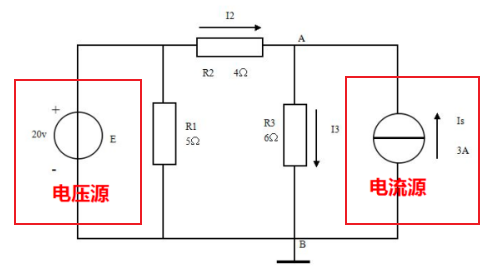

# 教程

https://www.bilibili.com/video/BV1Ss41117Fs

P4未（可重看）

# 公式

#### 欧姆定律

U=IR

#### 功率

关联：p=ui=i^2^R=u^2^/R

非关联：p=ui=(-Ri)i=-i^2^R=-u^2^/R

#### 总功

w=UIt

#### 热量

Q=I^2^Rt

# 关联，非关联

关联+（电流从元件的高电压流向低电压）

非关联-

吸收+

发出-

# 理想电压、电流源

# 基尔霍夫定律KCL,KVL

电路中元件与元件的关系成为基尔霍夫定律

#### KCL

i入的和=i出的和（有正负）

#### KVL

V1+V2+V3...=0（考虑关联非关联取正负号）

#### 支路

电路中每一个两端元件叫一条支路

#### 结点

元件的连接点成为结点或**三条以上支路的连接点称为结点**

#### 路径

两结点间的一条通路。由支路构成。

#### 回路

由支路组成的闭合路径

#### 网孔

对平面电路，其内部不含任何支路的回路称网孔 

