>  开仓

在交易中，无论是买还是卖，凡是新建头寸都叫开仓。

> 持仓

> 平仓

买入的卖出去

卖出的买回来

> 做多

买

与之相对应的是“看多”，所谓“看多”，是指我们从主观上认为某一货币的价格在一段时间内可能会连续上涨。

在看多的情况上，我们“做多”，意思是，我们买入这种货币。

> 做空

卖

做空，与之相对应的是“看空”，所谓“看空”，是指我们从主观上认为某一货币的价格在一段时间内可能会连续下跌。

在看跌的情况上，我们“做空”，意思是，我们卖出这种货币。

# 沪深A股

> 代码：6位数字

+ 60开头：上证A股
+ 0开头：  深圳A股
+ 3开头：  创业板（证券公司开通）
+ 688开头：科创版（最低50W资金）

# 交易时间

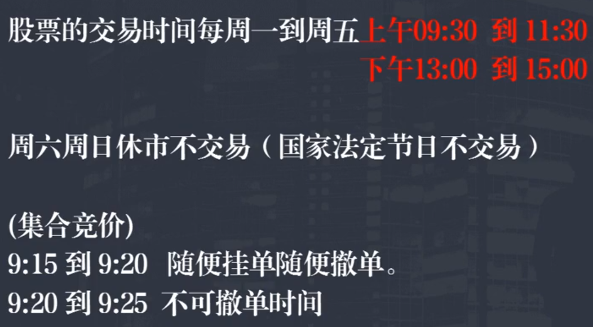

# 涨跌幅

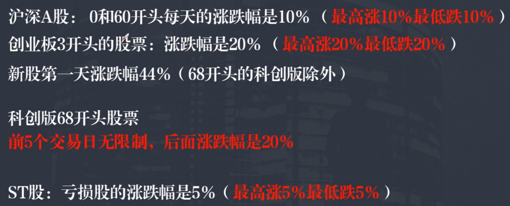

# 分时图

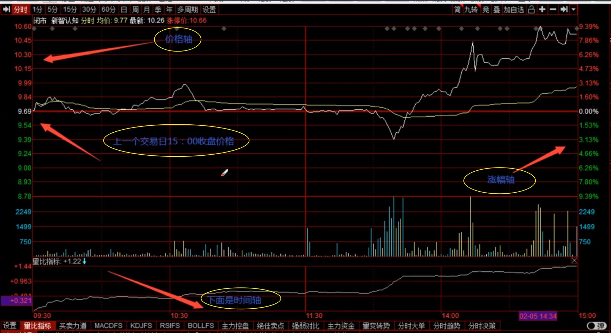

# K线图

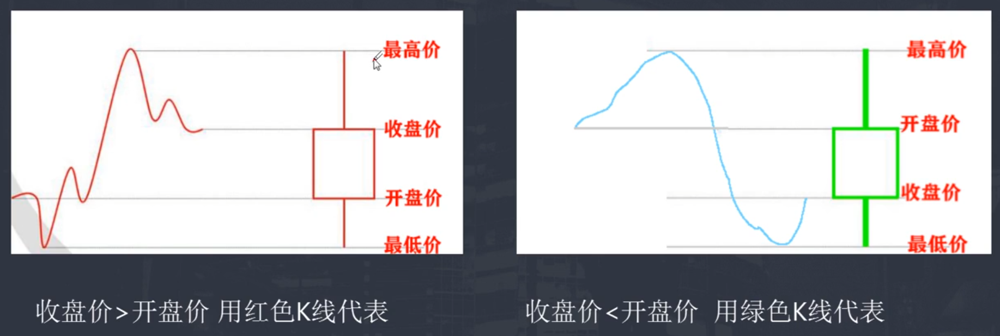

# ==股票的交易规则==

> 开户：一定要弄清交易佣金是万几，是不是知名证券公司

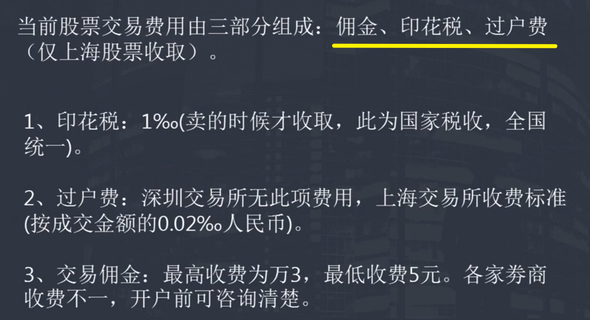

# 看盘软件的基本操作

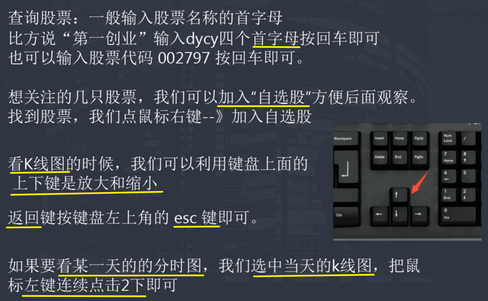

# 看盘软件界面

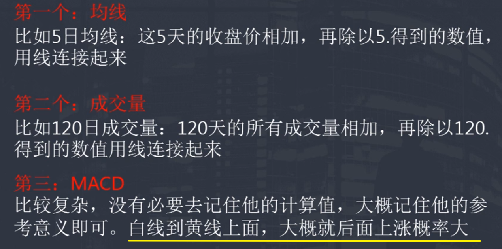

### 修改均线

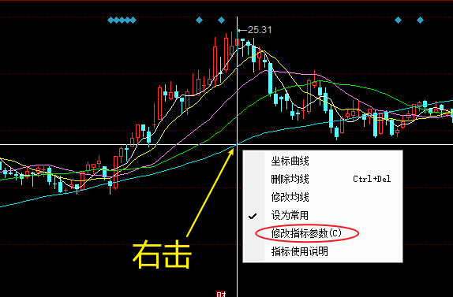

# ==支撑位、压力位==

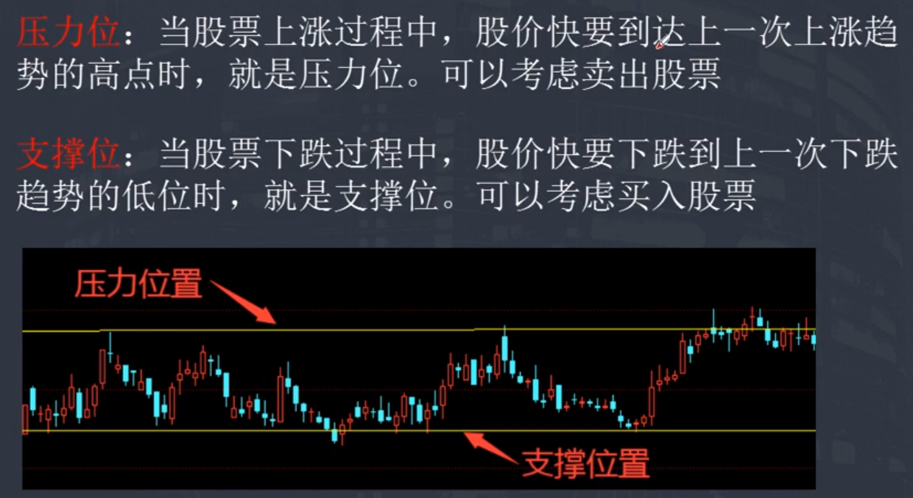

# 突破、跌破

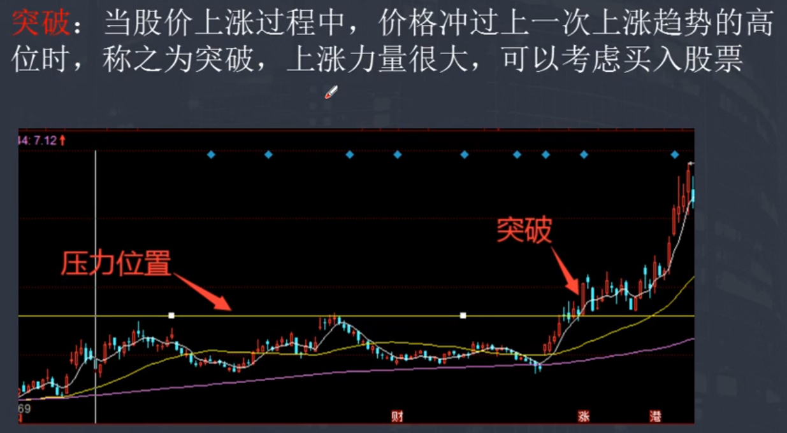

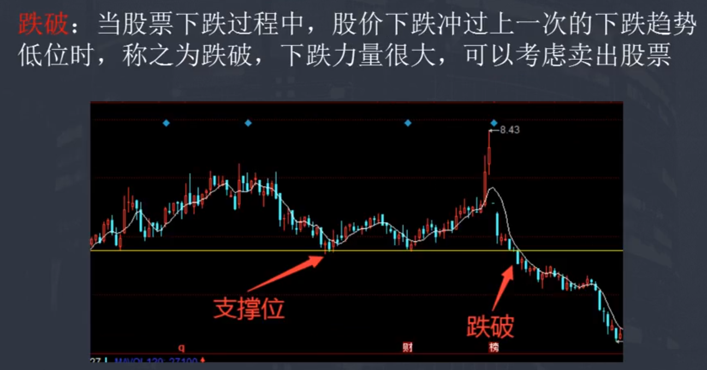

# 盘口（挂买、卖价格）

 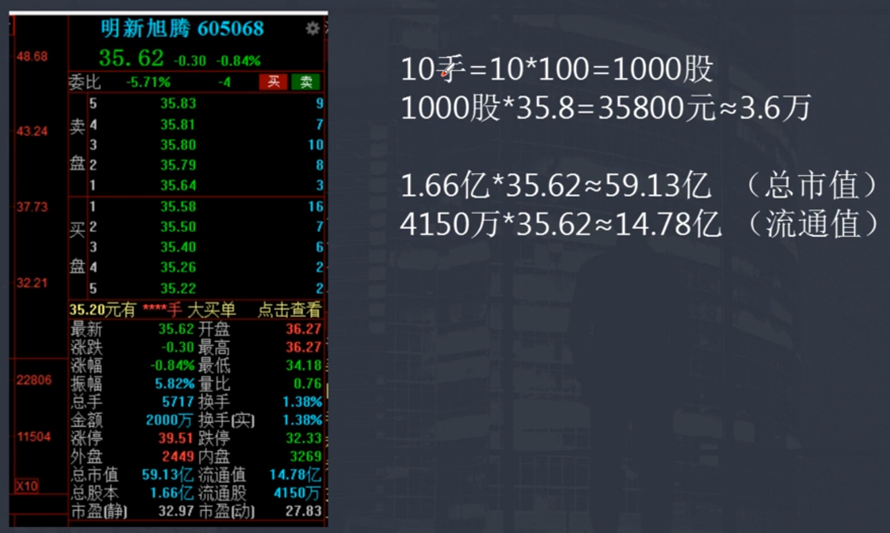

# 股票的买卖机制

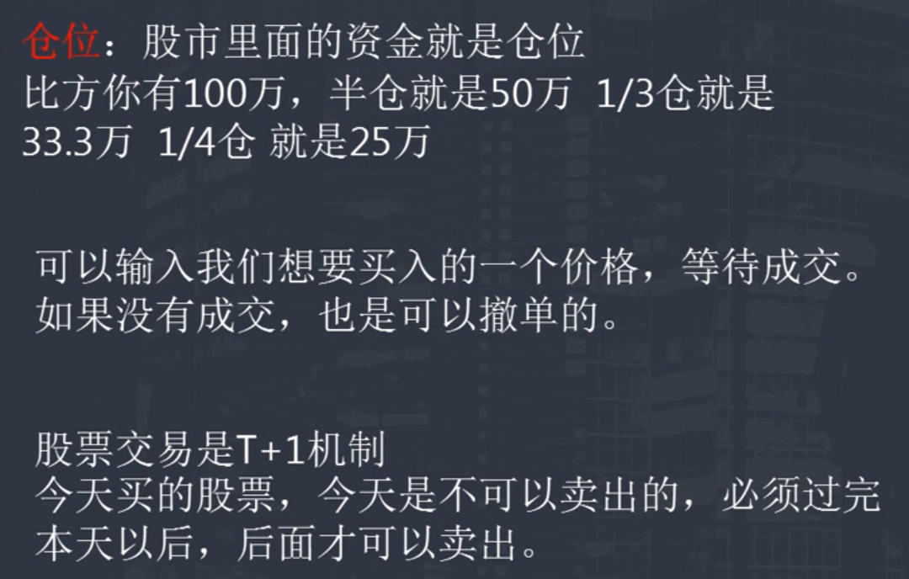

